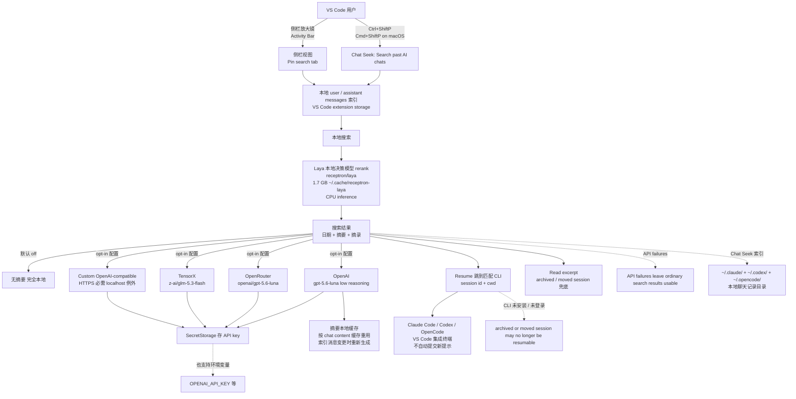

# fstandhartinger/chat-seek-vscode

## 一句话定位
VS Code 跨 Claude Code / Codex / OpenCode 聊天本地检索 + Laya 本地决策模型 reranking——可选 opt-in 1 句 AI 摘要（OpenAI / OpenRouter / TensorX / Custom OpenAI-compatible），SecretStorage 存 API key，Resume 跳到匹配 CLI 的 session id + cwd，Read excerpt 兜底 archived / moved session。

## 它解决的问题
当前 VS Code 用户跨多个 AI Coding Agent（Claude Code + Codex + OpenCode）的痛点是「**多个 CLI 各有聊天记录 + 在 VS Code 里找不到过去对话 + 无法纯文本描述找匹配 + 不想把聊天内容发给云 LLM（除非明确 opt-in）+ 想跳回 CLI 直接继续 + 想本地决策模型 rerank 隐私**」——chat-seek-vscode 把「**VS Code extension + Ctrl+ShiftP 入口 + 侧栏放大镜 Activity Bar + Pin search tab + 本地 user / assistant messages 搜索 + Laya 本地决策模型 rerank + 可选 1 句 AI 摘要（默认 off）+ Resume 跳到匹配 CLI 的 session id + cwd + Read excerpt 兜底**」做成 2753 KB JavaScript + VS Code extension。

## 为什么值得关注（2026-09-22）
- **Stars:** 54（截至 2026-09-22），1 天新增 54⭐，fork 6
- **Forks:** 6（fork/star 11.1%，VS Code extension 早期企业 fork 信号）
- **Open Issues:** N/A（详情未抓取）
- **License:** MIT
- **语言:** JavaScript
- **规模:** 2753 KB（VS Code extension + 本地搜索 + Laya reranking + 可选摘要 provider）
- **活跃度:** created 2026-09-21，pushed 2026-09-21，1 天内快速迭代
- **Topics:** N/A（GitHub topics 未声明）
- **平台:** Linux x64 VSIX + VS Code 1.99+
- **本地模型:** Laya（receptron/laya），第一次使用下载约 1.7 GB 模型权重到 ~/.cache/receptron-laya；CPU inference

## 热度来源判断
chat-seek-vscode 的热度是「**跨 Claude Code / Codex / OpenCode 三个 CLI 聊天记录本地搜索 + Laya 本地决策模型 rerank + VS Code 集成 + 摘要默认 off 默认完全本地 + SecretStorage 存 API key + Resume 跳回 CLI**」的强劲组合。AI Coding Agent 生态从 09-15 ~ 09-21 的「**单 CLI + 单 Agent + 单工具**」推到 09-22 的「**跨 CLI 聊天记录本地搜索 + 本地决策模型 rerank + VS Code 集成 + Resume**」严肃工程化，是「**AI Coding 工具从单 CLI 推到跨 CLI 检索 + 本地决策模型**」的具体兑现。6 个 fork 反映「**VS Code extension + 本地决策模型**」早期企业 fork 信号（fork/star 11.1% 与前日 kitze/skillbox 10.1% 接近）。54⭐ / 1 天是 09-22 当日 GitHub Search created 2026-09-21..2026-09-22 stars>30 全站 trending 后段。热度**真实且具备跨 CLI 检索 + 本地决策模型潜力**——但需警惕：Laya 本地决策模型 reranking 在多 CLI 聊天记录上的实际质量 + 跨 Claude Code / Codex / OpenCode 三个 CLI 聊天记录格式的兼容性 + 摘要 opt-in 的实际采用率 + Resume 在多 CLI session 升级的兼容性 + Linux x64 only 当前限制的扩展性。

## 关键技术亮点
1. **Ctrl+ShiftP 入口:** （Cmd+ShiftP on macOS）→ Chat Seek: Search past AI chats
2. **侧栏放大镜 Activity Bar:** 可右键显示 / 拖动视图 / Pin search tab
3. **搜索 + 索引 + Laya reranking 无需 API key:** 默认完全本地
4. **摘要默认 off:** disable summaries to keep search entirely local
5. **可选 4 provider:** OpenAI（`OPENAI_API_KEY`，默认 gpt-5.6-luna）+ OpenRouter（`OPENROUTER_API_KEY` 或 `OPEN_ROUTER_API_KEY`，默认 openai/gpt-5.6-luna）+ TensorX（`TENSORX_API_KEY`，默认 z-ai/glm-5.3-flash）+ Custom OpenAI-compatible endpoint（`CHAT_SEEK_API_KEY`）
6. **SecretStorage 存 API key:** 不写入环境不写入 git；vscode SecretStorage API 存储
7. **模型可覆盖:** chatSeek.summaries.<provider>Model；GPT-5/6 overrides request low reasoning
8. **摘要懒生成:** 只对显示的搜索结果（最多 30 chats，每批 2 个请求）生成
9. **每次请求最多 12 sampled messages of up to 600 characters apiece distributed across the chat:** 严格采样策略
10. **摘要本地缓存:** 按 chat content 缓存重用，索引消息变更时重新生成
11. **UI labels AI summaries and their provider:** 用户可看到哪些摘要来自哪个 provider
12. **private indexes 和 summary caches 在 VS Code extension storage:** 不上传
13. **Resume 跳到匹配 CLI:** session id + original working directory；不自动提交新提示；CLI 必须在同一环境安装并登录
14. **Read excerpt 兜底:** archived or moved session may no longer be resumable by CLI
15. **Laya 本地决策模型:** receptron/laya；第一次使用下载 1.7 GB 模型权重到 ~/.cache/receptron-laya；CPU inference
16. **构建链:** npm ci + npm test + npm run lint + npm run package + code --install-extension
17. **VS Code 1.99+:** Linux x64 VSIX
18. **VSIX 不能重新标记为另一平台:** vsce --target + .vscodeignore ONNX native-binary exclusions

## 架构师速览

| 决策问题 | 研究判断 | 证据边界 |
|---|---|---|
| 系统边界 | VS Code extension + 本地 user / assistant messages 索引 + Laya 本地决策模型 rerank + 可选 opt-in AI 摘要；边界为本地索引 + SecretStorage API key | 仅基于档案描述的 Linux x64 VSIX + VS Code 1.99+；具体 macOS / Windows 兼容性、Remote WSL 兼容性、ONNX native-binary 多平台打包未在档案中给出 |
| 主路径 | User Ctrl+ShiftP / 侧栏放大镜 → Chat Seek 索引本地聊天记录 → Laya rerank → 显示搜索结果（日期 + 摘要 + 摘录）→ 用户点 Resume 跳到匹配 CLI 或 Read excerpt 打开索引上下文 | 主路径为档案语义抽象；具体索引存储格式、Laya rerank 算法细节、Resume 实际调用 CLI 命令未在档案中给出 |
| 关键权衡 | 跨 CLI 聊天记录检索 vs 隐私边界 vs Laya 本地 rerank vs SecretStorage 存 API key vs 摘要 opt-in vs Resume 跳回 CLI vs Linux x64 only 当前限制 | 档案明示 4 项限制（Linux x64 only / Remote WSL only / VSIX 不能重新标记 / API failures leave ordinary search results usable）；具体多 OS 打包策略、企业部署态度未证实 |
| 最小 PoC | Linux x64 + VS Code 1.99+ 安装 chat-seek-linux-x64-0.2.1.vsix → 等 1.7 GB Laya 模型下载 → Ctrl+ShiftP 搜一个 Claude Code 旧对话 → 验证 Laya rerank 质量 → 配置 OpenAI API key 验证摘要 opt-in → 点 Resume 跳回 CLI | PoC 范围、退出路径由档案「Linux x64 + VS Code 1.99+ + Laya rerank + Resume」建议推导；具体 macOS / Windows 兼容性、CI / 自动化测试套件、付费与商业条款待核验 |

## 架构启发
chat-seek-vscode 的核心启发是「**跨 CLI 聊天记录本地搜索 + 本地决策模型 rerank + VS Code 集成 + Resume**」的工程化形式。传统做法是用户手动翻 Claude Code / Codex / OpenCode 各 CLI 的聊天记录，效率极低。chat-seek-vscode 反向走「**VS Code extension + 本地索引 + Laya 本地 rerank + Resume**」路线——是「**跨 CLI 检索 + 本地决策模型**」的工程化对比。**更深层的启发是：摘要默认 off 默认完全本地 + SecretStorage 存 API key + Resume 不自动提交新提示**——这种「**隐私边界 + 用户最终 gate**」让 chat-seek-vscode 在隐私敏感场景下可用。**Laya 1.7 GB 本地模型下载 + CPU inference**——是「**低门槛严肃本地化**」的工程化形式。**API failures leave ordinary search results usable**——是「**兜底可用度**」的工程化形式。

## 架构图（MMD）

> 证据边界：此图只采用本档案已有可核验描述；「待核验」节点不应视为项目实现事实。

## 定位判断
**工具型项目（VS Code 跨 CLI 聊天记录本地检索）。** chat-seek-vscode 不仅是 VS Code extension，更试图成为「**AI Coding 工具从单 CLI 推到跨 CLI 检索 + 本地决策模型 + Resume**」的具体实现——通过 Ctrl+ShiftP 入口 + 侧栏放大镜 + 本地搜索 + Laya 本地 rerank + 摘要默认 off 默认完全本地 + SecretStorage 存 API key + Resume 跳回 CLI + Read excerpt 兜底，把「**跨 CLI 聊天记录本地检索 + 本地决策模型 + 隐私边界 + 用户最终 gate**」做到极致。54⭐ + 6 fork 已显示社区初步关注（fork/star 11.1% VS Code extension 早期企业 fork 信号）。但「**平台化**」取决于一个关键问题：Laya 本地决策模型 reranking 在多 CLI 聊天记录上的实际质量 + 跨 Claude Code / Codex / OpenCode 三个 CLI 聊天记录格式的兼容性 + 摘要 opt-in 的实际采用率 + Resume 在多 CLI session 升级的兼容性 + Linux x64 only 当前限制的扩展性。目前定位是「**最有影响力的 VS Code 跨 CLI 聊天记录本地检索 + 本地决策模型**」，向多 OS + 多 LLM + 企业部署是合理路径。

## 风险 / 局限 / 泡沫点
- **Laya 本地决策模型 reranking 质量:** 1.7 GB CPU inference 模型质量未给具体 benchmark 数字
- **跨 CLI 聊天记录格式兼容性:** Claude Code + Codex + OpenCode 三个 CLI 各自聊天记录格式可能变化，需要持续适配
- **摘要 opt-in 实际采用率:** 默认 off 可能导致采用率偏低；opt-in 后用户体验取决于 API key 可用性
- **Resume 在多 CLI session 升级的兼容性:** session id 可能在新版本不兼容，archived / moved session 可能不可恢复
- **Linux x64 only 当前限制:** macOS / Windows 用户需要自行 build，VSIX 不能重新标记为另一平台
- **隐私边界:** 即便默认完全本地，索引和缓存仍存在 VS Code extension storage，恶意扩展可能读取
- **个人项目属性:** fstandhartinger 个人维护，6 forks 但核心治理仍集中
- **企业部署:** 单机本地 extension，无集群 / 高可用 / 监控
- **依赖 Laya:** 依赖 receptron/laya 持续维护

## 与同类项目的关系
- **vs 官方各 CLI 聊天记录查看:** 官方各 CLI 是单 CLI 内聊天记录查看；chat-seek-vscode 是跨 CLI 聊天记录本地检索
- **vs Anthropic Prompt caching / OpenAI Conversation state:** 官方 API caching 是单 vendor 缓存；chat-seek-vscode 是本地跨 CLI 检索
- **vs Grep / ripgrep / ack:** Grep / ripgrep / ack 是文本搜索；chat-seek-vscode 是语义搜索 + Laya rerank + Resume
- **vs logan-markewich/jeff:** logan-markewich/jeff 是「**GLiFormer 400M encoder + typesafe-sdk 兼容 + 自托管 drop-in**」；chat-seek-vscode 是「**Laya 本地决策模型 + 跨 CLI 聊天记录检索 + VS Code 集成 + Resume**」——两者都做本地决策模型但走不同应用领域
- **vs wshobson/agents:** wshobson/agents 是「**多 Harness Agent Skills 市场**」；chat-seek-vscode 是「**跨 Harness 聊天记录检索 + 本地决策模型**」——wshobson 是 Skill 分发，chat-seek-vscode 是聊天记录检索

## 是否值得持续跟踪
**值得跟踪（VS Code 跨 CLI 聊天记录本地检索候选）。** chat-seek-vscode 代表了「**AI Coding 工具从单 CLI 推到跨 CLI 检索 + 本地决策模型 + Resume**」的演化方向，无论其本身成败，这一方向是行业趋势。建议关注：Laya rerank 质量、跨 CLI 聊天记录格式兼容性、摘要 opt-in 实际采用率、Resume 在多 CLI session 升级兼容性、Linux x64 only 扩展性。对 VS Code AI Coding 重度用户，这是「**跨 CLI 检索 + 本地决策模型 + 隐私边界**」的实用样本，值得直接采用。对 AI Coding 工具生态观察者，它是「**跨 CLI 检索 + 本地决策模型**」的头部样本。

## 后续观察点
- Laya 本地决策模型 reranking 在多 CLI 聊天记录上的实际质量（决定语义搜索实用性）
- 跨 Claude Code / Codex / OpenCode 三个 CLI 聊天记录格式的兼容性（决定多 CLI 通用）
- 摘要 opt-in 的实际采用率（决定隐私边界 UX）
- Resume 在多 CLI session 升级的兼容性（决定跨 CLI 跳回稳定性）
- SecretStorage 存 API key 的稳定性（决定 API key 安全）
- macOS / Windows 打包兼容性（决定多 OS 扩展）
- 多 LLM rerank 接入（除 Laya 外是否支持其他本地决策模型）
- 企业 / 合规部署的态度（决定能否进入企业 VS Code 环境）

---
> 数据来源: GitHub API (2026-09-22) | Stars: 54 | Forks: 6 | License: MIT | 语言: JavaScript | 创建: 2026-09-21 | Laya: receptron/laya