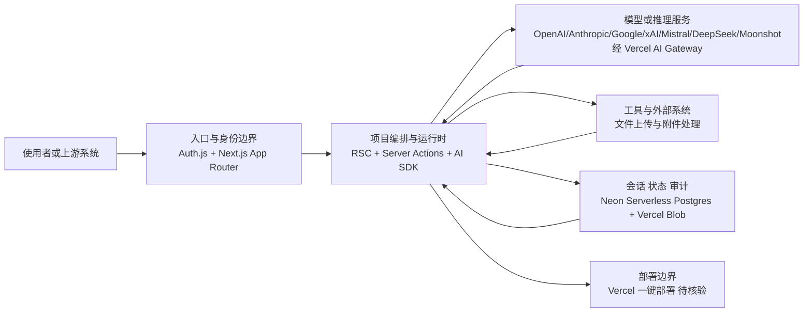

# vercel/chatbot

## 一句话定位
Vercel 官方维护的开源 Next.js AI 聊天机器人模板，基于 AI SDK 构建，提供完整的聊天功能（流式响应、文件上传、持久化历史、多模型支持）和一键部署能力。

## 它解决的问题
开发者想在 Next.js 上快速构建一个 AI 聊天应用时，通常需要从零搭建：流式响应处理、模型 API 对接、聊天历史持久化、用户认证、文件上传/存储等，每一步都有大量样板代码。vercel/chatbot 将所有这些功能打包成一个开箱即用的模板——clone 后配置环境变量即可运行，一键部署到 Vercel 即可上线。它是 AI SDK 生态的最佳参考实现。

## 为什么值得关注（2026-07-08）
- 20,804 stars，6,725 forks——fork 数极高说明它被大量开发者用作项目起点
- Vercel 官方团队维护，与 AI SDK 同步更新，代表 Next.js + AI 的最佳实践
- 使用 React Server Components、Server Actions、Auth.js、Neon Postgres 等前沿技术栈
- 支持 OpenAI、Anthropic、Google、xAI、Mistral、DeepSeek、Moonshot 等多家模型提供商

## 热度来源判断
**生态绑定驱动**。vercel/chatbot 的高热度有三个来源：(1) Vercel 品牌背书——作为 Next.js 的创建者，Vercel 的模板天然获得开发者信任；(2) AI SDK 的官方参考实现——所有学习 AI SDK 的人都会被引导到这里；(3) 2023-2025 年 AI 应用开发的爆发潮。20K stars 中相当一部分来自"想要搭一个 ChatGPT 竞品"的开发者，fork 数（6.7K）远超同级别项目，证明它是真正被使用（而不仅仅是被 star）的模板。

## 关键技术亮点亮点
1. **AI SDK 统一接口**：通过 Vercel AI Gateway 统一接入多家模型，`lib/ai/models.ts` 中集中配置，切换模型只需改一行代码。这种抽象层设计让应用层逻辑与模型提供商完全解耦。
2. **React Server Components + Server Actions**：充分利用 Next.js App Router 的最新范式，聊天 UI 通过 RSC 渲染，消息保存通过 Server Actions 执行，减少了客户端 JS 体积和 API 端点数量。
3. **流式渲染 UI**：使用 AI SDK 的 `useChat` hook 实现流式消息传输，支持在流式过程中渲染 Generative UI（如代码高亮、表格、图表等结构化输出）。
4. **完整的数据持久化方案**：使用 Neon Serverless Postgres 存储聊天历史和用户数据，Vercel Blob 存储文件附件，Auth.js 处理认证——这是一个生产级的架构，而非简单的 demo。

## 架构师速览

| 决策问题 | 研究判断 | 证据边界 |
|---|---|---|
| 系统边界 | vercel/chatbot 是 Vercel 官方维护的 Next.js 聊天机器人模板，处于"使用者/上游系统 ↔ 模型供应商 ↔ 工具与数据源"三方之间的编排层，承担入口认证、模型路由与状态持久化职责 | 基于"一句话定位"、技术栈标签与"完整的数据持久化方案"段；具体路由/中间件边界需源码核验 |
| 主路径 | 用户请求 → 入口与身份边界（Auth.js）→ 项目编排与运行时（RSC + Server Actions + AI SDK）→ 多模型提供商（OpenAI/Anthropic/Google/xAI/Mistral/DeepSeek/Moonshot，经 Vercel AI Gateway）→ 会话与文件持久化（Neon Postgres + Vercel Blob）→ 流式响应回写 | 基于"关键技朮亮点亮点"四条；流式协议细节、Server Action 契约需源码核验 |
| 关键权衡 | 模板复用与扩展性 vs. 对 Vercel 生态的强耦合（AI Gateway / Blob / Neon / 一键部署）；快速 fork 启动 vs. AI SDK 频繁变更导致的 breaking changes 风险 | 基于"风险/局限/泡沫点"1、2 条与"架构启发"段的"vendor lock-in"判断；fork 不稳定性为观察结论而非量化数据 |
| 最小 PoC | 单渠道（Web）、最小工具权限、可审计日志下验证：clone → 配置模型与 Postgres/Blob 环境变量 → 本地启动 `next dev` → 走通一次流式对话与一条历史持久化 | 基于"它解决的问题"段"clone 后配置环境变量即可运行"；具体启动脚本、端口、数据库 schema 以 README 为准 |

## 架构启发
vercel/chatbot 是"模板即产品"的典型案例。它的价值不在于功能创新（聊天机器人并不新颖），而在于将 Vercel 生态的所有最佳实践（RSC、AI SDK、Neon、Blob、Auth.js）组装成一个可运行的整体。这种"标杆实现"策略对平台公司非常有效——它既是文档（最好的文档是可运行的代码），也是获客渠道（用户部署后自然成为 Vercel/Neon 客户）。不过这种设计也意味着它高度绑定 Vercel 生态，脱离 Vercel 环境使用时需要较多适配工作。

## 架构图（MMD）

> 证据边界：此图只采用本档案已有可核验描述；“待核验”节点不应视为项目实现事实。

## 定位判断
在 AI 应用开发工具链中，vercel/chatbot 定位为**官方参考模板/起点项目**。它不是框架（那是 AI SDK 的角色），也不是产品（没有直接面向终端用户的功能），而是一个"加速器"——让开发者从 Day 1 就有一个可运行的聊天应用。它的竞品不是其他 chatbot 产品，而是开发者自己从零写的样板代码。

## 风险 / 局限 / 泡沫点
1. **深度绑定 Vercel 生态**：模板设计围绕 Vercel 的产品（AI Gateway、Blob、Neon、一键部署），在非 Vercel 环境（如自托管、Cloudflare、AWS）中使用需要较多改造。这在客观上是一种 vendor lock-in，虽然代码是开源的。
2. **更新频繁导致 Fork 不稳定**：由于与 AI SDK 同步更新，API 变更频繁，早期 fork 的项目升级时经常遇到 breaking changes。这对生产使用是一个风险。
3. **功能深度有限**：作为模板，它覆盖了基础聊天功能但缺乏高级特性（RAG、Agent、工具调用编排等），不适合直接用于复杂场景。

## 与同类项目的关系
- **e2b-dev/fragments**：AI 代码生成 + 运行环境的模板，侧重于代码执行而非聊天。更面向"AI 开发助手"场景。
- **lobehub/lobe-chat**：功能更丰富的开源聊天应用（插件系统、多模态、市场），约 50K+ stars，但更接近"产品"而非"模板"，复杂度也更高。
- **chatgpt-next-web (ChatGPTNextWeb)**：最早的 ChatGPT Web UI 开源项目之一，约 80K stars，功能更全面但技术栈较老（Pages Router），代码质量和架构不如 Vercel 模板现代化。

## 是否值得持续跟踪
**值得跟踪，作为 AI 应用开发范式的风向标**。vercel/chatbot 的每次重大更新都反映了 Vercel 和 Next.js 社区对 AI 应用开发最佳实践的最新理解。对于关注 AI 应用架构趋势的研究者，它是"官方信号塔"。建议每次 AI SDK 大版本发布后检查此项目的更新。

## 后续观察点
1. **Agent 能力的引入**：是否会从纯聊天模板演变为支持 Agent 工具调用、多步推理的模板（当前 AI SDK 已支持 tool calling，但模板尚未深度展示）
2. **RAG 模式集成**：是否会内置向量搜索和文档问答能力，成为更完整的 AI 应用起点
3. **非 Vercel 部署的友好度**：随着更多开发者选择自托管，模板是否会降低对 Vercel 服务的耦合

---
*首次记录：2026-07-08*
