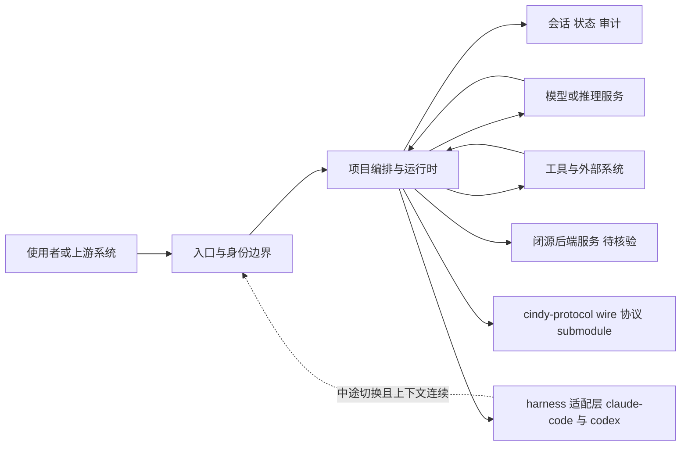

# cindy — 开箱即用的多 harness AI agent 客户端

## 一句话定位
开源 AI agent 客户端（Electron 桌面 + React Native 移动），首个支持 Claude Code 和 Codex 两个 harness，可在任务中途切换 harness×model 组合而工作区/记忆/技能/工具保持连续，本地运行用真实文件和已登录应用。

## 它解决的问题
普通用户（非开发者）想用 coding agent（Claude Code、Codex）但面对的是 CLI 工具和复杂配置。cindy 把多个 harness 打包成"开箱即用"的桌面/移动应用——装上就能用，不需要理解 harness 的差异，甚至在任务中途可以无缝切换。

## 为什么值得关注（2026-08-01）

在 harness 应用层产品化趋势中，cindy 代表了"开箱即用客户端"方向——与 qm（团队协作平台）形成互补。cindy 的核心差异化是**多 harness 混合驱动**：一个任务可以由不同 harness×model 组合分别完成规划、执行、review，中途切换而上下文不丢。这在 harness 本身仍在快速迭代的当下，是一种对冲上游变化的策略。

## 热度来源判断
- **定位精准**："open-source AI agent that works out of the box" + 中英双语 README，瞄准的是不想折腾配置的用户群体。
- **fork 161** 高于 star 量级的预期，说明有人在实际尝试修改/部署。
- **商业化路径清晰**：开源客户端 + 付费托管服务（Cindy cloud）+ BYO API key/Claude Code Codex Coding Plan 三种模式。但这种"客户端开源 + 服务收费"的模式可持续性取决于服务体验。
- **话题性成分**：harness 应用化是本周热点，cindy 受品类热度加持。

## 关键技术亮点亮点

1. **多 harness 混合驱动 + 中途切换**：首个支持 Claude Code 和 Codex 两个 harness，models 和 harnesses 自由组合、可在任务中途切换，而 workspace/memory/skills/tools 保持连续。一个任务甚至可以由不同 harness×model 组合分别完成 plan/execute/review。原生 harness 开发中。
2. **本地优先 + 真实环境**：在用户自己的机器上运行，用真实文件和已登录的应用（可驱动浏览器、电脑和手机，从 IM 和日历取任务）。
3. **pnpm monorepo 架构**：`apps/desktop`（Electron）+ `apps/mobile`（Expo/React Native）+ `packages/*`（共享能力：auth/device-link/agent orchestration/model providers）+ `cindy-protocol/`（与服务端共享的 wire protocol，git submodule）。后端服务在独立 repo 不含在此 monorepo。
4. **工具二进制按需下载**：claude-code、codex、ripgrep 等工具二进制不提交到 repo，由 `pnpm install` 按平台下载；Android platform-tools 按 pinned 版本 + sha256 校验后获取。

## 架构师速览

| 决策问题 | 研究判断 | 证据边界 |
|---|---|---|
| 系统边界 | cindy 是 TypeScript 的 pnpm monorepo 客户端（apps/desktop Electron + apps/mobile Expo/React Native + packages/* 共享层 + cindy-protocol git submodule），后端服务在独立 repo 不含此 monorepo，工具二进制按平台由 `pnpm install` 下载并带 sha256 校验 | 仓库语言为 TypeScript，monorepo 结构与 cindy-protocol 子模块描述来自档案；具体子包粒度需源码核验 |
| 主路径 | 用户→入口与身份→项目编排/运行时→模型与工具调用→会话/状态/审计回写；中途可在 claude-code 与 codex 两个 harness 间切换，workspace/memory/skills/tools 由共享 packages 维持连续 | harness 切换语义、协议格式、持久化后端细节均未在档案中给出，须读源码或 cindy-protocol |
| 关键权衡 | 多 harness 混合驱动 vs 上游 API breaking change 适配成本；本地优先+真实环境 vs 工具二进制/平台组件供应链风险；开源客户端+付费托管服务 vs 闭源后端削弱可评估性 | 权衡基于档案描述的运行时职责与商业化路径；具体性能、SLO、权限模型未披露 |
| 最小 PoC | 在单一桌面渠道（Electron），最小工具权限，开启可审计日志，先跑通"Claude Code + Codex 中途切换且 workspace/memory 连续"一条主路径，再评估移动端与协议 | 工具链依赖、协议握手和后端离线行为均属“待核验”，不建议在本 PoC 中纳入生产化判断 |

## 架构启发
cindy 的"多 harness 中途切换且上下文连续"暗示了一种新的 agent 编排模式——不是把多个 agent 的输出拼接，而是让**同一个持续的工作流在不同 harness 间迁移**。这要求 workspace/memory/skills/tools 与 harness 解耦，cindy 通过共享 packages 层实现。但也意味着它是"重客户端"——需要管理多个 harness 的安装、版本、兼容性。

## 架构图（MMD）

> 证据边界：此图只采用本档案已有可核验描述；“待核验”节点不应视为项目实现事实。

## 定位判断
在 agent 生态分层中，cindy 与 qm 同处 L5 应用产品层，但方向不同：qm 面向**团队协同**（多人 scope + Slack），cindy 面向**个人异构组合**（多 harness 混合驱动 + 跨设备）。cindy 更接近"个人 AI 助理"的产品形态，qm 更接近"团队工作平台"。

## 风险 / 局限 / 泡沫点

1. **极早期项目**：创建于 2026-07-22（10 天），1.3K⭐，客户端刚开源，后端服务不开源。实际使用体验依赖闭源后端，社区无法完整评估。
2. **上游 harness 依赖严重**：Claude Code 和 Codex 都在快速迭代，cindy 的"多 harness 混合驱动"需要持续适配上游变化。README 提到工具二进制按需下载，但 harness API 的 breaking change 影响更深。
3. **"开箱即用"承诺的可持续性**：当 Claude Code/Codex 更新导致兼容性问题时，普通用户（cindy 的目标群体）最缺乏排障能力——这与"开箱即用"定位存在张力。
4. **商业化模式的不确定性**：开源客户端 + 付费服务的模式下，如果服务体验不佳，开源客户端的吸引力会下降；如果服务太强，又可能变成事实上的闭源产品。
5. **跨设备一致性**：桌面（Electron）和移动（React Native）共享 agent 能力，但移动端的 agent 执行能力（文件系统访问、工具链）天然受限，"同样的 agent 在手机和电脑上都能干活"的承诺在实际场景中会打折。

## 与同类项目的关系

- **vs qm（1.4K⭐）**：qm 是团队协作平台（Slack+Web），cindy 是个人客户端（桌面+移动）。qm 强调多人 scope，cindy 强调多 harness 混合。
- **vs openworker（11.3K⭐）**：openworker（Andrew Ng）是"交付成品 + 审批门控 + BYO 模型"的本地 AI Coworker，偏个人生产力；cindy 也偏个人但强调多 harness 和跨设备。
- **vs omnigent（7.9K⭐）**：omnigent 是编排层（L3），cindy 是客户端（L5）。omnigent 管理 agent，cindy 把 agent 交付给最终用户。

## 是否值得持续跟踪
**是，作为"harness 应用层客户端化"趋势的代表。** 关注其多 harness 中途切换的实际稳定性和闭源后端的服务质量。

## 后续观察点
1. **Claude Code/Codex 上游 breaking change 后的适配速度**：这是 cindy 最大的工程风险。
2. **社区是否fork 出纯本地方案**：如果有人 fork cindy 去掉闭源后端依赖、纯本地运行，能验证"开箱即用 + 多 harness"在无托管服务下的可行性。
3. **移动端 agent 实际能力边界**：手机上能执行多少种任务，与桌面端的差距有多大。

---
*首次记录：2026-08-01*
