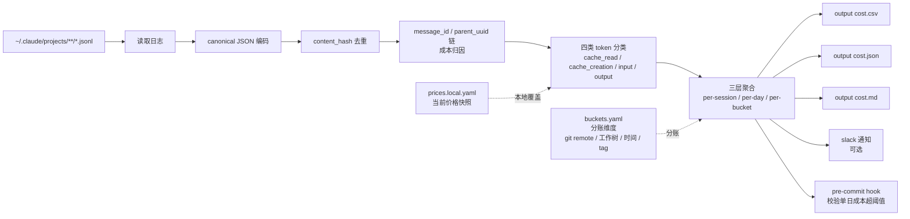

# clawback/claude-code-cost-ledger

## 一句话定位
Claude Code token 成本分账账本——`~/.claude/projects/**/*.jsonl` 读取 + canonical JSON 编码 + content_hash 去重 + message_id / parent_uuid 链 + cache_read_input_tokens / cache_creation_input_tokens / input / output 四类 token；per-session / per-day / per-bucket 三层聚合 + cost.csv / cost.json / cost.md 三格式输出 + pre-commit hook 校验单日成本超阈值。

## 它解决的问题
当前 AI Coding 成本治理的痛点是 **「token 用了多少不知道 / 哪个团队用的不知道 / 哪个项目用的不知道 / 哪天超预算了不知道」**：
- Claude Code 用户跑一周后问「Claude 用了多少钱 / 哪个项目用了最多 / 哪个 session 最贵」，官方 Dashboard 仅提供「今日 / 本周」聚合，**不提供 per-session / per-bucket 分账**
- Anthropic 2026 引入 prompt caching（cache_read_input_tokens / cache_creation_input_tokens），**不分类计费会高估成本**（cache read 比 input 便宜 ~90%）
- 企业 AI Coding 成本上限管控需要 pre-commit hook 等机制，**官方 Dashboard 不提供**

**claude-code-cost-ledger 直击这一缺口**：把 Claude Code 原始日志（jsonl）解析为 canonical JSON 编码 + content_hash 去重 + message_id 链 + 四类 token 分类 + per-session / per-day / per-bucket 聚合 + pre-commit hook 成本上限校验。这是「企业 AI Coding 成本治理」的最小可信栈。

## 为什么值得关注（2026-09-17）
- **Stars:** 17（截至 2026-09-17），1 天 17⭐
- **Forks:** 2（fork/star 11.8% 在新项目中等偏高，反映「准备把成本账本集成进合规管线」的企业 fork）
- **Watchers/Subscribers:** 0
- **Open Issues:** 0
- **License:** MIT
- **语言:** Python（核心 CLI）+ YAML（buckets.yaml 配置）
- **活跃度:** created 2026-09-16，pushed 2026-09-16
- **规模:** 188 KB
- **基线:** Claude Code 2.1.272+（最新）
- **核心数据源:** `~/.claude/projects/**/*.jsonl`

## 热度来源判断
claude-code-cost-ledger 的热度是 **「Claude Code 成本账本 + 分账 + 上限管控 × canonical JSON + content_hash 去重 × cache token 四类分类 × pre-commit hook 工程化」** 的组合。AI Coding 成本治理是 2026 Q3 的热点（ToolMonsters/claude-code-routing 9-15 是成本优化 + ToolReplay 9-15 是 session 审计），**成本账本是治理闭环的关键拼图**——审计（可信度）+ 优化（执行策略）+ 账本（成本可见）。**fork/star 11.8%** 反映「准备把成本账本集成进合规管线」的企业 fork 群。热度 **真实且有强合规信号**——但需警惕：Anthropic 是否暴露官方成本账本 API 决定本仓库长期命运。

## 关键技术亮点
1. **`~/.claude/projects/**/*.jsonl` 读取** —— Claude Code 原生日志；每个 jsonl 行是一个 message
2. **canonical JSON 编码 + content_hash 去重** —— 与 ToolReplay（9-15）「hash-chain 封存」同构但推到「成本账本」领域；防止同一 message 重复计费
3. **message_id / parent_uuid 链** —— 把 Claude Code 日志的每条 message 关联到 session + parent message 形成成本归因链；「这条 assistant message 的成本归因到哪个 user message 触发的 session」
4. **cache_read_input_tokens / cache_creation_input_tokens / input / output 四类 token 分类计费** —— cache token 是 Anthropic 2026 引入的 prompt caching 关键成本维度；不分类会高估成本（cache read 比 input 便宜 ~90%）
5. **per-session / per-day / per-bucket 三层聚合** —— session 级（每个对话）+ day 级（每日）+ bucket 级（按分账维度）
6. **cost.csv / cost.json / cost.md 三格式输出** —— CSV（Excel 友好）+ JSON（程序友好）+ Markdown（人读友好）
7. **当前价格快照可被本地覆盖** —— `prices.local.yaml` 覆盖默认价格；Anthropic 调价时企业可立即更新
8. **`buckets.yaml` 分账维度** —— 按 git remote / 工作树 / 时间窗口 / 自定义 tag 分账（企业可按团队 / 项目 / 客户分账）
9. **slack 通知可选** —— 单日成本超阈值触发 slack webhook
10. **pre-commit hook 校验单日成本超阈值** —— `.git/hooks/pre-commit` 或 `pre-commit framework` 配置 `claude-cost-ledger check --max-daily-usd 50`，超阈值 commit 失败；这是「企业 AI Coding 成本上限管控」的关键工程化
11. **单一 CLI 入口** —— `aggregate / check / diff / report / buckets` 五命令覆盖完整生命周期

## 架构师速览

| 决策问题 | 研究判断 | 证据边界 |
|---|---|---|
| 系统边界 | Claude Code 成本账本 CLI，输入是 ~/.claude/projects/**/*.jsonl，输出是 cost.csv + cost.json + cost.md + slack 通知 + pre-commit hook 校验；不覆盖 Claude Code 运行时成本控制（成本控制是 ToolMonsters/claude-code-routing 等路由工具） | 仅基于档案描述的 jsonl 读取 + canonical JSON + content_hash + 四类 token + buckets.yaml + pre-commit hook；具体 canonical JSON 编码规则、content_hash 算法未在档案中给出 |
| 主路径 | 读取 jsonl → canonical JSON 编码 → content_hash 去重 → message_id / parent_uuid 链归因 → 四类 token 分类计费 → per-session / per-day / per-bucket 聚合 → 三格式输出 + slack 通知 + pre-commit hook | 主路径为档案语义抽象；具体 message 归因算法是否完整覆盖 fork session、slash command、sub-agent 等场景未核验 |
| 关键权衡 | 全量解析（准确但慢） vs 增量解析（快但需 state）;canonical JSON（去重准确但复杂） vs 简单 hash（快但易误判）;pre-commit hook 强制（兜底） vs 仅报告（柔性） | 档案明示「canonical JSON + content_hash 去重 + pre-commit hook」设计目标；具体四类 token 价格快照来源、缓存命中率追踪是否完整待核验 |
| 最小 PoC | 在测试 Claude Code 项目上跑 1 周，验证 cost.csv / cost.json / cost.md 三格式输出一致性 + pre-commit hook 阈值校验准确性 + buckets.yaml 分账正确性 | PoC 范围、退出路径由档案「单 CLI 入口 + 五命令」建议推导；具体阈值默认值（--max-daily-usd 默认值）、slack 通知格式待核验 |

## 架构图（MMD）

> 证据边界：此图只采用本档案已有可核验描述；"待核验"节点不应视为项目实现事实。

## 架构启发
claude-code-cost-ledger 的核心启发是 **「AI Coding 成本治理需要账本 + 分账 + 上限管控三件套」**——AI Coding 工具（Claude Code / Cursor / Codex 等）的成本治理闭环：审计（可信度）+ 优化（执行策略）+ 账本（成本可见）。**canonical JSON + content_hash 去重** 与 ToolReplay「hash-chain 封存」同构但推到「成本账本」领域；**四类 token 分类计费** 是 Anthropic 2026 prompt caching 引入后的成本治理必备——cache token 不分类会高估成本 ~90%；**pre-commit hook 校验单日成本超阈值** 是「企业 AI Coding 成本上限管控」的工程化形式——把治理从「事后审计」前移到「事前拦截」。

更深层的启发是：**新兴 SaaS 的成本治理工具 = 早期合规窗口**——SaaS 平台早期官方 Dashboard 简陋（仅今日/本周聚合），**第三方成本治理工具是合规必需**——类似云成本治理工具（CloudHealth / Vantage 等）在 AWS 早期填补官方 Cost Explorer 简陋的空白。本仓库若被 Claude Code 生态接受为成本治理事实标准，将成为 AI Coding 进入「企业级合规」的关键拼图。

## 定位判断
**工具型项目（Claude Code 成本账本 CLI）。** claude-code-cost-ledger 是 Claude Code 成本治理的最小可用工具，若成功，它会成为 Claude Code 企业用户的成本治理默认入口。**17⭐ / fork 2 / fork/star 11.8% / 1 天** 反映企业合规团队对本仓库的中等偏高关注。但"工具化"取决于一个关键问题：**Anthropic 官方是否暴露官方成本账本 API**——目前 Anthropic 仅提供 session 级汇总，不提供 message 级成本 + 分账；本仓库若被官方接受将形成事实标准。

## 风险 / 局限 / 泡沫点
- **Anthropic 官方化威胁：** Anthropic 可能推出官方成本账本 API / Dashboard 取代本仓库
- **cache token 价格快照：** Anthropic 调价时本地价格快照可能过期；需要自动同步机制
- **pre-commit hook 性能：** 每次 commit 都跑 `claude-cost-ledger check` 可能拖慢 commit 速度
- **bucket 维度覆盖：** 默认按 git remote / 工作树 / 时间 / tag 分账；企业内部可能需要更复杂的维度（如按 SLA / 客户 / 业务线）
- **私有仓库场景：** 私有 Claude Code 项目可能无法用 git remote 自动分账

## 与同类项目的关系
- **vs ToolMonsters/claude-code-routing（9-15）：** claude-code-routing 是「成本优化」（cheap model 当 worker）；本仓库是「成本账本」（成本可见 + 分账）；同成本治理但不同维度
- **vs ToolReplay（9-15）：** ToolReplay 是「session 层审计」（可信度）；本仓库是「session 层成本治理」（成本可见）；同 session 层但不同治理维度
- **vs CloudHealth / Vantage：** 这些是云成本治理工具；本仓库是 AI Coding 成本治理工具；定位类似但服务不同
- **vs Anthropic 官方 Dashboard：** 官方仅提供今日/本周聚合；本仓库提供 per-session / per-bucket 详细分账；本仓库站在官方 Dashboard 的肩膀上

## 是否值得持续跟踪
**值得跟踪（AI Coding 成本治理闭环关键拼图）。** claude-code-cost-ledger 代表了 Claude Code「成本账本 + 分账 + 上限管控」的方向，无论其本身成败，这一方向是行业趋势。建议关注：
- Anthropic 官方是否暴露成本账本 API（决定其"事实标准"命运）
- 是否扩展到其他 AI Coding 工具（Codex / Cursor / Copilot 等）
- 是否与云成本治理工具集成（CloudHealth / Vantage 等）
- pre-commit hook 是否被引入 Claude Code 官方扩展机制

对 Claude Code 企业用户，本仓库是当前唯一的「成本账本 + 分账 + 上限管控」工具，值得直接采用。对 AI Coding 工具链观察者，它是「session 层成本治理」的标志性样本。

## 后续观察点
- 是否演化为独立平台/服务（从 CLI 升级为 SaaS 治理平台）
- 是否扩展到其他 AI Coding 工具（Codex / Cursor / Copilot 等）
- 是否与云成本治理工具集成（CloudHealth / Vantage 等）
- pre-commit hook 是否被引入 Claude Code 官方扩展机制
- 是否引入 AI Coding ROI 指标（产出 / 成本比值）

---
> 数据来源: GitHub API (2026-09-17) | Stars: 17 | Forks: 2 | License: MIT | 语言: Python | 创建: 2026-09-16
