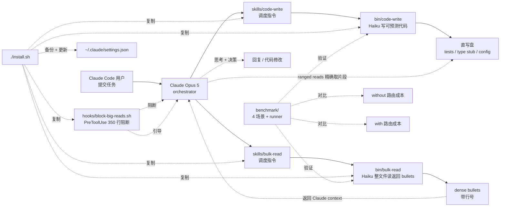

# ToolMonsters/claude-code-routing

## 一句话定位
Spotify Portal 90% Claude Code token 削减公开博客的 plain Claude Code 复现；cheap model（Haiku）处理「读 / 写 boilerplate」，Claude 处理「thinking」；PreToolUse 350 行阻断 hook + Skills + benchmark。

## 它解决的问题
Claude Code 在生产 SDLC 中的 token 成本是显著开销——Opus 5 token 单价比 Haiku 高 60-100 倍。Spotify 在 2026-09 公开博客「Portal by Spotify cut my Claude Code token usage by 90%」描述了「cheap model 处理 reading/boilerplate，Claude 处理 thinking」的路由方案，但依赖 Portal 平台 + Gemini Flash。ToolMonsters/claude-code-routing 是 **「plain Claude Code + Haiku 不需 Portal」的复现**——把 Spotify 公开博客的方案移植到 plain Claude Code CLI，无需 SaaS 平台依赖。**「cheap model 当 worker + Claude 当 orchestrator」是 AI Coding 成本优化的标准模式**——把「读 / 写 boilerplate」这种高 token 低思考的工作分离出去，让 Claude 专注「思考 + 决策」。

## 为什么值得关注（2026-09-15）
- **Stars:** 19（截至 2026-09-15），1 天 19⭐，成本优化工具早期信号
- **Forks:** 3
- **Watchers/Subscribers:** 0
- **Open Issues:** 0
- **License:** MIT（极宽松）
- **语言:** HTML（README + Skills 是 Markdown/HTML）
- **活跃度:** created 2026-09-14，pushed_at 2026-09-14
- **规模:** 193 KB
- **Topics:** （GitHub API 未列出 topics）

## 热度来源判断
claude-code-routing 的热度是 **「Claude Code token 成本压力 × Spotify Portal 公开博客背书 × plain Claude Code 不需 Portal 复现 × 4 个公开 benchmark + 主动标注反例的诚实信号」** 的组合。Claude Code 重度用户的 token 成本是真实痛点；Spotify Portal 博客公开化提升了行业关注度；plain Claude Code 复现意味着「不绑 SaaS 平台也能降本」；**README 主动标注「The numbers are below, including the ones that don't flatter it」**（S2 with 比 without 略贵）是诚实信号的工程化。fork=3 / 1 天 / fork/star 15.8% 是「企业 fork 信号」高区间——准备把路由策略集成进内部 Claude Code 工作流的团队已经在试。热度 **真实且具成本优化刚需**——但需关注 Spotify Portal 博客原文的版权与本仓库的关系。

## 关键技术亮点
1. **`bin/code-write` 是核心**——Haiku 写「可预测代码」（测试 / type stub / config），从 spec + 参考文件直写盘；Claude 不读参考文件也不读输出——把「写 boilerplate」的工作完全外包给 Haiku
2. **`bin/bulk-read` 把整文件读路由给 Haiku**——Claude 的 context 不被这些大文件污染，Haiku 返回 dense bullets 带行号（Claude 后续用 ranged reads 精确取片段）
3. **`hooks/block-big-reads.sh` 是 PreToolUse 强制 hook**——任何全量读超 350 行就阻断并把 Claude 指向两个脚本（targeted reads 不阻断）
4. **`skills/code-write` + `skills/bulk-read` 是 Claude 调度指令**——告诉 Claude 何时调用哪个脚本
5. **`benchmark/` 4 场景 + runner + 分析可复现所有数字**——S1 inventory 110/110 classes、S2 raise/except 跨 1155+625 行、S3 与 S4（README 截断部分）
6. **`./install.sh` 自动安装**——把脚本 hook skills 复制到 `~/.claude` 并备份 `~/.claude/settings.json`
7. **环境变量配置**——`BLOCK_MIN_LINES`（默认 350）/ `CHEAP_MODEL`（默认 haiku）/ `CLAUDE_BIN`（若 `claude` 不在 PATH）
8. **实测基础**——Claude Code 2.1.270 + Opus 5 + `psf/requests` 仓库 + 4 个任务（每个任务 with / without 各跑一次）
9. **诚实信号**——README 主动标注 S2 反例（$0.85 with vs $0.74 without，「with 略贵」）避免读者误读为「所有场景都省钱」
10. **MIT 许可 + 193 KB repo**——可直接复现的成本优化工具标准形态

## 架构师速览

| 决策问题 | 研究判断 | 证据边界 |
|---|---|---|
| 系统边界 | plain Claude Code CLI 之上的 cheap model 路由层；输入 Claude Code 任务；输出低成本执行（Haiku 处理 reading/boilerplate，Claude Opus 5 处理 thinking）；含 bin/code-write + bin/bulk-read scripts + hooks/block-big-reads.sh PreToolUse hook + skills/code-write + skills/bulk-read Skills 调度指令 + benchmark/ 4 场景 | 来自 README 关于「bin/code-write Haiku 直写盘可预测代码」「bin/bulk-read Haiku 整文件读返回 bullets」「hooks/block-big-reads.sh PreToolUse 350 行阻断」「skills/code-write / skills/bulk-read」「benchmark/ 4 场景 psf/requests」的明示；具体 Haiku 模型版本、Opus 5 token 单价、Skills 调度协议细节待核验 |
| 主路径 | 用户提交 Claude Code 任务 → Claude Opus 5 orchestrator → skills/code-write 调度 bin/code-write（Haiku 写测试/type stub/config 直写盘）或 skills/bulk-read 调度 bin/bulk-read（Haiku 整文件读返回 dense bullets）→ PreToolUse hook 350 行阻断引导用上述 scripts → Claude Opus 5 用 ranged reads 精确取片段思考决策 → 回复 / 代码修改 | 主路径来自 README 描述的「cheap model 当 worker + Claude 当 orchestrator」模式 + Spotify Portal 公开博客复现；具体 Skills 调度协议、Haiku 调用参数、Opus 5 vs Haiku token 单价比待核验 |
| 关键权衡 | cheap model 当 worker + Claude 当 orchestrator（成本省 vs 增加路由复杂度）/ plain Claude Code 不需 Portal（不绑 SaaS 平台 vs Spotify Portal 集成度更高）/ PreToolUse hook 350 行阻断（保护 Claude context vs 可能误阻断大文件读）/ S2 反例诚实标注（实测 vs cherry-pick）/ benchmark/ 4 场景仅 psf/requests 仓库（可复现 vs 场景覆盖窄） | 权衡五因素均从 README 推导；具体 Spotify Portal 博客原文版权、Haiku 模型可用性、PreToolUse hook 阻断阈值 350 是否调整、更多 benchmark 场景待核验 |
| 最小 PoC | macOS / Linux + Claude Code CLI 2.1.270 + Opus 5 + Haiku 模型可用 + git clone + cd claude-code-routing && ./install.sh（自动复制 scripts + hook + skills 到 ~/.claude 并备份 settings.json）+ 重启 Claude Code + 跑 benchmark/ 4 场景（inventory 110/110 classes + raise-except 跨 1155+625 行）+ 对比 without 成本 vs with 成本 | PoC 由「git clone + install.sh + benchmark/ 4 场景」路径推导；具体 Haiku 模型可用性、benchmark/ 数字验证、S2 反例实测、Spotify Portal 博客原文版权待核验 |

## 架构启发
claude-code-routing 的核心启发是 **「cheap model 当 worker + Claude 当 orchestrator」是 AI Coding 成本优化的标准模式**。现代 AI Coding 系统的成本结构是「高 token 单价的 LLM 处理所有任务」，但**绝大多数 token 消耗是「读 / 写 boilerplate」这种高 token 低思考的工作**——把这类工作分离出去给 cheap model（Haiku / Gemini Flash / Llama 等）能显著降低成本且不损失质量。更深层的启发是 **「plain Claude Code 不需 Portal」的复现路径**——Spotify Portal 公开博客后，本仓库证明「不绑 SaaS 平台也能降本」；**对企业**：这是「内部可部署的降本方案」而非「依赖第三方 SaaS 平台」的关键差异。**S2 反例（with 比 without 略贵）是诚实信号**——说明不是所有场景都省钱，路由策略的适用场景需用户根据自身 workload 实测。**PreToolUse hook + Skills 组合**是 Claude Code 扩展机制的清晰示范——hook 强制阻断、Skills 引导调度，二者配合实现「cheap model worker + Claude orchestrator」的协调。

## 架构图（MMD）

> 证据边界：此图只采用本档案已有可核验描述；"待核验"节点不应视为项目实现事实。

## 定位判断
**工具型（AI Coding 成本优化工具）。** claude-code-routing 不是又一个 AI Coding 客户端（那是 Aider / Cursor / Claude Code 等），而是 **「plain Claude Code 之上叠加 cheap model 路由层的成本优化工具」**。它的价值不在于「功能多」，而在于 **「可复现 + 可实测 + 诚实标注」** 三件套。对 Claude Code 重度用户：这是「直接克隆 + install.sh + 跑 4 个 benchmark 验证成本节省比」的最简路径；对企业 IT 团队：这是「内部可部署的降本方案」而非「依赖第三方 SaaS 平台」的关键差异。

## 风险/局限/泡沫点
- **S2 反例（with 比 without 略贵）说明不是所有场景都省钱**——路由策略的适用场景需用户实测
- **依赖 plain Claude Code CLI + Haiku 模型可用性**——若 Haiku 不可用需切其他 cheap model（`CHEAP_MODEL` 环境变量可配）
- **Spotify Portal 博客原文的版权与本仓库的关系**——README 自述「Not affiliated with Spotify. I rebuilt it」是合理声明但仍需关注
- **PreToolUse hook 仅阻断 350 行以上全量读**——若用户任务需要读超过 350 行整文件（如理解大型生成代码）会被阻断
- **Skills 调度依赖 Claude 遵循 skills/code-write / skills/bulk-read 指令**——若 Claude 不遵循则 hook + skills 失效
- **`bin/code-write` 写可预测代码（测试 / type stub / config）但不写创造性代码**——路由策略仅对 boilerplate 工作有效
- **193 KB repo + 仅 README + Scripts + Skills 形态**——不是「大项目」而是「配置 + Scripts + Skills」形态

## 与同类项目的关系
- **vs Spotify Portal**：Portal 是 Spotify 内部 SaaS 平台 + Gemini Flash；claude-code-routing 是 plain Claude Code + Haiku 复现——**不依赖 SaaS 平台**
- **vs oil-oil/oil-codex-title（今日 1 天 24⭐）**：oil-codex-title 是独立 Luna Fast 后台命名话题（不污染主对话）；claude-code-routing 是 cheap model 处理 reading/boilerplate——**AI Coding 工具链不同维度**
- **vs FelixQiu1/XiaoAi-LLM-Router（今日 1 天 20⭐）**：XiaoAi-LLM-Router 是 LiteLLM 统一多供应商（智能音箱升级）；claude-code-routing 是 cheap model 路由层（Claude Code 成本优化）——**AI Coding 工具链不同维度**
- **vs 昨日 ToolMonsters/claude-code-routing 复现历史**：本仓库是 2026-09-14 创建的复现版本——**完整复现 1 天 19⭐**
- **vs Aider / Cursor / Claude Code**：这些是 AI Coding 客户端；claude-code-routing 是 plain Claude Code 之上的路由层——**叠加层**

## 是否值得持续跟踪
**值得跟踪（AI Coding 成本优化工具赛道）。** claude-code-routing 代表了「cheap model 当 worker + Claude 当 orchestrator」AI Coding 成本优化的标准模式，无论其本身成败，这一方向是行业趋势。建议关注：**(a) 是否被 Claude Code 官方集成**（决定其「事实标准」地位）、**(b) cheap model 路由策略是否扩展到其他 AI Coding 客户端**（决定模式可推广性）、**(c) Spotify Portal 后续博客是否进一步公开细节**（决定可复现深度）。对 Claude Code 重度用户：值得立即评估成本节省比。

## 后续观察点
- 是否被 Claude Code 官方集成（类似 settings.json 标准化）
- cheap model 路由策略是否扩展到其他 AI Coding 客户端
- Spotify Portal 后续博客是否进一步公开细节
- benchmark/ 是否扩展更多场景（如 reasoning / refactoring / testing）
- `bin/code-write` 创造性代码支持（目前仅可预测代码）
- PreToolUse hook 阻断阈值（350 行）是否调整
- 是否补齐 GitHub Actions CI

---
> 数据来源: GitHub API (2026-09-15) + README API readme 字段 base64 解码 | Stars: 19 | Forks: 3 | License: MIT | 语言: HTML | 创建: 2026-09-14
