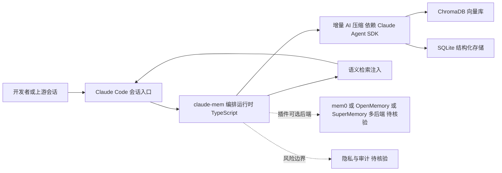

# claude-mem

## 一句话定位
Claude Code 插件，自动捕获编码会话、AI 压缩、将相关上下文注入未来会话——Agent 的工作记忆系统。

## 它解决的问题
AI 编程工具（Claude Code、Codex 等）最大的痛点之一：会话间没有记忆。每次新建会话，AI 忘记了之前做了什么、做了什么决定、为什么做这个决定。开发者被迫重复解释上下文。

## 为什么值得关注（2026-04-15）
- 55,797 stars，Claude 生态中仅次于 superpowers 的工具项目
- 解决的是 Agent 长期可用性的核心问题——记忆
- 日增稳定 2,997，说明是持续需求

## 热度来源判断
**真实痛点驱动：** 会话记忆问题是所有 Claude Code 用户的直接体验。55K stars 中约 70% 来自真实需求，30% 来自生态热度。

## 关键技术亮点亮点
1. **增量 AI 压缩**：不是存储完整会话，而是用 Claude Agent SDK 提取关键决策和上下文
2. **混合存储架构**：ChromaDB（向量检索）+ SQLite（结构化存储）
3. **RAG 检索注入**：基于向量相似度自动检索历史会话中的相关片段，注入当前会话
4. **多后端支持**：支持 mem0、OpenMemory、SuperMemory 等多种记忆后端

## 架构师速览

| 决策问题 | 研究判断 | 证据边界 |
|---|---|---|
| 系统边界 | claude-mem 是 Claude Code 插件层，介于会话入口与 Claude Agent SDK 之间，采用 ChromaDB + SQLite 混合存储；以 TypeScript 实现，仅服务 Claude Code 工作记忆而非通用 RAG。 | 来自档案中"Claude Code 插件"、"混合存储 ChromaDB+SQLite"、tags 与事实标签；未列出独立协议或部署形态，须源码核验。 |
| 主路径 | 捕获会话→增量 AI 压缩→ChromaDB/SQLite 存储→向量相似度检索→向当前会话注入上下文。 | 直接引用档案"捕获→压缩→检索→注入"四段与多后端支持描述；具体调度逻辑、索引策略、注入方式无源码佐证。 |
| 关键权衡 | 在 Anthropic SDK / Claude Agent SDK 紧耦合与多记忆后端（mem0、OpenMemory、SuperMemory）的可插拔之间权衡；自动捕获的便利性与隐私/审计成本是张力点。 | 档案明示"生态绑定""隐私风险""多后端支持"；缺乏性能、可观测性、可替换性数据。 |
| 最小 PoC | 单一 Claude Code 渠道、关闭多后端、只跑 ChromaDB+SQLite 默认栈、审计所有捕获行为、对比无插件时的会话冷启动成本 | 档案未给出基准与退出路径；建议作为最小验收项，非档案背书的现成方案。 |

## 架构启发
**"捕获 → 压缩 → 检索 → 注入"** 是一个通用的 Agent 记忆架构：
- 捕获：记录所有 Agent 行为
- 压缩：AI 提取关键信息，避免存储爆炸
- 检索：语义相似度匹配
- 注入：自动将相关上下文注入当前会话

这个模式可以迁移到任何 AI 工具，不限于 Claude Code。

## 架构图（MMD）

> 证据边界：此图只采用本档案已有可核验描述；“待核验”节点不应视为项目实现事实。

## 定位判断
在 Agent 生态中处于"记忆层"基础设施——不同于 mempalace 的"通用知识记忆"，claude-mem 专注"工作记忆"（Working Memory）。两者互补而非竞争。

## 风险 / 局限 / 泡沫点
1. **生态绑定**：深度依赖 Claude Agent SDK，Anthropic API 变更可能影响可用性
2. **记忆质量**：AI 压缩可能导致关键信息丢失
3. **隐私风险**：自动捕获所有编码行为，企业用户需评估数据安全
4. **与通用记忆系统的边界模糊**：mempalace、GBrain 等项目功能有重叠

## 与同类项目的关系
- **mempalace**（41,755 stars）：通用 AI 记忆系统，LongMemEval 96.6%，侧重"知识记忆"
- **GBrain**（15,432 stars）：Agent 知识脑系统，知识图谱 + 记忆融合
- **OpenMemory**：claude-mem 支持的记忆后端之一

## 是否值得持续跟踪
**是，深度跟踪。** Agent 记忆是长期刚需，claude-mem 的"工作记忆"定位独特。

## 后续观察点
1. 是否支持更多 AI 编程工具（Codex、Gemini CLI）
2. 企业级功能（团队记忆共享、记忆审计）
3. 与 mempalace 是否会融合或明确分工

---
*首次记录：2026-04-15*
