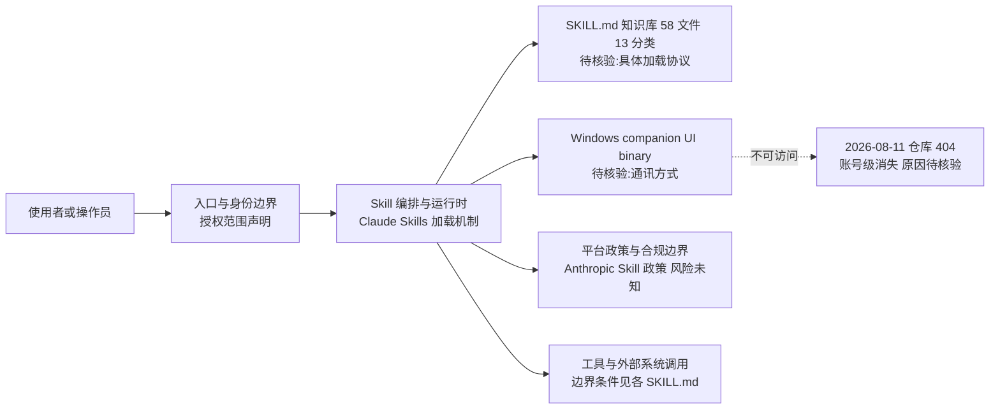

# 0xwilliamortiz/claude-red

## 一句话定位
首个 Claude Skills 体系的攻防安全技能库——58 个结构化 SKILL.md 文件，覆盖 13 个攻击面（从 SQLi 到 shellcode、从 EDR 绕过到漏洞开发），把 Claude 变成"按需加载的专家级红队操作员"。

## 它解决的问题
安全攻防（红队/渗透测试）的知识高度专业化且分散——不同攻击面（Web 应用、AD、云、移动、IoT、漏洞开发）各有方法论、工具链和边界条件。传统方式是安全工程师手动调用工具或记忆流程。claude-red 把这些专业知识编码为结构化 Skill 文件，Claude 在对话中按需加载对应攻击面的方法论——相当于给 AI 一个"红队专家知识库"。解决的是**"安全攻防专业知识难以被 AI agent 快速准确调用"**的问题。

## 为什么值得关注
- **Stars:** 555（截至 2026-08-08），创建 2026-08-05，3 天破 500
- **Forks:** 69
- **Watchers/Subscribers:** 169（极高比例，169/555 = 30%，通常 <5%）
- **Open Issues:** 1
- **License:** MIT
- **语言:** JavaScript
- **活跃度:** created 2026-08-05，pushed_at 2026-08-06
- **规模:** 58 个 skill，13 个分类（Web Application / Auth & Identity / AD / Wireless / Cloud / Mobile / IoT & Embedded / Infrastructure & Red Team / Exploit Development / Fuzzing & VR / Reconnaissance / AI Security / Utility）
- **作者:** 0xwilliamortiz（同时也是 humanizer-cli 作者，持续生产高质量 Skill 生态）

## 热度来源判断
claude-red 的热度来自**"安全赛道刚需 × Claude Skills 生态红利 × 同作者前作口碑"**的叠加。169 watchers（30% 的 star/watcher 比）是极强的信号——这说明安全从业者（而非普通开发者）在深度关注，"watch"意味着"我在工作中要用/在跟踪"。58 个 skill × 13 分类的覆盖广度也是关键——这不是玩具，而是试图覆盖完整红队方法论。热度**真实且指向专业用户群体**。需注意：作者 0xwilliamortiz 此前 humanizer-cli（585⭐/208 watchers）已建立口碑，claude-red 的初期热度有"同作者粉丝迁移"成分，但 169 watchers 独立验证了安全赛道需求。

## 关键技术亮点亮点
1. **按需加载（on-demand loading）:** Skill 基于对话触发自动加载，不占用全局 context（Claude Skills 体系的核心机制）
2. **SKILL.md 结构化:** 每个 skill 是结构化文件，含方法论/工具/边界条件/升级路径
3. **13 个攻击面全覆盖:** 从 Web 应用（SQLi/XSS）到 Exploit Development（shellcode）、从 EDR 绕过到 ADCS 滥用，覆盖红队完整 kill chain
4. **AI Security 分类:** 包含针对 AI 系统的攻击 skill，反映了"AI 安全"从理论进入实操
5. **Windows companion UI:** 在 Windows 上可启动 companion UI binary
6. **明确的使用边界:** README 声明用于"authorized red team engagements, bug bounty, security research, CTF"

## 架构师速览

| 决策问题 | 研究判断 | 证据边界 |
|---|---|---|
| 系统边界 | 档案明示的边界仅包括：作者已删除的 GitHub 仓库、58 个 SKILL.md 文件、13 个攻击面分类、可选的 Windows companion UI binary；其余组件不可访问 | 因账号与仓库自 2026-08-11 起 404，源码无法核验 |
| 主路径 | 入口与权限读取 → 58 个 SKILL.md 按对话上下文按需加载到 Claude Skills 体系 → Claude 按 skill 方法论调用工具/产出结果 | 路径来源于档案"按需加载""SKILL.md 结构化"自述，未由源码证实 |
| 关键权衡 | 攻防知识覆盖广度（58 skill × 13 分类） vs. 单作者维护质量一致性、平台政策风险、Skill 机制变更依赖 | star/watch 比例仅是关注度信号，不能当作攻防有效性证据 |
| 最小 PoC | 在受控授权环境，单一攻击面（例如 Web Application SQLi skill）跑通：触发加载 → 按方法论执行 → 输出可审计日志，且具备随时禁用/退出路径 | 不应外推到全部 58 skill；建议把厂商政策与法律合规列为前置验收 |

## 架构启发
claude-red 的核心启发是**"专业领域知识正在被编码为 Agent Skill"**。这与 humanizer（去 AI 腔写作）、h3-prompt-writing（视频 prompt）、wshobson/agents（编码 agent 插件）共同构成一个趋势：**"领域专家知识 → SKILL.md → 按需注入 agent context"**正在成为知识分发的标准模式。安全领域尤其适合——攻防知识高度结构化（有明确方法论和工具链），且人类专家稀缺。更深层的启发：**Skill 生态正在沿"能力维度"而非"工具维度"组织**——claude-red 不是"一个渗透测试工具"，而是"一个红队专家的完整知识体系"。

## 架构图（MMD）

> 证据边界：此图只采用本档案已有可核验描述；“待核验”节点不应视为项目实现事实。

## 定位判断
**品类定义型项目（安全 Skill 生态）。** claude-red 是首个系统化覆盖 Claude Skills 体系的攻防安全技能库（58 skill × 13 分类）。它的定位不是工具，而是**"安全专业知识在 Agent 时代的分发载体"**。169 watchers 说明它已触及专业用户群体。若 Claude Skills 生态持续增长，claude-red 有潜力成为安全领域的默认 Skill 来源（类似 wshobson/agents 之于编码）。关键变量：Skill 质量是否经得起真实红队检验、社区贡献是否扩展覆盖面、各 Agent 平台是否推出竞争性安全 Skill。

## 风险/局限/泡沫点
- **安全/法律风险:** 攻防安全 skill 的分发天然敏感，可能面临平台政策限制（Claude/Anthropic 是否允许此类 skill 在官方渠道分发待观察）
- **质量未独立验证:** 58 个 skill 的实际效果未经公开红队验证，"expert-level methodology"为 README 自述
- **作者集中:** 0xwilliamortiz 个人维护，58 个 skill 的质量一致性需观察
- **平台依赖:** 完全依赖 Claude Skills 体系，若 Anthropic 改变 Skill 机制或政策，影响重大
- **双重用途风险:** 攻防 skill 可被恶意使用，README 的"authorized use"声明是软约束
- **69 fork vs 555 star:** fork 比例正常，但说明使用者更多是"直接用 skill"而非"二次开发"

## 与同类项目的关系
- **vs humanizer-cli（同作者）:** humanizer-cli 是"写作治理"，claude-red 是"安全攻防"——同一作者在不同领域验证 Skill 分发模式
- **vs wshobson/agents:** wshobson 覆盖编码通用 skill，claude-red 深耕安全垂直——互补关系
- **vs Metasploit/Burp Suite:** 传统安全工具是"工具调用"，claude-red 是"方法论注入"——不同层次
- **vs awesome-pentest 等列表:** 列表是资源索引，claude-red 是可执行 skill——更高一层抽象

## 是否值得持续跟踪
**值得跟踪（Skill 生态安全垂直头部）。** claude-red 代表了"安全专业知识被编码为 Agent Skill"的趋势，169 watchers 验证了专业用户需求。无论其本身成败，"领域 Skill 化"是明确方向。建议关注：Skill 质量的独立验证（是否有安全团队公开使用反馈）、Anthropic 对安全类 Skill 的政策态度、社区贡献是否扩展覆盖面、同作者后续项目（0xwilliamortiz 似乎在系统化生产 Skill 生态）。

## 后续观察点
- Anthropic/平台对安全 Skill 的政策态度（关键风险变量）
- 是否有安全团队公开使用反馈或 case study
- 社区贡献是否扩展 skill 数量和攻击面覆盖
- 是否出现竞品安全 Skill 库
- 0xwilliamortiz 的下一个 Skill 项目（判断是否在系统化构建 Skill 生态矩阵）

---
> 数据来源: GitHub API (2026-08-10) | Stars: 701 | Forks: 89 | Watchers: 208 | License: MIT | 语言: JavaScript | 创建: 2026-08-05 | Skill: 58 个 / 13 分类

## 最近动态（2026-08-10）

- **增速显著放缓 +20（+3%），208 watchers 持续高位**：681 → 701，fork 86 → 89（+3），watchers 208 → 208（持平）。今日无新 commit（GitHub API 可核验：pushed_at 08-09），增长来自曝光惯性。
- **watchers 持平说明深度关注已饱和**：208 watchers 连续两日持平（08-09: 208 → 08-10: 208），说明安全从业者的深度关注群体已初步稳定，新增 star 更多是"收藏"而非"跟踪"。
- **判断（维持 score 84）**：增速从 +23% 骤降到 +3%，但 30% watch 率持续，品类定义者地位不变。今日无代码活动，需关注后续是否有 skill 扩展或独立红队验证。
- **同作者 humanizer-cli（586⭐）维持**：0xwilliamortiz 在"专业垂直 Skill"赛道的能力持续验证。

## 最近动态（2026-08-11）⚠️ 全账号 404

- **重大事件——0xwilliamortiz 全账号及 claude-red、humanizer-cli 双双消失：** 2026-08-11 对 GitHub API 发起请求，`GET /repos/0xwilliamortiz/claude-red` → 404 Not Found，`GET /users/0xwilliamortiz` → 404 Not Found，`GET /users/0xwilliamortiz/repos` → 返回空数组。**整个账号级别的事件，不是单个仓库被删。** 昨日数据：701⭐ / 89 fork / 208 watchers。
- **消失原因无法确定（待观察）：** 可能是主动删除、GitHub TOS 强制措施（攻防类内容可能触发审查）、账号被盗后清除、或改名迁移。API 无法区分。
- **影响判断（score 84→70）：** 品类定义者一夜蒸发，安全 Skill 品类面临断档风险。这是本周第二个"高关注度 Skill 项目异变"案例（前一个是 open-kimi-ppt-skill 归档），凸显 Skill 生态的单点脆弱性。
- **可核验事实汇总：** (1) 账号 404，(2) 两个仓库 404，(3) 昨日 star/watchers 数据来自 08-10 API 快照。**无法核验：** 消失的具体原因。
