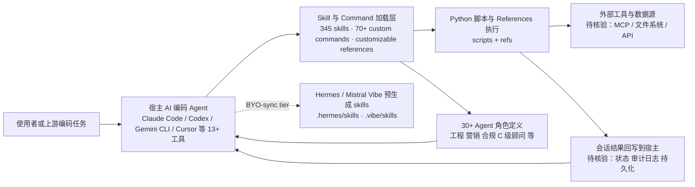

# alirezarezvani/claude-skills — 345 Claude Code skills & agent skills & plugins (30+ Agents, 70+ custom commands

## 一句话定位

345 Claude Code skills & agent skills & plugins (30+ Agents, 70+ custom commands, 330+ skills, customizable references, scripts)for Claude Code, Codex, Gemini CLI, Cursor, and 8 more coding agents — engineering, marketing, product, compliance, C-level advisory, research, business operations, commercial & finance, and your daily productivity skills.。主要使用 Python 编写，当前 24,268 stars / 3,416 forks / 222 subscribers。

## 它解决的问题

**目标用户**：使用 python 生态的开发者、AI Agent 构建者。

**痛点**：该项目解决的核心问题是 345 Claude Code skills & agent skills & plugins (30+ Agents, 70+ custom commands, 330+ skills, customizable references, scripts)for Claude Code, Codex, Gemini CLI, Cursor, and 8 more coding agents — engineering, marketing, product, compliance, C-level advisory, research, business operations, commercial & finance, and your daily productivity skills.。从 README 来看，项目提供了 # Claude Code Skills & Plugins — Agent Skills for Every Coding Tool **362 production-ready Claude Code skills, plugins, and agent skills for 13 AI coding tools.** The most comprehensive open-source li。

**场景**：适用于需要 agent-plugins, agent-skills, agentic-ai 的开发场景。

## 为什么值得关注（2026-07-03）

1. **Stars 增长**：24,268 stars，3,416 forks——fork/star 比为 14.1% （高 fork 比例说明部署/集成意愿强）
2. **活跃度**：创建于 2025-10-19，最后更新 2026-08-09，24 open issues
3. **技术栈**：Python，License: MIT
4. **生态定位**：Topics: agent-plugins, agent-skills, agentic-ai, ai-coding-agent, anthropic-claude

## 热度来源判断

**真实需求信号**：forks 3416（高部署意愿），subscribers 222（深度关注）。

**品类时机**：从 topics 来看，agent-plugins, agent-skills, agentic-ai 是当前社区关注的方向。

## 关键技术亮点

1. **# Claude Code Skills & Plugins — Agent Skills for Every Coding Tool**
2. ****362 production-ready Claude Code skills, plugins, and agent skills for 13 AI coding tools.****
3. **The most comprehensive open-source library of Claude Code skills and agent plugins — also works with**
4. ****Works with:** Claude Code · OpenAI Codex · Gemini CLI · OpenClaw · Hermes Agent[^hermes] · Mistral**
5. **[^hermes]: Hermes Agent is **BYO-sync tier**: the repo ships a pre-generated `.hermes/skills/claude-**
6. **[^vibe]: Mistral Vibe is also **BYO-sync tier**: the repo ships a pre-generated `.vibe/skills/claude**

## 架构师速览

| 决策问题 | 研究判断 | 证据边界 |
|---|---|---|
| 系统边界 | 这是一个面向 Claude Code / Codex / Gemini CLI / Cursor 等 13+ AI 编码工具的资源型 skill 库（345 skills、30+ Agents、70+ custom commands），自身定位是"插件/技能集合"，而非独立运行时；其外延覆盖工程、营销、合规、C 级顾问等多业务领域。 | 边界判断基于 README 自述的数量与覆盖范围；未声明其内部是否有独立调度内核或仅作为静态 skill 文件分发，待核验。 |
| 主路径 | 路径为：宿主编码 Agent（Claude Code 等）→ 加载本仓库的 skill/command/agent 定义 → 调用对应工具或脚本执行 → 回写结果到宿主会话。Python 是实现脚本与 references 的主要语言。 | 主路径来自 README 的"skills, custom commands, customizable references, scripts"描述；具体加载协议（如是否走 MCP / Skills 标准）未在档案中给出，待核验。 |
| 关键权衡 | 跨 13+ 工具兼容性 vs. 各工具原生能力差异：覆盖广意味着需为每家维护映射层；此外脚本默认权限边界、BYO-sync tier（Hermes / Mistral Vibe）的预生成 skills 是否安全需评估。 | 权衡结论仅依据 README 列出的覆盖工具与脚注中的 BYO-sync 提示；权限模型、可观测性细节档案未证实，待核验。 |
| 最小 PoC | 选定 1 个官方支持的宿主（优先 Claude Code），挑选 1 个领域 skill（例如工程类）与 1 个 custom command，在受限工作目录、关闭网络工具的前提下跑通端到端，验证 skill 加载、脚本执行与审计可见性后再扩展。 | PoC 步骤基于"先单一渠道、最小权限、可审计日志"的通用建议与 README 的多工具声明；具体 skill 标识符、依赖与执行入口待核验。 |

## 架构启发

从 alirezarezvani/claude-skills 的设计来看，核心思路是 **"345 Claude Code skills & agent skills & plugins (30+ Agents,"**。这反映了 Python 生态中 Agent / AI 工具链 的演进方向——降低集成复杂度、提供开箱即用的能力。开源 License (MIT) 降低了采用门槛。

## 架构图（MMD）

> 证据边界：此图只采用本档案已有可核验描述；“待核验”节点不应视为项目实现事实。

## 定位判断

**资源型**。在生态中定位为345 Claude Code skills & agent skills & 方向的工具。Stars 24268 说明已有一定社区基础。

## 风险 / 局限 / 泡沫点

1. **规模风险**：24,268 stars，但 fork 3416 说明有实际部署
2. **维护风险**：最后 push 时间 2026-08-09，活跃维护中
3. **Open Issues**：24 个 open issues，活跃社区反馈
4. **License**：MIT（宽松许可，适合商用）

## 与同类项目的关系

- 与同 Python 生态的同类工具形成竞争/互补关系。具体竞品对比需参考社区讨论。
- 从 topics (agent-plugins, agent-skills, agentic-ai) 来看，与关注 agent-plugins 的其他项目有交叉。

## 是否值得持续跟踪

**是。** 24268 stars + 活跃更新说明项目有持续价值。建议关注后续版本迭代和社区增长。

## 后续观察点

1. Star 增速是否可持续（当前 24,268）
2. Fork 增长趋势（当前 3,416）
3. 功能迭代频率（最后更新 2026-08-09）
4. 社区活跃度（subscribers 222, open issues 24）

---
> 数据来源: GitHub API (2026-08-09) | Stars: 24,268 | Forks: 3,416 | License: MIT | 语言: Python | 创建: 2025-10-19
