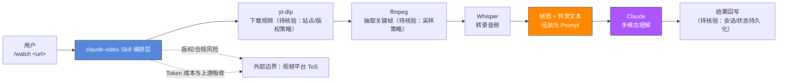

# claude-video — 让 Claude 看视频

## 一句话定位
一个极简的 Claude Code 技能——`/watch` 命令下载视频、抽取关键帧、转录音频，然后将所有信息交给 Claude 处理。

## 它解决的问题
Claude（以及大多数 LLM）无法直接"看"视频。用户如果想让 AI 分析视频内容，需要手动下载、抽帧、转录。claude-video 将整个流程自动化为一个命令。

## 为什么值得关注（2026-07-13）
周增 4.4K stars，说明"Agent 多模态感知"是真实需求。虽然技术简单，但解决了一个高频痛点。

## 热度来源判断
- **Claude Code 生态红利**：作为 Claude Code Skill 发布，自动获得生态曝光
- **功能直观**：`/watch <url>` 就能用，零学习成本
- **视频 AI 分析需求**：内容创作者、教育者、研究者都有需求
- **泡沫风险中等**：技术壁垒低，容易被复制或被上游吸收

## 关键技术亮点亮点
1. **流水线设计**：download → extract frames → transcribe → feed to Claude，每步可替换
2. **Claude Code Skill 集成**：符合 Agent Skills 标准，一键安装
3. **帧抽取策略**：不是每帧都抽，而是智能采样关键帧

## 架构师速览

| 决策问题 | 研究判断 | 证据边界 |
|---|---|---|
| 系统边界 | claude-video 是 Claude Code 技能形态的编排层，串联 yt-dlp、ffmpeg、Whisper 三个外部工具，并把多模态结果交回 Claude；自身不提供模型、不做存储抽象 | 仅基于档案中明示的流水线组件（yt-dlp/ffmpeg/Whisper）与"Skill"形态；未声明鉴权、持久化、部署形态 |
| 主路径 | `/watch` 命令 → 下载视频（yt-dlp）→ ffmpeg 抽取关键帧 → Whisper 转录音频 → 帧图+转录文本提交 Claude → 视频内容理解回写 | 路径与组件来自档案"关键技术亮点"与 mermaid 段；具体协议（HTTP/MCP/Skill manifest）、会话模型未在档案中说明 |
| 关键权衡 | 在"零学习成本/易集成"与"Token 消耗、版权风险、上游吸收风险"之间取舍；技术壁垒低、扩展性依赖外部工具替换能力 | 权衡判断来自档案"风险/局限"与"泡沫风险中等"；未提供量化数据（如帧数/分钟、单视频成本） |
| 最小 PoC | 单一公开短视频 URL → 固定目录输出关键帧+转录 → 提交 Claude 校验摘要准确度；验收项：成本上限、版权规避、可审计日志、退出路径 | PoC 边界仅依据档案定位"工具型 Skill"与"采用建议"段；具体验收阈值、SLO、权限模型待核验 |

## 架构启发
## 架构图（MMD）

> 证据边界：此图只采用本档案已有可核验描述；“待核验”节点不应视为项目实现事实。

**启发**：Agent 多模态感知不需要复杂的端到端模型——"拆解 + 组合"式的流水线设计在工程上更实用。

## 定位判断
在 Agent 多模态生态中：
- 定位为**轻量级视频感知 Skill**
- 不是平台，不是基础设施，是工具
- 短期有价值，中期可能被 Agent 框架原生吸收

## 风险 / 局限 / 泡沫点
1. **技术壁垒极低**：核心逻辑就是 yt-dlp + ffmpeg + Whisper 的串联
2. **长期可能被吸收**：Claude Code 或其他 Agent 框架可能原生支持视频
3. **版权风险**：下载 YouTube 等平台视频可能涉及版权问题
4. **Token 消耗大**：视频帧图片消耗大量 Token，长视频成本高

## 与同类项目的关系
| 项目 | 定位 | 差异 |
|------|------|------|
| Claude Code 原生 | 可能内置视频支持 | 官方方案 |
| Gemini | 原生多模态 | 不需要外部工具 |
| Multimodal Agent SDK | 多模态 Agent 框架 | 更通用，更复杂 |

## 是否值得持续跟踪
⚠️ **短期跟踪**。核心价值在于验证"Agent 视频感知"需求。如果 Claude Code 原生支持视频，此项目可能被吸收。

## 后续观察点
1. **使用场景演化**：用户用它做什么——内容分析、教育、监控？
2. **上游吸收信号**：Claude Code 是否在 changelog 中提到原生视频支持
3. **帧抽取效率**：是否有更智能的关键帧选择策略

---
*首次记录：2026-07-13*
