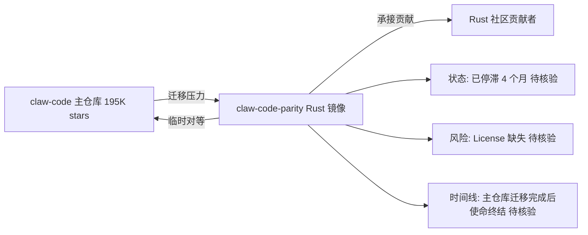

# ultraworkers/claw-code-parity

## 一句话定位
claw-code 主仓库的 Rust 语言"parity（对等）"工作分支，是主仓库进行技术迁移期间的临时 Rust 端口——目的是让 Rust 社区在过渡期也能参与开发。

## 它解决的问题
当主项目（claw-code，195K stars）进行大规模架构迁移时，可能出现"语言栈切换"——例如从某语言迁移到 Rust，或从某架构重构到新架构。迁移期间，主仓库代码可能不稳定或不可用。claw-code-parity 作为"过渡期镜像"，在 Rust 生态中保持项目可编译、可贡献，避免迁移期间社区断层。

## 为什么值得关注
- **Stars:** 6,668（截至 2026-08-07），关注度中等
- **Forks:** 5,262（fork 数异常高，接近 star 数）
- **License:** 未指定（需谨慎使用）
- **⚠️ 活跃度低:** pushed_at 2026-04-05，已 4 个月未更新
- **语言:** Rust
- **定位:** 明确声明为"临时工作"（temporary work）

## 热度来源判断
本仓库的热度**完全是 claw-code 主仓库热度的溢出效应**。claw-code 拥有 19 万 stars，其任何衍生仓库都会获得关注。fork 数异常高（5,262，接近 stars）说明大量用户 fork 是为了"留存副本"或"研究代码"，而非真正参与开发。自 2026-04 停更以来，它事实上已**完成历史使命**或**被遗弃**。

## 关键技术亮点亮点
1. **Rust 实现:** 将 claw-code 核心逻辑用 Rust 重写
2. **Parity 目标:** 追求与主仓库功能对等（feature parity）
3. **临时性质:** 明确声明为过渡产物，非长期维护项目
4. **社区接力:** 在主仓库迁移期间承接 Rust 社区贡献

## 架构师速览

| 决策问题 | 研究判断 | 证据边界 |
|---|---|---|
| 系统边界 | claw-code-parity 是 claw-code 主仓库的 Rust 临时镜像仓库，承接主仓库过渡期 Rust 生态贡献，本身不是独立产品系统 | 档案明确为"临时工作分支"，定位为过渡产物，非独立运行时边界 |
| 主路径 | 主路径即"主仓库迁移 → parity 仓库维持 Rust 可编译/可贡献 → 主仓库迁移完成后使命终结"；并非运行时请求链路 | 档案未给出运行时组件/协议描述，图中编排/模型/工具等节点属架构抽象 |
| 关键权衡 | 唯一实质权衡是"过渡期保留双语言栈 vs 一刀切直接迁移"；社区接力价值 vs 维护负担与许可证风险 | 档案给出"双仓库策略"启发与 InfluxDB 类比，但未含具体技术权衡细节 |
| 最小 PoC | 在评估侧无需 PoC；档案明确建议"不需要跟踪"，仅需核验主仓库迁移完成状态即可 | 档案未提供 PoC 步骤；License 缺失、4 个月未更新，使任何复用都缺乏前置证据 |

## 架构启发
claw-code-parity 的存在反映了一种 **"语言迁移期的双仓库策略"**——主仓库推进迁移，parity 仓库维持旧语言生态运行。这种模式在大型项目语言迁移时常见（如 InfluxDB 从 Go 迁移到 Rust 时也有类似安排）。启发是：**重大技术迁移需要"过渡桥"，而非"一刀切"**。但本案例的特殊性在于：claw-code 本身声称"由 Agent 维护"，那么 parity 工作是否也是 Agent 自主完成？这增加了项目的社会学趣味。

## 架构图（MMD）

> 证据边界：此图只采用本档案已有可核验描述；“待核验”节点不应视为项目实现事实。

## 定位判断
**已停滞的过渡型项目。** claw-code-parity 是一个"工具性存在"——它的价值在过渡期，过渡结束即失去意义。当前已 4 个月未更新，很可能已被官方放弃。不建议作为独立项目跟踪，理解 claw-code 主仓库即可。

## 风险/局限/泡沫点
- **⚠️ 疑似遗弃:** 4 个月未更新，无维护迹象
- **License 缺失:** 无明确许可证，法律状态不明，不可安全使用
- **临时性质:** 即使恢复维护，也是过渡产物，无长期价值
- **泡沫属性:** 6.6K stars 完全来自主仓库热度溢出，非独立价值
- **代码质量:** 与主仓库一样由 Agent 生成，未经人类审查

## 与同类项目的关系
- **vs claw-code（主仓库）:** 本仓库是主仓库的 Rust parity；主仓库才是核心
- **vs greycheer/claw-code:** 第三方备份 fork（21 stars），价值更低
- **vs 其他语言移植:** 暂未观察到 Go/Python 等其他语言移植

## 是否值得持续跟踪
**不需要跟踪。** 作为 claw-code 生态的过渡产物，其使命已结束（或被放弃）。理解主仓库 claw-code 即可。如需 Rust 实现，等待主仓库自身完成 Rust 迁移。

## 后续观察点
- 是否有"复活"迹象（恢复更新）
- 主仓库 claw-code 的 Rust 迁移是否正式完成（届时 parity 仓库彻底失去意义）
- 是否被官方明确声明废弃

---
> 数据来源: GitHub API (2026-08-07) | Stars: 6,668 | Forks: 5,262 | License: 未指定 | ⚠️ 已 4 个月未更新
