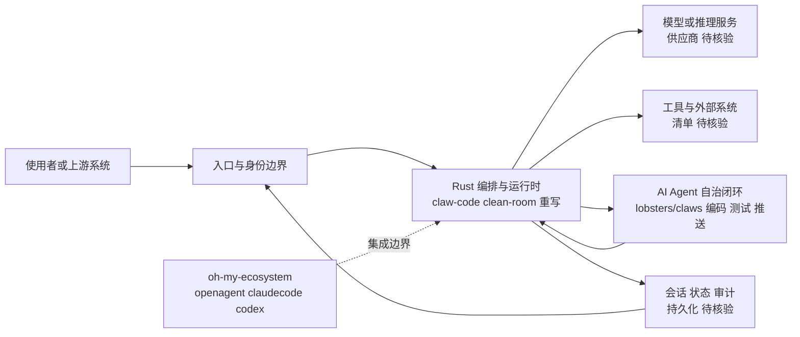

# claw-code-parity

## 一句话定位

claw-code 的 Rust 重写版本——由 AI Agent 自主编写、测试和维护的"Agent 为 Agent 写代码"实验。

## 它解决的问题

claw-code 的原始版本在快速爆发后暴露出一些架构层面的问题（可能是为了速度而做的妥协）。claw-code-parity 试图通过**完全重写**来解决这些问题，同时进行一个更激进的实验：**让 AI Agent 自己完成整个开发流程**。

这不是一个常规的开源项目——它是一个关于"AI 能否自主维护软件"的实验。

## 为什么值得关注（2026-04-08）

claw-code 本身已是 168K stars 的现象级项目，而 claw-code-parity 作为其重写版本，代表了两层含义：

1. **架构迭代信号**：社区/作者认为原始架构存在需要重写的层面
2. **AI 自主开发实验**：项目声称由 AI Agent（lobsters/claws）自主编写、运行测试、推送更新，没有传统的人类开发团队

## 热度来源判断

- **claw-code 效应**：直接受益于 claw-code 的巨大流量和关注度
- **AI 自主开发叙事**："AI 写 AI 工具"的故事性极强，媒体传播性高
- **架构好奇心**：开发者想知道重写版本与原版的架构差异

## 关键技术亮点亮点

1. **Clean-room 重建**：不是 fork 原版，而是从头重写，避免了代码层面的继承问题
2. **Agent 自主 CI/CD**：AI Agent 自动运行测试、修复 bug、推送更新，形成闭环
3. **高性能 Rust 实现**：保持 Rust 的性能优势，同时改进架构设计
4. **LLM-to-Tool Wiring**：深入研究 LLM 如何与本地工具连接、管理长期对话上下文、编排 sub-agent
5. **与 oh-my-ecosystem 的集成**：与 oh-my-openagent、oh-my-claudecode、oh-my-codex 形成生态

## 架构师速览

| 决策问题 | 研究判断 | 证据边界 |
|---|---|---|
| 系统边界 | 入口、模型、工具三方通过 Rust 编排层解耦，定位为 claw-code 的 clean-room 重写，集成 oh-my-ecosystem 多 Agent 体系 | 边界划分基于 README 抽象描述；具体协议、I/O 接口与子 Agent 边界"待核验" |
| 主路径 | 使用者经入口/身份 → 编排运行时 → LLM 调用 + 工具调用 → 会话/状态/审计回写，AI Agent（lobsters/claws）自主完成编码、测试、推送 | 主流程为档案明示；CI/CD 触发器、状态持久化格式、工具清单"待核验" |
| 关键权衡 | 自主开发闭环的速度收益，与人类审核缺位下的代码质量、可观测性、安全边界之间的张力；clean-room 重写 vs. 与原版共享心智模型 | 权衡为观察性判断；性能基准、PR 质量、测试覆盖率"待核验"，无第三方实测数据 |
| 最小 PoC | 单一入口 + 最少工具权限 + 可审计日志下验证 LLM-to-Tool 接线与会话上下文管理，再评估 oh-my-openagent/claudecode/codex 接入 | PoC 范围仅可由档案中"集成生态"与"LLM-to-Tool Wiring"研究主题推导；具体部署形态、模型供应商、SLO 指标"待核验" |

## 架构启发

claw-code-parity 最有价值的启发不是代码本身，而是**开发模式**：

- **AI 自主开发闭环**：AI Agent 写代码 → 自动测试 → 自动修复 → 自动推送，人类只负责设定目标和审核
- **Trade-off**：这种模式的速度极快，但代码质量、架构一致性和安全性需要额外保障
- **实验性质**：这是一个"能否做到"的实验，而非"应该这样做"的最佳实践

## 架构图（MMD）

> 证据边界：此图只采用本档案已有可核验描述；“待核验”节点不应视为项目实现事实。

## 定位判断

**实验性基础设施**。claw-code-parity 既是 claw-code 的架构改进，也是 AI 自主开发的实验平台。它的价值目前更多在于实验本身，而非生产可用性。

## 风险 / 局限 / 泡沫点

- **"AI 自主维护"的泡沫**：实际上仍需要人类设定目标、审核代码、处理安全问题，纯粹的自主维护是不现实的
- **与原版的内耗**：两个并行版本可能分散社区贡献
- **代码质量未知**：AI 生成的代码在复杂场景下的可靠性尚未验证
- **新项目不确定性**：作为新项目，API 稳定性、文档完备性、社区支持都待观察

## 与同类项目的关系

- **claw-code（ultraworkers）**：原始版本，claw-code-parity 是其重写
- **instructkr 版本**：claw-code 的另一个并行仓库，三者之间的竞争/合作关系待观察
- **Claude Code（Anthropic）**：两者都是 Claude Code 架构的重实现

## 是否值得持续跟踪

**观察架构差异。** claw-code-parity 的真正价值在于它与 claw-code 原版的架构对比——哪些设计被保留了，哪些被改进了，以及为什么。这是理解 AI Agent 框架最佳架构的绝佳案例。

## 后续观察点

1. **与 claw-code 的架构差异**：核心设计决策有哪些不同
2. **AI 自主开发的质量**：PR 质量、测试覆盖率、bug 修复速度
3. **社区走向**：社区是聚焦于一个版本还是两个版本并行发展
4. **性能基准**：重写版本在启动速度、内存占用上的实际表现

---

*首次记录：2026-04-08*
