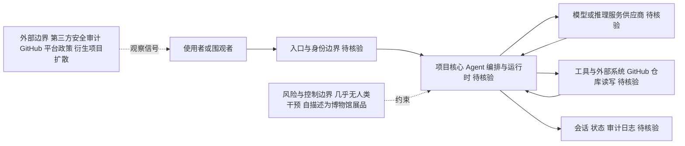

# ultraworkers/claw-code

## 一句话定位
史上最快突破 100K stars 的现象级项目，一个用 Rust 编写、号称"完全自主维护"的 AI Coding Agent——宣称其代码库本身由 Agent 持续开发，几乎无人类干预。

## 它解决的问题
本项目展示了一种极端的"AI 自主软件开发"实验：能否让 AI Agent 自己维护一个 GitHub 仓库，包括编写代码、合并 PR、修复 bug、演进架构，全程几乎不需要人类介入？claw-code 试图证明"Agent-driven development"不只是 demo，而是可以在真实开源项目中持续运行。它针对的是"AI 究竟能否接管完整软件工程流程"这一根本性问题。

## 为什么值得关注
- **Stars:** 195,005（截至 2026-08-07），GitHub 历史增速最快的项目之一
- **Forks:** 109,272，fork 数极高（与 star 接近 1:1.8，异常高）
- **License:** MIT
- **活跃度:** pushed_at 2026-08-06，几乎每日更新
- **语言:** Rust（高性能、内存安全的系统编程语言）
- **描述声明:** "An agent-managed museum exhibit...developed and maintained with no human intervention"——这是核心叙事卖点

## 热度来源判断
claw-code 的热度**混杂了真实技术好奇与社交媒体炒作**。3 个月内达到近 20 万 stars 的速度前所未有，其中包含大量"围观型"star（用户 star 以"标记关注"而非"实际使用"）。Fork 数异常高（109K）也是信号——大量 fork 来自想研究其代码或参与"Agent 开发实验"的用户，而非生产使用。它本质上更像一个**行为艺术 + 技术实验**，热度部分真实、部分泡沫。

## 关键技术亮点亮点
1. **Agent 自主开发:** 仓库描述明确声称代码由 Agent 编写和维护
2. **Rust 实现:** 选择内存安全的系统语言，适合长期运行的 Agent 进程
3. **"博物馆展品"定位:** 自我描述为 "museum exhibit"，暗示这是展示性而非生产工具
4. **持续自主演进:** 从 2026-03-31 创建至今高频更新，展示 Agent 长期自主运行能力

## 架构师速览

| 决策问题 | 研究判断 | 证据边界 |
|---|---|---|
| 系统边界 | 自我描述为"Agent 自主维护的博物馆展品"；档案未给出入口渠道、模型供应商、工具/数据源清单，编排层细节属待核验 | 仅有项目描述（"agent-managed museum exhibit"）、MIT 许可、Rust 语言、标签（AI-Coding-Agent、自主开发）等公开元数据 |
| 主路径 | 档案未公开 Agent 编排/工具调用/状态回写的具体实现，仅有"代码由 Agent 编写与维护"的叙事级声明 | 无源码审计支撑；不得据此推断协议、运行时或持久化实现 |
| 关键权衡 | 围绕"几乎无人类干预"这一核心叙事的真实性与可持续性；star/fork 比例近 1:1.8（195K/109K）显示围观信号显著，技术实质与社交动量之间存在权衡 | 热度数据来自 GitHub API 2026-08-07；非生产可用性证据为零 |
| 最小 PoC | 以观察者视角跟踪：追踪独立第三方安全审计、衍生项目扩散、平台政策介入等外部信号；不进入生产接入 PoC 阶段 | 档案明确标注"非生产工具"且"不建议生产使用"，PoC 仅限于外部信号监测 |

## 架构启发
claw-code 的最大启发不在代码本身，而在于**"Agent 作为开源项目维护者"这一组织形态**。传统开源依赖人类 Maintainer 的时间和精力（瓶颈明显），如果 Agent 能接管 PR Review、Bug Fix、文档更新等重复性工作，开源可持续性问题可能被重新定义。但目前它更像概念验证而非可复用范式。

## 架构图（MMD）

> 证据边界：此图只采用本档案已有可核验描述；“待核验”节点不应视为项目实现事实。

## 定位判断
**现象级实验项目，非生产工具。** claw-code 的价值在于"提出了一个问题"，而非"提供了一个产品"。它推动行业思考 Agent 在软件开发中的自治边界，但本身不是一个值得在生产中使用的工具。建议以"社会学实验"视角观察。

## 风险/局限/泡沫点
- **泡沫风险极高:** 195K stars + 109K forks 的比例异常，大量为"围观 star"
- **不可生产使用:** 自我描述为"博物馆展品"，不适合作为生产依赖
- **代码质量存疑:** 全 AI 生成的代码在安全性和可维护性上未经人类审查
- **叙事驱动:** 项目热度主要靠"无人干预"这一叙事驱动，技术实质待验证
- **维护可持续性:** 一旦实验结束或维护者（人类监督者）退出，项目可能停滞

## 与同类项目的关系
- **vs Claude Code/Codex CLI:** 这些是可实际使用的 AI Coding Agent 产品；claw-code 是"用 Agent 开发的项目"
- **vs claw-code-parity:** 同一生态的 Rust 端口工作（ultraworkers/claw-code-parity, 6.6K stars），作为正式迁移期间的临时替代
- **vs Devin/AutoGPT:** Devin 是商业 Agent 产品，AutoGPT 是通用自主 Agent 框架；claw-code 聚焦于"Agent 自我维护代码库"这一窄场景

## 是否值得持续跟踪
**以观察者视角跟踪，不建议投入生产使用。** 关注点不是技术采用，而是：这种"Agent 全自动维护仓库"模式是否会扩散到其他项目？是否会被恶意利用（如 Agent 仓库传播恶意代码）？

## 后续观察点
- 是否有独立第三方对其代码进行安全审计
- Star 数能否突破 25 万（验证是否为可持续关注而非短期炒作）
- 衍生出更多"Agent 自主维护"的项目（模式扩散信号）
- 是否被 GitHub 官方关注或介入（平台政策信号）

---
> 数据来源: GitHub API (2026-08-07) | Stars: 195,005 | Forks: 109,272 | License: MIT
