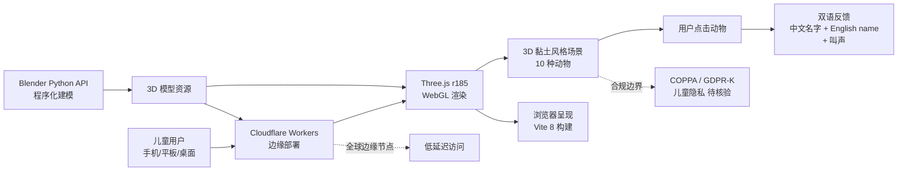

# cclank/clay-safari

## 一句话定位
黏土风格 3D 双语儿童动物世界——Three.js r185 + Blender-scripted 模型 + Cloudflare Workers 部署 + 中英双语 + 10 种动物 + 点击听名字 + 叫声；2 天 135⭐，**fork/star 23.7% 极高**，是 2026-09-09 "3D 教育内容向儿童 + 双语延伸"的代表样本。

## 它解决的问题
3D 儿童教育内容长期存在三个痛点：(1) **3D 美术成本高**——手工建模 10 种动物需要专业美术团队；(2) **部署成本高**——3D 内容通常需要大型服务器支持；(3) **双语支持稀缺**——多数儿童应用要么纯中文要么纯英文，双语支持稀缺。`cclank/clay-safari` 直击这三点：

1. **Blender 程序化建模**——用 Blender Python API 程序化生成黏土风格 3D 模型，避免手工建模成本
2. **Cloudflare Workers 边缘部署**——全球边缘节点部署，儿童访问延迟低
3. **中英双语界面**——10 种动物 + 名字 + 叫声中英双语

## 为什么值得关注（2026-09-09）
- **Stars:** 135（截至 2026-09-09），2 天净增，单日均速 ~67⭐/day
- **Forks:** 32（fork/star **23.7% 极高**——反映真实使用密度，可能因为教育机构 / 教师大量 fork）
- **Watchers/Subscribers:** 待观察
- **Open Issues:** 待观察
- **License:** MIT
- **语言:** JavaScript 主导（Three.js r185 + Vite 8）
- **项目年龄:** 2 天（创建 2026-09-07），是 2026-09-09 trending 新项目
- **核心差异:** 黏土风格 + 3D + 双语儿童教育 + 程序化建模 + Cloudflare Workers

## 热度来源判断
热度来自 **三个层面的叠加**：(1) **3D 互动教育内容需求增长**——Apple Vision Pro / Meta Quest 推动 3D 内容普及，儿童教育场景天然适合 3D；(2) **程序化建模降本**——Blender Python API 让非专业美术也能生成黏土风格 3D 模型；(3) **Cloudflare Workers 边缘部署**——3D 内容全球低延迟访问成为可能。

2 天 135⭐ / 32 fork / fork/star 23.7% 反映 **"视觉吸引力 + 教育刚需 + 双语 + 易部署"** 四者叠加——是真实教育需求场景，不是营销放大。

## 关键技术亮点
1. **黏土风格 3D 模型：** Blender 程序化生成黏土风格（claymation-style）动物模型——避免手工建模成本
2. **Three.js r185：** Three.js 最新版渲染，浏览器端纯 WebGL
3. **Cloudflare Workers 部署：** 全球边缘节点部署，儿童访问延迟低；Cloudflare Workers 模型意味着**没有传统服务器成本**
4. **中英双语：** 10 种动物 + 名字 + 叫声中英双语——双语教育工程化实现
5. **互动设计：** 点击听名字 + 叫声；走进去点一点——3D 互动范式
6. **Vite 8 构建：** 现代前端构建工具

## 架构师速览

| 决策问题 | 研究判断 | 证据边界 |
|---|---|---|
| 系统边界 | 3D 互动教育应用层——前端 Three.js r185（浏览器）+ 中间层 Vite 8 构建 + 后端 Cloudflare Workers 边缘部署；3D 资源由 Blender 程序化生成后打包 | 边界由 README + topics 明示；具体 Cloudflare Workers 模型（边缘 KV / R2 / D1）需代码审阅 |
| 主路径 | 用户访问 → Cloudflare Workers 边缘节点 → Three.js 加载 → 3D 场景渲染 → 用户点击动物 → 触发名字 / 叫声（中英双语）→ Three.js 动画反馈 | 主路径为 README 语义抽象；具体 Workers 路由、3D 资源加载策略、音频触发逻辑需代码审阅 |
| 关键权衡 | 程序化建模（成本低 / 风格统一）vs 手工建模（质量高 / 风格独特）；Cloudflare Workers（边缘部署 / 无服务器）vs 传统服务器（更灵活 / 更强控制）；双语界面（教育友好）vs 单语（开发简单） | README 明示程序化建模 + Cloudflare Workers + 双语；具体音频生成（真人 vs TTS vs 预录）需核验 |
| 最小 PoC | 访问 `https://clay-safari.lanshuagent.com/` → 浏览器渲染 3D 场景 → 点击动物 → 验证中英双语名字 + 叫声 → 测试不同设备（手机 / 平板 / 桌面）的响应式布局 | PoC 范围由 README 明示；具体离线 / 弱网支持、跨浏览器兼容性需 benchmark |

## 架构图（MMD）

> 证据边界：此图只采用本档案已有可核验描述；"待核验"节点不应视为项目实现事实。

## 架构启发
`cclank/clay-safari` 的核心启发是 **"3D 互动教育内容向儿童 + 双语 + 程序化建模 + Cloudflare Workers 边缘部署"** 的四维组合：

1. **程序化建模降本**——Blender Python API 让非专业美术也能生成风格统一 3D 模型
2. **Cloudflare Workers 边缘部署**——3D 内容全球低延迟访问成为可能，且无传统服务器成本
3. **双语教育工程化**——中英双语界面是儿童早期双语教育的工程化实现
4. **黏土风格差异化**——Apple Liquid Glass / Material 3 Expressive 等现代设计语言推 3D UI 普及，黏土风格是其中一种

更深层的启发是 **"3D 互动内容 SaaS 化路径"**——传统 3D 内容需要复杂部署；Cloudflare Workers + Vite + Three.js 让 3D 互动内容可以像 SaaS 一样部署。这与昨日 `EverettFish/holo-card-studio`（Codex Skill → 3D 内容流水线）共同构成 "3D 内容平民化" 趋势。

风险提示：**儿童隐私合规**——COPPA / GDPR-K 适用，访问数据 / cookies / AI 生成音频标注需要合规；**AI 内容生成**——是否用 AI 生成音频 / 文本需要明确标注；**离线 / 弱网支持**——Cloudflare Workers 模式在弱网地区是否可达需要 benchmark。

## 定位判断
**工具型项目（黏土风格 3D 双语儿童教育应用）。** `cclank/clay-safari` 在 2026-09-09 "3D 教育内容向儿童 + 双语延伸" 趋势中切入。差异化定位是 **"黏土风格 + 程序化建模 + 双语 + Cloudflare Workers 边缘部署 + 儿童教育"**——比传统 3D 儿童应用成本低、比单语应用教育价值高、比传统服务器部署的 3D 应用延迟低。当前定位是 **"3D 双语儿童教育应用样板"**，向"3D 教育内容 SaaS"扩展是合理路径。

## 风险/局限/泡沫点
- **儿童隐私合规：** COPPA（美国儿童在线隐私保护法）/ GDPR-K（欧盟通用数据保护条例儿童版）适用——访问数据 / cookies / AI 生成音频标注需要合规
- **AI 内容生成标注：** 是否用 AI 生成音频 / 文本需要明确标注（儿童内容对 AI 生成有强监管）
- **离线 / 弱网支持：** Cloudflare Workers 模式在弱网地区是否可达需要 benchmark
- **跨浏览器 / 跨设备兼容性：** WebGL 在不同浏览器（Safari / Chrome / Firefox / 移动端）的实现差异 + 设备性能差异需要测试
- **教育效果评估：** 双语 / 3D 互动对儿童学习的实际效果需要教育学评估
- **Blender 程序化建模局限：** 程序化建模的风格统一 vs 手工建模的独特性——前者成本低但风格单调
- **cclank 是新账号：** 2 天 135⭐ / 项目年龄 2 天，项目可持续性 / 治理结构 / 安全漏洞响应未验证

## 与同类项目的关系
- **vs 传统 3D 儿童教育应用（Khan Academy Kids / 洪恩等）:** 传统应用是商业闭源 + 手工建模 + 中心服务器；clay-safari 是开源 + 程序化建模 + 边缘部署——**开源 vs 闭源**
- **vs EverettFish/holo-card-studio (9-08, 779⭐):** holo-card-studio 是 Codex Skill → 3D 闪卡；clay-safari 是 3D 双语儿童教育——**成人创作 vs 儿童学习** 两条路线
- **vs 昨日 OpenBot/cumora (9-07, 4,367⭐):** OpenBot 是 AI coworker；clay-safari 是 3D 教育——AI 应用方向不同
- **vs Khan Academy 等教育平台:** Khan Academy 是视频 + 文字教育；clay-safari 是 3D 互动教育——**互动 vs 单向**
- **vs Apple Vision Pro Liquid Glass:** Liquid Glass 是设计语言；clay-safari 是具体应用——**设计语言 vs 应用实现**

## 是否值得持续跟踪
**值得跟踪（3D 双语儿童教育应用 + 程序化建模 + Cloudflare Workers 边缘部署）。** `cclank/clay-safari` 代表 "3D 互动内容平民化 + 双语教育工程化 + 边缘部署低成本" 三个趋势的交汇。建议关注：(a) 儿童隐私合规（COPPA / GDPR-K）；(b) AI 内容生成的标注合规；(c) 离线 / 弱网支持的实际表现；(d) 教育效果的实证研究。对儿童教育从业者 / 双语教育工作者 / 3D 内容开发者，clay-safari 是开源参考实现。

## 后续观察点
- 儿童隐私合规（COPPA / GDPR-K）——决定项目可持续性
- AI 内容生成的标注合规
- 离线 / 弱网支持的实际表现
- 教育效果的实证研究——决定教育价值
- 是否扩展到更多动物 / 主题（昆虫 / 海洋 / 恐龙等）
- 是否出现"3D 双语教育 Marketplace"或类似聚合
- cclank 是否持续维护 / 治理结构演化

---
> 数据来源: GitHub API (2026-09-09) | Stars: 135 | Forks: 32 | License: MIT | 语言: JavaScript | 创建: 2026-09-07
