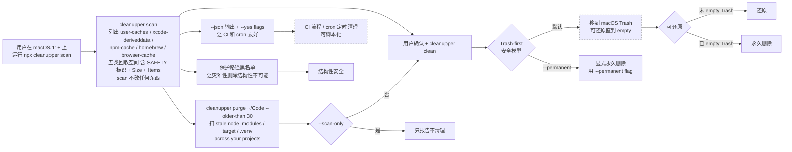

# SewCabinSpout/cleanupper

## 一句话定位
macOS 终端清理 CLI 替代 CleanMyMac ——「The open-source, privacy-first Mac cleaner CLI」：macOS 11+ Node.js 18+ 一行 `xcode-select --install && mkdir diskclean && cd diskclean && npm install github:SewCabinSpout/cleanupper` 即装，cleanupper scan 列出 user-caches / xcode-deriveddata / npm-cache / homebrew / browser-cache 五类回收空间，Trash-first 删除可还原，保护路径黑名单让灾难性删除结构性不可能，Zero telemetry 全程不联网。

## 它解决的问题
CleanMyMac 等闭源工具订阅 + 不透明 + telemetry + 用户想从终端一行命令清理 + 用户期望安全可还原 + 用户期望不联网 + 用户期望 CI / cron 可脚本化 + 用户期望多语言依赖 caches 全覆盖 + 用户期望 stale node_modules / target / .venv 项目级清理。它解决的是「macOS 终端磁盘清理 CLI + 安全 + 隐私 + 脚本化 + 多语言依赖清理」六件事一次解决的真痛点。

## 为什么值得关注
- **Stars:** 723（截至 2026-09-24），1 天突破 723，增速极快
- **Forks:** 0，社区未 fork（典型「高 star + 0 fork」高质量粉丝型结构 —— 用户多但不二次开发）
- **Watchers/Subscribers:** 0（公开 API 字段）
- **Open Issues:** 0，维护良好
- **License:** MIT
- **语言:** JavaScript
- **活跃度:** created 2026-09-23（1 天前），pushed_at 2026-09-23（当日），持续高活跃
- **规模:** 253KB，极小 JavaScript 项目
- **Topics:** cache-cleane, cleanmymac-alternative, cli, deriveddata, developer-tools, disk-cleanup, free-disk-space, homebrew, mac-cleaner, macos, macos-app, node-modules, nodejs, npm, open-source

## 热度来源判断
SewCabinSpout/cleanupper 的热度是 **「macOS 终端清理 CLI 替代 CleanMyMac 刚需 × Trash-first 安全模型 × 保护路径黑名单 × Zero telemetry 全程不联网 × JSON 输出 + CI 脚本化 × Xcode / npm / Yarn / pnpm / pip / uv / CocoaPods / Gradle / Cargo / Go caches 全覆盖 × purge 扫 stale node_modules / target / .venv 项目级清理」** 的强劲组合。CleanMyMac 是 macOS 老牌闭源工具但订阅 + 不透明 + telemetry，开发者苦之久矣。一个 macOS 终端 CLI 替代 + Trash-first 安全 + 保护路径黑名单 + Zero telemetry 全程不联网 直击痛点。**fork/star 0% 极干净个人开发者信号** ——「高 star + 0 fork」典型高质量粉丝结构：用户多但 fork 极少（因为 fork = 二次开发意愿，star = 「我装了用 + 收藏」意愿），723⭐ / fork 0 是「用户认可作品但不 fork，因为不需要」。热度**真实且具 macOS 严肃工程化个人开发者工具潜力**——但需警惕：Trash-first 在多 macOS 版本的稳定性；保护路径黑名单在多用户配置的覆盖度；Xcode / npm / Yarn / pnpm / pip / uv / CocoaPods / Gradle / Cargo / Go caches 探测的准确率；Homebrew cleanup 在 brew 多版本的兼容性；purge 扫 stale node_modules / target / .venv 在多项目结构的实用度。

## 关键技术亮点
1. **Trash-first 安全模型** —— 所有东西移到 macOS Trash，任何东西可还原直到你自己 empty；永久删除需要显式 `--permanent`
2. **保护路径黑名单** —— 让灾难性删除结构性不可能（不会误删 home / Documents / Desktop 等用户重要目录）
3. **Zero telemetry** —— 全程在 Mac 上运行，不发任何网络请求
4. **Xcode / npm / Yarn / pnpm / pip / uv / CocoaPods / Gradle / Cargo / Go caches 全覆盖** —— 一个命令清理多语言开发缓存
5. **Homebrew cleanup** —— 专门命令清理 Homebrew 缓存
6. **`purge` 命令** —— 扫 stale node_modules / target / .venv across your projects（`purge ~/Code --older-than 30` / `purge --scan-only` 不清理）
7. **`--json` 输出 + `--yes` flags** —— 让 CI 和 cron 友好
8. **一行安装** —— `xcode-select --install && mkdir -p 'diskclean' && cd 'diskclean' && npm install github:SewCabinSpout/cleanupper` 自动装 Apple Command Line Tools
9. **README 诚实表态** —— No subscription. No upsell. No telemetry. Just a fast, honest terminal tool
10. **`scan` 不改任何东西** + **`clean` 按类别显示大小确认后才动** —— 用户控制粒度细

## 架构师速览

| 决策问题 | 研究判断 | 证据边界 |
|---|---|---|
| 系统边界 | macOS 11+ Node.js 18+ 命令行工具；保护路径黑名单覆盖 home / Documents / Desktop 等用户重要目录；Xcode / npm / Yarn / pnpm / pip / uv / CocoaPods / Gradle / Cargo / Go caches 全部支持；Homebrew 缓存清理；purge 命令扫 stale node_modules / target / .venv | 仅基于 README 公开摘录 + GitHub Search API 元数据；具体保护路径黑名单列表、各语言 cache 探测准确率、Homebrew 多版本兼容性、purge 项目扫描深度未在档案中给出 |
| 主路径 | 用户运行 `cleanupper scan` → 列出 user-caches / xcode-deriveddata / npm-cache / homebrew / browser-cache 五类回收空间（含 SAFETY 标识 + Size + Items）→ 用户确认 → `cleanupper clean` → 按 Trash-first 模型移到 macOS Trash → 可还原直到 empty | 主路径为 README 语义抽象；scan 与 clean 的内部实现、Trash-first 与 macOS Trash 的集成方式、保护路径黑名单的具体规则、并行异步扫描实现均待核验 |
| 关键权衡 | Trash-first 安全 vs 永久删除 `--permanent` 显式 vs 保护路径黑名单覆盖度 vs 多语言 cache 探测准确率 vs Homebrew cleanup 兼容性 vs purge 项目扫描深度 vs Zero telemetry 实际效果 vs CI / cron 脚本化可用度 | 档案明示 Trash-first + 保护路径黑名单 + Zero telemetry + JSON 输出 + CI 脚本化五点权衡；具体黑名单列表、cache 探测准确率、Homebrew 兼容性、purge 扫描深度、SLA 未证实 |
| 最小 PoC | `xcode-select --install && mkdir diskclean && cd diskclean && npm install github:SewCabinSpout/cleanupper && npx cleanupper scan` 验证五类回收空间 + `cleanupper clean` 验证 Trash-first 可还原 + `cleanupper clean --permanent -c xcode-deriveddata` 验证永久删除 + `cleanupper purge ~/Code --older-than 30 --scan-only` 验证 stale node_modules / target 扫描 + `cleanupper scan --json | jq` 验证 JSON 脚本化 | PoC 范围、退出路径由档案「先 scan 报告、再 clean Trash-first、再 --permanent、再 purge、再 JSON 脚本化」建议推导；具体黑名单覆盖、cache 准确率、Homebrew 兼容性、SLA 指标待核验 |

## 架构启发
SewCabinSpout/cleanupper 的核心启发是 **「Trash-first 安全模型 + 保护路径黑名单 + Zero telemetry 全程不联网」是 macOS 严肃工程化 CLI 工具的「安全 / 隐私三件套」**。当前 macOS 清理工具要么订阅闭源（CleanMyMac）要么 telemetry（DaisyDisk 等），开发者从终端一行命令清理的需求长期被忽视。cleanupper 尝试做「macOS 严肃工程化个人开发者工具 + 安全 + 隐私 + 脚本化」的代表，Trash-first 让删除可还原，保护路径黑名单让灾难性删除结构性不可能，Zero telemetry 全程不联网。更深层的启发是：**「`purge ~/Code --older-than 30` 扫 stale node_modules / target / .venv across your projects」是项目级清理的具体路径** ——把工具从「系统级缓存清理」推到「项目级 stale 依赖清理」，覆盖了开发者最痛的 `node_modules` 占用空间。再深一层：**「`--json --yes` CI / cron 脚本化」是开发者工具严肃工程化的关键标志** —— 不仅 GUI / 终端能用，还能进自动化流程，是开发者工具从「一次性工具」升级为「持续集成组件」的严肃工程化路径。

## 架构图（MMD）

> 证据边界：此图只采用本档案已有可核验描述；"待核验"节点不应视为项目实现事实。

## 定位判断
**工具型项目（macOS 终端清理 CLI 替代 CleanMyMac）。** SewCabinSpout/cleanupper 不仅是一个 CLI 工具，更试图成为 **macOS 严肃工程化个人开发者工具的代表** ——Trash-first 安全模型 + 保护路径黑名单 + Zero telemetry + JSON 输出 + CI 脚本化 + 多语言依赖清理 + purge stale node_modules / target / .venv。723⭐ / fork 0 已显示「高质量粉丝结构 + 极干净个人开发者信号」的早期形态。能否持续，取决于一个关键问题：**Trash-first 在多 macOS 版本的稳定性 + 保护路径黑名单在多用户配置的覆盖度 + 多语言 cache 探测的准确率**。目前定位是「macOS 终端清理 CLI 替代 CleanMyMac 的严肃工程化实现」，向更多 cache 类型（Docker / VSCode / Cursor / IntelliJ 等）扩展是合理路径。

## 风险 / 局限 / 泡沫点
- **平台限制**：仅 macOS 11+，不支持 Linux / Windows
- **Trash-first 稳定性**：依赖 macOS Trash 在多 macOS 版本的稳定性
- **保护路径黑名单覆盖度**：README 未公开具体黑名单列表，多用户配置的覆盖度待验证
- **多语言 cache 探测准确率**：Xcode / npm / Yarn / pnpm / pip / uv / CocoaPods / Gradle / Cargo / Go caches 探测准确率未公开验证
- **Homebrew 兼容性**：Homebrew cleanup 在 brew 多版本的兼容性未公开验证
- **purge 扫描深度**：purge 扫 stale node_modules / target / .venv 在多项目结构的实用度待验证
- **Zero telemetry 实际效果**：依赖 README 表述与实际代码一致性
- **个人开发者属性**：SewCabinSpout 个人维护，0 forks 可持续性存疑

## 与同类项目的关系
- **vs CleanMyMac**：后者是 macOS 老牌闭源工具，订阅 + 不透明 + telemetry；cleanupper 是 macOS 终端 CLI 开源 MIT + Trash-first + Zero telemetry + JSON 脚本化，互补
- **vs DaisyDisk**：后者是 macOS 闭源可视化工具；cleanupper 是终端 CLI + Trash-first + 保护路径黑名单，互补
- **vs OnyX**：后者是 macOS 闭源多功能工具；cleanupper 是终端 CLI + 多语言 cache + purge stale node_modules / target / .venv，互补
- **vs unreallabsai/unreal-agent**（09-23）：后者是「async-first Go harness 八组件」；cleanupper 是「macOS 严肃工程化个人开发者工具 + 安全 / 隐私三件套」，互补
- **vs jev-chat-windows**（09-22）：后者是「WGC + RapidOCR + exe 146 MB + 注册表存 key + DeepSeek 国内直连」；cleanupper 是「macOS 终端清理 CLI + Trash-first」，都是 macOS 严肃工程化个人开发者工具

## 是否值得持续跟踪
**值得跟踪（macOS 终端清理 CLI 替代 CleanMyMac）。** SewCabinSpout/cleanupper 代表了 macOS 严肃工程化个人开发者工具 + 安全 / 隐私三件套的诉求，无论其本身成败，这一方向是行业趋势。建议关注：Trash-first 在多 macOS 版本的稳定性 + 保护路径黑名单在多用户配置的覆盖度 + 多语言 cache 探测的准确率 + Homebrew 兼容性 + purge 项目扫描深度 + Zero telemetry 实际效果 + 是否商业化（Sponsor / 网站 / Homebrew tap）。对 macOS 开发者，这个项目是「从终端一行命令安全清理 + Xcode / 多语言 caches / stale node_modules / target / .venv 一键清 + CI / cron 脚本化」的具体实现路径，值得直接采用。对 macOS 严肃工程化工具观察者，它是「安全 / 隐私三件套」赛道的头部样本。

## 后续观察点
- Trash-first 在多 macOS 版本的稳定性（macOS 11 / 12 / 13 / 14 / 15）
- 保护路径黑名单在多用户配置的覆盖度（家庭 / 企业 / 开发者 / 设计者）
- Xcode / npm / Yarn / pnpm / pip / uv / CocoaPods / Gradle / Cargo / Go caches 探测准确率
- Homebrew cleanup 在 brew 多版本的兼容性
- purge 扫 stale node_modules / target / .venv 在多项目结构的实用度
- Zero telemetry 在 README 的明确表态与实际代码一致性
- --json --yes 在 CI / cron 的可用度
- 是否扩展到更多 cache 类型（Docker / VSCode / Cursor / IntelliJ 等）
- 是否商业化（Sponsor / 网站 / Homebrew tap）

---
> 数据来源: GitHub API (2026-09-24) | Stars: 723 | Forks: 0 | License: MIT | 语言: JavaScript | 创建: 2026-09-23