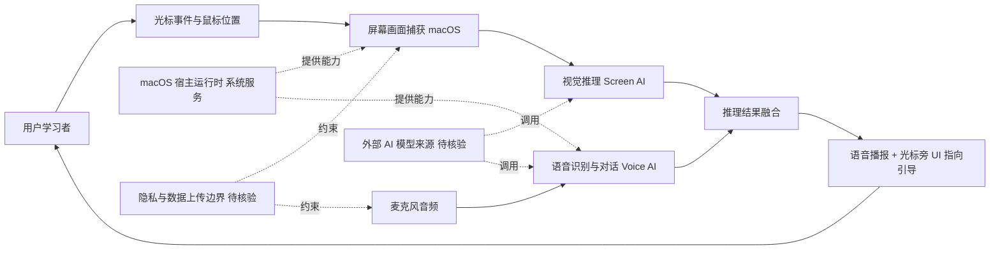

# clicky

## 一句话定位
AI 老师住在光标旁，能看屏幕、语音对话、指向引导，专为学习场景设计的桌面伴侣。

## 它解决的问题
传统 AI 助手需要用户主动提问、描述上下文，学习效率低。clicky 让 AI 直接「看到」用户屏幕内容，通过语音和指向引导进行教学式交互，降低学习门槛。

## 为什么值得关注（2026-04-12）
- 3,774 stars，Swift 生态中的 Screen AI 新秀
- 体验创新 > 技术创新，代表 Screen AI + Voice AI 的融合方向
- 教育场景有潜力，光标旁的 AI 概念直观易懂
- macOS 原生应用，体现桌面端 AI 的趋势

## 热度来源判断
- **体验驱动**：光标旁 AI 老师的概念新颖，视频传播力强
- **Screen AI 浪潮**：2026 年 Screen Understanding 是热门方向
- **教育赛道热度**：AI + 教育始终是高关注度领域

## 关键技术亮点亮点
1. **Screen AI 融合**：实时屏幕内容理解 + AI 推理
2. **Voice AI 交互**：语音对话教学，降低学习摩擦
3. **光标跟随**：AI 始终在光标附近，上下文感知自然
4. **Swift 原生**：macOS 原生体验，系统集成度高

## 架构师速览

| 决策问题 | 研究判断 | 证据边界 |
|---|---|---|
| 系统边界 | clicky 是 macOS 原生 Swift 桌面应用，核心边界在「本地屏幕捕获 + 视觉/语音推理 + 光标跟随 UI」之间，外部依赖仅有屏幕与音频系统服务 | 档案仅声明 macOS/Swift/Screen AI/Voice AI，未列出具体推理服务、屏幕捕获 API、语音引擎或网络远端依赖 |
| 主路径 | 用户光标触发 → 屏幕画面截取 → 视觉/语音模型推理 → 语音播报 + 指向引导回传至光标旁 UI | 路径为档案描述的功能抽象，未确认是否本地推理、是否调用云端 LLM、是否流式输出 |
| 关键权衡 | 「始终在侧」的体验创新 vs. 仅限 macOS、单学习场景、Screen+Voice 组合可被快速复制的低技术壁垒 | 权衡基于档案「风险/局限」一节的明确陈述，未引用第三方对比或性能数据 |
| 最小 PoC | 在一台 macOS 沙箱机上验证：屏幕采样频率、语音唤醒/对话延迟、是否有离线模式、是否上传屏幕帧、退出/卸载是否残留后台进程 | 档案未给出采样率、模型来源、网络行为、隐私策略等实现细节，全部需在源码或运行中核验 |

## 架构启发
- 桌面端 AI 的最佳形态可能是「始终在旁边」而非「打开一个窗口」
- Screen AI + Voice 的组合比纯文字交互更适合教育场景
- 工具型产品的用户体验创新可以弥补技术深度的不足

## 架构图（MMD）

> 证据边界：此图只采用本档案已有可核验描述；“待核验”节点不应视为项目实现事实。

## 定位判断
**工具型（中等质量）** — 体验创新明显，但非基础设施或平台级项目。定位为学习辅助工具，教育场景有潜力，但普适性有限。

## 风险 / 局限 / 泡沫点
1. **仅限 macOS**：Swift 原生意味着无法覆盖 Windows/Linux 用户
2. **教育场景窄**：非学习场景的需求不明确
3. **技术壁垒不高**：Screen AI + Voice 的技术组合可被快速复制
4. **商业模型不明**：免费工具的可持续性存疑

## 与同类项目的关系
- **各类 Screen AI 工具**：clicky 更聚焦教育场景，通用性不如其他 Screen AI 工具
- **AI 教学助手**：相比 chatbot 式教学，clicky 的屏幕感知是差异化优势

## 是否值得持续跟踪
**观望**。体验创新值得关注，但技术壁垒和场景局限性意味着需要观察后续发展。

## 后续观察点
1. 是否扩展到 Windows/Linux 平台
2. 教育场景的用户留存数据
3. Screen AI 技术栈的演进

---
*首次记录：2026-04-12*
