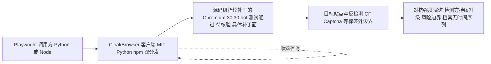

# CloakHQ/CloakBrowser — Stealth Chromium that passes every bot detection test. Drop-in Playwright replac

## 一句话定位

Stealth Chromium that passes every bot detection test. Drop-in Playwright replacement with source-level fingerprint patches. 30/30 tests passed.。主要使用 Python 编写，当前 29,872 stars / 2,457 forks / 140 subscribers。

## 它解决的问题

**目标用户**：使用 python 生态的开发者、AI Agent 构建者。

**痛点**：该项目解决的核心问题是 Stealth Chromium that passes every bot detection test. Drop-in Playwright replacement with source-level fingerprint patches. 30/30 tests passed.。从 README 来看，项目提供了 
  
 
 <a href="https://pypi.org/project/cloakbrowser/">**
2. ****
4. **
**
5. **<a href="https://pypi.org/project/cloakbrowser/"> 证据边界：此图只采用本档案已有可核验描述；“待核验”节点不应视为项目实现事实。

## 定位判断

**工具型**。在生态中定位为Stealth Chromium that passes every bot d方向的工具。Stars 29872 说明已有一定社区基础。

## 风险 / 局限 / 泡沫点

1. **规模风险**：29,872 stars，但 fork 2457 说明有实际部署
2. **维护风险**：最后 push 时间 2026-08-11，活跃维护中
3. **Open Issues**：190 个 open issues，活跃社区反馈
4. **License**：MIT（宽松许可，适合商用）

## 与同类项目的关系

- 与同 Python 生态的同类工具形成竞争/互补关系。具体竞品对比需参考社区讨论。
- 从 topics (ai-agents, anti-detect, antidetect-browser) 来看，与关注 ai-agents 的其他项目有交叉。

## 是否值得持续跟踪

**是。** 29872 stars + 活跃更新说明项目有持续价值。建议关注后续版本迭代和社区增长。

## 后续观察点

1. Star 增速是否可持续（当前 29,872）
2. Fork 增长趋势（当前 2,457）
3. 功能迭代频率（最后更新 2026-08-11）
4. 社区活跃度（subscribers 140, open issues 190）

---
> 数据来源: GitHub API (2026-08-11) | Stars: 29,872 | Forks: 2,457 | License: MIT | 语言: Python | 创建: 2026-02-22
