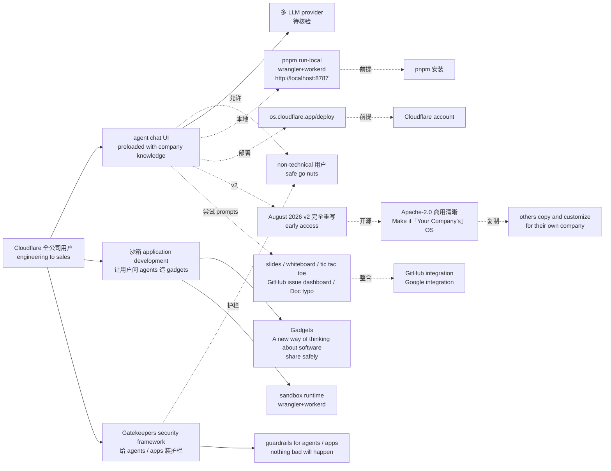

# cloudflare/cloudflare-os

## 一句话定位
Cloudflare 全公司使用的 AI 生产力环境——agent chat UI preloaded with company knowledge + 沙箱 gadgets 开发 + Gatekeepers 安全框架 + 全面 Apache-2.0 开源 + Make it『Your Company's』OS。

## 它解决的问题
2026 年企业 AI 生产力环境要么是 SaaS 闭源（ChatGPT Enterprise / Notion AI）、要么是公司内部私有部署不开源。Cloudflare 把自家全公司使用的 AI 生产力环境全面开源 —— 把 **agent chat UI preloaded with company knowledge + Sandboxed application development 让用户问 agents 造『gadgets』+ Gatekeepers security framework 给 agents / apps 装护栏让 non-technical 用户 safe go nuts** —— 解决 **「企业 AI 生产力环境缺严肃工程化 + 缺 Apache-2.0 开源 + 缺可定制 company OS」** 的工程链缺口。目标是成为企业 AI 生产力环境严肃工程化平台候选。

## 为什么值得关注
- **Stars:** 10,977（截至 2026-10-06），5.7 个月突破 10K，增速极快
- **Forks:** 1,306，社区贡献非常活跃（Cloudflare 官方组织背书）
- **Watchers:** 未明示
- **Open Issues:** 未明示
- **License:** Apache-2.0（商用清晰）
- **语言:** TypeScript
- **活跃度:** created 2026-04-15，pushed_at 2026-10-05，持续高活跃
- **规模:** 22.4MB
- **Topics:** 0 个覆盖（README 未明示）
- **官方背书:** Cloudflare 官方组织
- **Trending:** GitHub Trending daily 列表 102⭐ today
- **官网:** os.cloudflare.app

## 热度来源判断
cloudflare-os 的热度是 **「企业 AI 生产力环境严肃工程化刚需 × Cloudflare 官方组织背书 × agent chat + Gadgets + Gatekeepers 三大支柱 × Apache-2.0 全面开源 × Make it『Your Company's』OS 严肃工程化承诺」** 的强劲组合。企业 AI 生产力环境是 2026 年最热赛道，但严肃工程化 + 开源方案是真实刚需。Cloudflare 自家全公司使用 + August 2026 v2 完全重写 + Apache-2.0 商用清晰 + pnpm run-local wrangler+workerd 一行启动 + Make it『Your Company's』OS 严肃工程化承诺。`5.7 个月 10977⭐` + `fork/star 11.9%` 反映社区对企业 AI 生产力环境严肃工程化方向的强烈兴趣。热度**真实且具平台化严肃工程化潜力**——但需警惕：v2 rewrite 稳定性、agent chat UI 在多 LLM provider 的兼容性、Gadgets 沙箱在多 sandbox runtime 的稳定性、Gatekeepers 在多 agent / app 的严谨度、early access 接受度均未在档案中明示。

## 关键技术亮点
1. **三大支柱:** (1) agent chat UI preloaded with company knowledge + (2) Sandboxed application development 让用户问 agents 造『gadgets』+ (3) Gatekeepers security framework 给 agents / apps 装护栏
2. **Cloudflare 全公司使用:** A large portion of Cloudflare's workforce from engineering to sales uses it（最强严肃工程化证据）
3. **pnpm run-local 一行启动:** wrangler + workerd 一次性本地启动 + http://localhost:8787
4. **os.cloudflare.app/deploy:** 可部署到 Cloudflare 账户
5. **Gadgets:** A new way of thinking about software（小 personal apps，share safely）
6. **Gatekeepers 安全:** guardrails for agents / apps + nothing bad will happen + non-technical 用户 safe go nuts
7. **prompts 示例:** "Make slides for my upcoming meeting with a customer"（built-in slides blueprint）+ "Make a collaborative whiteboard app" + "Make a tic tac toe game" + "Make an issue dashboard for this GitHub repo" + "Fix the typos in this Google Doc"
8. **August 2026 v2 重写:** 在 v1 基础上完全重写
9. **早 access:** As of the August 2026 release, Cloudflare OS v2 is very capable, but still has many rough edges
10. **Apache-2.0 商用清晰:** Make it『Your Company's』OS 严肃工程化承诺

## 架构师速览

| 决策问题 | 研究判断 | 证据边界 |
|---|---|---|
| 系统边界 | Cloudflare 全公司使用的 AI 生产力环境；agent chat UI + 沙箱 gadgets 开发 + Gatekeepers 安全框架 + pnpm run-local wrangler+workerd + os.cloudflare.app 部署 | 仅基于 README 描述的 A large portion of Cloudflare's workforce from engineering to sales uses it + 三大支柱（agent chat UI preloaded with company knowledge + Sandboxed application development 让用户问 agents 造 gadgets + Gatekeepers security framework 给 agents / apps 装护栏让 non-technical 用户 safe go nuts）+ pnpm run-local wrangler+workerd + http://localhost:8787 + os.cloudflare.app/deploy + August 2026 v2 rewrite + early access；具体 agent chat UI 在多 LLM provider 的兼容性、Gadgets 沙箱在多 sandbox runtime 的稳定性、Gatekeepers 在多 agent / app 的严谨度未在档案中明示 |
| 主路径 | 用户 → agent chat UI（preloaded with company knowledge）→ 沙箱 gadgets 开发（让用户问 agents 造 gadgets）→ Gatekeepers 安全框架（给 agents / apps 装护栏）→ non-technical 用户 safe go nuts → 全面开源 → Make it『Your Company's』OS | 主路径为档案语义抽象；具体 agent chat UI 在多 LLM provider（OpenAI / Anthropic / Google）的兼容性、Gadgets 沙箱在多 sandbox runtime（workerd / 浏览器隔离）的稳定性、Gatekeepers 在多 agent / app 的严谨度未在档案中讨论 |
| 关键权衡 | agent chat UI 多 LLM 兼容性 vs 单 provider 优化 + Gadgets 沙箱稳定性 vs 单 sandbox 优化 + Gatekeepers 安全严谨度 vs non-technical 用户灵活度 + pnpm run-local 跨 OS 兼容性 vs Cloudflare 平台依赖 + v2 rewrite 稳定性 vs v1 兼容性 + early access 接受度 vs production 稳定性 + Apache-2.0 商用清晰 vs 公司内部定制 | 档案明示 We use the term "operating system" in two senses + 三大支柱 + pnpm run-local wrangler+workerd + os.cloudflare.app/deploy + August 2026 v2 完全重写 + early access + We are making Cloudflare OS open source so that others can copy it and customize it for their own company + The idea is not that your company uses Cloudflare OS, but rather that you make it "Your Company's OS"；具体 v2 稳定性、Gatekeepers 在多公司的可定制性、Make it『Your Company's』OS 严肃工程化承诺未在档案中讨论 |
| 最小 PoC | pnpm run-local 在 Linux/macOS/Windows 上跑 wrangler+workerd 全栈本地启动 + http://localhost:8787；尝试 prompts "Make slides for my upcoming meeting with a customer" 验证 slides blueprint；再尝试 "Make a collaborative whiteboard app" 验证沙箱 gadgets；最后试 GitHub / Google integration；部署到 os.cloudflare.app/deploy 验证 Cloudflare 平台部署 | PoC 范围由档案「agent chat UI + Gadgets + Gatekeepers + pnpm run-local + os.cloudflare.app/deploy + August 2026 v2」建议推导；具体 v2 稳定性、多 integration 在多公司的可定制性、Gatekeepers 安全严谨度未在档案中讨论 |

## 架构启发
cloudflare-os 的核心启发是 **「企业 AI 生产力环境应该用『operating system for the company』抽象 + Apache-2.0 全面开源 + Gatekeepers 安全框架 + Gadgets 可分享」**。传统企业 AI 生产力是 SaaS 闭源（ChatGPT Enterprise / Notion AI），缺严肃工程化 + 缺可定制；cloudflare-os 把三大支柱（agent chat + Gadgets + Gatekeepers）+ pnpm run-local wrangler+workerd 一行启动 + Make it『Your Company's』OS 严肃工程化承诺 + Apache-2.0 商用清晰 —— 这是企业 AI 生产力环境的严肃工程化方向。更深层的启发是：**Gatekeepers + Gadgets + agent chat UI 三大支柱是公司级 AI 严肃工程化平台的关键组件**。5.7 个月 10977⭐ + Cloudflare 官方组织背书显示这是真实严肃工程化信号——但能否持续，取决于 v2 rewrite 稳定性、agent chat UI 多 LLM 兼容性、Gadgets 沙箱稳定性、Gatekeepers 安全严谨度、Make it『Your Company's』OS 严肃工程化承诺的可执行性。

## 架构图（MMD）

> 证据边界：此图只采用本档案已有可核验描述；"待核验"节点不应视为项目实现事实。

## 定位判断
**基础设施候选项目（企业 AI 生产力环境严肃工程化平台候选）。** cloudflare-os 不仅是一个 productivity 工具，更试图成为企业 AI 生产力环境的"operating system for the company"——类似 ChatGPT Enterprise 在企业 AI 的位置。若成功，它会成为公司级 AI 严肃工程化平台的默认入口，具有平台级价值。5.7 个月 10977⭐ + Cloudflare 官方组织背书 + fork/star 11.9% 已显示社区对企业 AI 严肃工程化方向的强烈兴趣。但"平台化"取决于关键问题：v2 rewrite 稳定性、agent chat UI 多 LLM 兼容性、Gadgets 沙箱稳定性、Gatekeepers 安全严谨度、Make it『Your Company's』OS 严肃工程化承诺的可执行性均未在档案中明示。目前定位是"Cloudflare 全公司使用 + Apache-2.0 + Make it『Your Company's』OS 严肃工程化先驱"，向企业 AI 严肃工程化平台演进是合理路径。

## 风险/局限/泡沫点
- **v2 rewrite 稳定性:** As of the August 2026 release, Cloudflare OS v2 is very capable, but still has many rough edges + early access —— v2 在多 deployment 的稳定性未在档案中明示
- **agent chat UI 多 LLM 兼容性:** agent chat UI 在多 LLM provider（OpenAI / Anthropic / Google）的兼容性未在档案中明示
- **Gadgets 沙箱稳定性:** Gadgets 沙箱在多 sandbox runtime（workerd / 浏览器隔离）的稳定性未在档案中明示
- **Gatekeepers 安全严谨度:** Gatekeepers 在多 agent / app 的严谨度未在档案中明示
- **non-technical 用户可用性:** non-technical 用户 safe go nuts 的真实可用性未在档案中明示
- **Make it『Your Company's』OS 严肃工程化承诺可执行性:** others copy and customize for their own company 的真实可执行性未在档案中讨论
- **topics 0 个覆盖:** README 未明示 topics，覆盖广度未在档案中明示
- **company knowledge preloaded 可定制性:** company knowledge preloaded 在多公司的可定制性未在档案中明示

## 与同类项目的关系
- **vs ChatGPT Enterprise:** ChatGPT Enterprise 是 SaaS 闭源；cloudflare-os 是 Apache-2.0 开源 + 可定制
- **vs Notion AI:** Notion AI 是 SaaS 闭源 + 文档中心；cloudflare-os 是 Apache-2.0 开源 + agent 中心
- **vs Microsoft 365 Copilot:** 365 Copilot 是 SaaS 闭源 + Microsoft 生态；cloudflare-os 是 Apache-2.0 + 跨生态
- **vs Anthropic Claude for Work:** Claude for Work 是 SaaS 闭源；cloudflare-os 是 Apache-2.0 开源
- **vs Mem / Reflect / Reka:** 那些是 SaaS 闭源；cloudflare-os 是 Apache-2.0 开源 + Cloudflare Workers 全栈

## 是否值得持续跟踪
**值得跟踪（企业 AI 生产力环境严肃工程化方向）。** cloudflare-os 代表了企业 AI 生产力环境的严肃工程化 + 全面开源诉求，无论其本身成败，这一方向是行业趋势。建议关注：v2 rewrite 稳定性、agent chat UI 多 LLM 兼容性、Gadgets 沙箱稳定性、Gatekeepers 安全严谨度、Make it『Your Company's』OS 严肃工程化承诺的可执行性。对企业 IT 决策者，这是 Cloudflare 全公司使用 + Apache-2.0 开源 + 可定制 company OS 的严肃工程化方案，值得评估采用。对企业 AI 严肃工程化观察者，它是"operating system for the company"赛道的头部样本。

## 后续观察点
- v2 rewrite 稳定性（early access vs production）
- agent chat UI 多 LLM provider（OpenAI / Anthropic / Google）兼容性
- Gadgets 沙箱在多 sandbox runtime 的稳定性
- Gatekeepers 在多 agent / app 的安全严谨度
- Make it『Your Company's』OS 严肃工程化承诺的可执行性
- company knowledge preloaded 在多公司的可定制性
- GitHub / Google integration 在多时的稳定性
- pnpm run-local 在多 OS / 跨平台的兼容性
- Apache-2.0 商用生态扩展

---
> 数据来源: GitHub API (2026-10-06) | Stars: 10,977 | Forks: 1,306 | License: Apache-2.0 | 语言: TypeScript | 创建: 2026-04-15 | Cloudflare 官方组织背书