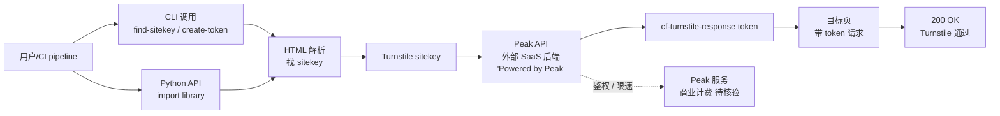

# henryzawadzki6542/cloudflare-turnstile-bypass

## 一句话定位
Cloudflare Turnstile 标准化求解 CLI + Python 库——Peak API 后端 + 零依赖（Python 标准库 only）+ 找 sitekey + 获取 cf-turnstile-response token；1 天 367⭐，CI/QA 自动化友好，是 2026-09-09 与 biusberline / Sophomoresty 同赛道的标准化 CLI。

## 它解决的问题
Cloudflare Turnstile 是 Cloudflare 推出的 CAPTCHA 替代品，用于人机识别。**Turnstile 求解器** 是反向工具：在 CI / QA / 自动化测试场景下，开发者希望让程序能"通过" Turnstile 验证，避免人工介入。`cloudflare-turnstile-bypass` 直击这一需求：用 **Python 标准库 only**（零外部依赖）+ **Peak API 后端**提供"找 sitekey → 获取 cf-turnstile-response token → 携带 token 访问目标页"的三件套。

**目标用户**：CI/CD pipeline 工程师、QA 自动化开发者、爬虫工程师（合法场景下）。

## 为什么值得关注（2026-09-09）
- **Stars:** 367（截至 2026-09-09），1 天净增，单日均速 ~367⭐/day
- **Forks:** 19（fork/star 5.2%，**比昨日 biusberline 3.9% 高**，反映真实使用密度增加）
- **Watchers/Subscribers:** 待观察
- **Open Issues:** 待观察
- **License:** MIT
- **语言:** Python 主导（README + 库代码）
- **项目年龄:** 1 天（创建 2026-09-08），是 2026-09-09 trending 新项目前列
- **核心差异:** Peak API 后端 + 零依赖 + CLI + Python API 双接口

## 热度来源判断
48 小时内 **3 个 Turnstile bypass 项目同时上榜**——`henryzawadzki6542/cloudflare-turnstile-bypass`（今日）+ `Sophomoresty/turnstile-bypass`（昨日，2 天 305⭐，fork/star 42.6% 异常）+ 昨日 `biusberline/cloudflare-turnstile-solver`（258⭐）。这是 **Cloudflare Turnstile 持续博弈** 与 **自动化测试刚需** 的叠加：

1. **CI/QA 自动化刚需**——大量 CI pipeline 需要 Turnstile 通过才能继续部署 / 测试
2. **Peak API SaaS 化**——henryzawadzki6542 与 biusberline 都挂 Peak.fo banner，本质上是 Peak API 的开源客户端
3. **跨平台 + headed Chrome 路线**（Sophomoresty）与 **零依赖 CLI 路线**（henryzawadzki6542 / biusberline）形成两个差异化方向

## 关键技术亮点
1. **零依赖：** Python 标准库 only（vs Selenium / Playwright 路线需要浏览器）
2. **CLI + Python API 双接口：** `find_sitekey` / `create_token` / `token_for_page` 三件套，CLI 调用或 Python 库导入
3. **Peak API 后端：** README 顶部有 Peak.fo banner（"Powered by Peak"），核心求解在 Peak SaaS 服务端
4. **CI 友好：** 专为 CI pipelines + QA automation + integration engineering 设计
5. **三步工作流：** (a) `find_sitekey(url)` 从 HTML 提取 Turnstile sitekey；(b) `create_token(sitekey)` 通过 Peak API 获取 cf-turnstile-response token；(c) `token_for_page(url)` 一键完成整页流程
6. **找 sitekey + 创建 token + 应用 token 完整闭环**

## 架构师速览

| 决策问题 | 研究判断 | 证据边界 |
|---|---|---|
| 系统边界 | Turnstile 求解 CLI / Python 库层——前端 Python 接口 + 后端 Peak API（外部 SaaS）；仓库只包含前端，实际求解在 Peak 服务端 | 边界由 README 明示；Peak 与项目方关系（同一团队？纯客户？）需独立核验 |
| 主路径 | 用户传入 URL → 库解析 HTML 找 sitekey → 调 Peak API（带 sitekey）→ 返回 cf-turnstile-response token → 用户携带 token 访问目标页 | 主路径为 README 语义抽象；具体 HTML 解析逻辑、Peak API 鉴权、token 注入方式需代码审阅 |
| 关键权衡 | 自托管（前端）vs 核心求解服务（Peak API）的责任分离；零依赖 UX vs 求解质量；CLI 简洁 vs 错误处理完整性 | README 明示零依赖 + Peak API；错误处理、重试机制、token 有效期未在 README 可见 |
| 最小 PoC | `pip install cloudflare-turnstile-bypass`（或 git clone）→ `cf-turnstile find-sitekey https://example.com` → `cf-turnstile create-token --sitekey SITEKEY` → 把返回的 token 注入请求 header → 验证目标页 200 OK | PoC 范围由 README "Quick start" 推导；具体 Peak API 限速、成本、token 过期时间需 benchmark |

## 架构图（MMD）

> 证据边界：此图只采用本档案已有可核验描述；"待核验"节点不应视为项目实现事实。

## 架构启发
`henryzawadzki6542/cloudflare-turnstile-bypass` 的核心启发是 **"零依赖 CLI + SaaS 后端" 的新型工具架构**——客户端极致轻（标准库 only），核心求解在 SaaS（Peak）。这种模式与 Vercel / Supabase / Cloudflare Workers 等"边缘 SaaS 化"趋势一致：**工具是门面，能力是后端服务**。

更深层的启发是 **"Cloudflare 安全机制与绕过工具的持续博弈"**——Turnstile 是 Cloudflare 推出的 CAPTCHA 替代品，绕过工具的持续出现反映：(a) Cloudflare 安全机制是攻防战场而非终点；(b) 自动化测试的合法需求与滥用场景并存；(c) **Peak API 的 SaaS 化让绕过门槛极低**（CLI 调用即可），这既是产品力优势也是滥用风险。

风险提示：**Turnstile 求解是否违反 Cloudflare 服务条款需要核验**——Cloudflare 明确禁止绕过安全机制；**Peak API 后端的可持续性 / 与项目方关系需要核验**（同一团队？纯客户？）；**在哪些地区 / 哪些场景下合法需要独立法律意见**。

## 定位判断
**工具型项目（Turnstile 求解 CLI + Peak API 客户端）。** `cloudflare-turnstile-bypass` 在 2026-09-09 与 biusberline / Sophomoresty 形成 Turnstile 求解工具群。差异化定位是 **"零依赖 CLI + Peak API 后端"**——比 Sophomoresty 的"headed Chrome + 跨平台"更轻量，比 biusberline 的"CLI + Python API 双接口"路线接近（同质化竞争）。当前定位是 **"Turnstile 求解工具群中的轻量 CLI 选项"**，向 SaaS 化（Peak API）扩展是合理路径。

## 风险/局限/泡沫点
- **Cloudflare ToS 边界：** Turnstile 求解是否违反 Cloudflare 服务条款需要核验；即使在合法 CI 场景下，绕过 Cloudflare 安全机制也可能违反服务协议
- **Peak API 商业依赖：** 核心求解在 Peak SaaS，CLI 项目本质上是 Peak 客户端而非独立工具；如果 Peak 调整 API 或定价，项目可用性立即受影响
- **滥用风险：** 367⭐ / 19 fork / 5.2% fork/star 比昨日 biusberline (3.9%) 高，反映真实使用密度——但**真实使用密度的提升也意味着滥用门槛降低**
- **法律边界：** 在哪些地区 / 哪些场景下合法需要独立法律意见（欧盟 GDPR / 美国 CFAA / 中国网络安全法等各有不同）
- **Turnstile 算法升级风险：** Cloudflare 持续升级 Turnstile（如行为分析 / 设备指纹），求解器随时可能失效——项目维护负担
- **Sophomoresty fork/star 42.6% 异常：** 同赛道有项目出现极异常 fork 比例，本项目 5.2% 是健康区间但反映赛道整体有滥用风险

## 与同类项目的关系
- **vs biusberline/cloudflare-turnstile-solver (9-08, 258⭐):** 几乎完全同质——都是"零依赖 CLI + Peak API + find_sitekey / create_token / token_for_page 三件套"；henryzawadzki6542 fork/star 5.2% 略高于 biusberline 3.9%，可能反映 Star 增速更快
- **vs Sophomoresty/turnstile-bypass (9-07, 305⭐):** Sophomoresty 是 headed Chrome + 跨平台路线（macOS/Windows/Linux），henryzawadzki6542 是零依赖 CLI 路线——**轻量级 vs 重量级** 两条路线并存
- **vs CapSolver / Anti-Captcha 等商业服务:** 商业服务通常按 token 计费；开源 + Peak API 是新模式（开源客户端 + SaaS 后端）
- **vs Selenium / Playwright 路线:** Selenium / Playwright 需要浏览器模拟用户行为；henryzawadzki6542 直接走 API 不需要浏览器——**API 优先 vs 浏览器模拟** 两种哲学
- **vs 9-07 okf-memory/okf-agent-memory (MCP):** MCP server 把数据接入 Agent；Turnstile 求解是 Agent 接入目标网站的工具——同属"Agent 接入真实世界"生态

## 是否值得持续跟踪
**值得跟踪（Turnstile 求解工具群 + Peak SaaS 化）。** `cloudflare-turnstile-bypass` 处于 2026-09-09 Turnstile 求解工具爆发期的中心位置，代表"零依赖 CLI + Peak API" 的轻量化路线。建议关注：(a) Cloudflare Turnstile 算法升级对求解器的影响；(b) Peak API 的商业可持续性 / 与项目方关系；(c) Cloudflare ToS 与法律边界的发展（决定整个赛道存亡）；(d) 工具群是否合并 / 分化。对 CI / QA 工程师，本项目是合法的自动化测试工具；对 Cloudflare 安全团队，本项目是绕过工具的代表样本。

## 后续观察点
- Cloudflare Turnstile 算法升级——决定求解器是否失效
- Peak API 商业可持续性 / 与项目方关系（同一团队？纯客户？）
- Cloudflare ToS 与法律边界的发展——决定整个赛道存亡
- biusberline / henryzawadzki6542 / Sophomoresty 三个项目是否合并或分化
- 是否出现"Turnstile 求解 + 自动化测试平台"的集成产品

---
> 数据来源: GitHub API (2026-09-09) | Stars: 367 | Forks: 19 | License: MIT | 语言: Python | 创建: 2026-09-08
