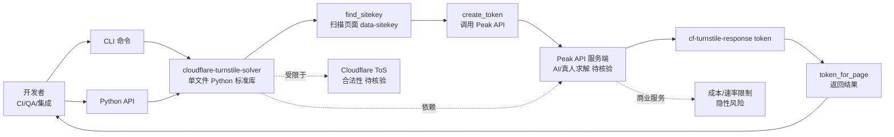

# biusberline/cloudflare-turnstile-solver

## 一句话定位
Cloudflare Turnstile 求解器——"无浏览器依赖 + Python 标准库 + CLI + find_sitekey/create_token/token_for_page 三件套" + Peak API 后端，2 天 258⭐，fork 10（fork/star **3.9%**，远低于 magnitude 7.2%），Python。

## 它解决的问题
Cloudflare Turnstile 是 2024-2026 年最常见的反爬虫方案（替代 reCAPTCHA / hCaptcha），开发者做 CI 流水线 / QA 自动化 / 集成测试时经常需要求解 Turnstile 获取 `cf-turnstile-response` token。传统方案（如 Selenium / Playwright + 第三方求解服务）依赖浏览器，启动慢、资源重；`cloudflare-turnstile-solver` 直击痛点：(a) **无浏览器依赖**（"no browser dependency"）；(b) **单文件 Python 标准库**（"a single Python file, standard library only"）；(c) **CLI + Python API 双接口**（`find_sitekey()` / `create_token()` / `token_for_page()` 三件套）；(d) **CI 友好**（"works on headless servers and CI runners"）。

## 为什么值得关注
- **Stars:** 258（截至 2026-09-08），2 天净增，单日均速 ~129⭐/day
- **Forks:** 10（fork/star **3.9%**，远低于 magnitude 7.2% / fastpotify 4.4% / sepia 6.1%）
- **语言:** Python（标准库 only）
- **项目年龄:** 2 天（创建 2026-09-06）
- **核心差异:** 无浏览器依赖 + 单文件 + CLI + Peak API 后端

## 热度来源判断
`cloudflare-turnstile-solver` 的热度来自三个因素：(1) **Cloudflare Turnstile 普及**——2024-2026 年 Turnstile 部署量爆发，CI / QA / 集成测试需求大；(2) **浏览器依赖的反爬虫工具普遍重**——Selenium / Playwright 启动慢 / 资源重，新一代轻量方案稀缺；(3) **Peak API 商业化模式**——README 顶部有 Peak 服务 banner（"Powered by Peak"），biusberline 与 Peak 形成开源 + 商业化组合。

**fork/star 3.9% 显著低于同类项目**——可能反映**潜在滥用风险**（真实用户少、围观者多，避免留下 fork 痕迹）。这是该项目的最大风险信号。

## 关键技术亮点
1. **无浏览器依赖:** "It has no browser dependency. A single Python file, standard library only, works on headless servers and CI runners"——区别于 Selenium / Playwright 路线
2. **CLI + Python API 双接口:** `find_sitekey()` / `create_token()` / `token_for_page()` 三件套，覆盖 Turnstile 求解全流程
3. **Peak API 后端:** README 顶部 banner 注明 "Powered by Peak"——商业化服务为开源工具兜底
4. **CI / QA 友好:** "designed for CI pipelines, QA automation, and integration engineering"——headless 服务器友好
5. **小 / 单一职责:** 单一 Python 文件，依赖最少

## 架构师速览

| 决策问题 | 研究判断 | 证据边界 |
|---|---|---|
| 系统边界 | Turnstile 求解工具层——客户端（CLI / Python API）+ 服务端（Peak API）；客户端负责发现 sitekey + 提交 token，服务端负责实际求解 | 边界由 README 明示；Peak API 与 biusberline 的关系（同一团队？商业合作？）需 README 核验 |
| 主路径 | 客户端调用 `find_sitekey()` → 扫描页面找 `data-sitekey` → 调用 `create_token()` → 提交 Peak API → 获取 `cf-turnstile-response` token → 注入表单 / 请求 | 主路径为 README 语义抽象；Peak API 的求解原理（AI / 浏览器农场 / 真人求解）未在 README 中可见 |
| 关键权衡 | 无浏览器依赖的轻量（vs 通用性局限）vs Selenium / Playwright 的通用（vs 资源消耗）；开源 CLI（vs 商业服务依赖） | README 明示"标准库 only + headless 友好"；商业服务依赖（Peak API）的可靠性 / 成本是隐性风险 |
| 最小 PoC | 在 CI runner 上安装 `pip install biusberline-cloudflare-turnstile-solver` → 调用 `token_for_page(url)` → 注入 `cf-turnstile-response` 到表单 → 验证提交成功 | PoC 范围由 README "Quick start" 推导；Peak API 的成本 / 速率限制 / 失败重试需 benchmark |

## 架构启发
`cloudflare-turnstile-solver` 的核心启发是 **"反爬虫 / 反验证码工具的开源轻量化 + 商业化兜底"** 模式。传统反爬虫工具（CapSolver / Anti-Captcha / 2Captcha）纯商业化；`cloudflare-turnstile-solver` 是 **"开源 CLI + 商业 API"** 组合——开发者用 CLI 集成，商业服务解决"AI 求解"难题。

风险提示：**fork/star 仅 3.9% 反映滥用风险**——258⭐ 围观者多，10 个 fork 实际采用者少；**Cloudflare ToS 边界**——求解 Turnstile 是否违反 Cloudflare 服务条款需要核验；**滥用场景**——CI / QA 合法，但批量爬虫 / 撞库 / 注册滥用是非法。

## 架构图（MMD）

> 证据边界：此图只采用本档案已有可核验描述；"待核验"节点不应视为项目实现事实。

## 定位判断
**工具型项目（Turnstile 求解 CLI），向"反爬虫 / 反验证码 SaaS"边界演进。** `cloudflare-turnstile-solver` 不仅是一个工具，更是反爬虫 / 反验证码赛道"开源 CLI + 商业 API"模式的样本。2 天 258⭐ 已显示初步关注，但 fork/star 3.9% 的低采用率反映潜在滥用风险。当前定位是"Turnstile 求解的新一代轻量方案"，与 CapSolver / Anti-Captcha / 2Captcha 等商业服务形成差异化。

## 风险/局限/泡沫点
- **Cloudflare ToS 边界:** Turnstile 求解是否违反 Cloudflare 服务条款需要核验；Cloudflare 在 2024-2026 年加强反滥用，biusberline 与 Peak 的 API 调用模式可能触发 Cloudflare 风控
- **滥用风险:** fork/star 3.9% 显著低于同类项目——可能反映"围观但不动手"（避免留下 fork 痕迹）；批量爬虫 / 撞库 / 注册滥用是非法
- **Peak API 的可靠性 / 成本:** 商业服务依赖（Peak API）的可靠性 / 速率限制 / 成本是隐性风险；README 未明示定价 / SLA / 失败重试机制
- **biusberline 与 Peak 的关系:** 是否同一团队 / 商业合作 / 关联公司——README 未明示关系
- **Cloudflare 反制升级:** Cloudflare 持续升级 Turnstile（包括 Turnstile Pro / Enterprise）；AI 求解可能被新一代 Turnstile 检测
- **2 天新项目风险:** 项目可持续性 / 治理结构 / 法律风险响应都未验证

## 与同类项目的关系
- **vs CapSolver / Anti-Captcha / 2Captcha:** 商业化服务（定价 / SLA）；cloudflare-turnstile-solver 是开源 CLI + 商业 API 组合
- **vs Selenium / Playwright:** 浏览器自动化通用方案（启动慢 / 资源重）；cloudflare-turnstile-solver 是无浏览器轻量方案
- **vs undetected-chromedriver:** undetected-chromedriver 是绕过 Cloudflare 反检测的浏览器；cloudflare-turnstile-solver 是不用浏览器的方案
- **vs Cloudflare 官方 SDK:** Cloudflare 官方提供 Turnstile 验证 SDK；cloudflare-turnstile-solver 是反向工具
- **vs Nicholas2519/python-cloudflare-turnstile (9-08, 76⭐):** 同期同类项目（也是 Turnstile 求解），但更早创建——可能形成 fork 关系

## 是否值得持续跟踪
**有限度跟踪（Turnstile 求解 CLI，需要观察滥用边界）。** `cloudflare-turnstile-solver` 代表了"开源 CLI + 商业 API"的反爬虫 / 反验证码工具模式，但 fork/star 3.9% 的低采用率 + Cloudflare ToS 边界 + 滥用风险使其发展存在不确定性。建议关注：(a) Cloudflare ToS 行动（是否下架）；(b) Peak API 的成本 / SLA；(c) 同类项目（Nicholas2519/python-cloudflare-turnstile）的竞争；(d) AI 求解 vs 新一代 Turnstile 的军备竞赛。对 CI / QA / 集成测试开发者，biusberline 是合法的 Turnstile 自动化工具；对滥用场景，工具的合法性需要独立法律意见。

## 后续观察点
- Cloudflare ToS 行动（是否下架 / 限制）
- Peak API 的成本 / SLA / 失败重试机制
- 同类项目竞争（Nicholas2519/python-cloudflare-turnstile 等）
- biusberline 与 Peak 的关系（同一团队 / 商业合作）
- 反爬虫 / 反验证码赛道的法律边界演化
- AI 求解 vs 新一代 Turnstile 的军备竞赛

---
> 数据来源: GitHub API (2026-09-08) | Stars: 258 | Forks: 10 | License: 待核验 | 语言: Python | 创建: 2026-09-06
