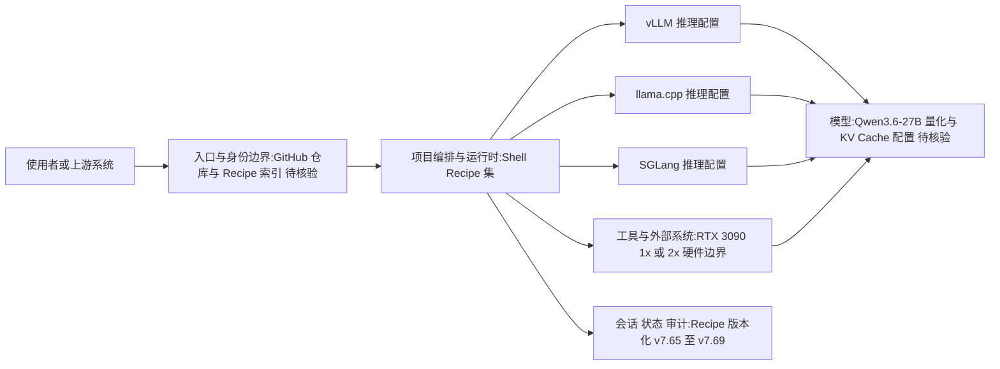

# Club 3090

## 一句话定位
RTX 3090 社区 LLM 部署方案集：多引擎 recipe，让消费级 GPU 跑起大模型。

## 它解决的问题
部署 LLM 到消费级 GPU 是一个充满工程细节的过程：引擎选择、量化配置、内存分配、KV Cache 优化、上下文长度调优——每个环节都有坑。Club 3090 把这些工程经验沉淀为可复用的 recipe，降低本地 LLM 部署门槛。

## 为什么值得关注（2026-05-03）
1. **Recipe-as-code 模式**：不是框架，不是 SDK，是精心调优的部署配置集。这种"知识即代码"的模式对 AI 基础设施团队有参考价值
2. **多引擎覆盖**：vLLM、llama.cpp、SGLang 三大引擎都支持，客观上在帮助开发者做引擎对比
3. **真实硬件约束**：针对 RTX 3090（24GB VRAM）的极限配置，是消费级 AI 推理的真实参考

## 热度来源判断
实用性驱动。3090 是 AI 爱好者和独立开发者最常见的 GPU，"怎么在 3090 上跑 27B 模型"是真实需求。354 stars 不算高，但 12 subscribers 和高频 commit 说明有核心用户群在活跃使用。

## 关键技术亮点亮点
1. **多引擎适配**：vLLM（高吞吐）、llama.cpp（低资源）、SGLang（结构化生成）三种引擎的配置和对比
2. **Qwen3.6-27B 优化**：当前主打模型，支持 1× 和 2× 3090 配置
3. **版本化管理**：从 v7.65 快速迭代到 v7.69，每个版本都有明确的变更记录
4. **Cliff 2 Closure Recipes**：Balanced MTP + Max-context 的量化策略

## 架构师速览

| 决策问题 | 研究判断 | 证据边界 |
|---|---|---|
| 系统边界 | 消费级 GPU（RTX 3090）本地 LLM 部署的 recipe 集，非通用框架；入口为 GitHub 仓库，输出为可复用的 Shell 配置，配套三类推理引擎（vLLM、llama.cpp、SGLang） | 依据语言=Shell、tags 列表与定位描述；具体目录结构、脚本数量、CI/CD 未在档案中给出 |
| 主路径 | 使用者按 recipe 选择引擎 → 加载针对 RTX 3090 调优的量化与 KV Cache 配置 → 在 24GB（单卡）或 48GB（双卡）VRAM 上运行 Qwen3.6-27B | 档案明确提到 1×/2× 3090 配置与"Cliff 2 Closure"量化策略；具体量化位宽、上下文长度参数未提供 |
| 关键权衡 | 多引擎可对比性 vs recipe 碎片化；极致硬件/模型优化 vs 硬件/模型绑定导致的复用面窄；社区活跃度 vs bus factor=1 的可持续性 | 档案明示硬件绑定、模型绑定、单一维护者三点局限 |
| 最小 PoC | 在单卡 RTX 3090 上挑选一份 recipe（如 v7.69 中 Qwen3.6-27B 的 llama.cpp 配置），按仓库说明拉取并加载，验证 24GB VRAM 下的推理吞吐与可复现性，作为评估入口 | 具体 recipe 文件、量化档位、依赖版本需在仓库源码核验 |

## 架构启发
```
用户需求：在消费级硬件上运行大模型
         ↓
传统方案：需要 ML 工程师逐个调优
         ↓
Club 3090 方案：Recipe As Code
         ↓
启示：部署知识可以（也应该）被版本化管理
```

对架构师的启发是：企业内部的 LLM 部署知识也应该沉淀为可版本化、可复用的 recipe，而不是散落在 Wiki 和 Slack 消息中。

## 架构图（MMD）

> 证据边界：此图只采用本档案已有可核验描述；“待核验”节点不应视为项目实现事实。



## 定位判断
实用工具。面向 AI 爱好者和独立开发者的 LLM 部署 recipe 集。

## 风险 / 局限 / 泡沫点
1. **硬件绑定**：极度依赖 RTX 3090，受众天然有限
2. **模型绑定**：当前主打 Qwen3.6-27B，如果模型更新导致配置失效，维护压力大
3. **一人维护**：主要贡献者只有 @noonghunna，bus factor = 1
4. **绝对 Star 不高**：354 stars 说明仍处于早期社区阶段

## 与同类项目的关系
- **Ollama**：开箱即用的 LLM 运行时，更通用但不针对特定硬件优化
- **vLLM**：高性能推理引擎，Club 3090 是其消费者级配置集
- **llama.cpp**：低资源推理引擎，Club 3090 提供其优化配置
- **LocalAI**：一体化本地 AI 引擎，更偏平台方向

Club 3090 的差异化在于"特定硬件 + 特定模型"的极致优化，而非通用方案。

## 是否值得持续跟踪
**有限跟踪**。作为本地 LLM 部署的 recipe 参考，关注其引擎对比结果和模型覆盖扩展。

## 后续观察点
1. 是否扩展到 4090、5090 等其他消费级 GPU
2. 是否覆盖更多模型（DeepSeek、GLM 等）
3. 社区贡献者是否增长
4. 是否形成可被企业内部借鉴的 recipe 管理方法论
