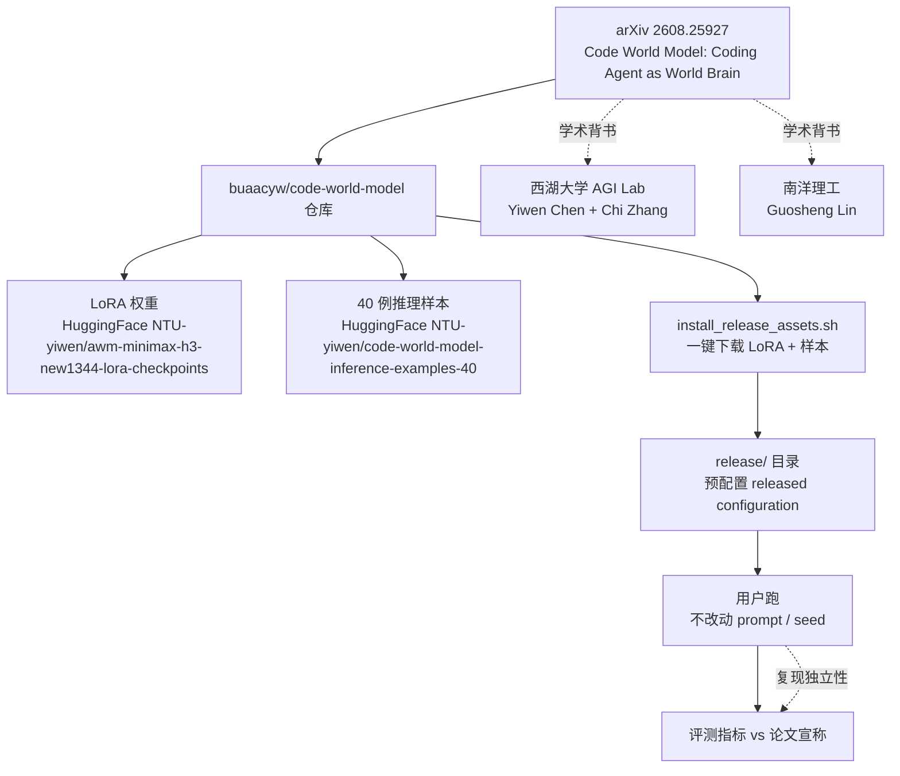

# buaacyw/code-world-model

## 一句话定位
西湖大学 AGI Lab + 南洋理工的"Code World Model"研究——把 Coding Agent 作为世界大脑，论文 (arXiv 2608.25927) + LoRA 权重 (HuggingFace NTU-yiwen) + 40 例推理样本 (HuggingFace NTU-yiwen/code-world-model-inference-examples-40) + 一键安装脚本四件套同时开源。

## 它解决的问题
世界模型（world model）是 RL / 表征学习的前沿范式（Yann LeCun 强调 world model，DeepMind Genie / V-JEPA 在视觉 / RL 方向）。但把 world model 引入 coding 任务（让 Coding Agent 通过预测代码执行后果来规划）几乎是空白领域。buaacyw/code-world-model（CWM）直击这一空白：以"Code World Model: Coding Agent as World Brain"为题，把"world model × coding"从概念做到可复现的论文 + LoRA + 推理样本 + 安装脚本一体发布。

## 为什么值得关注（2026-08-29）
- **Stars:** 205（截至 2026-08-29），3 天起步
- **Forks:** 待核验
- **License:** Apache-2.0
- **语言:** Python
- **活跃度:** created 2026-08-26，pushed_at 2026-08-29
- **学术背书:** 西湖大学 AGI Lab（Yiwen Chen + Chi Zhang）+ 南洋理工（Guosheng Lin）+ Yiwen Chen 双重 affiliation
- **完整可复现:** 论文 (arXiv 2608.25927) + LoRA 权重 (HuggingFace NTU-yiwen/awm-minimax-h3-new1344-lora-checkpoints) + 40 例推理样本 (HuggingFace NTU-yiwen/code-world-model-inference-examples-40) + 一键安装脚本

## 热度来源判断
CWM 的热度是 **"world model × coding 的学术空白 × 西湖大学 + 南洋理工学术背书 × Apache-2.0 × 论文 + 权重 + 样本 + 脚本一体可复现"** 的组合。205⭐/3 天说明学术圈对"coding agent world model"方向的高度关注。但需警惕：(1) "world brain" 概念是研究主张，独立 benchmark 是否真优于"非 world model baseline" 需独立复现；(2) base 模型与 LoRA 的搭配是否限定特定 base（依赖 README 未展开的细节）；(3) 评测数据集选择是否合理（评测独立性）。

## 关键技术亮点
1. **核心研究主张**：把 Coding Agent 作为世界大脑——通过预测代码执行后果（"what would happen if I run this code?"）来辅助规划，比纯 LLM 直接生成代码更稳
2. **论文 + LoRA + 推理样本 + 脚本一体可复现**（README 明示）：
   - 论文：arXiv 2608.25927（"Code World Model: Coding Agent as World Brain"）
   - LoRA：HuggingFace `NTU-yiwen/awm-minimax-h3-new1344-lora-checkpoints`
   - 推理样本：HuggingFace `NTU-yiwen/code-world-model-inference-examples-40`（40 例紧凑样本）
   - 一键脚本：`./scripts/install_release_assets.sh "$PWD/release"`（下载 LoRA + 40 例样本）
3. **"不改动 prompt / seed"的复现设计**（README 明示）：`cd release && run a released configuration without changing its inputs, prompts, or seed` —— 让研究者跑一行就能复现
4. **Apache-2.0 许可证**：商业友好，与 MIT / BSD 同档
5. **学术机构背书**：西湖大学 AGI Lab（Yiwen Chen + Chi Zhang）+ 南洋理工（Guosheng Lin）——双机构合作研究
6. **项目页 + 论文页分离**：项目页 `buaacyw.github.io/cwm/` + 论文 arXiv 链接——便于学术引用

## 架构师速览

| 决策问题 | 研究判断 | 证据边界 |
|---|---|---|
| 系统边界 | 论文 + LoRA + 推理样本 + install_release_assets.sh 一键脚本；研究范畴限定 coding world model | 论文 ID / LoRA / 40 例样本 / 安装脚本在 README 明示；base 模型与 LoRA 兼容性 / 评测数据集选择未在 README 给出 |
| 主路径 | 用户跑 `./scripts/install_release_assets.sh` → 进入 release/ → 跑某个 released configuration（不改动 prompt / seed） | install_release_assets.sh 与"不改动 prompt / seed"是 README 明示；具体配置清单与可运行入口需 ENVIRONMENT.md 独立核验 |
| 关键权衡 | 完整可复现 vs 数据 / 模型公开 vs "world brain" 概念 vs 评测独立性 | "world brain" 概念是 README / 项目页自述；独立 benchmark 复现 vs 论文宣称指标的偏差未量化 |
| 最小 PoC | 拉代码 → 跑 install 脚本 → 在 release/ 下跑一个最小配置 → 与 paper 中报告的指标对比 | install 流程是 README 明示；具体可运行配置清单需 ENVIRONMENT.md 独立核验 |

## 架构启发
CWM 的核心启发是 **"world model × coding 是软件工程自动化的潜在新范式"**。当前大多数 Coding Agent 都是"LLM 直接生成代码"，缺乏对代码执行后果的预测（"if I run this code, what would happen?"）。World model 范式把"代码执行后果预测"作为辅助信号，让 Coding Agent 能更稳地规划——这是把 RL / world model 范式引入 software engineering 的关键一步。更深层的启发是 **"完整可复现 = 论文 + 权重 + 样本 + 脚本四件套同时开源"**——这是 2026 年 ML 研究发布的"完整可复现"最低标准。仅放论文而不放权重、或仅放权重而不放样本，都会让独立复现困难重重。CWM 一体发布让其他研究者能在 1 天内跑通基线，再去改进。最深层的启发是 **"不改动 prompt / seed 的复现设计"**——明确告知用户"跑这个配置时不许改 prompt 与 seed"，把"我跑出来的指标与论文不一致"的责任明确化，是研究复现性的工程化保障。

## 架构图（MMD）

> 证据边界：此图只采用本档案已有可核验描述；"待核验"节点不应视为项目实现事实。

## 定位判断
**基础设施候选项目（code world model 研究）**。CWM 不是生产工具，而是"world model × coding"方向的学术前沿发布。205⭐/3 天说明学术圈对"coding agent world model"的高关注。是否能成为"软件工程自动化的新范式"，取决于：(1) 独立 benchmark 是否真优于"非 world model baseline"；(2) base 模型与 LoRA 的搭配是否通用；(3) 西湖大学 / 南洋理工后续工作是否能持续推进这一方向。

## 风险 / 局限 / 泡沫点
- **独立复现的不确定性**："world brain" 概念是研究主张，独立 benchmark 是否真优于"非 world model baseline" 需独立复现
- **base 模型依赖**：LoRA 是否限定特定 base（如 minimax-h3 等）的细节在 README 未展开
- **评测独立性**：评测数据集选择是否合理、是否被 cherry-pick，需独立审查
- **学术研究 ≠ 生产可用**：CWM 是研究发布，30 天内可能不会被任何生产工具采用
- **与 RL / world model 主流方向的关联**：CWM 与 Yann LeCun / DeepMind Genie / V-JEPA 等 world model 主线的关联度需独立分析

## 与同类项目的关系
- **vs Yann LeCun world model 主张**：LeCun 强调 world model 是 AGI 关键；CWM 是"world model × coding"的具体落地
- **vs DeepMind Genie / V-JEPA 等视觉 world model**：这些是视觉 / RL 方向 world model；CWM 是 coding 方向 world model
- **vs 8-22..8-28 foundation 模型开源**：Tencent/WeMM-Embedding（8-28）等是大厂多模态 embedding；CWM 是学术 world model 研究
- **vs 8-27 UditAkhourii/cdaf**：cdaf 是视频时间戳 sidecar 格式；CWM 是 coding world model——都是"格式 / 范式级"贡献但领域不同
- **vs 同机构其他 AGI Lab 项目**：西湖大学 AGI Lab 的其他工作（如 Yiwen Chen / Chi Zhang 的其他论文）值得横向比较

## 是否值得持续跟踪
**值得跟踪（code world model 学术前沿代表）**。CWM 代表了"world model × coding"的学术前沿方向，是软件工程自动化的潜在新范式。建议关注：独立 benchmark 复现、base 模型与 LoRA 兼容性、评测独立性、西湖大学 / 南洋理工后续工作、对 ML 实验室科研可借鉴性。对 ML 研究者，这是值得独立复现的研究发布；对 software engineering 自动化方向，这是"world model 范式"的具体落地案例。

## 后续观察点
- 30/60/90 天 stars / forks / 论文引用次数
- 独立 benchmark 复现 vs 论文宣称指标的偏差
- base 模型与 LoRA 兼容性细节
- 评测数据集的独立审查
- 西湖大学 AGI Lab / 南洋理工后续工作
- 是否被 Coding Agent 产品（Cursor / Codex / Claude Code 等）采用或参考
- 与 Yann LeCun / DeepMind Genie / V-JEPA 等 world model 主线的关联分析

---
*首次记录：2026-08-29*
