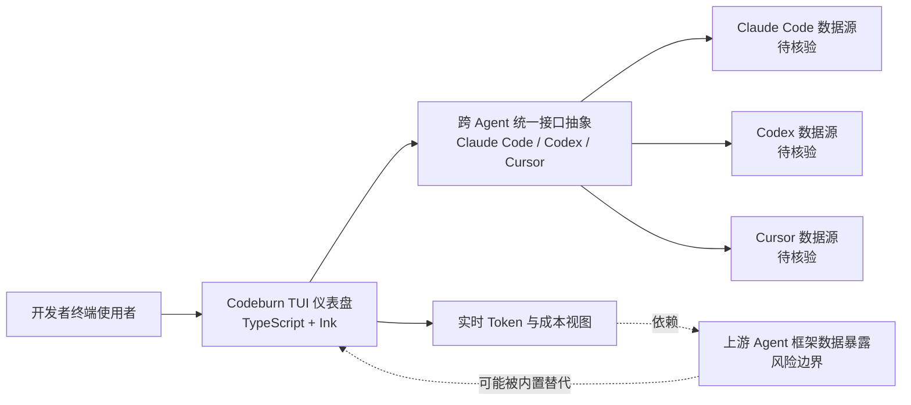

# Codeburn

## 一句话定位
AI Coding Token 消耗的实时 TUI 仪表盘，让开发者看清每个 Agent 会话的 token 去向和成本。

## 它解决的问题
AI Coding Agent（Claude Code、Codex、Cursor）在企业中规模化使用后，token 消耗是一个黑箱。开发者不知道 token 花在哪里，管理者无法做成本预算和优化。Codeburn 填补了 Agent 可观测性在成本维度的空白。

## 为什么值得关注
- 发布 2 天即破 1,698 stars，需求验证迅速
- 跨 Agent 支持（Claude Code / Codex / Cursor），统一视图
- TUI 交互设计，开发者无需离开终端
- 实时成本追踪，不是事后统计

## 热度来源判断
真实需求驱动。AI Coding 的 token 成本是每个重度使用者都会遇到的痛点，尤其是企业场景。

## 关键技术亮点亮点
1. **TypeScript + Ink（React for CLI）** — 组件化 TUI 开发，代码可维护
2. **跨 Agent 统一接口** — 抽象了不同 Agent 的 token 数据格式差异
3. **实时仪表盘** — 不依赖日志文件解析，实时捕获 token 使用

## 架构师速览

| 决策问题 | 研究判断 | 证据边界 |
|---|---|---|
| 系统边界 | Codeburn 定位为 AI Coding Agent 的 Token 可观测性层，跨越 Claude Code / Codex / Cursor 等多种 Agent 来源，向开发者提供 TUI 仪表盘 | 基于标签与定位描述，跨 Agent 接口的协议与实现细节未在档案中披露 |
| 主路径 | 数据来源（Claude Code/Codex/Cursor） → 跨 Agent 统一接口抽象 → TypeScript + Ink（React for CLI）TUI 实时仪表盘 → 终端呈现 token/成本视图 | TUI 技术栈明确，实时数据捕获是否依赖日志解析或 hook 机制未说明 |
| 关键权衡 | TUI 形态 vs 企业 Web Dashboard 需求；依赖上游 Agent 数据暴露 vs 被上游框架内置替代 | 档案已点明"壁垒不高""依赖上游数据暴露""TUI 形态限制企业部署"等风险 |
| 最小 PoC | 单 Agent 渠道（如 Claude Code）单用户场景，验证 token 分类口径与成本估算口径，再扩展到多 Agent 并行接入 | 跨 Agent 抽象的具体数据 schema 与成本计算模型未在档案中给出 |

## 架构启发
Agent Infra 需要一个独立的可观测性层：
- Token 消耗度量（Codeburn 做的）
- API 调用链追踪
- 模型选择策略监控
- 成本告警和预算控制

这类似于 K8s 生态中 Prometheus 之于容器的定位。

## 架构图（MMD）

> 证据边界：此图只采用本档案已有可核验描述；“待核验”节点不应视为项目实现事实。

## 定位判断
短期：工具型 — 实用的终端工具
中期：有潜力成为 Agent 可观测性标准组件，但风险在于上游 Agent 框架可能内置类似功能

## 风险/局限/泡沫点
1. **壁垒不高** — 核心功能（token 统计 + TUI 展示）技术难度有限
2. **依赖上游数据暴露** — 需要各 Agent 框架提供 token 使用数据
3. **容易被内置** — Anthropic/OpenAI 可能在自家产品中直接加入成本监控
4. **企业场景受限** — TUI 形态不适合企业级 Web Dashboard 需求

## 与同类项目的关系
目前几乎没有直接竞品。间接竞品是各 Agent 框架自带的 token 统计功能。

## 是否值得持续跟踪
**是。** Agent 可观测性是一个正在形成的基础设施需求，Codeburn 是该方向的早期信号。

## 后续观察点
1. 是否能扩展到 Web Dashboard 形态
2. 是否支持更多 Agent（OpenCode、OpenClaw 等）
3. 是否能做成本预测和预算告警
4. 上游 Agent 框架是否内置竞品功能

## 评分

| 维度 | 分数 | 理由 |
|------|------|------|
| 热度质量 | 8 | 2天1.7k星，需求驱动真实 |
| 技术创新度 | 5 | 技术实现常规，创新在产品定位 |
| 工程成熟度 | 5 | 刚发布2天，128 forks，12 issues |
| 架构启发价值 | 8 | 填补 Agent 可观测性空白 |
| 企业落地潜力 | 6 | TUI 形态限制企业部署 |
| 中期趋势概率 | 7 | Agent 成本管控是必然需求 |
| 平台化潜力 | 5 | 有潜力但壁垒有限 |
| 基础设施潜力 | 6 | 可成为 Agent 可观测性层组件 |

**总分：50/80**
**归类：工具型 → 基础设施候选**
**持续跟踪：是**

---
*最近更新：2026-04-18 | 2,553★ (+339)，6天持续高速增长，企业 FinOps 潜力显现*
