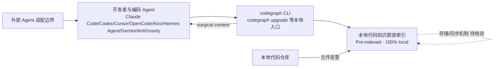

# colbymchenry/codegraph — Pre-indexed code knowledge graph, auto syncs on code changes, for Claude Code, C

## 一句话定位

Pre-indexed code knowledge graph, auto syncs on code changes, for Claude Code, Codex, Gemini, Cursor, OpenCode, AntiGravity, Kiro, and Hermes Agent — fewer tokens, fewer tool calls, 100% local。主要使用 C 编写，当前 65,850 stars / 4,146 forks / 149 subscribers。

## 它解决的问题

**目标用户**：使用 c 生态的开发者、工程师。

**痛点**：该项目解决的核心问题是 Pre-indexed code knowledge graph, auto syncs on code changes, for Claude Code, Codex, Gemini, Cursor, OpenCode, AntiGravity, Kiro, and Hermes Agent — fewer tokens, fewer tool calls, 100% local。从 README 来看，项目提供了 
 # CodeGraph Already installed? Run `codegraph upgrade` Follow [@getcodegraph](https://x.com/getcodegraph) on X for updates. ### Supercharge Claude Code, Cursor, Codex, OpenCode, H。

**场景**：适用于需要 该类型工具 的开发场景。

## 为什么值得关注（2026-05-19）

1. **Stars 增长**：65,850 stars，4,146 forks——fork/star 比为 6.3% （正常范围）
2. **活跃度**：创建于 2026-01-18，最后更新 2026-08-08，407 open issues
3. **技术栈**：C，License: MIT
4. **生态定位**：无 topics 标注

## 热度来源判断

**真实需求信号**：forks 4146（高部署意愿），subscribers 149（深度关注）。

## 关键技术亮点

1. **
**
2. **# CodeGraph**
3. **Already installed? Run `codegraph upgrade`**
4. **Follow [@getcodegraph](https://x.com/getcodegraph) on X for updates.**
5. **### Supercharge Claude Code, Cursor, Codex, OpenCode, Hermes Agent, Gemini, Antigravity, Kiro, and G**
6. ****The fastest complete code graph · surgical context · built for how agents actually work · 100% loc**

## 架构师速览

| 决策问题 | 研究判断 | 证据边界 |
|---|---|---|
| 系统边界 | codegraph 是一只面向编码 Agent 的本地代码知识图谱层，介于本地代码仓库与外部 Agent（Claude Code/Codex/Cursor/OpenCode/AntiGravity/Kiro/Hermes Agent/Gemini 等）之间，承担索引、上下文裁剪与同步职责 | 档案明确其"Pre-indexed code knowledge graph, auto syncs on code changes, …100% local"；协议、传输方式、存储引擎未在档案中说明 |
| 主路径 | 用户/Agent 触发 → codegraph 入口（`codegraph upgrade` 等 CLI）→ 本地索引/图谱 → 按需返回外科手术式上下文（surgical context）→ Agent 消费；变更时自动同步索引 | 仅基于档案中"pre-indexed / auto syncs on code changes / surgical context / 100% local"的事实拼接，未涉及具体同步机制 |
| 关键权衡 | 由 C 实现的本地化处理以换更少 token 与更少 tool call，与此对应的是首次索引与持续同步成本、Agent 适配面广带来的兼容性维护压力 | 权衡判断只引用档案中的 "fewer tokens, fewer tool calls, 100% local"；C 选择与性能/部署形态未在档案中证实 |
| 最小 PoC | 在单仓库、单一 Agent（如 Claude Code）下启用 codegraph，验证 token/tool call 降幅、增量同步正确性、失败回滚路径；验收前不接入多 Agent、不放权多工具 | 仅依据"100% local"与多 Agent 适配声明做边界划定；具体安装/升级路径、PoC 步骤需以 README/源码核验 |

## 架构启发

从 colbymchenry/codegraph 的设计来看，核心思路是 **"Pre-indexed code knowledge graph, auto syncs on code changes"**。这反映了 C 生态中 开发者工具 的演进方向——降低集成复杂度、提供开箱即用的能力。开源 License (MIT) 降低了采用门槛。

## 架构图（MMD）

> 证据边界：此图只采用本档案已有可核验描述；“待核验”节点不应视为项目实现事实。

## 定位判断

**工具型**。在生态中定位为Pre-indexed code knowledge graph, auto s方向的工具。Stars 65850 说明已有一定社区基础。

## 风险 / 局限 / 泡沫点

1. **规模风险**：65,850 stars，但 fork 4146 说明有实际部署
2. **维护风险**：最后 push 时间 2026-08-08，活跃维护中
3. **Open Issues**：407 个 open issues，活跃社区反馈
4. **License**：MIT（宽松许可，适合商用）

## 与同类项目的关系

- 与同 C 生态的同类工具形成竞争/互补关系。具体竞品对比需参考社区讨论。
- 从 topics () 来看，与关注 该领域 的其他项目有交叉。

## 是否值得持续跟踪

**是。** 65850 stars + 活跃更新说明项目有持续价值。建议关注后续版本迭代和社区增长。

## 后续观察点

1. Star 增速是否可持续（当前 65,850）
2. Fork 增长趋势（当前 4,146）
3. 功能迭代频率（最后更新 2026-08-08）
4. 社区活跃度（subscribers 149, open issues 407）

---
> 数据来源: GitHub API (2026-08-08) | Stars: 65,850 | Forks: 4,146 | License: MIT | 语言: C | 创建: 2026-01-18
