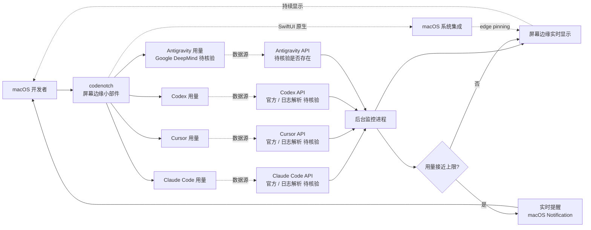

# vinzdg/codenotch

## 一句话定位
macOS native Coding Agent 用量 Monitor——A macOS app that pins usage limits from Claude Code, Cursor, Codex, and Antigravity to a screen edge.，Swift，把 Claude Code / Cursor / Codex / **Antigravity（Google DeepMind 新 Coding Agent）** 的用量限制固定到屏幕边缘实时显示。

## 它解决的问题
2026 年 Coding Agent 用户同时使用多个 Agent（Claude Code / Cursor / Codex 等），各 Agent 的用量限制（速率 / 配额 / 上下文窗口）独立管理，开发者难以实时追踪——经常遇到"Claude Code 配额用尽才发现"或"Cursor 上下文超限被截断"等问题。vinzdg/codenotch 直击这一痛点：(a) **多 Agent 统一监控**——同时显示 Claude Code / Cursor / Codex / Antigravity 的用量；(b) **macOS native 边缘固定**——不打扰主工作流（屏幕边缘小部件）；(c) **实时提醒**——用量接近上限时实时提醒；(d) **Swift 原生**——macOS 专用，开发门槛较高但体验好。这与 9-04 上榜的 damejan80/tokentab（CLI log 分析）形成 **"Coding Agent 用量监测"子赛道**。

## 为什么值得关注
- **Stars:** 667（截至 2026-09-07），2 天净增，单日均速 ~334⭐/day
- **Forks:** 87（fork/star **13.0%**，较高，反映真实开发者使用——macOS 用户的开发者群体对 Coding Agent 用量有刚需）
- **语言:** Swift（macOS native）
- **多 Agent 覆盖:** Claude Code / Cursor / Codex / **Antigravity**（Google DeepMind 新 Coding Agent）四 Agent 同时支持
- **macOS edge pinning:** 屏幕边缘固定显示，不打扰主工作流
- **Antigravity 早期支持:** Antigravity 是 Google DeepMind 在 2026 年推出的 Coding Agent（trending 出现频率较低），codenotch 把其纳入兼容矩阵

## 热度来源判断
codenotch 的热度来自三个趋势的交汇：(1) **多 Coding Agent 使用成常态**——开发者同时使用 Claude Code + Cursor + Codex 等多 Agent，各 Agent 用量独立管理痛点累积；(2) **macOS edge pinning UX 模式**——屏幕边缘小部件不打扰主工作流，是 macOS 原生 UX 优势；(3) **Antigravity 早期支持**——Google DeepMind Antigravity 是新平台，codenotch 把其纳入兼容矩阵获得 Antigravity 早期用户。

2 天 667⭐ / fork/star 13.0% 与"macOS native 工具 + 真实刚需"特征一致。**提示：** "Antigravity" 命名是项目方主张，需要核验是否为 Google DeepMind 官方产品（与 DeepMind 既有产品线的关系）；用量 API 是否官方提供 / 是否涉及逆向工程需要核验；Swift / macOS 限定受众小。

## 关键技术亮点
1. **多 Agent 统一监控:** 同时显示 Claude Code / Cursor / Codex / Antigravity 的用量
2. **macOS edge pinning:** 屏幕边缘固定显示，不打扰主工作流
3. **实时提醒:** 用量接近上限时实时提醒
4. **Swift 原生:** macOS 专用，开发门槛较高但体验好（推测使用 SwiftUI）
5. **Antigravity 集成:** Google DeepMind 新 Coding Agent 的早期支持
6. **用量 API 集成:** 推测需要官方 API（合规）或日志解析（合法但延迟高）

## 架构师速览

| 决策问题 | 研究判断 | 证据边界 |
|---|---|---|
| 系统边界 | macOS native Coding Agent 用量 Monitor——屏幕边缘固定小部件 + 多 Agent 统一监控 + 实时提醒 | 边界由 trending 描述明示；具体用量数据源（官方 API / 日志解析 / 逆向）需 README 核验 |
| 主路径 | macOS 启动 codenotch → 后台监控 Claude Code / Cursor / Codex / Antigravity 用量 → 屏幕边缘小部件显示 → 用量接近上限时实时提醒 | 主路径为描述语义抽象；具体监控方式（API 轮询 / 事件订阅 / 日志解析）未在 trending 中可见 |
| 关键权衡 | Swift / macOS 限定受众小 vs 开发体验好；用量数据官方 API（合规）vs 日志解析（合法但延迟高）vs 逆向 API（合法性存疑）；多 Agent 兼容广度 vs 每个 Agent 的数据准确性 | 四 Agent 覆盖由 trending 描述明示；具体数据源与合法性需 README 核验 |
| 最小 PoC | 在 macOS 上下载 codenotch → 同时使用 Claude Code + Cursor + Codex → 观察屏幕边缘小部件的实时用量显示 → 用量接近上限时验证实时提醒 | 安装命令需 README 独立核验；"Antigravity" 命名需要核验是否为 Google DeepMind 官方产品 |

## 架构启发
codenotch 的核心启发是 **"Coding Agent 用量监测是真实刚需"**。2026 年 Coding Agent 用户同时使用多个 Agent，各 Agent 用量独立管理导致"配额用尽才发现"或"上下文超限被截断"等问题。codenotch 通过 macOS edge pinning UX 模式解决——不打扰主工作流的实时显示，比 CLI log 分析工具（damejan80/tokentab）体验更好。更深层的启发是：**macOS native 工具在小众但真实刚需场景下仍有优势**——Swift 开发门槛高，但用户体验（edge pinning / 实时提醒）是 Electron / Web 工具难以达到的。

风险提示：**"Antigravity" 命名真实性**——需要核验是否为 Google DeepMind 官方产品（与 DeepMind 既有产品线的关系）；用量数据源合法性边界——官方 API（合规）vs 日志解析（合法但延迟）vs 逆向 API（合法性存疑）；Swift / macOS 限定受众小，难以规模化。

## 架构图（MMD）

> 证据边界：此图只采用本档案已有可核验描述；"待核验"节点不应视为项目实现事实。

## 定位判断
**工具型项目（macOS native Coding Agent 用量 Monitor）。** vinzdg/codenotch 是 Coding Agent 用量监测的小众但真实刚需工具，2 天 667⭐ / fork/star 13.0% 显示 macOS 开发者对 Coding Agent 用量管理的需求。但作为独立产品的天花板：(a) Swift / macOS 限定受众小；(b) 用量数据源合法性边界（官方 API vs 日志解析）；(c) 多 Agent 兼容广度（增加更多 Agent 支持）；(d) 与 tokentab 等 CLI 工具的差异化。当前定位是"macOS native 用量 Monitor 头部样本"，向"多平台扩展"或"用量预警 + 自动切换"是两条路径。

## 风险/局限/泡沫点
- **"Antigravity" 命名真实性:** 需要核验是否为 Google DeepMind 官方产品（与 DeepMind 既有产品线的关系）
- **用量数据源合法性:** 官方 API（合规）vs 日志解析（合法但延迟高）vs 逆向 API（合法性存疑）——边界模糊
- **Swift / macOS 限定:** 受众小，难以规模化到 Windows / Linux 用户
- **多 Agent 数据准确性:** 每个 Agent 的用量数据准确性需要独立测试
- **vinzdg 个人项目:** 长期可持续性 / 多 Agent 兼容矩阵扩展速度未验证
- **用量限制政策变化:** 各 Coding Agent 官方可能调整用量政策（API 变化 / 配额变化）影响 codenotch

## 与同类项目的关系
- **vs damejan80/tokentab:** tokentab 是 CLI 工具（分析 session log）；codenotch 是 macOS GUI 工具（实时监控）
- **vs Cursor Usage Bar:** Cursor 内置用量显示（仅 Cursor）；codenotch 跨多 Agent
- **vs Claude Usage Tracker:** Claude 官方用量追踪（仅 Claude Code）；codenotch 跨多 Agent
- **vs Bartender / Ice:** Bartender / Ice 是 macOS 菜单栏管理工具；codenotch 是 Coding Agent 用量专用 Monitor
- **vs 各 Agent 官方用量 API:** 官方用量 API 仅支持单 Agent；codenotch 是多 Agent 统一 Monitor

## 是否值得持续跟踪
**值得跟踪（macOS native Coding Agent 用量 Monitor）。** codenotch 代表了 Coding Agent 用户对"用量管理"的刚需，与 tokentab 等 CLI 工具形成差异化（macOS GUI vs CLI）。建议关注：(a) "Antigravity" 命名真实性；(b) 用量数据源合法性边界；(c) 多 Agent 兼容矩阵扩展速度；(d) 与各 Agent 官方用量 API 的集成深度。对 macOS 开发者，codenotch 是值得尝试的 Coding Agent 用量 Monitor。

## 后续观察点
- "Antigravity" 命名真实性（Google DeepMind 官方产品？）
- 用量数据源合法性边界（官方 API vs 日志解析 vs 逆向）
- 多 Agent 兼容矩阵扩展（增加 Windsurf / Cody / Continue 等）
- 与各 Agent 官方用量 API 的集成深度
- 是否演化为跨平台（Windows / Linux）
- vinzdg 个人项目的可持续性 / 多 Agent 兼容矩阵扩展速度

---
> 数据来源: GitHub API (2026-09-07) | Stars: 667 | Forks: 87 | License: 待核验 | 语言: Swift | 创建: 2026-09-05
