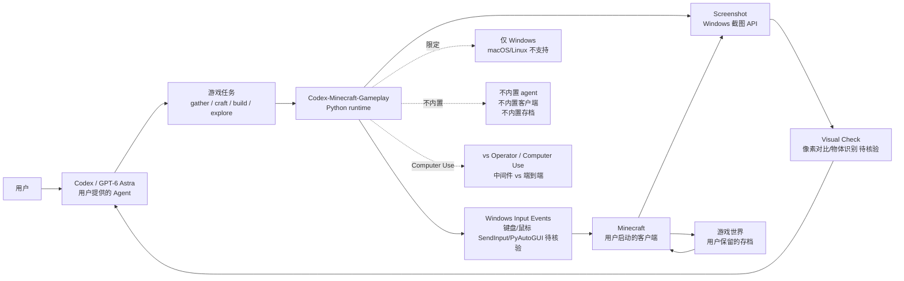

# wz1119/Codex-Minecraft-Gameplay

## 一句话定位
Codex 玩 Minecraft 工具包——Windows **键盘 / 鼠标 / 截图 + 可视化检查**；**不内置 agent 模型 / 客户端 / 世界存档**；只提供 Agent 与 Minecraft 之间的"输入 / 输出 / 视觉检查"中间件；2 天 126⭐，fork 8，Python。

## 它解决的问题
2026 年 Computer Use Agent（OpenAI Operator / Anthropic Computer Use）能操控 GUI 应用，但游戏是特殊场景：(a) **高频输入**——游戏需要毫秒级键盘 / 鼠标响应；(b) **视觉验证**——Agent 需要看截图判断是否成功；(c) **独立世界**——Agent 需要在不污染原存档的情况下探索。`Codex-Minecraft-Gameplay` 直击这三点：(a) **Windows input events**——底层键盘 / 鼠标模拟（不依赖 Selenium / Playwright）；(b) **`screenshot + 可视化检查`**——agent 主动截图 + 可选视觉验证；(c) **不内置游戏存档**——Agent 在原游戏世界探索，不污染存档。

## 为什么值得关注
- **Stars:** 126（截至 2026-09-08），2 天净增，单日均速 ~63⭐/day
- **Forks:** 8（fork/star 6.3%，略低于 magnitude 7.2%）
- **语言:** Python 主导
- **项目年龄:** 2 天（创建 2026-09-06）
- **核心差异:** 不内置 agent 模型 + 不内置客户端 + 不内置世界存档 + Windows 原生 input events

## 热度来源判断
`Codex-Minecraft-Gameplay` 的热度来自三个因素：(1) **Computer Use 游戏场景需求**——游戏是 Computer Use Agent 的经典测试场景（Minecraft 是开放世界标杆）；(2) **Codex + Minecraft 协同**——Codex 是当前 Coding Agent 头部，Minecraft 是开放世界标杆，二者协同有教育意义；(3) **作者个人品牌**——README 顶部有作者 X 链接（@wuyang_zhou），个人品牌可信度较高。

2 天 126⭐ / fork 8（fork/star 6.3%）的组合反映 **"Computer Use 游戏场景 + Codex 协同"** 的需求。

## 关键技术亮点
1. **Windows input events:** "The runtime uses Windows input events and screenshots"——底层键盘 / 鼠标模拟，不依赖 Selenium / Playwright
2. **可视化检查:** "Optional visual checks"——Agent 可主动截图 + 视觉验证任务完成度
3. **不内置 agent 模型:** "It does not include an agent model"——agent 由用户提供的 Codex / GPT-6 等
4. **不内置游戏客户端:** 用户自己启动 Minecraft，Agent 通过 input / output 与游戏交互
5. **不内置世界存档:** "It does not include a game-memory interface"——Agent 通过截图感知游戏世界
6. **多步任务支持:** README 给出"move, look around, gather materials, craft, explore, and build"——覆盖 Minecraft 核心玩法

## 架构师速览

| 决策问题 | 研究判断 | 证据边界 |
|---|---|---|
| 系统边界 | Computer Use 中间件层——Windows input / output / 可视化检查；不内置 agent / 客户端 / 存档；关键是"中间件"vs"端到端 Agent" | 边界由 README 明示；具体 Windows input 的实现（SendInput / PyAutoGUI）需 README 核验 |
| 主路径 | Codex 触发 → Windows input events（键盘 / 鼠标）→ Minecraft 接收 → 截图 → Agent 视觉检查 → 继续或回退 | 主路径为 README 语义抽象；具体视觉检查的实现（像素对比 / 物体识别）需 README 核验 |
| 关键权衡 | 中间件定位（不内置 agent）的灵活性 vs 完整方案的便利性；Windows 限定（vs 跨平台）的性能 vs 兼容性；高频 input 的延迟 vs 输入合法性 | README 明示 "Windows keyboard, mouse, and screenshot toolkit"；具体延迟 / 兼容性需 benchmark |
| 最小 PoC | Windows PC 安装 Codex-Minecraft-Gameplay → 启动 Minecraft → 进入世界 → 在 Codex 给定"gather wood" 任务 → 观察 input events + 截图 + 视觉检查 | PoC 范围由 README "Quick start" 推导；具体延迟与成功率需 benchmark |

## 架构启发
`Codex-Minecraft-Gameplay` 的核心启发是 **"Computer Use 中间件定位——不内置 agent / 客户端 / 存档"**。传统 Computer Use 项目（Operator / Computer Use）倾向于"端到端"——自己处理一切；Codex-Minecraft-Gameplay 走 **"中间件"** 路线——只负责 input / output / 视觉检查，agent 由用户提供，客户端由用户启动，存档由用户保留。

更深层的启发是 **"Computer Use 工具的 Linux 哲学"**——"do one thing and do it well"——只做 Minecraft 的 input / output 中间件，不越界做其他事情。

风险提示：**Windows 限定**——不支持 macOS / Linux；**游戏反作弊**——理论上可绕过一些 anti-cheat，但 Minecraft 是单机游戏不影响；**高频 input 的合法性**——SendInput 在某些场景可能触发游戏 anti-cheat。

## 架构图（MMD）

> 证据边界：此图只采用本档案已有可核验描述；"待核验"节点不应视为项目实现事实。

## 定位判断
**工具型项目（Codex 玩 Minecraft 中间件），向"Computer Use 游戏场景工具"演进。** `Codex-Minecraft-Gameplay` 不仅是一个 Minecraft 工具，更是 Computer Use 中间件定位（vs 端到端 Agent）的样本。2 天 126⭐ / fork/star 6.3% 已显示初步关注。当前定位是"Codex + Minecraft 协同工具头部样本"，向"Computer Use 游戏场景工具集"演进是合理路径。

## 风险/局限/泡沫点
- **Windows 限定:** 仅支持 Windows，macOS / Linux 用户无法直接使用
- **高频 input 的合法性:** SendInput 在某些场景可能触发游戏 anti-cheat（Minecraft 单机不影响，但其他游戏可能受影响）
- **不内置 agent 的灵活性 vs 便利性:** 用户需要自己提供 agent + 启动客户端 + 配置存档——门槛较高
- **视觉检查的准确性:** 像素对比 / 物体识别的准确性需要 benchmark；Minecraft 像素块相对简单，但复杂场景（生物群系 / 建筑结构）需要更高准确度
- **2 天新项目风险:** wz1119 是新 GitHub 账号，项目可持续性未验证
- **延迟与成功率:** Windows input events 的延迟与游戏任务的成功率需要 benchmark

## 与同类项目的关系
- **vs alchaincyf/huashu-mac-use (9-08, 181⭐):** huashu-mac-use 是 macOS Computer Use Skill；Codex-Minecraft 是 Windows Computer Use Minecraft 工具——平台 / 领域不同
- **vs OpenAI Operator:** Operator 是云端闭源 Computer Use；Codex-Minecraft 是开源本地 Minecraft 工具——云端 vs 本地
- **vs Anthropic Computer Use:** Computer Use 是 Claude API 能力；Codex-Minecraft 是独立中间件——API vs 中间件
- **vs Mineflayer (Node.js):** Mineflayer 是 Minecraft bot 框架；Codex-Minecraft 是 Codex 协同中间件——bot 框架 vs LLM 协同
- **vs OpenInterpreter:** OpenInterpreter 是 Computer Use 通用工具；Codex-Minecraft 是 Minecraft 专用工具——通用 vs 专用

## 是否值得持续跟踪
**值得跟踪（Codex 玩 Minecraft 中间件头部样本）。** `Codex-Minecraft-Gameplay` 代表了 Computer Use "中间件定位（vs 端到端 Agent）"模式的方向，与 Codex 协同 + Minecraft 标杆场景 + 2 天 126⭐ 共同构成新方向。建议关注：(a) 跨平台扩展（macOS / Linux）；(b) 视觉检查准确性的 benchmark；(c) 与 Mineflayer / OpenInterpreter 的竞争；(d) Computer Use 中间件模式是否扩展到其他游戏。对 Minecraft 玩家 / Computer Use 研究者，Codex-Minecraft-Gameplay 是开源的 Minecraft + Codex 协同工具。

## 后续观察点
- 跨平台扩展（macOS / Linux 支持）
- 视觉检查准确性的 benchmark
- 与 Mineflayer / OpenInterpreter 的功能差异化
- Computer Use 中间件模式的扩展（其他游戏 / 应用）
- 高频 input 的延迟与成功率
- "Codex + 游戏" 协同工具的演进

---
> 数据来源: GitHub API (2026-09-08) | Stars: 126 | Forks: 8 | License: 待核验 | 语言: Python | 创建: 2026-09-06
