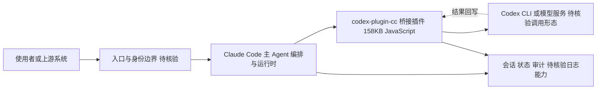

# openai/codex-plugin-cc

## 一句话定位
OpenAI 官方出品的桥接插件——让 **Claude Code**（Anthropic 的终端编程 Agent）能够调用 **Codex**（OpenAI 的编程模型/CLI）来审查代码或委派任务，是两大 AI 巨头在 Agentic Coding 工具层的一次罕见"互操作"，标志着 Coding Agent 从"各自封闭"走向"可组合"。

## 它解决的问题
Agentic Coding 工具（Claude Code、Codex CLI、Cursor）正各自构建封闭生态：Claude Code 用 Anthropic 模型，Codex CLI 用 OpenAI 模型，互不调用。但开发者常发现**不同模型各有所长**——Claude Sonnet 擅长架构推理，GPT/Codex 擅长某些代码生成，Gemini 擅长长上下文。理想状态下，一个 Agent 应能按任务"调用最合适的模型"。codex-plugin-cc 迈出了第一步：在 Claude Code 内，把特定子任务（如代码审查、独立实现）委派给 Codex 执行。解决的是 **"不同厂商 Coding Agent 之间无法协作、模型能力无法组合"** 的孤岛问题。它的意义超越工具本身——这是 Agent 互操作性的早期实践。

## 为什么值得关注
- **Stars:** 31,475（截至 2026-08-07），4 个月突破 3 万，增速极快
- **Forks:** 2,144，社区参与高
- **Watchers/Subscribers:** 125
- **Open Issues:** 417，反馈活跃
- **License:** Apache-2.0
- **语言:** JavaScript
- **活跃度:** created 2026-03-30，pushed_at 2026-07-08，持续迭代
- **规模:** 158KB，极简插件（说明核心是桥接协议，非重型实现）
- **背书:** OpenAI 官方组织维护，可信度极高

## 热度来源判断
codex-plugin-cc 的热度是 **"OpenAI 官方背书 + 跨厂商互操作的象征意义 + Claude Code 生态红利"** 三重驱动。OpenAI 主动为竞争对手（Anthropic 的 Claude Code）写插件，本身具有巨大话题性——这传递了一个信号：**Agent 互操作是大势所趋，连 OpenAI 都在拥抱**。Claude Code 庞大的用户基数（2026 年最火的 Coding Agent）为这个插件提供了天然分发渠道——每个 Claude Code 用户都是潜在用户。热度**真实且象征意义重大**，但也需清醒：158KB 的插件体量说明它是个"薄桥接"，技术深度有限，3 万 stars 中有不少是"围观事件"而非重度使用。真正的价值在于它开启的"Agent 互操作"范式。

## 关键技术亮点亮点
1. **Claude Code 插件机制:** 利用 Claude Code 的插件/MCP 接口，将 Codex 作为"外部工具"注入 Claude Code 工作流
2. **任务委派:** Claude Code 主 Agent 可将子任务（如"审查这段代码"、"独立实现这个函数"）委派给 Codex 执行并回收结果
3. **双 Agent 协作:** 形成 Claude（主控）+ Codex（执行/审查）的双模型协作模式，结合两家所长
4. **极简实现:** 158KB 体量，核心是协议桥接，依赖 Claude Code 与 Codex 各自的能力，插件本身是"胶水"
5. **Apache-2.0 开源:** OpenAI 以宽松许可开源，鼓励社区扩展（如反向插件、多模型桥接）
6. **官方维护:** OpenAI 维护而非第三方，保证与 Codex API/CLI 的及时同步

## 架构师速览

| 决策问题 | 研究判断 | 证据边界 |
|---|---|---|
| 系统边界 | 一个 158KB 的 Apache-2.0 JavaScript 插件，定位为 Claude Code 与 Codex 之间的桥接层（plugin / bridge / interoperability），非独立运行时 | 仅来自档案描述的体量、许可与标签；具体进程边界、IPC、宿主注入方式未在档案中说明 |
| 主路径 | Claude Code 主 Agent 通过插件/MCP 接口，把"代码审查/子任务委派"作为外部工具调用路由至 Codex，回收结果后回写到 Claude Code 工作流 | 档案未给出协议细节、消息格式、调用栈；"MCP 接口"为档案用词，未指明 MCP 版本或传输层 |
| 关键权衡 | 互操作开放姿态 vs 双方竞合关系；极简桥接 vs 依赖 Claude Code 与 Codex 任一方 API 变动；通用 Agent 协议（如 MCP 扩展）可能取代专用桥接 | 权衡为档案明确提示的风险点（竞合悖论、依赖双方稳定、可能被 MCP 吸收），无实测性能或耦合度数据 |
| 最小 PoC | 在 Claude Code 内启用该插件，仅开放"代码审查"单一委派能力，开启可审计日志（会话/状态/审计节点），验证 Codex 子任务委派—结果回写闭环 | 档案未提供安装方式、所需 Codex 凭据、CLI/API 版本要求；审计与日志能力仅为研究抽象，未在档案中证实 |

## 架构启发
codex-plugin-cc 的核心启发是 **"Agent 的未来是可组合的，而非各自封闭"**。当前每个 Coding Agent（Claude Code、Codex、Cursor）都试图成为"全能单体"，但模型各有所长、工具各有专精，封闭意味着能力浪费。OpenAI 为 Claude Code 写插件，实质上承认了：**没有单一 Agent/模型能满足所有需求，互操作是必然**。这预示着一个趋势：Coding Agent 将走向"插件化、可组合"的架构，类似 IDE 的插件生态——主 Agent 协调，专业插件（其他模型/工具）执行子任务。codex-plugin-cc 是这个趋势的早期信号，其范式意义大于当前功能。

## 架构图（MMD）

> 证据边界：此图只采用本档案已有可核验描述；“待核验”节点不应视为项目实现事实。

## 定位判断
**工具型插件（战略意义大于功能本身）。** codex-plugin-cc 作为单独插件，功能明确而有限（桥接 Claude Code 与 Codex）。但其战略意义突出：①OpenAI 拥抱互操作的姿态；②验证"Agent 可组合"范式；③抢占 Claude Code 生态的协同位。作为工具，它是 Claude Code 用户的锦上添花（可选用 Codex 做审查）；作为信号，它预示 Agent 互操作时代的开启。不会成为平台，但会启发更多跨厂商桥接。OpenAI 维护保证了可靠性。

## 风险/局限/泡沫点
- **功能单薄:** 158KB 插件，核心是桥接，深度依赖双方 Agent 能力，自身价值有限
- **象征 > 实用:** 大量 stars 来自"围观 OpenAI 给 Anthropic 写插件"的事件性关注
- **依赖双方稳定:** Claude Code 与 Codex 任何一方 API 变动都影响插件
- **竞合悖论:** OpenAI 与 Anthropic 是竞争对手，长期互操作意愿存疑（可能随时收紧）
- **更优方案:** 若出现统一 Agent 协议（如 MCP 扩展），专用桥接插件可能被通用方案取代
- **使用场景窄:** 仅服务"同时用 Claude Code 和 Codex 的用户"，受众有上限

## 与同类项目的关系
- **vs 反向桥接（Anthropic 为 Codex 写插件）:** 理论上对称，目前 OpenAI 率先出手
- **vs MCP（通用协议）:** MCP 是通用工具协议；codex-plugin-cc 是专用模型桥接，未来可能被 MCP 标准化吸收
- **vs 多模型 Agent（如 Cursor）:** Cursor 内部已支持多模型切换；codex-plugin-cc 是跨 Agent 桥接，层级不同
- **vs Aider/OpenCode（模型无关 Agent）:** 那些天然支持多模型；codex-plugin-cc 是特定厂商间的桥
- **vs Claude Code 插件生态:** 本插件是 Claude Code 插件体系的一个官方示范案例

## 是否值得持续跟踪
**值得跟踪（作为 Agent 互操作的信号）。** codex-plugin-cc 的价值不在于它当下做什么，而在于它预示什么——Agent 走向可组合。建议关注：是否出现反向插件（Anthropic 为 Codex 写）、是否演化出通用 Agent 互操作协议、Claude Code 插件生态的整体繁荣程度。对 Claude Code 重度用户，这个插件值得安装试用（用 Codex 做第二意见审查）。对行业观察者，它是 Agent 生态从封闭走向开放的里程碑事件之一。

## 后续观察点
- Anthropic 是否对等推出"Claude for Codex CLI"插件（互操作对称化）
- 是否出现统一的"Agent 间委派协议"（标准化 codex-plugin-cc 的模式）
- Claude Code 插件生态的繁荣度（更多官方/第三方插件涌现）
- OpenAI 对互操作的态度是否持续（竞合关系演变）
- 多 Agent 编排框架（如 Hermes、LangGraph）是否原生吸收这种桥接模式

---
> 数据来源: GitHub API (2026-08-07) | Stars: 31,475 | Forks: 2,144 | License: Apache-2.0 | 语言: JavaScript | 创建: 2026-03-30
