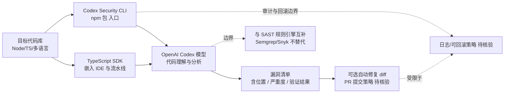

# openai/codex-security

## 一句话定位
OpenAI 官方的 Codex Security CLI 与 TypeScript SDK——把 OpenAI 的代码理解能力封装为可独立安装的安全扫描工具，用于在代码库中查找、验证并修复安全漏洞。

## 它解决的问题
应用安全扫描传统上是 Snyk / Semgrep / CodeQL 这类专用工具的天下，LLM 在此场景多被用于"补一句话解释"或"PR review"。OpenAI 把 Codex 拆出独立 CLI / SDK 形态的安全产品，意味着：① OpenAI 认为 LLM 可以独立承担"扫描 + 验证 + 修复"三步闭环；② 把"安全"做成可分发 npm 包，便于嵌入 CI / 现有 DevSecOps 流水线；③ 对 CISO 而言，新增了一个"由 OpenAI 背书"的安全工具选项。需求侧痛点是：**当前 AI 安全工具要么是规则引擎（误报多），要么是 PR Copilot 风格（仅评论不修复），少有"自动修复"一体化方案**。

## 为什么值得关注（2026-08-22）
- **OpenAI 官方开源**：非社区项目，README 明示 "OpenAI's Codex Security CLI and TypeScript SDK"，发布于 npm。
- **增长真实**：40 天 10,047⭐（GitHub API 可核验），TypeScript 实现，单一 CLI 入口。
- **官方 topics 包含**：`codex-security`、`vulnerability-scanning`、`devsecops`、`application-security`，定位清晰——不是泛 PR Copilot，而是 ASPM 工具。
- **npm 分发**：作为 npm 包，可被现有 Node / Next.js / TypeScript 工程直接嵌入，避免"再装一个二进制"。

## 热度来源判断
**OpenAI 品牌 × 安全合规焦虑 × 可嵌入式 CLI 三重驱动。** 安全行业从 2025 年起持续受 GenAI 改造——Snyk / Veracode / Semgrep 都在加 LLM 能力。OpenAI 亲自下场，意味着 "AI 安全"已从 "LLM 辅助 PR review" 升级为 "LLM 原生扫描器"。10k 星在 40 天达成，含品牌流量也含真实集成需求——但需注意：**OpenAI 既有产品线（ChatGPT Enterprise、API）的合规绑定可能让企业采购时犹豫**（锁定 vs 多供应商的取舍）。

## 关键技术亮点
1. **CLI + SDK 双形态**：同一能力既可独立运行（CI 集成），也可作为 TypeScript 库嵌入应用（IDE 插件 / 内部平台）。
2. **官方 topics 含 vulnerability-scanning / devsecops**：覆盖 SAST 扫描 + 应用安全合规两类场景。
3. **Codex 模型驱动**：底层复用 Codex 的代码理解能力，对结构化漏洞（SQLi、XSS、不安全反序列化、密钥硬编码）有较好覆盖。
4. **npm 生态**：与 Node.js / TypeScript 现有 CI / lint / test 流水线无缝集成。
5. **OpenAI 品牌**：当企业安全审计要求"独立第三方"时，OpenAI 官方的身份有助于通过合规审查。

## 架构师速览

| 决策问题 | 研究判断 | 证据边界 |
|---|---|---|
| 系统边界 | Codex Security 是 OpenAI 的安全扫描 CLI 与 TS SDK，承担"扫描—验证—修复"三步闭环；底层复用 Codex 模型，边界外不替代 SAST 规则引擎的全部能力 | 仅基于档案描述的 CLI+SDK 双形态、Codex 模型驱动、官方 topics；具体漏洞规则覆盖、修复 PR 生成策略均待官方文档核验 |
| 主路径 | 目标代码库 → CLI 扫描入口 → Codex 模型分析 → 漏洞清单与验证结果 → 可选自动修复 diff 回写 | 主路径为档案语义抽象；具体 LLM 调用协议、误报阈值、修复权限控制（PR 自动提交 vs 仅建议）均未披露 |
| 关键权衡 | "OpenAI 一站式"便利性 vs 多供应商安全策略的合规要求；LLM 修复建议的"创造性" vs 安全修复应保守、可审计、可回滚；CLI 嵌入 vs SAST 厂商（Semgrep / Snyk）既有的规则生态 | 均为推断；具体规则覆盖、修复 PR 审批流程、审计日志机制均待核验 |
| 最小 PoC | 在内部一个非生产 Node/TypeScript 服务（建议为最小 Express + 一个已知 CVE 依赖）中跑一次 `npx codex-security scan`，开启"建议模式"而非"自动修复模式"，比对与 Semgrep baseline 的差异，记录误报/漏报后评估是否在 CI 中灰度上线 | PoC 范围与退出路径由档案"先建议、可审计、可回滚"原则推导；具体命令、版本兼容、SLO 指标待核验 |

## 架构启发
codex-security 的启发是 **"模型即安全产品"**——传统上，安全工具靠规则与签名库；LLM 时代，模型自身可以是"安全分析师"。它的另一启发是 **"品牌 SDK 化"**：把 Codex 拆为可独立分发的 SDK（而非绑定到 ChatGPT 后台），让企业可在自有流水线嵌入——这是从"消费级产品"向"开发者基础设施"转型的清晰动作。对照 Snyk（规则数据库）、Semgrep（开源规则引擎）、GitHub Advanced Security（平台绑定），codex-security 是"模型驱动 + 品牌官方 + 跨厂商"的新象限。

## 架构图（MMD）

> 证据边界：此图只采用本档案已有可核验描述；"待核验"节点不应视为项目实现事实。

## 定位判断
**应用安全 Agent 赛道（OpenAI 官方入场）**。codex-security 是 OpenAI 把 Codex 从"编程 agent"延伸到"安全 agent"的官方产品。对企业：① 若已采购 OpenAI API / ChatGPT Enterprise，codex-security 是合规友好的额外收益；② 若需"独立第三方安全厂商"，仍需 Semgrep / Snyk / Veracode 等多源验证。10k 星体现品牌 + AI 安全焦虑的双重热度，但**生产成熟度仍需观察 3-6 个月**——漏洞覆盖是否全（不只 JS/TS）、修复建议是否会被 LLM 幻觉污染、审计日志是否完整，是企业采购前的核心问题。

## 风险 / 局限 / 泡沫点
- **品牌绑定风险**：由 OpenAI 运营意味着 OpenAI 政策变化（API 价格、模型退役、合规）会直接影响产品可用性；对"vendor-neutral 安全策略"是负担。
- **LLM 幻觉污染**：漏洞修复建议可能"看起来对但实际破坏功能"，尤其在复杂业务逻辑（认证、加密、并发）领域。
- **覆盖语言有限**：官方 topics 与 npm 入口暗示主战场是 JS/TS/Node，其他语言（Rust、Go、Java、COBOL）覆盖深度待核验。
- **模型成本不可忽视**：每次 scan 都调 Codex API，对大型 monorepo 可能产生显著 token 成本；需自建缓存与扫描调度策略。
- **合规边界模糊**：在金融/医疗等强监管行业，LLM 自动修复可能被视为"未授权代码变更"，需明确人工审批边界。

## 与同类项目的关系
- **vs Snyk / Veracode / Checkmarx**：传统 SAST 厂商，靠规则库与签名；codex-security 靠 LLM 模型——可能互补而非替代。
- **vs Semgrep**：开源 SAST 引擎，靠社区规则；codex-security 是厂商托管、模型驱动。
- **vs GitHub Advanced Security**：平台绑定（必须用 GitHub）；codex-security 跨平台、跨代码托管。
- **vs Anthropic Claude Code 安全模式**：Claude Code 也可写规则做安全检查，但非独立产品形态。
- **vs Snyk DeepCode AI**：Snyk 已收购的 AI 代码审查产品，codex-security 是 OpenAI 的对位产品。

## 是否值得持续跟踪
**值得跟踪（AI 安全赛道风向标）**。codex-security 是 OpenAI 把"AI 安全"从 PR review 升级为独立产品的首次明确动作。建议关注：① 是否扩展到更多语言；② 是否引入专门的安全微调模型；③ 与 OpenAI 其他产品（ChatGPT Enterprise、API）的合规绑定是否加深。对企业安全团队：可作为内部"AI 安全试用工具"在隔离环境跑 PoC，但生产化前必须做多供应商对比与审计验证。对投资人/观察者：这是 AI 安全赛道"厂商化"加速的信号——Snyk / Veracode / Semgrep 的应对动作值得跟踪。

## 后续观察点
- 语言覆盖是否扩展（Rust / Go / Java / C++）
- 自动修复 PR 的"人工审批"机制是否默认开启
- 与 OpenAI 其他产品（ChatGPT Enterprise、API）的合规绑定深度
- Snyk / Veracode / Semgrep 的应对（是收购 AI 安全初创 vs 自研 vs 兼容）
- 是否有第三方独立基准测试（OWASP Benchmark、SARIF 兼容性）

---
> 数据来源: GitHub API (2026-08-22) | Stars: 10,047 | Language: TypeScript | 创建: 2026-07-13 | 官方 topics: codex-security, security, vulnerability-scanning, devsecops, application-security