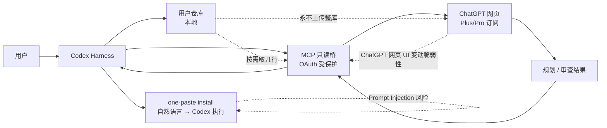

# XiaoDuoYa/codex-with-chatgpt

## 一句话定位
把 ChatGPT 网页订阅（Plus/Pro）的"规划与审查大脑"与 Codex Harness 的"执行权"用 MCP 只读桥拼起来——ChatGPT 通过 OAuth 受保护的只读 MCP 连接按需读取工作区，**仓库永不上传**。

## 它解决的问题
ChatGPT 付费订阅（Plus/Pro）的网页版额度大量闲置，Codex 却在消耗紧张的 API/Codex 额度做规划和 Review——订阅与 API 的成本差异可达 10×。codex-with-chatgpt 直击这一痛点：把"思考"交给已付费的网页版 ChatGPT，把"执行"交给 Codex。**不用 API Key、不搞逆向代理——官方网页 + 只读 MCP 桥接。**

## 为什么值得关注（2026-08-29）
- **Stars:** 239（截至 2026-08-29），**1 天起步**
- **Forks:** 待核验
- **License:** MIT
- **语言:** TypeScript
- **活跃度:** created 2026-08-28，pushed_at 2026-08-29
- **接入面:** Codex Harness + ChatGPT 网页（OAuth）
- **安全性设计:** 只读 MCP 桥 + OAuth 保护 + 仓库永不上传
- **UX:** one-paste install（"把下面这段话原样复制给你的编码 Agent（Codex），然后去倒杯咖啡"）

## 热度来源判断
codex-with-chatgpt 的热度是 **"ChatGPT 订阅闲置 vs Codex API 紧张的真实矛盾 × 只读 MCP 桥的安全设计 × zero-friction UX"** 的组合。239⭐/1 天说明 ChatGPT 付费用户群对"释放订阅价值"的真实需求。但需警惕：(1) ChatGPT 网页版 UI 变动会破坏只读桥（脆弱性）；(2) OAuth 范围是否真正限定为只读（token scope 治理）；(3) "agent 自动安装 + agent 自动跑通"的安全边界——agent 在无人监督下执行 README 中的"所有事情你自己做"是新的 Prompt Injection 攻击面；(4) OpenAI 对"第三方桥接 ChatGPT 网页订阅"的政策不透明。

## 关键技术亮点
1. **思考 / 执行分离**（README 明示）："Use the ChatGPT web app as the planning and review brain for your Codex coding sessions, while Codex keeps full ownership of execution"
2. **只读 MCP 桥**："Your repository is never uploaded: ChatGPT reads exactly the lines it needs through a secure, OAuth-protected, read-only MCP connection to your current workspace"——按需取行（不是整库上传）
3. **OAuth 受保护** + **零 API Key** + **零逆向代理**："No API keys, no reverse proxy — official web UI plus a read-only MCP bridge"（README 自述）
4. **one-paste install UX**（README 自述）："不懂 git、Node、终端？完全不需要懂。把下面这段话原样复制给你的编码 Agent（Codex），然后去倒杯咖啡"
5. **双语 README**（英文 + 简体中文）——中英文用户群双向友好
6. **明确边界设计**："你的仓库永远不会被上传" + "执行权完全保留在 Codex 手里"——避免"AI Coding = 把代码全发给第三方 LLM"的隐私焦虑

## 架构师速览

| 决策问题 | 研究判断 | 证据边界 |
|---|---|---|
| 系统边界 | ChatGPT 网页（OAuth 受保护）+ Codex Harness（执行）+ 只读 MCP 桥；用户仓库永不上传 | "Your repository is never uploaded" 是 README 明确表述；MCP token scope（read-only）的执行强度需 OAuth 配置独立验证 |
| 主路径 | 用户在 Codex 中发起任务 → Codex 通过 MCP 把"需要的几行代码"发给 ChatGPT → ChatGPT 给出规划 / 审查 → Codex 执行 | MCP 桥的请求粒度（按需取几行）是 README 明示；具体取行算法（grep / AST / 文件级）需源码核验 |
| 关键权衡 | ChatGPT 订阅利用率 vs 网页 UI 变动脆弱性 vs OAuth 治理（防止升级为读写） vs 无人监督下 agent 自动安装的安全边界 | "one-paste install" 与 "agent 自动跑通" 是 README 明示；ChatGPT 官方对网页 API / 第三方桥的政策风险未量化 |
| 最小 PoC | macOS / Linux 上按 README one-paste 装好 → 在一个空仓库里让 Codex 写一个 30 行 Python 函数 → 验证 ChatGPT 端只收到了这一文件 / 这几行 → 验证 Codex 端产物正确 | one-paste 命令与"零 git / Node / 终端门槛"是 README 明示；网络条件（访问 ChatGPT 网页）需自备 |

## 架构启发
codex-with-chatgpt 的核心启发是 **"AI Coding 经济学 = 思考 / 执行分离"**。当前 ChatGPT Plus 订阅（约 $20/月）与 Codex API（约 $0.01-0.06/1k tokens）的成本结构差异巨大——订阅内"思考"几乎免费，API 内"执行"按 token 计费。把"思考"放在订阅内、"执行"放在 API 上，可以释放 10× 成本节约。这一模式如果被 Anthropic 订阅 + 任意 Harness / Google Gemini + 任意 Harness 跟进，会成为 **AI Coding 经济学的下一战场**。更深层的启发是 **"只读 MCP 桥"的隐私设计**——按需取行而非整库上传，是 agent 安全的关键原语。当整个 SaaS 行业都在担心"AI 把数据发给第三方 LLM"时，只读 MCP 桥是优雅解。最深层的启发是 **"agent 自动安装 + agent 自动跑通"的 zero-friction UX**——把 README 的自然语言当命令直接传给 Codex，由 Codex 自主完成 git / Node / 终端的所有操作。这是"agent 即 installer"的产品形态，但也引入新的 Prompt Injection 攻击面（README 中的恶意指令）。

## 架构图（MMD）

> 证据边界：此图只采用本档案已有可核验描述；"待核验"节点不应视为项目实现事实。

## 定位判断
**工具型项目（ChatGPT 订阅 × Codex Harness 桥）**。codex-with-chatgpt 不是 ChatGPT 官方扩展，而是"释放订阅价值"的个人项目级解决方案。239⭐/1 天说明真实需求存在，但能否进入主流取决于：(1) OpenAI 官方对"第三方桥接 ChatGPT 网页订阅"的政策；(2) ChatGPT 网页版 UI 变动频率；(3) OAuth 只读 scope 的执行强度；(4) Prompt Injection 防护。

## 风险 / 局限 / 泡沫点
- **OpenAI 政策风险**：官方对"第三方桥接 ChatGPT 网页订阅"的政策不透明，若官方封禁此类桥接（类似 Anthropic 对 third-party OAuth 客户端的态度），239⭐/1 天可能归零
- **ChatGPT UI 变动脆弱性**：只读 MCP 桥依赖 ChatGPT 网页 DOM 结构，UI 频繁更新（如 ChatGPT Atlas、Canvas 等）会破坏桥接
- **OAuth scope 治理**：只读 scope 是否真能防止升级到读写，需 OAuth 配置独立验证
- **Prompt Injection 攻击面**：README 中"把下面这段话原样复制给你的编码 Agent"是新的 Prompt Injection 攻击面——若 README 被篡改，agent 会执行恶意命令
- **依赖 ChatGPT 网页访问**：在中国大陆等地区访问 ChatGPT 网页需要额外工具，下游用户门槛高
- **个人项目属性**：XiaoDuoYa 个人维护，长期可持续性 / 治理结构待观察

## 与同类项目的关系
- **vs ChatGPT 官方 Codex 集成**：OpenAI 官方 ChatGPT 内置 Codex 入口是网页内调用，与本项目"ChatGPT 订阅作为规划 + 本地 Codex Harness 执行"形态不同
- **vs Claude Code + Anthropic API**：两者都是单一 vendor 闭环；codex-with-chatgpt 是"ChatGPT 思考 + Codex 执行"的跨 vendor 组合
- **vs Aider / Cursor 等 IDE 内 AI Coding**：Aider / Cursor 在 IDE 内集成 LLM；codex-with-chatgpt 把 LLM 推到 ChatGPT 网页订阅
- **vs token-bridge 类项目**：与 damejan80/tokentab（8-28）等 token-cost 工具互补——token-bridge 管成本，codex-with-chatgpt 管资源经济学
- **vs 8-26 codex-with-chatgpt 同赛道**：本项目是唯一知名案例，可视为赛道开创者

## 是否值得持续跟踪
**值得跟踪（思考 / 执行分离的 AI Coding 经济学新形态）**。codex-with-chatgpt 代表了"释放订阅价值 × 只读 MCP 桥 × zero-friction UX"的 AI Coding 经济学新形态，是企业 / 个人 AI Coding 用户被低估的成本优化方向。建议关注：OpenAI 政策、ChatGPT UI 变动频率、OAuth 治理、Prompt Injection 防护、是否被 Anthropic / Google 跟进。对 ChatGPT 订阅用户，这是值得一试的工具；对 AI Coding 产品设计者，这是"思考 / 执行分离"的范式参考。

## 后续观察点
- 30/60/90 天 stars / forks 曲线
- OpenAI 官方对"第三方桥接 ChatGPT 网页订阅"的政策变化
- ChatGPT 网页版 UI 变动频率（影响桥接稳定性）
- OAuth scope 是否真能防止升级到读写
- 是否被 Anthropic / Google 跟进（ChatGPT 订阅 → 任意 Harness / Anthropic 订阅 → 任意 Harness）
- Prompt Injection 防护机制（README 中"自然语言 → Codex 执行"的安全性）
- 在中国大陆等访问受限地区的可用性

---
*首次记录：2026-08-29*
