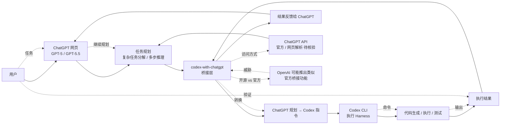

# XiaoDuoYa/codex-with-chatgpt

## 一句话定位
ChatGPT ↔ Codex 桥接工具——ChatGPT thinks. Codex works. Use ChatGPT as the planning brain while keeping the Codex harness.，TypeScript，把 ChatGPT 网页作为规划大脑 + Codex CLI 作为执行 harness，是 OpenAI 双产品协同的"用户自研胶水层"。

## 它解决的问题
2026 年 OpenAI 提供两大产品：(a) **ChatGPT 网页**——GPT-5 / GPT-5.5 顶级规划能力，适合复杂任务的规划 / 分解 / 推理；(b) **Codex CLI**——OpenAI 官方 Coding Agent Harness，适合代码生成 / 执行。但两者割裂——ChatGPT 网页无法直接调用 Codex 执行代码，Codex CLI 缺乏 ChatGPT 网页的顶级规划能力。XiaoDuoYa/codex-with-chatgpt 直击这一痛点：(a) **ChatGPT as planning brain**——使用 ChatGPT 网页的规划能力；(b) **Codex as execution harness**——保持 Codex CLI 的代码执行能力；(c) **bridge layer**——把两者通过桥接层无缝衔接。这与 Anthropic Claude.ai ↔ Claude Code 之间的"用户自研胶水"模式（如各类 cc-bridge 工具）相似。

## 为什么值得关注
- **Stars:** 2,551（截至 2026-09-07），10 天净增，单日均速 ~255⭐/day
- **Forks:** 278（fork/star 10.9%，较高，反映真实开发者使用）
- **语言:** TypeScript 主导
- **OpenAI 双产品协同:** ChatGPT 网页 + Codex CLI 的用户自研桥接
- **用户自研胶水层:** 反映 OpenAI 用户对"双产品不互通"的不满
- **规划 + 执行分工:** ChatGPT 负责规划（顶级推理），Codex 负责执行（代码生成）

## 热度来源判断
codex-with-chatgpt 的热度来自三个趋势的交汇：(1) **OpenAI 双产品割裂**——ChatGPT 网页与 Codex CLI 之间无官方桥接；(2) **用户自研胶水层需求**——Anthropic Claude.ai ↔ Claude Code 也有类似问题，各类 cc-bridge 工具已验证需求；(3) **规划 + 执行分工**——顶级 LLM 规划 + Coding Agent 执行的组合是 2026 年主流模式。

10 天 2,551⭐ / fork/star 10.9% 与"OpenAI 用户群体 + 桥接刚需"特征一致。**提示：** OpenAI 官方可能推出 ChatGPT ↔ Codex 官方桥接（挤压 codex-with-chatgpt 空间）；XiaoDuoYa 是中国开发者个人项目，长期可持续性需观察。

## 关键技术亮点
1. **ChatGPT as planning brain:** 调用 ChatGPT 网页（GPT-5 / GPT-5.5）的规划能力——复杂任务分解 / 多步推理 / 上下文管理
2. **Codex as execution harness:** 保持 Codex CLI 的代码生成 / 执行能力——CLI 命令调用 / 文件编辑 / 测试运行
3. **Bridge layer:** 把 ChatGPT 规划输出转化为 Codex 可执行的指令
4. **TypeScript 主导:** 与 bridge tool 一致
5. **双产品协同:** OpenAI ChatGPT 网页 + Codex CLI 的协同
6. **开源 + 用户自研:** 反映用户对官方产品的补充需求

## 架构师速览

| 决策问题 | 研究判断 | 证据边界 |
|---|---|---|
| 系统边界 | ChatGPT ↔ Codex 桥接层——ChatGPT 作为规划大脑 + Codex 作为执行 harness | 边界由 trending 描述明示；具体桥接方式（API 调用 / 网页解析 / 消息队列）需 README 核验 |
| 主路径 | 用户任务 → ChatGPT 网页规划 → 输出任务分解 → 桥接层转化为 Codex 指令 → Codex CLI 执行 → 结果返回 ChatGPT 网页 → 继续规划迭代 | 主路径为描述语义抽象；ChatGPT 网页的访问方式（官方 API / 网页解析 / 浏览器自动化）需核验 |
| 关键权衡 | ChatGPT 顶级规划 vs Codex 执行能力 vs 桥接层延迟 / 错误率；用户自研胶水 vs OpenAI 官方可能推出类似功能 | 双产品分工由 trending 描述明示；具体桥接实现与延迟需 README 核验 |
| 最小 PoC | 安装 codex-with-chatgpt → 用户在 ChatGPT 网页提出复杂任务 → ChatGPT 规划 → 自动转化为 Codex 指令 → Codex 执行 → 结果反馈 → 验证任务完成度 | 安装命令需 README 独立核验；ChatGPT 网页访问的合规性需要核验（官方 API vs 网页解析） |

## 架构启发
codex-with-chatgpt 的核心启发是 **"AI 产品组合需要桥接层"**。当前 AI 巨头（OpenAI / Anthropic / Google）提供多个产品（聊天 / Agent / API），但产品之间缺乏官方桥接——用户需要"自研胶水"组合各产品的优势。codex-with-chatgpt 是 OpenAI 双产品（ChatGPT 网页 + Codex CLI）的桥接样本，与 Anthropic cc-bridge 工具共同构成"AI 产品组合桥接层"的趋势。更深层的启发是：**桥接层可能演化为"AI 工作流编排"产品**——类似 Zapier 之于 SaaS，桥接层可能成为 AI 产品组合的编排工具。

风险提示：**OpenAI 官方可能推出类似功能**——挤压 codex-with-chatgpt 空间；ChatGPT 网页访问的合规性——官方 API（合规）vs 网页解析（合规性存疑）；"planning brain" 的质量完全依赖 ChatGPT 模型，规划错误会传导到 Codex 执行层。

## 架构图（MMD）

> 证据边界：此图只采用本档案已有可核验描述；"待核验"节点不应视为项目实现事实。

## 定位判断
**工具型项目（ChatGPT ↔ Codex 桥接）。** XiaoDuoYa/codex-with-chatgpt 是 OpenAI 双产品协同的"用户自研胶水层"样本，10 天 2,551⭐ / fork/star 10.9% 显示该桥接需求真实。但作为独立产品的天花板：(a) OpenAI 官方可能推出类似功能（挤压空间）；(b) 桥接实现深度（ChatGPT 网页访问的合规性）；(c) 与 Anthropic cc-bridge 等其他桥接工具的差异化；(d) XiaoDuoYa 个人项目可持续性。当前定位是"OpenAI 双产品桥接头部样本"，向"AI 工作流编排平台"演进或聚焦 OpenAI 生态深度是两条路径。

## 风险/局限/泡沫点
- **OpenAI 官方可能推出类似功能:** 挤压 codex-with-chatgpt 空间
- **ChatGPT 网页访问合规性:** 官方 API（合规）vs 网页解析（合规性存疑）
- **"planning brain" 错误传导:** ChatGPT 规划错误会传导到 Codex 执行层
- **与 Anthropic cc-bridge 等竞争:** 跨 AI 产品桥接工具的差异化
- **XiaoDuoYa 个人项目:** 长期可持续性 / 治理结构未验证
- **ChatGPT 模型依赖:** 完全依赖 ChatGPT 模型（GPT-5 / GPT-5.5）的规划质量

## 与同类项目的关系
- **vs OpenAI 官方 ChatGPT ↔ Codex 桥接:** 官方未推出（截至 2026-09-07）；codex-with-chatgpt 是用户自研
- **vs Anthropic cc-bridge:** Anthropic Claude.ai ↔ Claude Code 的用户自研桥接工具（类似模式）
- **vs Zapier / n8n:** Zapier / n8n 是 SaaS 工作流编排；codex-with-chatgpt 是 AI 产品桥接
- **vs LangChain / LlamaIndex:** LangChain / LlamaIndex 是 LLM 应用框架；codex-with-chatgpt 是具体 AI 产品桥接
- **vs Traycerai/traycer:** traycer 是"Nerve Center for Agentic Coding"；codex-with-chatgpt 是 OpenAI 双产品桥接

## 是否值得持续跟踪
**值得跟踪（ChatGPT ↔ Codex 桥接）。** codex-with-chatgpt 代表了 OpenAI 双产品用户的桥接需求，与 Anthropic cc-bridge 等工具共同构成"AI 产品组合桥接层"趋势。建议关注：(a) OpenAI 官方是否推出类似功能；(b) 桥接实现的合规性（ChatGPT API vs 网页解析）；(c) 与其他 AI 产品桥接工具的差异化；(d) 是否演化为"AI 工作流编排平台"。对 OpenAI 重度用户，codex-with-chatgpt 是值得尝试的双产品桥接工具。

## 后续观察点
- OpenAI 官方是否推出 ChatGPT ↔ Codex 官方桥接
- 桥接实现合规性（ChatGPT API vs 网页解析）
- ChatGPT 规划质量 vs Codex 执行能力的协同效果
- 与其他 AI 产品桥接工具（Anthropic cc-bridge 等）的差异化
- 是否演化为"AI 工作流编排平台"
- XiaoDuoYa 个人项目的可持续性 / 治理结构

---
> 数据来源: GitHub API (2026-09-07) | Stars: 2,551 | Forks: 278 | License: 待核验 | 语言: TypeScript | 创建: 2026-08-28
