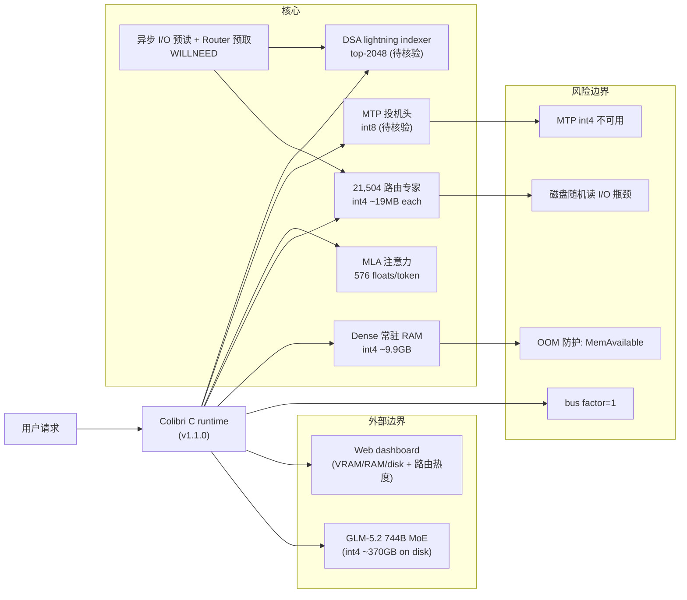

# Colibri

## 最近动态（2026-07-31）
- **Stars 暴涨至 21,218**（19 天从 7/12 的 3,850 飙至 21K，+17,368），forks 2,206，v1.1.0 已发布。
- 已扩展为多后端：CPU / CUDA / Metal / NUMA 共享同一 runtime，支持部分或全专家驻留。
- README 公开实测：6× RTX 5090 全专家驻留下 **4 tok/s、TTFT 1.6s、disk 0**（无需磁盘流式）；Web dashboard 实时展示 VRAM/RAM/disk 三级条与专家路由热度。
- 在今日"前沿 MoE 本地推理范式确立"趋势中作为代表，与 deltafin（K3 单机）同属"MoE 推理瓶颈是 I/O 而非 FLOPS"的范式家族。
- 证据边界：6×5090 仍是高门槛配置；单人项目（bus factor=1）；非 SLA 研究运行时，不应作生产推理方案。

---

## 一句话定位
纯C、零依赖的 GLM-5.2 744B MoE 推理引擎，在 25GB RAM 消费机上正确运行前沿大模型。

## 它解决的问题
前沿大模型（700B+参数）的推理通常需要数据中心级 GPU 集群。普通开发者无法在本地运行这类模型。Colibri 证明：利用 MoE 架构的稀疏激活特性 + 精巧的 I/O 工程化，可以在一台没有 GPU 的消费级机器上正确运行 744B 前沿模型。

## 为什么值得关注（2026-07-12 更新）

**Stars 暴涨**：从昨日 2,065 暴涨至 3,850（+87%），社区传播效应显著。核心原因可能是 Colibri 的 I/O-first 设计模式引发了广泛讨论。
这是2026年本地推理的工程标本。不是一个产品，而是一份"如何用工程智慧突破硬件限制"的参考实现。2400行C代码，无BLAS/无Python运行时/无GPU依赖，token级验证精确。每一个设计决策都有实测数据支撑。

## 热度来源判断
- **真实技术价值驱动**：C语言+大模型推理的组合本身就吸引底层工程师
- **GLM-5.2热度**：智谱的744B MoE模型自带流量
- **社区讨论质量高**：issue讨论MTP接受率、SSD热管理等实际工程问题
- **非炒作型增长**：10天2K star对于纯C项目是真实兴趣信号

## 关键技术亮点亮点

### 1. MoE 内存分层架构
- Dense部分（attention + shared experts + embeddings ~17B params）：常驻RAM，int4量化，9.9GB
- 路由专家（21,504个，每个~19MB int4）：存磁盘（~370GB），按需流式加载
- 每token激活~40B参数，仅~11GB变化（路由专家部分）

### 2. MLA注意力 + KV压缩
- 576 floats/token vs 标准32,768（57×压缩）
- GLM-5.2有64头无GQA，压缩更为关键
- MLA weight absorption（DeepSeek trick）：decode时无需per-token k/v reconstruction

### 3. MTP投机解码
- GLM-5.2自带的multi-token-prediction头（layer 78）做draft
- int8头：39-59%接受率，2.2-2.8 tokens/forward
- int4头：0-4%接受率（不可用），诚实标注
- 采样下无损（rejection sampling）

### 4. 异步专家预读 + Router预取
- 计算当前层专家时，I/O线程已用WILLNEED预读下一层
- PILOT实验功能：下层路由71.6%可预测，提前预取

### 5. DSA稀疏注意力
- GLM-5.2的lightning indexer：per-layer top-2048 causal key selection
- 可禁用（DSA=0）或自定义（DSA_TOPK）

### 6. 全验证 + 安全设计
- token级对比transformers oracle（TF 32/32, greedy 20/20）
- KV持久化崩溃安全（.coli_kv, ~182KB/token）
- RAM自动预算（MemAvailable → expert cache auto-size），不触发OOM killer

## 架构师速览

| 决策问题 | 研究判断 | 证据边界 |
|---|---|---|
| 系统边界 | 单进程 C 运行时：CPU/CUDA/Metal/NUMA 多后端共享 runtime，对外暴露 Web dashboard 实时展示 VRAM/RAM/disk 三级条与专家路由热度；输入为 GLM-5.2 744B MoE（仅 glm_moe_dsa 架构），输出为 token 流 | 多后端列表、Web dashboard、模型架构名称均在 README/档案中明列；具体 dashboard 协议、端口、鉴权未证 |
| 主路径 | 启动期将 Dense（attention + shared experts + embeddings ~17B，int4 ≈9.9GB）载入 RAM，将 21,504 个路由专家（每 ~19MB int4，共 ~370GB）置于磁盘；推理期按 token 激活 ~40B 参数，LRU + page cache 命中 RAM，缺失专家异步 fadvise WILLNEED 预读；decode 阶段由 GLM-5.2 自带 MTP 头（int8，39–59% 接受率）做投机，MLA weight-absorption 跳过 per-token k/v 重建，DSA（lightning indexer，per-layer top-2048）可选关停 | 路径节点均为档案明示的组件与数字；异步 I/O 线程模型与 page cache 行为细节需源码核验 |
| 关键权衡 | 以 I/O 取代 FLOPS 为瓶颈前提，用磁盘流式 + 预取换取 GPU 缺席的可行性；代价是冷启动 0.05–0.1 tok/s、370GB 磁盘与 NVMe 级随机读依赖、bus factor=1 的单人维护、以及 MTP 头被强制 int8（int4 接受率 0–4%） | 速度、磁盘、维护性、MTP 量化敏感性均在档案中明列；功耗、延迟抖动、SSD 寿命未测 |
| 最小 PoC | 在 6×RTX 5090 节点上拉取 v1.1.0，按 README 加载 GLM-5.2 int4 模型，观察 4 tok/s、TTFT 1.6s、disk≈0 的稳态；随后降至 25GB RAM + NVMe 单机配置，量化冷启动 tok/s 与磁盘随机读 iops 关系，再压降 MTP 关停、DSA 关停观察退化曲线 | 6×5090 数字与三项指标来自 README 自测；25GB RAM “可运行”仅档案定性，无官方基准；其余组合未在档案中给出 |

## 架构启发

**核心insight：MoE推理瓶颈是I/O不是FLOPS。** 当每token仅激活5%参数时，GPU算力大量闲置，真正的瓶颈变成"如何快速从磁盘读取需要的专家"。Colibri的I/O-first设计——专家流式加载 + LRU cache + OS page cache L2 + 异步预读 + router预取——是这个新范式的工程参考。

**对架构师的价值：** 随着MoE成为大模型主流架构（GLM-5.2、DeepSeek-V3等），推理基础设施的设计哲学需要从"算力优先"转向"I/O优先"。Colibri是这个转向的极端示例。

## 架构图（MMD）

> 证据边界：此图只采用本档案已有可核验描述；“待核验”节点不应视为项目实现事实。

## 定位判断
**研究型工程标本**，不是生产工具。它证明了"前沿大模型可在消费机正确运行"的工程路径，但速度限制（冷启动0.05-0.1 tok/s）使其更像概念验证。价值在于：被其他本地推理项目借鉴的I/O-first设计模式。

## 风险 / 局限 / 泡沫点
1. **速度硬伤**：冷启动0.05-0.1 tok/s，即使热缓存也只是"勉强可对话"级别
2. **磁盘空间门槛**：~370GB int4模型 + 需要NVMe级随机读性能
3. **单一模型**：仅支持GLM-5.2架构（glm_moe_dsa），泛化到其他MoE模型需额外工作
4. **单人项目**：主要贡献者JustVugg，bus factor = 1
5. **MTP头量化敏感**：int4 MTP头不可用（接受率0-4%），必须int8

## 与同类项目的关系
| 项目 | 定位 | 差异 |
|------|------|------|
| llama.cpp | 通用本地推理 | 支持多模型，但GLM-5.2 744B的MoE支持不如Colibri深 |
| Ollama | 本地推理产品化 | 用户体验好但对744B级模型无专门优化 |
| MLX | Apple Silicon推理 | 依赖Apple GPU，Colibri纯CPU+磁盘 |
| vLLM | 服务端推理 | GPU集群场景，定位完全不同 |

## 是否值得持续跟踪
**是。** Colibri代表MoE本地推理的工程前沿。即使项目本身不成长为平台，其I/O-first设计模式会被广泛借鉴。

## 后续观察点
1. 是否被llama.cpp/ollama等项目吸收其MoE流式加载设计
2. 社区是否为其贡献其他MoE模型的支持（DeepSeek-V3等）
3. SSD随机读性能提升（PCIe 5.0/6.0）是否会改变Colibri类项目的可用性
4. 是否出现基于Colibri思路的GPU加速版本（利用低成本GPU做专家计算）
5. GLM-5.2后续版本对Colibri设计的兼容性

---
*首次记录：2026-07-11*
