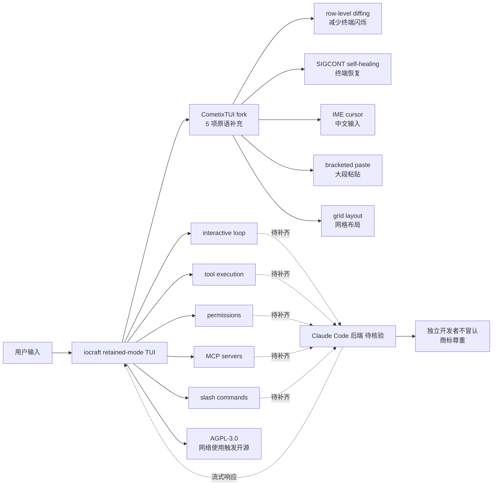

# Haleclipse/CometixCode

## 一句话定位
Anthropic 官方 Claude Code terminal UI 的 Rust 1:1 重实现 —— 用 Rust 2024 edition + iocraft retained-mode TUI framework + 自带 CometixTUI fork，把 TypeScript + React + Ink 的 TUI 按文件 1:1 映射到 Rust，并在 README 明示「Unofficial project, not affiliated with Anthropic」尊重商标。

## 它解决的问题
当前 Claude Code 周边工具的痛点是 **「Anthropic 官方 Claude Code 是 TypeScript + React + Ink 闭源 terminal UI + 用户不能修改 TUI + 不能改用自己 Rust 工具链 + 不能按自己审美定制 + 中文 IME 在 Ink 中卡顿 + 终端切换（SIGCONT）Ink 不能自愈」**。CometixCode 用「Rust 2024 + iocraft retained-mode TUI + 1:1 组件映射 + 自带 CometixTUI fork 补齐 iocraft 缺失原语（row-level diffing / SIGCONT / IME / bracketed paste / grid layout）+ 严肃 AGPL-3.0 + 不冒认 Anthropic 关联」是「Claude Code TUI 层重写 + Rust 生态 + 严肃许可 + 商标尊重」的具体路径。

## 为什么值得关注（2026-09-21）
- **Stars:** 325（截至 2026-09-21），1 天 325⭐，fork 17
- **License:** AGPL-3.0（GNU Affero General Public License v3.0；服务端网络使用触发开源 + 修改需公开）
- **语言:** Rust（Rust 1.88+ edition 2024）
- **活跃度:** created 2026-09-20，pushed_at 2026-09-20
- **规模:** 5919 KB（Rust + iocraft + CometixTUI fork + 完整 TUI 重写的中等规模）
- **Topics:** （空）
- **状态:** 「It is a work in progress. Large parts of the interactive loop, tool execution, permissions, MCP and slash commands are implemented; other areas are partial」诚实表态
- **归属:** README 明示「Unofficial project, not affiliated with Anthropic」+「Claude/Claude Code are trademarks of Anthropic, PBC」+「Nothing here is endorsed by or supported by Anthropic」

## 热度来源判断
CometixCode 的热度是 **「Claude Code TUI 层 Rust 重写 × 严肃 AGPL-3.0 × 1:1 组件映射 × iocraft retained-mode × CometixTUI 5 项原语补充 × 商标尊重 × 中文 IME 解决」** 的组合。当前 Claude Code 用户 / Rust 开发者 / 中文用户的痛点是「Claude Code 是 TypeScript 闭源 + 不能改 TUI + 中文 IME 卡顿」。一个 5919 KB Rust 项目 1:1 重写 + 严肃许可 + 商标尊重 + 中文 IME 解决 + 最低依赖无系统库无 pkg-config，自然爆火。**fork/star 5.2%** 与昨日 thruwire/foreman 6.4% 接近，反映「Rust 重写 + 严肃许可」的典型早期 fork 率特征——准备集成到 Claude Code 工作流的开发者 fork。热度**真实且具 Rust 生态价值**——但需警惕：未实现部分的补齐速度 + iocraft 多平台兼容性 + AGPL-3.0 与企业集成的兼容性 + 中文 IME 在多输入法的稳定性 + SIGCONT self-healing 在 macOS / Linux 终端切换的稳定性。

## 关键技术亮点
1. **Rust 2024 edition** ——最新 Rust 版本 + Rust 1.88+ 最低依赖
2. **iocraft retained-mode TUI framework** ——与 Ink 命令式渲染对应的声明式 retained-mode
3. **CometixTUI fork 5 项 iocraft 原始不支持能力** ——row-level diffing（减少终端闪烁）+ SIGCONT self-healing（终端恢复）+ IME cursor（中文输入）+ bracketed paste（大段粘贴）+ grid layout（网格布局）
4. **TypeScript 组件 → Rust 组件 1:1 映射** ——确保功能一致
5. **hook → hook 映射** ——确保 hooks 一致
6. **deliberate deviations 记录在源码里** ——避免二次发明轮子
7. **已实现核心交互链** ——interactive loop + tool execution + permissions + MCP + slash commands
8. **诚实表态进度** ——「other areas are partial」避免过度承诺
9. **最低依赖 Rust 1.88+** ——无系统库、无 pkg-config
10. **AGPL-3.0** ——文件级 copyleft + 网络使用触发开源 + 修改需公开（适合 SaaS 部署 + 严肃企业）
11. **独立开发者不冒认** ——README 明示「Unofficial project, not affiliated with Anthropic」+ 商标尊重
12. **5919 KB repo** ——Rust + iocraft + CometixTUI fork + 完整 TUI 重写的中等规模

## 架构师速览

| 决策问题 | 研究判断 | 证据边界 |
|---|---|---|
| 系统边界 | Claude Code TUI 的 Rust 1:1 重实现；Rust 2024 + iocraft retained-mode + CometixTUI fork 5 项原语补充 | 仅基于档案描述的 Rust 2024、iocraft、CometixTUI fork、1:1 映射、AGPL-3.0；具体 TUI 组件树、生命周期、状态管理未在档案中给出 |
| 主路径 | 用户输入 → iocraft retained-mode TUI → Claude Code 后端 → 流式响应 → CometixTUI row-level diffing 渲染 | 主路径为档案语义抽象；具体 iocraft 组件实现、Claude Code 后端协议、CometixTUI diffing 算法均待核验 |
| 关键权衡 | 1:1 映射保真度 vs Rust 习语重写 vs iocraft 原始能力不足 vs 中文 IME 解决 vs SIGCONT 自愈 vs AGPL-3.0 vs 未实现部分 | 档案明示 iocraft 5 项原语补充、1:1 映射、AGPL-3.0、未实现部分 4 项权衡；具体未实现部分清单、性能基准、AGPL-3.0 企业兼容性均待核验 |
| 最小 PoC | 在 macOS / Linux 终端拉起 CometixCode，确认 iocraft 渲染 + SIGCONT self-healing + 中文 IME cursor + 一段对话 + tool call + slash command 端到端可用 | PoC 范围、退出路径由档案「核心交互链已实现」建议推导；具体会话场景、UI 流畅度、未实现部分行为待核验 |

## 架构启发
CometixCode 的核心启发是 **「Anthropic 闭源 CLI 的 Rust 重写 + 严肃许可 + 商标尊重 + 中文 IME 解决 + 终端自愈 + 最低依赖」**。当前 Claude Code 周边工具的痛点是「TypeScript 闭源 + 不能改 TUI + 中文 IME 卡顿」。CometixCode 用「Rust 2024 + iocraft retained-mode + CometixTUI fork 5 项原语补充 + 1:1 映射 + AGPL-3.0 + 商标尊重」是「TypeScript 闭源 CLI 重写到 Rust 生态」的参考实现。更深层的启发是：**「Unofficial project, not affiliated with Anthropic」+「Claude/Claude Code are trademarks of Anthropic, PBC」是「不冒认 + 商标声明」工程化形式**——避免「开源项目借势官方品牌」的法律风险；**CometixTUI fork 5 项原语补充** ——row-level diffing + SIGCONT self-healing + IME cursor + bracketed paste + grid layout——是「Rust TUI 在中文 + 终端切换场景的关键工程化」；**AGPL-3.0 是「服务端网络使用 copyleft + 修改需公开」具体路径**——比 MIT / Apache-2.0 更强 copyleft，适合 SaaS 部署严肃企业。能否持续，取决于 iocraft 多平台兼容性 + TypeScript → Rust 1:1 映射的完整性 + 未实现部分的补齐速度 + AGPL-3.0 与企业集成的兼容性 + 中文 IME 在多输入法的稳定性。

## 架构图（MMD）

> 证据边界：此图只采用本档案已有可核验描述；"待核验"节点不应视为项目实现事实。

## 定位判断
**工具型项目（Claude Code TUI 层 Rust 重写）。** CometixCode 不仅是 Claude Code 替代，更试图成为「Claude Code 周边 Rust 生态入口」——类似 Zed 之于 VS Code 但聚焦 TUI 层。若成功，它会成为 Rust 生态内 Claude Code 用户的默认 TUI 选择，具有生态级价值。325⭐ + fork 17 + fork/star 5.2% + 5919 KB 已显示「Rust 重写 + 严肃许可 + 商标尊重」早期信号。但「生态化」取决于一个关键问题：未实现部分的补齐速度 + iocraft 多平台兼容性 + AGPL-3.0 与企业集成的兼容性 + 中文 IME 在多输入法的稳定性。目前定位是「Claude Code TUI 层 Rust 重写严肃工程化的早期样本」。

## 风险/局限/泡沫点
- **未实现部分补齐** ——README 明示「Large parts of the interactive loop, tool execution, permissions, MCP and slash commands are implemented; other areas are partial」；未实现部分的具体清单未公开
- **iocraft 多平台兼容性** ——iocraft 是 retained-mode TUI framework，在 Windows Terminal / iTerm2 / Linux 各终端的兼容性需验证
- **AGPL-3.0 企业兼容性** ——服务端网络使用触发开源，企业集成需评估
- **商标风险** ——「Claude Code」是 Anthropic 商标；不冒认但仍需关注 Anthropic 商标政策
- **个人维护** ——Haleclipse 个人维护，长期可持续性存疑
- **Anthropic 官方反制** ——Anthropic 可能发布官方 Rust 版本 / 强化 TUI 层 / 商标行动
- **CometixTUI fork 同步成本** ——5 项原语补充需跟进 iocraft 上游变化

## 与同类项目的关系
- **vs Anthropic 官方 Claude Code:** Claude Code 是 TypeScript + React + Ink 闭源；CometixCode 是 Rust + iocraft 开源 AGPL-3.0，1:1 重写
- **vs 其他 Claude Code Rust 重写:** 多为 SDK / API client 重写；CometixCode 是 TUI 层 1:1 重写
- **vs 通用 TUI framework（ratatui / cursive / tui-rs）:** 通用 TUI framework 缺少 iocraft 的 retained-mode + 组件树；CometixCode 通过 iocraft 补齐
- **vs Zed / Helix:** Zed / Helix 是完整编辑器；CometixCode 是 Claude Code TUI 层重写
- **vs kitze/skillbox:** skillbox 是 Skills 库；CometixCode 是 TUI 层重写，都属 Claude Code 周边

## 是否值得持续跟踪
**值得跟踪（Claude Code TUI 层 Rust 重写严肃工程化）。** CometixCode 代表了「TypeScript 闭源 CLI 重写到 Rust 生态 + 严肃许可 + 商标尊重 + 中文 IME 解决 + 终端自愈」的诉求，无论其本身成败，这一方向是行业趋势。建议关注：iocraft + CometixTUI 在多平台终端的兼容性 + TypeScript → Rust 1:1 映射的完整性 + 未实现部分的补齐速度 + AGPL-3.0 与企业集成的兼容性 + 中文 IME 在多输入法的稳定性 + SIGCONT self-healing 在 macOS / Linux 终端切换的稳定性 + Anthropic 商标政策。对 Rust 开发者，这个项目是 Claude Code TUI 层重写的严肃参考；对中文用户，CometixTUI 提供 IME cursor 解决 Ink 中文 IME 卡顿；对 Claude Code 生态观察者，它是「TUI 层重写」赛道的早期样本。

## 后续观察点
- iocraft 在 Windows Terminal / iTerm2 / Linux 各终端的兼容性
- 未实现部分的具体清单与补齐速度（interactive loop / tool execution / permissions / MCP / slash commands）
- AGPL-3.0 与企业集成的兼容性（是否能被商业产品 fork 并闭源修改）
- 中文 IME cursor 在拼音 / 五笔 / 仓颉等输入法的稳定性
- SIGCONT self-healing 在 macOS / Linux 终端切换（cmd + tab / workspace 切换）的稳定性
- Anthropic 商标政策变化与 CometixCode 的应对
- 个人维护可持续性（Haleclipse 是否建立社区 / 公司化）
- 与其他 Claude Code Rust 重写项目的协同

---
> 数据来源: GitHub API (2026-09-21) | Stars: 325 | Forks: 17 | License: AGPL-3.0 | 语言: Rust | 创建: 2026-09-20
