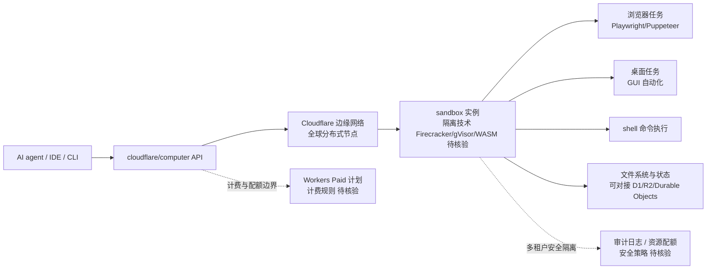

# cloudflare/computer

## 一句话定位
Cloudflare 官方开源的 "agent computer"——把 "给 agent 一台可远程操作的计算机" 从 demo 升级为云端可托管、可分发的运行时，让 AI agent 能在隔离沙箱中执行任意浏览器 / 桌面 / shell 任务。

## 它解决的问题
Anthropic 在 2024 年首次演示 "computer use"（让 Claude 操作屏幕），但实际部署面临：① 本地浏览器/桌面难以规模化（每用户一台 VM）；② 状态不持久、上下文难共享；③ 启动延迟高、安全审计薄弱。Cloudflare 的 computer 用云端 sandbox 把这个能力产品化：① 基于 Cloudflare 边缘网络，延迟与启动速度优于传统云 VM；② 沙箱隔离保证多租户安全；③ 与 Workers / D1 / R2 等 Cloudflare 生态原生集成。需求侧痛点是：**"computer use" 从 demo 到生产，需要一个"可被编排的云端运行时"，而不是每家公司自建 KVM / Firecracker**。

## 为什么值得关注（2026-08-22）
- **Cloudflare 官方开源**：非社区项目，是 Cloudflare 边缘计算战略的关键产品。
- **增长真实**：77 天 8,465⭐（GitHub API 可核验），TypeScript 实现。
- **战略位置**：与 Cloudflare Workers / D1 / R2 / Pages 同栈，是其"agent infra"象限的核心。
- **"computer use" 落地**：从 Anthropic demo 升级为厂商生产化产品，证明"computer use" 赛道已开始厂商竞争。

## 热度来源判断
**Cloudflare 品牌 × AI agent 浪潮 × 边缘计算差异化三重驱动。** Cloudflare 在 Workers / Durable Objects 上的积累让其有"边缘 sandbox"的工程基础——把 computer use 放边缘比 AWS / Azure 的传统 VM 启动快 10-100 倍。8k 星在 77 天达成，含品牌流量也含"agent 开发者想用现成 sandbox 而非自建" 的真实需求。但需警惕：**Cloudflare 在 AI infra 上的"开源 + 闭源 SaaS" 双轨策略**——开源版可能仅是边缘能力子集，完整能力需付费 Workers Paid 计划。

## 关键技术亮点
1. **云端 sandbox**：基于 Cloudflare 边缘网络的隔离沙箱，支持多租户并发。
2. **agent runtime**：把"computer use" 从本地桌面操作升级为云端可编排的运行时。
3. **TypeScript 实现**：与 Node 生态、Cloudflare Workers 同语言，开发者友好。
4. **生态集成**：与 Cloudflare Workers / D1 / R2 / Pages 同栈，可在同一控制台管理。
5. **边缘低延迟**：相比传统云 VM（启动 30-60 秒），边缘 sandbox 可在毫秒级启动。
6. **多模态 agent 支持**：浏览器、桌面、shell 任务都可在 sandbox 内执行。

## 架构师速览

| 决策问题 | 研究判断 | 证据边界 |
|---|---|---|
| 系统边界 | Cloudflare 边缘网络上的 agent computer sandbox，承担"computer use" 任务的运行时执行；与 Workers / D1 / R2 等 Cloudflare 生态共享底层资源但不替代通用应用托管 | 仅基于档案描述的 TypeScript 实现、Cloudflare 官方品牌、computer-use 定位；具体隔离技术（Firecracker / gVisor / WASM）、配额模型、计费规则均待核验 |
| 主路径 | agent 客户端调用 → Cloudflare 边缘 sandbox 启动 → 隔离执行（浏览器 / 桌面 / shell）→ 状态回写（可存 D1 / R2）→ agent 收到结果 | 主路径为档案语义抽象；具体调度、隔离、持久化、计费、审计机制均未披露 |
| 关键权衡 | 边缘低延迟优势 vs 单 sandbox 计算能力上限（边缘节点 ≠ 数据中心 VM）；开源版与商业版（Workers Paid）能力边界；agent 任务灵活性 vs 多租户安全隔离 | 均为推断；隔离技术、配额、计费、审计机制均待核验 |
| 最小 PoC | 用 cloudflare/computer 跑一个简单 browser-use 任务（如"打开网页 → 提取信息 → 截图"），记录启动延迟、执行时长、token 成本、审计日志；对比本地 Playwright/Selenium baseline 后评估生产化 | PoC 范围由档案"先验证基础能力、再扩面"原则推导；具体命令、配额、SLO 指标待核验 |

## 架构启发
cloudflare/computer 的启发是 **"agent runtime 正在被基础设施厂商化"**——"computer use" 不再是 Anthropic 的 demo，而是 Cloudflare、OpenAI、AWS 都在争夺的赛道。Cloudflare 的差异化在于"边缘 + sandbox + 生态" 三件套：边缘网络让 sandbox 启动快、低延迟；sandbox 隔离满足多租户需求；与 Workers / D1 / R2 同栈降低运维复杂度。这呼应了"基础设施总是赢家" 的旧命题——**当上层应用（agent）爆发时，掌握底层的厂商有定价权**。更深层启发：**"开源 vs 闭源" 的双轨策略**——开源版吸引开发者与生态，闭源 SaaS（Workers Paid）把生产价值变现。

## 架构图（MMD）

> 证据边界：此图只采用本档案已有可核验描述；"待核验"节点不应视为项目实现事实。

## 定位判断
**Agent Runtime / Computer Use 平台候选**。cloudflare/computer 是"agent infra" 赛道的厂商入场，与 OpenAI 的 computer use（嵌入 ChatGPT/Codex）、Anthropic 的 computer use（嵌入 Claude）形成不同象限：Cloudflare 卖"基础设施"（sandbox + 边缘网络 + 生态），OpenAI / Anthropic 卖"应用"（带模型的 IDE/聊天）。8k 星在 77 天达成，体现厂商战略 + 开发者关注的双重热度，但**生产化前需评估**：① 隔离等级是否满足企业合规（金融、医疗、政府）；② 配额与计费是否经济（高频 agent 任务可能成本高）；③ 与其他 agent runtime（OpenAI computer use、AWS Bedrock AgentCore）的竞争与互补。

## 风险 / 局限 / 泡沫点
- **厂商锁定风险**：与 Cloudflare Workers / D1 / R2 深度绑定，迁移成本高。
- **隔离等级合规边界**：金融/医疗等强监管场景对 sandbox 隔离等级有严格认证要求，Cloudflare 是否通过 SOC2 / HIPAA / PCI-DSS 等认证待核验。
- **单 sandbox 计算能力限制**：边缘节点 ≠ 数据中心 VM，CPU/内存/磁盘配额可能限制复杂任务（视频处理、大型 ML 推理）。
- **计费透明度**：Workers Paid 计划的计费模型（请求数、CPU 时长、出口流量）对 agent 高频任务可能产生意外成本。
- **开源版 vs 商业版能力差异**：开源版可能仅是边缘能力子集，完整能力（持久化、跨区域、审计）需付费。
- **竞争对手压力**：OpenAI 的 computer use（嵌入 ChatGPT）、AWS Bedrock AgentCore、阿里云 / 腾讯云同类产品都在入场。

## 与同类项目的关系
- **vs Anthropic computer use（demo）**：Anthropic 演示"模型直接操作屏幕"；cloudflare/computer 提供"云端可托管的运行时"。
- **vs OpenAI Codex CLI / Claude Code**：harness 是 agent 的入口；cloudflare/computer 是 agent 的执行环境。两者互补。
- **vs AWS Bedrock AgentCore**：AWS 的 agent runtime，云端 VM 级别隔离；cloudflare/computer 是边缘 sandbox，启动快但计算能力小。
- **vs E2B / Modal / Replicate**：第三方 sandbox 平台；cloudflare/computer 是 Cloudflare 官方，与 Workers 生态同栈。
- **vs 本地 Playwright / Selenium**：本地浏览器自动化；cloudflare/computer 是云端版本，可扩展但有延迟与隔离差异。

## 是否值得持续跟踪
**值得跟踪（agent runtime 厂商竞争风向标）**。cloudflare/computer 是 Cloudflare 把"computer use" 从概念升级为产品的关键动作，标志边缘厂商正式进入 agent infra 赛道。建议关注：① 隔离等级认证（SOC2、HIPAA、PCI-DSS）；② 配额与计费模型透明度；③ 与 OpenAI / Anthropic computer use 的对比与互操作。对 agent 开发者：可作为"低延迟 sandbox 替代品" 在 PoC 场景试用，但生产化前需评估合规与成本。对云厂商观察者：这是"agent runtime 厂商化"加速的信号——AWS / Azure / 阿里云的应对动作值得跟踪。

## 后续观察点
- 隔离等级认证进度（SOC2 / HIPAA / PCI-DSS）
- 单 sandbox 计算能力扩展（CPU / 内存 / 磁盘）
- 开源版与 Workers Paid 计划的能力差异边界
- 与 OpenAI / Anthropic / AWS agent runtime 的互操作性
- 计费透明度（请求数 / CPU 时长 / 出口流量）的清晰文档

---
> 数据来源: GitHub API (2026-08-22) | Stars: 8,465 | Language: TypeScript | 创建: 2026-06-05 | Cloudflare 官方开源