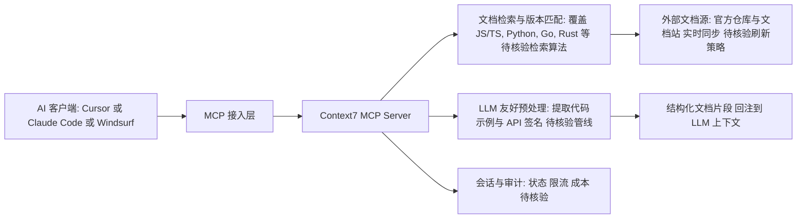

# upstash/context7

## 一句话定位
为 LLM 和 AI 代码编辑器提供"最新版"代码文档的上下文服务平台——通过 MCP（Model Context Protocol）让 Cursor、Claude Code 等工具获取实时的、版本正确的库文档，而非依赖过时的训练数据。

## 它解决的问题
LLM 训练数据有截止日期，对快速迭代的软件库（如 React 19、Next.js 15、LangChain 最新 API）经常产生"过时代码建议"。开发者发现 AI 给的代码用了已废弃的 API。Context7 通过 MCP 协议，让 AI 编辑器实时查询最新文档——AI 写代码时自动调用 Context7 获取正确的、当前版本的 API 用法，而非依赖可能过时的训练记忆。

## 为什么值得关注
- **Stars:** 60,381（截至 2026-08-07），增速极快
- **Forks:** 2,900
- **License:** MIT
- **活跃度:** pushed_at 2026-08-07（当日更新），极度活跃
- **创建时间:** 2025-03-26，一年多达到 6 万 stars
- **Watchers:** 156
- **Topics 命中:** mcp / mcp-server / vibe-coding / llm
- **商业支持:** Upstash（QStash、Redis Cloud 背后的公司）出品

## 热度来源判断
Context7 的热度是**"Vibe Coding"浪潮 + MCP 生态爆发 + 真实开发者痛点**三重驱动。2025 年 Cursor、Windsurf、Claude Code 等 AI 编辑器爆发，开发者发现"AI 写的代码用了旧 API"是最高频痛点。Context7 精准解决此问题，且通过 MCP 标准协议无缝集成到所有 AI 编辑器。60K stars 增速极快，是真实需求驱动，非纯炒作。

## 关键技术亮点亮点
1. **MCP 原生:** 作为 MCP Server 实现，任何支持 MCP 的客户端（Cursor、Claude、Windsurf）即插即用
2. **版本感知:** 不仅提供文档，还提供特定版本的 API 差异
3. **预处理文档:** 文档经过 LLM 友好的预处理（提取代码示例、API 签名），而非原始 Markdown 灌入
4. **多语言覆盖:** 支持 JS/TS、Python、Go、Rust 等主流语言的库文档
5. **实时更新:** 文档源跟随官方仓库/文档站自动同步
6. **检索优化:** 针对"AI 查询"优化的检索（按 API 名称、功能场景），而非全文搜索

## 架构师速览

| 决策问题 | 研究判断 | 证据边界 |
|---|---|---|
| 系统边界 | Context7 是面向 AI 编辑器（Cursor、Claude Code、Windsurf）的 MCP 文档上下文服务，提供库文档的实时检索；档案未给出源码级组件命名与部署形态。 | 仅基于 README 与公开描述中的"mcp-server / documentation / code-context"标签及"MCP Server"实现声明；内部模块名、传输协议、存储栈未披露。 |
| 主路径 | 主路径为：AI 客户端经 MCP 拉取 → Context7 检索版本化文档 → 返回经 LLM 友好预处理的代码示例与 API 签名给客户端注入到 LLM 上下文。 | 路径描述仅来自项目自述"版本感知""预处理文档""实时更新"等表述；具体检索算法、缓存层、预处理管线待源码核验。 |
| 关键权衡 | 跨编辑器标准覆盖（MCP） vs MCP 协议演进不确定性；长尾/私有库覆盖广度 vs 文档质量受制于源头站点。 | 权衡源自档案"风险/局限"段中 MCP 生态不确定性、文档覆盖广度、质量依赖源头三点；性能、成本、供应商耦合未量化。 |
| 最小 PoC | 用支持 MCP 的客户端（Cursor / Claude Code / Windsurf 任一）接入 Context7，针对 React 19 或 Next.js 15 等档案点名的高迭代库验证：能否返回当前版本 API、是否含代码示例与签名、是否随源站更新。 | 接入方式、客户端配置细节、是否需 API key 均未在档案中说明，标为"待核验"。 |

## 架构启发
Context7 的核心启发是 **"LLM 的知识应该外置，且按需检索"**。这本质上是"RAG for Code Docs"，但关键是：(1) 走 MCP 标准而非私有 API；(2) 文档经过"LLM 友好预处理"而非原始灌入。这种"AI 时代的 DevDocs"模式正在成为 AI 编程工具链的基础设施层。启发是：**任何"易过时"的领域知识，都值得做一层"实时上下文服务"**。

## 架构图（MMD）

> 证据边界：此图只采用本档案已有可核验描述；“待核验”节点不应视为项目实现事实。

## 定位判断
**平台型基础设施候选。** Context7 定位为"AI 编程工具链的文档上下文层"。它不与 Cursor/Claude 竞争，而是作为它们的"文档后端"。这是经典的"平台化"定位——成为 AI 编辑器生态的共享基础设施。

## 风险/局限/泡沫点
- **MCP 生态不确定性:** MCP 标准仍在演进，版本变化可能影响兼容
- **文档覆盖广度:** 长尾库/私有库文档覆盖有限
- **质量依赖源头:** 文档质量取决于原始文档站，难以保证一致性
- **竞争:** Cursor 自建文档索引、Continue.dev 等可能内置类似功能
- **成本:** 实时文档预处理和检索需要基础设施投入
- **"最新"≠"正确":** 最新版文档也可能有 bug，AI 需结合判断

## 与同类项目的关系
- **vs Cursor 内置索引:** Cursor 自建文档索引是私有方案；Context7 通过 MCP 成为跨编辑器标准
- **vs DevDocs (freeCodeCamp):** DevDocs 是人类用的文档聚合；Context7 为 AI 优化
- **vs Continue.dev:** Continue 是开源 AI 编程助手，部分功能重叠但定位不同
- **vs Mendable:** Mendable 做"AI 文档问答"，偏企业；Context7 偏开发者工具链
- **vs RAG (通用):** 通用 RAG 需自建；Context7 是"文档领域的专用 RAG 服务"

## 是否值得持续跟踪
**值得重点跟踪。** Context7 是 MCP 生态中最成功的应用之一，也是"AI 编程工具链基础设施"的代表。它的发展反映 MCP 标准的采用情况和 AI 编程工具的演进方向。

## 后续观察点
- 是否被主流 AI 编辑器（Cursor、GitHub Copilot）默认集成
- MCP 协议标准化进展对 Context7 的影响
- 是否扩展到非编程领域（如产品文档、API 文档、运维 Runbook）
- 商业化模式（Upstash 是否推出付费版/企业版）
- 文档覆盖广度（从主流库扩展到长尾生态）

---
> 数据来源: GitHub API (2026-08-07) | Stars: 60,381 | Forks: 2,900 | License: MIT
