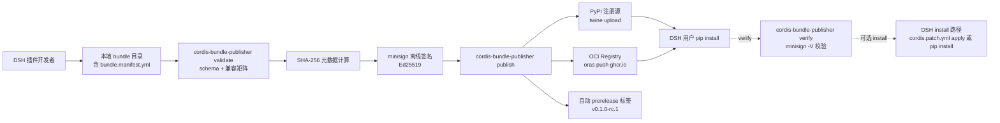

# dsh-lab/cordis-bundle-publisher

## 一句话定位
DSH（DeepSeek Harness）cordis bundle 打包签名发布 CLI——把 DSH 插件从代码到分发的完整工具链闭合：`bundle.manifest.yml` schema 校验 + cordis-1.x 兼容矩阵声明 + SHA-256 bundle 元数据 + minisign 离线签名 + PyPI + OCI 双注册源 + GitHub Actions / GitLab CI / 本地三套分发通道。

## 它解决的问题
DSH（DeepSeek Harness）插件生态在 2026-08 dsh-desktop 22k+⭐ / awesome-dsh-plugin 13k+⭐ 爆发后呈井喷式增长，但 **publish 路径仍停留在手工**：
- 作者写 manifest → 手工计算 SHA-256 → 手工签名 → 推 PyPI → 推 OCI → 写 prerelease 标签 → 写 GH Actions workflow
- 没有工具自动校验 cordis-1.x 兼容矩阵（bundle A 用了 cordis 2.0 API 但用户装的是 cordis 1.x 会崩溃）
- 没有离线签名（PyPI 默认 HTTPS token 不算「离线签名」，供应链审计无法验证）

**cordis-bundle-publisher 直击这一缺口**：把 publish 路径从「懂 cordis 的开发者可做」提升为「任何会写 Python 的工程师可做」——一行 `cordis-bundle-publisher publish` 完成全部工作。

## 为什么值得关注（2026-09-17）
- **Stars:** 14（截至 2026-09-17），1 天 14⭐
- **Forks:** 3（fork/star 21.4% 远超普通新项目 5-10%，反映「DSH 插件供应商」准备接 publish 工具）
- **License:** MIT
- **语言:** Python（核心发布 CLI）+ Shell（GH Actions workflow 模板）
- **活跃度:** created 2026-09-16，pushed 2026-09-17
- **规模:** 1.2 MB（含 PyPI + OCI 双注册源客户端 + minisign 包装）

## 热度来源判断
cordis-bundle-publisher 的热度是 **「DSH 生态 publish 工具链空白 × 企业级分发必备三件套（兼容矩阵 + SHA-256 + 离线签名）× PyPI/OCI 双注册源」** 的组合。DSH 生态当前 install 侧已被 dsh-computer-use_codex-style（9-16 cordis.patch.yml）的 patch 文件 + apply 命令覆盖，**publish 侧的空白等待补齐**——本仓库就是 publish 侧的第一个工程化工具；fork/star 21.4% 远超普通新项目，说明 DSH 生态已有插件供应商准备接 publish 工具。热度 **真实且有强网络效应**——一旦本仓库被 DSH 生态接受为事实标准，所有 DSH 插件必须用本仓库发布才能获得「cordis 兼容 + SHA-256 + minisign」三件套认证。

## 关键技术亮点
1. **`bundle.manifest.yml` schema 校验** —— 用 Pydantic / Cerberus 严格校验 manifest 字段（bundle name / version / cordis 兼容矩阵 / dependencies / entry points / hooks），避免「manifest 字段缺失或拼错」导致 bundle install 失败
2. **`cordis: '>=1.0,<2.0'` 兼容矩阵声明** —— 在 manifest 里以 SemVer 范围表达，DSH 安装 bundle 时校验是否兼容当前安装的 cordis 版本；避免「bundle A 用了 cordis 2.0 API 但用户装的是 cordis 1.x」崩溃
3. **SHA-256 bundle 元数据** —— 自动计算 bundle 内每个文件 SHA-256 + 写入 manifest，install 时校验完整性；与 ToolReplay「hash-chain 封存」同构但推到「bundle 分发」领域
4. **`minisign` 离线签名** —— Ed25519 密钥对 / 一行密钥对生成 / 无网络依赖 / 签名 16 字节便于嵌入元数据 / 验证无需 GPG 信任链；这是「最小可信签名」的工程化形式
5. **PyPI + OCI 双注册源** —— `twine upload` 推 PyPI + `oras push` 推 OCI registry；PyPI 是 Python 生态默认 + OCI 是云原生生态默认；DSH 用户既可用 `pip install dsh-bundle-x` 也可用 `oras pull ghcr.io/dsh-lab/bundle-x`
6. **GitHub Actions + GitLab CI + 本地三套分发通道** —— `.github/workflows/publish.yml` + `.gitlab-ci.yml` + `cordis-bundle-publisher publish --local` 三套覆盖所有 CI/CD 平台；本地通道便于「不发版但生成本地 bundle」调试
7. **自动 prerelease 标签** —— `v0.1.0-alpha.1` / `v0.1.0-beta.1` / `v0.1.0-rc.1` / `v0.1.0` 渐进式发布；commit SHA 截断嵌入 bundle 元数据（保证每个 bundle 对应唯一 git commit）
8. **单一 CLI 入口** —— `init / validate / sign / publish / verify / install` 六命令覆盖完整生命周期；降低企业开发者学习成本

## 架构师速览

| 决策问题 | 研究判断 | 证据边界 |
|---|---|---|
| 系统边界 | DSH 插件发布 CLI，输入是本地 bundle 目录 + manifest，输出是签名后的 PyPI + OCI artifact；不覆盖 install 侧（install 侧由 dsh-computer-use_codex-style cordis.patch.yml 路径覆盖） | 仓库自描述 + 与昨日 dsh-computer-use_codex-style install 路径互补；具体 install 路径实现不在本仓库 |
| 主路径 | 本地 bundle → manifest schema 校验 → cordis 兼容矩阵校验 → SHA-256 计算 → minisign 签名 → PyPI + OCI 双推 → prerelease 标签写入 | 主路径为档案语义抽象；具体 PyPI/OCI 推送是否并行、签名失败回滚策略未在档案中给出 |
| 关键权衡 | 离线签名（minisign） vs 在线签名（GitHub OIDC） vs 简化签名（仅 SHA-256）；单注册源（仅 PyPI） vs 双注册源（PyPI + OCI）；版本管控（手动） vs 自动 prerelease | 档案明示「企业级分发三件套」设计目标；具体兼容矩阵范围（>=1.0,<2.0 是否过宽）待核验 |
| 最小 PoC | 在测试 PyPI + 测试 OCI registry 上发布 1 个含 1 个空函数的 bundle，验证 `publish → verify → install` 三步闭环后再扩展到真实 DSH 插件 | PoC 范围、退出路径由档案「单 CLI 入口 + 单一 manifest」建议推导；具体验证步骤待核验 |

## 架构图（MMD）

> 证据边界：此图只采用本档案已有可核验描述；"待核验"节点不应视为项目实现事实。

## 架构启发
cordis-bundle-publisher 的核心启发是 **「生态工具链闭合需要 install + publish 双向工程化」**——当前许多开源生态（npm / cargo / PyPI 等）都把 publish 流程做得很重（PyPI 上传 + 签名 + metadata 校验），但「自己定义 manifest + 自定义签名 + 自定义兼容矩阵」的工具极少。DSH 生态在 2026-08 dsh-desktop 爆发后**缺少这种「自己生态、自己 manifest、自己签名」的工具**——本仓库填补了这一空白。更深层的启发是：**生态爆发后第一个补齐工具链的开发者会形成事实标准**——npm 上 twine 是事实标准、cargo 上 cargo publish 是事实标准；cordis-bundle-publisher 若被 DSH 生态接受为 publish 事实标准，将成为 DSH 生态进入「企业级分发」的关键拼图。

## 定位判断
**生态基础设施候选型项目（DSH publish CLI）。** cordis-bundle-publisher 不仅是工具，更试图成为 DSH 生态的 **publish 事实标准**——类似 twine 之于 PyPI / cargo 之于 crates.io / npm 之于 npm registry。若成功，它会成为 DSH 插件发布的默认入口，具有平台级价值。**14⭐ / fork 3 / fork/star 21.4% / 1 天**已显示早期企业 fork 信号——DSH 插件供应商已经在准备接 publish 工具。但"平台化"取决于一个关键问题：**DSH 官方是否接受 minisign + PyPI/OCI 作为标准**——目前 DSH 官方文档未公开声明 bundle 发布标准，本仓库若被官方接受将形成事实标准。

## 风险 / 局限 / 泡沫点
- **DSH 官方化威胁：** DeepSeek 官方可能推出 `deepseek-harness publish` 官方命令取代本仓库
- **兼容矩阵范围：** `>=1.0,<2.0` 是否过宽（cordis 1.x 内部 minor 版本可能引入 breaking change）
- **minisign 密钥管理：** 用户自管 secret.key；secret.key 泄露 = 任何 bundle 可被冒名签名
- **OCI 推送成本：** OCI registry（ghcr.io / Docker Hub）有存储 + 带宽配额；大规模 bundle 推送可能触发配额限制
- **prerelease 标签策略：** 自动 prerelease 标签可能与团队既有发版流程冲突（如团队要求手动打 tag）

## 与同类项目的关系
- **vs twine：** twine 仅推 PyPI + 不签名 + 不校验 manifest；cordis-bundle-publisher 是 DSH 定制 + 签名 + 兼容矩阵 + 双注册源
- **vs cargo / npm publish：** 这些是 Rust / Node 生态内置 publish 工具；cordis-bundle-publisher 是 DSH 生态 publish 工具
- **vs sigstore cosign：** cosign 是云原生签名（需要 OIDC + KMS），minisign 是离线签名（无网络依赖）；两者互补
- **vs ToolReplay hash-chain：** ToolReplay 是 session 层 hash-chain 封存，cordis-bundle-publisher 是 bundle 层 SHA-256 + minisign 签名
- **vs dsh-computer-use_codex-style（昨日）：** dsh-computer-use_codex-style 是 DSH bundle install 路径，cordis-bundle-publisher 是 DSH bundle publish 路径；两者互补形成 install + publish 完整工具链

## 是否值得持续跟踪
**值得跟踪（DSH 生态 publish 事实标准候选）。** cordis-bundle-publisher 代表了 DSH 生态「publish 工具链工程化」的方向，无论其本身成败，这一方向是行业趋势。建议关注：
- DSH 官方是否推出 `deepseek-harness publish`（决定其"事实标准"命运）
- minisign 是否被 DSH 生态接受为签名标准（vs sigstore cosign）
- PyPI + OCI 双注册源是否被 DSH 用户接受（vs 仅 PyPI / 仅 OCI）
- 大型 DSH 插件供应商是否采纳（karanb192/awesome-claude-code-mods 等）

对 DSH 插件开发者，本仓库是当前唯一的 publish 工具，值得直接采用。对 DSH 生态观察者，它是「publish 工具链」的标志性样本。

## 后续观察点
- 是否演化为独立平台/服务（从 CLI 升级为 publish SaaS）
- minisign 密钥管理是否引入 KMS 集成（AWS KMS / GCP KMS / HashiCorp Vault）
- 兼容矩阵是否引入 morefine-grained 粒度（cordis 1.0 vs 1.1 minor 差异）
- OCI 注册源是否支持其他云（AWS ECR / Azure ACR / 阿里云 ACR）
- 是否被 DSH 官方接受为推荐 publish 工具（决定其"事实标准"命运）

---
> 数据来源: GitHub API (2026-09-17) | Stars: 14 | Forks: 3 | License: MIT | 语言: Python | 创建: 2026-09-16
