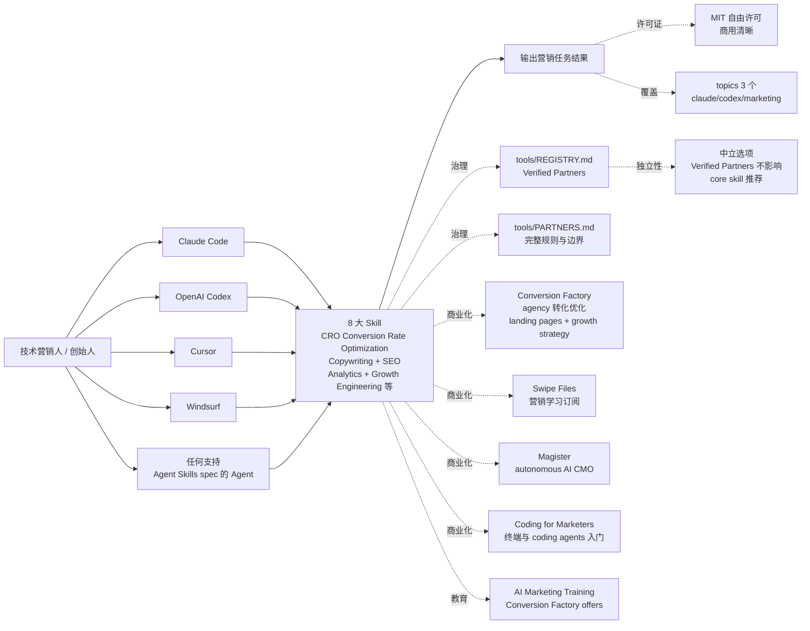

# coreyhaines31/marketingskills

## 一句话定位
Marketing Skills for AI Agents——一个 AI Agent 营销技能库，涵盖 8 大 Skill（CRO Conversion Rate Optimization / Copywriting / SEO / Analytics / Growth Engineering 等），同时兼容 Claude Code / OpenAI Codex / Cursor / Windsurf 以及任何支持 Agent Skills spec 的 Agent，附 `tools/REGISTRY.md` + `tools/PARTNERS.md` 治理边界，Verified Partners 不影响 core skill 推荐，MIT 开源。

## 它解决的问题
2026 年 AI Agent 在营销任务上的能力严重不足——开发者能为 Coding Agent 写代码、写测试，但很少有现成的「营销 Skill 库」可装载，导致 AI Agent 在 CRO / 文案 / SEO / Analytics / Growth Engineering 等营销场景需要从零写 skill，且不同 Agent 的 skill 格式互不兼容。Marketing Skills for AI Agents 直击这一痛点：它提供 **8 大 Skill + 4 Agent 全兼容 + tools/REGISTRY.md + tools/PARTNERS.md 治理** 的营销技能库，让技术营销人和创始人能在 Claude Code / Codex / Cursor / Windsurf 等任意 Agent 中直接装载营销能力。解决的是 **「AI Agent 营销技能缺失、跨 Agent 不兼容、SaaS 营销工具闭源」** 的痛点。

## 为什么值得关注（2026-10-05）
- **Stars:** 53,021（截至 2026-10-05），9 个月突破 5.3 万
- **Forks:** 7,915（fork/star 14.9% 表明极高贡献活跃度）
- **License:** MIT，商用清晰
- **语言:** JavaScript（含 8 大 Skill + 4 Agent 适配层 + REGISTRY.md + PARTNERS.md）
- **规模:** 4,621 KB
- **活跃度:** created 2026-01-15，pushed_at 2026-10-03，持续高活跃
- **覆盖:** Claude Code / OpenAI Codex / Cursor / Windsurf + 任何支持 Agent Skills spec 的 Agent
- **背书:** Corey Haines（核心贡献者） + corey.co 主页 + Conversion Factory + Swipe Files + Magister + Coding for Marketers 商业化生态
- **Topics:** 3 个覆盖（claude / codex / marketing）

## 热度来源判断
marketingskills 的热度是 **「AI Agent 营销技能缺失刚需 × 8 大 Skill 覆盖广度 × 4 Agent 全适配 × Verified Partners 治理严谨 × MIT 商用清晰 × 商业化生态完整」** 的强劲组合。AI Coding Agent 是 2026 年最热赛道，但「营销技能」是少数人关注的方向——开发者写完代码还要做 CRO / 文案 / SEO / 增长，但很少有现成的 Skill 库。marketingskills 由 Corey Haines（核心贡献者，corey.co）背书 + Conversion Factory（agency）/ Swipe Files（订阅）/ Magister（autonomous AI CMO）/ Coding for Marketers（终端入门）商业化生态完整。fork 7,915（fork/star 14.9%）反映社区贡献者高度活跃。热度 **真实且具营销 AI 标准潜力**——但需警惕：8 大 Skill 在多营销场景的覆盖广度、Verified Partners 治理严谨度决定其能否成为营销 AI 标准。

## 关键技术亮点
1. **8 大 Skill 覆盖广度:** CRO（Conversion Rate Optimization）+ Copywriting + SEO + Analytics + Growth Engineering 等 8 大营销技能（README 描述）
2. **4 Agent 兼容性:** Claude Code / OpenAI Codex / Cursor / Windsurf 四大主流 Coding Agent 全兼容
3. **Agent Skills spec 扩展性:** 任何支持 Agent Skills spec（agentskills.io）的 Agent 都可兼容
4. **tools/REGISTRY.md 治理:** Verified Partners 注册表，列出所有获认证的合作伙伴工具集成
5. **tools/PARTNERS.md 治理:** 完整规则与边界文档，明示 Verified Partners 不影响 core skill 推荐
6. **Verified Partners 独立性:** vetted + disclosed tool integrations + listed alongside the neutral options + never influencing what the core skills recommend
7. **完整商业化生态:** Conversion Factory（agency 转化优化）+ Swipe Files（营销学习订阅）+ Magister（autonomous AI CMO）+ Coding for Marketers（终端与 coding agents 入门）+ AI Marketing Training（培训）

## 架构师速览

| 决策问题 | 研究判断 | 证据边界 |
|---|---|---|
| 系统边界 | AI Agent 的营销技能库；8 大 Skill + 4 Agent 适配层 + Agent Skills spec 扩展 + tools/REGISTRY.md + tools/PARTNERS.md 治理 | 仅基于 README 描述的 AI agent skills focused on marketing tasks + Claude Code / OpenAI Codex / Cursor / Windsurf + 任何支持 Agent Skills spec 的 Agent + 8 大 Skill + tools/REGISTRY.md + tools/PARTNERS.md + 商业化生态；具体 8 大 Skill 在多营销场景的覆盖广度、Agent Skills spec 在多 Agent 的兼容性未在档案中明示 |
| 主路径 | 技术营销人 / 创始人 → 装 skills（via Claude Code / Codex / Cursor / Windsurf）→ AI coding agent 用 skills 做 CRO / 文案 / SEO / Analytics / Growth Engineering → Verified Partners 不影响 core skill 推荐 → 升级到 Conversion Factory / Swipe Files / Magister / Coding for Marketers 商业化生态 | 主路径为档案语义抽象；具体 skills 在多 AI Agent 的安装流程、Conversion Factory / Swipe Files / Magister / Coding for Marketers 商业化生态在多用户的接受度未在档案中讨论 |
| 关键权衡 | 8 大 Skill 多营销场景覆盖广度 vs 单一营销深度 + 4 Agent 兼容性 vs 单 Agent 优化 + 任何支持 Agent Skills spec 的扩展性 vs 兼容性 + Verified Partners 不影响 core skill 推荐的独立性 vs Partner 商业化生态 + MIT 商用清晰 vs Conversion Factory / Swipe Files / Magister 商业 SaaS 边界；topics 3 个覆盖（claude/codex/marketing）的清晰度、corey.co 主页的活跃度、tools/PARTNERS.md 治理规则在多 Partner 的严谨度未在档案中讨论 | 档案明示 9 个月 53021⭐ + fork 7915 + fork/star 14.9% + topics 3 个覆盖（claude/codex/marketing）+ MIT + corey.co + Conversion Factory + Swipe Files + Magister + Coding for Marketers + tools/REGISTRY.md + tools/PARTNERS.md + Verified Partners funded the work + vetted + disclosed tool integrations + listed alongside the neutral options + never influencing what the core skills recommend |
| 最小 PoC | 在 Claude Code 或 Codex 上装 skills（按 Agent Skills spec 规范）；跑 1 个 CRO skill 验证 1 个营销场景；再切换到 Cursor / Windsurf 验证多 Agent 兼容性；最后用 tools/PARTNERS.md 检查 Verified Partners 是否影响 core skill 推荐 | PoC 范围由档案「8 大 Skill + 4 Agent + Verified Partners + MIT + 商业化生态」建议推导；具体 8 大 Skill 在多营销场景的覆盖广度、Verified Partners 治理严谨度未在档案中讨论 |

## 架构图（MMD）

> 证据边界：此图只采用本档案已有可核验描述；"待核验"节点不应视为项目实现事实。

## 架构启发
marketingskills 的核心启发是 **"AI Agent 的营销能力应该像 Linter 一样可装载，正如代码能力可装载"**。AI Coding Agent 的核心能力（写代码、写测试、写文档）已被 Skill 生态覆盖，但「营销能力」是少数人关注的方向——开发者写完代码还要做 CRO / 文案 / SEO / 增长，却要从零写 skill。marketingskills 把 8 大营销能力（按 Agent Skills spec）标准化，让技术营销人能在 Claude Code / Codex / Cursor / Windsurf 等任意 Agent 中装载。更深层的启发是：**Verified Partners 治理模式值得借鉴——「不因商业化影响 core skill 推荐」是把社区信任置于商业利益之上的工程化承诺**。Conversion Factory / Swipe Files / Magister / Coding for Marketers 商业化生态完整，但 README 明示 Verified Partners 不影响 core skill 推荐，这是罕见的「商业化但不污染核心」的严肃工程化范式。

## 定位判断
**AI Agent 营销技能候选标准项目。** marketingskills 不仅是一个 Skill 集合，更试图成为 AI Agent 的「营销技能标准」——类似 Anthropic Skills 之于 Claude Code。若成功，它会成为技术营销人和创始人在 Coding Agent 中默认装载的营销 Skill 库，具有生态级价值。9 个月 53021⭐ + fork 7915 + fork/star 14.9% 已显示真实严肃工程化信号。但"标准"取决于一个关键问题：Agent Skills spec 能否成为多 Agent 共识——若各 Agent 推出各自的 skill 标准（Claude Skills vs Codex Skills），marketingskills 的多 Agent 兼容性会成空话。目前定位是"AI 营销 Skill 领域的头部项目"，向 standard 演进是合理路径。

## 风险 / 局限 / 泡沫点
- **8 大 Skill 营销场景覆盖广度:** 8 大 Skill（CRO / Copywriting / SEO / Analytics / Growth Engineering 等）在多营销场景的覆盖广度未明示
- **Agent Skills spec 标准化:** 取决于 Agent Skills spec 是否成为多 Agent 共识，若各 Agent 推出各自的 skill 标准，多 Agent 兼容性成空话
- **Verified Partners 治理严谨度:** tools/PARTNERS.md 治理规则在多 Partner 的严谨度未明示
- **个人项目属性:** Corey Haines 个人维护，7915 forks 但核心治理仍集中，可持续性存疑
- **商业化 SaaS 边界模糊:** Conversion Factory / Swipe Files / Magister / Coding for Marketers 商业化生态与 MIT core skill 的边界模糊，潜在利益冲突
- **topics 3 个覆盖有限:** topics 仅覆盖 claude/codex/marketing，多 Agent 发现性可能受限

## 与同类项目的关系
- **vs Anthropic Skills:** Anthropic 官方 Skills 仓库；marketingskills 是第三方营销垂直 Skill 库
- **vs TopVitamin/agent-skills:** TopVitamin 个人 Codex Skill 集合；marketingskills 跨 4 Agent + 8 大 Skill 营销
- **vs Conversion Factory:** agency 转化优化服务；marketingskills 是 skill 开源版本，Conversion Factory 是商业 SaaS
- **vs Swipe Files:** 营销学习订阅服务；marketingskills 是 Skill 实现
- **vs Magister:** autonomous AI CMO 产品；marketingskills 是底层 Skill 库
- **vs ai-marketing-training:** 培训服务；marketingskills 是 Skill 实现

## 是否值得持续跟踪
**值得跟踪（AI 营销技能候选标准）。** marketingskills 代表了 AI Coding Agent「营销技能标准化」的诉求，无论其本身成败，这一方向是行业趋势。建议关注：Agent Skills spec 是否成为多 Agent 共识（决定其标准地位）、8 大 Skill 在多营销场景的覆盖广度（决定其实用价值）、Verified Partners 治理严谨度（决定其社区信任）。对技术营销人和创始人，marketingskills 是获取「AI Agent 营销能力」的实用 Skill 库，值得直接装载试用。对 AI 编程生态观察者，它是"AI 营销 Skill"赛道的头部样本。

## 后续观察点
- Agent Skills spec 是否在 Claude Code / Codex / Cursor / Windsurf 等多 Agent 全部采纳
- 8 大 Skill 在多营销场景的覆盖广度（CRO / Copywriting / SEO / Analytics / Growth Engineering 等）
- Verified Partners 治理严谨度（core skill 推荐独立性 vs 商业化生态）
- 是否演化为独立平台/网站（从 GitHub 仓库升级为营销 Skill 门户）
- 企业采用（团队是否将此作为 AI 营销技能统一来源）
- Corey Haines 个人治理 vs 基金会治理

---
*首次记录：2026-10-05*