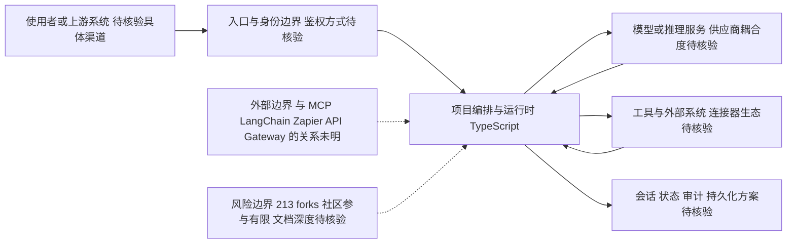

# corsairdev/corsair

## 一句话定位
AI Agent 的集成层（Your Agent's Integration Layer）——为 AI agent 提供与外部系统、数据和工具的统一连接中间件。

## 它解决的问题
AI agent 需要连接各种外部系统（数据库、API、SaaS 服务、文件系统），每个系统的接口、认证、数据格式都不同。直接在 agent 代码中写集成逻辑会导致代码膨胀、维护困难。Corsair 提供一个统一的集成层，让 agent 通过标准化接口连接各类系统，降低集成复杂度。

## 为什么值得关注
- **Stars:** 7,494 stars，agent 基础设施新赛道
- **Forks:** 213（fork 较少，可能更多是企业内部使用）
- **TypeScript 实现**，对全栈开发者友好
- **持续活跃**（2026-08-07 更新）
- 定位独特：不是 agent 框架，是 agent 的"集成层"
- 填补了 agent 与外部系统之间的中间件空白

## 热度来源判断
- **AI agent 集成刚需（高）**：agent 需要连接的工具越来越多
- **MCP 协议热潮（中高）**：agent 工具连接是热点话题
- **中间件理念回归（中）**：类似 ESB/API Gateway，但为 agent 设计
- **企业 AI 落地推动（中）**：企业需要标准化 agent 与内部系统连接

## 关键技术亮点亮点
1. **统一集成接口**：抽象各类外部系统的连接方式为统一模式
2. **Agent-native 设计**：为 AI agent 的请求模式（非确定性、多步推理）优化
3. **TypeScript 实现**：与主流 agent 框架（LangChain.js/Mastra）同语言栈
4. **中间件架构**：支持拦截器模式做认证、日志、转换
5. **连接器生态**：可能支持常见 SaaS（Slack/Notion/数据库等）的预置连接器

## 架构师速览

| 决策问题 | 研究判断 | 证据边界 |
|---|---|---|
| 系统边界 | 位于上游渠道、模型推理与外部系统/数据源之间的集成中间件层，统一抽象各类异构连接 | 仅基于档案"AI Agent 集成层"定位与 middleware/agent-integration 标签推导；具体协议（如 MCP/HTTP/gRPC）、部署形态与运行时细节未在档案中确认 |
| 主路径 | 请求 → 入口与身份 → 编排运行时 → 调用模型与工具 → 会话/状态/审计回写 | 路径结构来自档案架构师速览与架构启发节；连接器清单、鉴权方式与持久化方案待源码核验 |
| 关键权衡 | 扩展速度（连接器广度）vs 权限治理、可观测性与供应商耦合之间的平衡；与 MCP/通用 API 网关的边界划分 | 仅由"Agent-native 设计""中间件架构""与 MCP 关系不清"等表述推导；缺乏基准或生产案例量化证据 |
| 最小 PoC | 单入口 + 单模型 + 1~2 个最小权限工具，启用拦截器做认证/日志/审计，验证可观测与退出路径后再扩面 | 来自档案"采用建议"；具体连接器、权限模型与 SLO 指标在档案中未列，属待核验项 |

## 架构启发
- **Agent 需要专用集成层**：传统 ESB/iPaaS 不适合 agent 的动态请求模式
- **中间件分离关注点**：将集成逻辑从 agent 逻辑中分离，两者独立演进
- **Agent 时代的 API Gateway**：类似 Web 时代的 API Gateway，但为 agent 交互模式设计

## 架构图（MMD）

> 证据边界：此图只采用本档案已有可核验描述；“待核验”节点不应视为项目实现事实。

## 定位判断
**早期基础设施候选**。定位独特（agent 集成层），方向符合 agent 生态演进趋势。目前处于成长期，需要更多采用案例验证。

## 风险/局限/泡沫点
- **信息不透明**：描述简短，技术细节文档可能不足
- **与 MCP 的关系不清**：MCP 已经在做 agent 工具连接标准，Corsair 的差异化需明确
- **竞争模糊**：LangChain Tools、MCP servers、Zapier AI 等都在做类似事情
- **企业采用门槛**：中间件类产品需要深度集成，试错成本高
- **小团队维护**：213 forks 说明社区参与度有限

## 与同类项目的关系
- **vs MCP**：MCP 是协议标准，Corsair 可能是 MCP 的实现层/管理层
- **vs LangChain Tools**：LangChain Tools 嵌入框架，Corsair 独立部署
- **vs Zapier AI Actions**：Zapier 更偏 SaaS 集成平台，Corsair 更偏开发者基础设施
- **vs Kong/APISIX**：通用 API 网关 vs Agent 专用集成层

## 是否值得持续跟踪
**值得关注。** Agent 集成层是新概念，如果 MCP 生态成熟，这类中间件有存在的必要。但需等待更多技术细节和使用案例。

## 后续观察点
- 与 MCP 协议的关系定位
- 连接器生态系统建设情况
- 企业生产环境部署案例
- 是否支持非 TypeScript agent（Python 生态）
- 商业模式（开源+企业版？托管服务？）

---
> 数据来源: GitHub API (2026-08-07) | Stars: 7,494 | Forks: 213 | 语言: TypeScript
