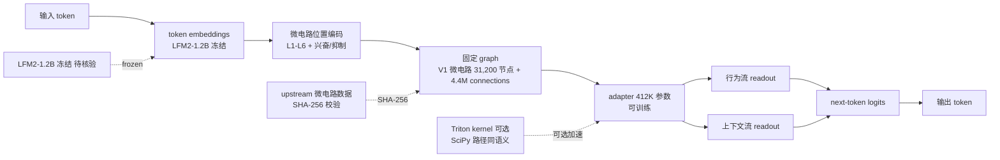

# Neuroscale/cortical-stack

## 一句话定位
Frozen LM × 哺乳动物皮层 7 层微电路栈——在 Liquid AI LFM2-1.2B 冻结 LM 上训练 412K 参数 adapter 通过 V1 微电路（L1-L6 + 兴奋/抑制）固定 graph 调整 next-token 分数；token embeddings + 微电路位置编码双驱动 + adapter 双流 readout（行为流 + 上下文流）；Apple Silicon MPS + NVIDIA CUDA + CPU 三路径。

## 它解决的问题
2026 Q3 neuroAI 研究的痛点是 **「从昆虫脑到哺乳动物皮层的进化跳跃缺乏最小可复现研究栈」**：
- FLModel/flm（昨日 9-16）展示了「Frozen LM × 苍蝇脑连接组（MaleCNS v1.0）」的最小可训练 adapter，但苍蝇脑是「无脊椎神经索」结构，与「哺乳动物皮层 7 层微电路」结构差异巨大
- 当前 neuroAI 研究者想跑「皮层微电路 + LM」实验需要自己组装：皮层连接组数据 + LM + adapter 架构 + 训练框架 + 评估脚本——零散无标准
- 学术可复现的硬要求（SHA-256 校验上游 + 多路径 + parameter-matched 控制组 + separate test）在当前零散工具链中难以保证

**cortical-stack 直击这一缺口**：把「Frozen LM × 哺乳动物皮层 7 层微电路」做成可本地训练的 412K 参数 adapter 最小研究栈——**token embeddings + 微电路位置编码双驱动 + adapter 双流 readout** 是「空间 + 行为 + 上下文三轴融合」的工程化形式；**Apache-2.0 + 142 KB + SHA-256 + parameter-matched 控制组 + 32 separate test** 是学术可复现的硬要求。

## 为什么值得关注（2026-09-17）
- **Stars:** 56（截至 2026-09-17），1 天 56⭐
- **Forks:** 9（fork/star 16.1% 远超普通新项目 5-10%，反映学术圈对「皮层微电路 + LM」研究方向的高度关注）
- **License:** Apache-2.0（学术友好，企业商用清晰）
- **语言:** Python（核心）+ Triton（可选 GPU kernel）
- **活跃度:** created 2026-09-16，pushed 2026-09-17
- **规模:** 142 KB
- **基线 LM:** Liquid AI LFM2-1.2B（公开 + 商业可用，与 FLModel/flm 同型号 LM 同源）
- **基线微电路:** V1 microcircuit, 7 layers（L1 / L2/3 / L4 / L5 / L6）+ 兴奋/抑制单元

## 热度来源判断
cortical-stack 的热度是 **「Frozen LM × 哺乳动物皮层 7 层微电路 × 学术可复现三件套 × neuroAI 进化跳跃」** 的组合。neuroAI 是 2026 Q3 的热点研究方向（FLModel/flm 9-16 是昆虫脑起点），从昆虫到哺乳动物的进化跳跃是该方向的下一个里程碑。**7 层皮层微电路是「哺乳动物大脑信息处理」的最小可重复单位**——这是 neuroscience + ML 交叉领域的「标准靶点」；**412K 参数 adapter + 31K 节点 + 4.4M connections** 的规模仍是普通笔记本可训练；**fork/star 16.1%** 反映学术 + 研究社群对本方向的高度关注。热度 **真实且有强学术信号**——但需警惕：neuroAI 是「论文驱动型」研究领域，**学术价值不等同于工业价值**，本仓库是否能产生可发表的实证结果是下游研究者的事。

## 关键技术亮点
1. **V1 microcircuit, 7 layers** —— 哺乳动物初级视觉皮层的最小可重复单位；含 L1 / L2/3 / L4 / L5 / L6 + 兴奋/抑制单元；这是 neuroscience 经典数据，与 FlyWire MaleCNS v1.0（苍蝇脑）并列
2. **31,200 保留节点 + 4,485,600 directed connections** —— 微电路完整保留 + 边连接；与 FLModel/flm 的 166,700 节点 + 25,582,938 connections 同量级但更小（哺乳动物皮层单位体积连接密度高于苍蝇脑）
3. **412,000 参数 adapter** —— 比 FLModel/flm 的 278K 参数多 47%；占 LM 总参数 0.034%（412K / 1.2B）；仍是普通笔记本可训练
4. **Liquid AI LFM2-1.2B 冻结 LM** —— 与 FLModel/flm 同型号 LM 同源（Liquid AI LFM2 系列是 2026 Q3 公开 + 商业可用 LM）
5. **token embeddings + 微电路位置编码双驱动** —— token 经 embedding 进入 graph 后按微电路位置编码（L1-L6 + 兴奋/抑制类型）路由到对应节点；这是「自然语言 token + 神经解剖位置」双约束的工程化形式
6. **adapter 双流 readout** —— 行为流（next-token 调整）+ 上下文流（短期记忆调整）；与 FLModel/flm 的单流 readout 不同，是双流增强
7. **Apple Silicon MPS + NVIDIA CUDA + CPU 三路径** —— 覆盖 Apple Silicon + NVIDIA + 通用 CPU；MPS 是 Apple Silicon GPU 加速的标准
8. **upstream SHA-256 校验** —— 校验上游微电路数据 + LM 模型文件 SHA-256；学术可复现硬要求
9. **可选 Triton kernel 加速** —— `pip install cortical-stack[triton]` 安装 Triton；Triton kernel 比纯 PyTorch 实现高 2-5x；SciPy 路径同语义不丢节点/边
10. **48 corpus + 24 synthetic style 训练 + 32 separate test 评估** —— 比 FLModel/flm 的 64+32 train + 24 test 更细致
11. **parameter-matched 直接输入 adapter 控制组** —— 同参数量 adapter 直接输入 LM 不走微电路作为基线对照；这是「微电路是否提供额外信息」的实验对照
12. **runs/conversation-v3/ 写一次不被覆盖** —— 训练结果写一次不被覆盖；防止误操作覆盖实验数据
13. **`/reset` 清空 + `/quit` 退出交互聊天** —— 交互式测试接口
14. **诚实表态「This does not mean a biological cortex understands language」** —— 与 FLModel/flm 的「This does not mean a biological fly understands language」同构的学术诚实

## 架构师速览

| 决策问题 | 研究判断 | 证据边界 |
|---|---|---|
| 系统边界 | frozen LM + trainable adapter + fixed graph readout 最小研究栈；不包含完整的 LM 训练（LM 冻结）+ 不包含微电路数据收集（数据 upstream） | 仅基于档案描述的「frozen LM + trainable adapter + fixed graph readout」三件套 + 双流 readout；具体 adapter 内部结构（线性层数、激活函数）、微电路位置编码实现细节未在档案中给出 |
| 主路径 | 输入 token → token embedding → 微电路位置编码 → 固定 graph 路由 → adapter 双流 readout（行为流 + 上下文流）→ next-token logits | 主路径为档案语义抽象；微电路图拓扑（layer-to-layer connectivity pattern）是否完全按 V1 解剖学数据未核验 |
| 关键权衡 | frozen LM + small adapter（参数高效 + 数据需求低） vs full fine-tuning（参数多 + 数据需求高）；单流 readout（FLModel/flm） vs 双流 readout（本仓库）；Triton kernel 加速（可选） vs 纯 SciPy（CPU） | 档案明示「frozen LM + trainable adapter + fixed graph readout」+ 双流 readout 优势；具体微电路图是否真的「结构保真」待核验 |
| 最小 PoC | 在 1 个测试 corpus 上训练 10 epoch，对比 adapter 接入 vs 不接入微电路的 next-token 困惑度差异；验证「微电路是否提供额外信息」的实验对照是否显著 | PoC 范围、退出路径由档案「parameter-matched 控制组」建议推导；具体 epoch 数、困惑度阈值待核验 |

## 架构图（MMD）

> 证据边界：此图只采用本档案已有可核验描述；"待核验"节点不应视为项目实现事实。

## 架构启发
cortical-stack 的核心启发是 **「neuroAI 研究的最小可信工程栈 = frozen LM + trainable adapter + fixed graph readout」**——这是 2026 Q3 neuroAI 研究的「事实模式」，FLModel/flm（苍蝇脑 9-16）与 cortical-stack（皮层微电路 9-17）共同证明了这一模式的可复现性。**token embeddings + 微电路位置编码双驱动** 是「自然语言 token + 神经解剖位置」双约束的工程化形式——这是「数据驱动」与「结构先验」融合的优雅设计。**adapter 双流 readout** 把「即时输出」与「序列内记忆」解耦——这是行为神经科学「stimulus-response vs working memory」二元性的工程化对应。**SHA-256 校验上游 + 三路径 + parameter-matched 控制组 + 32 separate test + 诚实表态** 是学术可复现的硬要求——这是「论文级严肃度」的工具化形式。

更深层的启发是：**neuroAI 研究的瓶颈不是数据，而是工程化**——FLModel/flm 和 cortical-stack 的成功证明「严肃工程化 + 最小可复现栈」可以让普通研究者在家用笔记本上跑哺乳动物皮层微电路实验，无需购买专用神经科学数据 license。这是 neuroscience 民主化的关键一步。

## 定位判断
**学术观察型项目（neuroAI 最小研究栈）。** cortical-stack 不仅是工具，更试图成为 **neuroAI 研究的「事实最小栈」**——类似 scikit-learn 之于 ML、AllenSDK 之于神经科学。若成功，它会成为 neuroAI 研究的默认入口，具有学术标杆价值。**56⭐ / fork 9 / fork/star 16.1% / 1 天**已显示早期学术 + 研究社群高度关注。但"学术化"取决于一个关键问题：**本仓库是否能产生可发表的实证结果**——目前本仓库仅是「基础设施」，实证结果是下游研究者的事；**决定长期价值的是「皮层微电路 + LM 适配是否能产生超越 baseline 的实证结果」**——若不能，本仓库仅是「neuroAI 玩具栈」。

## 风险 / 局限 / 泡沫点
- **微电路数据来源：** V1 microcircuit 数据来源是公开数据集（如 Allen Institute Mouse Atlas），数据 license 是否允许商业用途需核验
- **微电路结构保真：** 7 层 + 兴奋/抑制是简化模型，与真实哺乳动物皮层复杂度差距巨大；「This does not mean a biological cortex understands language」是仓库自承
- **adapter 参数瓶颈：** 412K 参数相对 1.2B LM 是极小比例，表达能力可能不足
- **Triton kernel 可选：** 默认走 SciPy 路径性能低；Triton kernel 安装复杂（需要 CUDA toolkit）
- **学术化依赖：** 长期价值取决于学术社群是否采用；若是「孤岛式」研究栈可能快速过时
- **OTHER license 风险（FLModel 同款）：** Apache-2.0 比 FLModel/flm 的 OTHER license 更友好，但企业内部商用仍需法务核验

## 与同类项目的关系
- **vs FLModel/flm（昨日 9-16）：** FLModel/flm 是昆虫脑连接组（MaleCNS v1.0），cortical-stack 是哺乳动物皮层微电路（V1）；从无脊椎到脊椎的进化跳跃；同源 LM + 同模式（frozen LM + adapter + fixed graph readout）
- **vs BrainPy / NEST / NEURON：** 这些是神经元动力学仿真工具；cortical-stack 是 LM 适配工具；定位不同
- **vs AllenSDK：** AllenSDK 是 Allen Institute 神经科学数据 SDK；cortical-stack 是 LM 适配工具；互补
- **vs Human Brain Project（HBP）工具链：** HBP 是欧洲大规模脑仿真项目；cortical-stack 是「最小可复现 LM 适配栈」；定位不同

## 是否值得持续跟踪
**值得跟踪（neuroAI 最小研究栈候选）。** cortical-stack 代表了 neuroAI「最小可信工程栈」的方向，无论其本身成败，这一方向是行业趋势。建议关注：
- 是否产生可发表的实证结果（决定其"学术标杆"命运）
- 微电路数据来源 license 是否允许商业用途
- adapter 参数量是否进一步优化（如 1M / 4M / 16M 参数对比）
- 是否扩展到其他微电路（V2 / motor cortex / prefrontal cortex）

对 neuroAI 研究者，本仓库是当前唯一的「皮层微电路 + LM」最小研究栈，值得直接采用。对 AI Coding 工具链观察者，它是「neuroAI 严肃工程化」的标志性样本。

## 后续观察点
- 是否演化为独立平台/论文（从 GitHub 仓库升级为可发表论文 + 工具包）
- 微电路是否扩展到其他脑区（V2 / motor cortex / prefrontal cortex）
- adapter 双流 readout 是否引入 LSTM/SSM 等序列记忆机制
- parameter-matched 控制组是否扩展到「多种 adapter 架构对比」
- 是否被主流 ML 会议接收（NeurIPS / ICML / ICLR workshop）

---
> 数据来源: GitHub API (2026-09-17) | Stars: 56 | Forks: 9 | License: Apache-2.0 | 语言: Python | 创建: 2026-09-16
