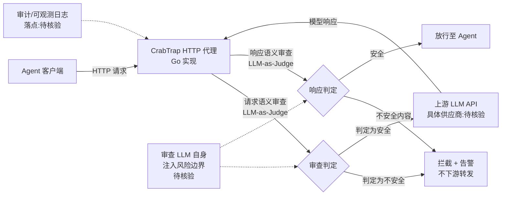

# CrabTrap

## 一句话定位
LLM-as-a-Judge HTTP 代理，为生产环境的 AI Agent 提供请求/响应安全审查。

## 它解决的问题
传统 WAF 基于规则，无法理解自然语言中的恶意意图（Prompt Injection、数据泄露指令等）。Agent 在生产环境中暴露面大，需要理解语义的安全层。

## 为什么值得关注（2026-04-25）
用 LLM 审查 LLM 是 Agent 安全的新范式。CrabTrap 由 Brex（金融科技公司）出品，说明已在金融级生产环境验证。HTTP 代理形式意味着零侵入接入。

## 热度来源判断
424 stars，热度不高但来源可靠。Brex 背书增加了可信度。Agent 安全是企业刚需，不需要 viral 增长。

## 关键技术亮点亮点
1. **LLM-as-a-Judge 模式**：用 AI 理解 AI 的意图，比规则引擎更适应 Prompt Injection 的多变手法
2. **HTTP 代理零侵入**：不改 Agent 代码，加一层代理即可
3. **Brex 生产验证**：金融场景的安全要求极高，通过验证说明方案可行

## 架构师速览

| 决策问题 | 研究判断 | 证据边界 |
|---|---|---|
| 系统边界 | CrabTrap 是位于 Agent 与上游 LLM API 之间的 HTTP 代理层，承担请求/响应语义审查职能，不侵入 Agent 代码 | 边界形态由"LLM-as-a-Judge HTTP 代理"与 Go 语言实现推出；具体监听端口、TLS 终止、上下游协议未在档案中确认 |
| 主路径 | 用户请求 → CrabTrap 代理(LLM-as-Judge 审查请求) → 转发至 LLM API → CrabTrap 审查响应 → 放行或拦截给 Agent | 主路径以档案"sequenceDiagram"为依据；审查用的 LLM 是否同上游、是否流式审查、是否异步均属"待核验" |
| 关键权衡 | 在 Agent 安全语义覆盖度 vs 每请求额外一次 LLM 调用带来的延迟与成本上升、误报漏报风险之间的权衡 | 权衡来源于档案"风险/局限"第 1、2 项；未涉及具体 P95 延迟、单次审查 token 消耗或 SLA |
| 最小 PoC | 在单一非关键渠道接入 CrabTrap 作为出站 HTTP 代理，限定最小工具权限，开启审计日志，以延迟、误报率、审查 LLM 注入风险作为验收项 | PoC 建议来自档案"架构师速览·采用建议"；具体部署形态、回滚机制、审查 LLM 选型档案未给出 |

## 架构启发
CrabTrap 代表了 Agent 安全链路中的"内容审查层"。与 ThinkWatch（身份层）、CubeSandbox（执行层）形成完整的安全架构：

## 架构图（MMD）

> 证据边界：此图只采用本档案已有可核验描述；“待核验”节点不应视为项目实现事实。

## 定位判断
基础设施候选。Agent 安全链路的语义审查层。Go 实现适合代理场景。

## 风险 / 局限 / 泡沫点
1. **LLM 审查延迟**：每次请求额外调用一次 LLM 做安全审查，增加延迟和成本
2. **误判风险**：LLM-as-a-Judge 可能产生误报/漏报，尤其是面对精心构造的 Prompt Injection
3. **审查本身的安全**：审查用的 LLM 也可能被注入攻击

## 与同类项目的关系
- **ThinkWatch**：互补关系。ThinkWatch 做身份/限流/审计，CrabTrap 做语义审查
- **NeMo Guardrails**：NVIDIA 的 LLM 安全框架，规则+模型混合，更重
- **LLM Guard**：Protect AI 的 LLM 安全扫描器，规则为主

## 是否值得持续跟踪
是。LLM-as-a-Judge 安全审查是 Agent 安全的新范式，值得关注其在生产环境中的表现。

## 后续观察点
1. 延迟和成本在生产环境中的实际表现
2. 面对 Prompt Injection 变种的拦截率
3. 是否会从代理模式扩展到 SDK/插件模式

---
*首次记录：2026-04-25*
