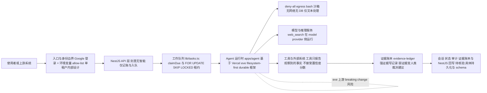

# trycompai/crm — Agentic-first 开源 CRM（agent 是产品本体）

## 一句话定位
一个把 agent 作为产品本体的开源 CRM——agent 不是 CRM 的功能，CRM 是 agent 记笔记的地方；agent 跑在自己的部署、调度、工作队列上，花研究预算、到预算耗尽就停。

## 它解决的问题
传统 CRM 是"数据库 + 表单"，AI CRM 是"给表单旁边加个聊天框"，两者都把真正的工作（查清事实、写下来）留给人类。trycompai/crm 面向的痛点是：销售/BD 团队的线索研究、富化、跟进调度本应是 agent 自动完成的持续工作，而非请求-响应的查询。目标用户是需要内部 CRM 且希望 agent 持续自主做研究的团队。

## 为什么值得关注（2026-08-03）

这是本周应用层演进的**第二次深化**。08-02 的应用层是"通用 harness 产品化"（qm/cindy/qwen-audio-agent）——把现有 harness 包成不同产品形态。trycompai/crm 是另一条路径：**把一个垂直领域（CRM）的整个产品逻辑以 agent 为核心重建**。它是 07-31 追踪的 Vercel eve（filesystem-first durable agent 框架）的**首个可观察生产级应用**，验证了 eve 从框架走向产品。3 天 1,731⭐ + 205 fork（fork/star ≈12%，健康）。

## 热度来源判断
- **真实需求信号**：fork 205 在 3 天项目里偏高，说明有团队在尝试部署/学习；README 是认真写的工程文档（含 `docs/agent.md`、`docs/api.md`、SECURITY.md），非营销页面。
- **品类热度成分**："agentic-first CRM"踩中本周应用层 + 垂直 SaaS 重写双热点；但"证据账本""deny-all egress 沙箱""eve 底座"是独立的设计深度，非纯蹭热度。
- **价值定位**：核心价值不在"又一个 CRM"，而在于它示范了**"agent 作为产品本体"的工程范式**——可迁移到其他垂直领域。

## 关键技术亮点亮点

1. **证据账本取代置信度**：agent 的工具**不接受置信度分数**。README 原文论证——"a model asked to grade its own certainty will, and it will be wrong in the direction that makes it look useful"。工具只报告观察到的事实（`crm.signature-block`、`github.account-identity`），一个账本对证据定价：强证据写记录，弱证据变成人类裁决的建议。"A confidently wrong fact about a customer is worse than a blank field, because nobody can tell it is wrong."
2. **deny-all egress 沙箱**：agent 的 bash 沙箱**无网络、无数据库**。`web_fetch` 在 app 运行时跑、`web_search` 在 model provider 跑，沙箱 shell 只做文本处理。沙箱**永不获得 `DATABASE_URL`**。论证："A shell with credentials and egress is exfiltration-shaped even in an internal tool; a shell with neither is a text processor."
3. **以 Vercel eve 为底座**：agent 部署（`apps/agent`）构建在 [eve](https://eve.dev)——filesystem-first durable agent 框架。tool 是文件、skill 是 markdown、schedule 是文件，runtime 处理持久化（session 跨 redeploy 存活、工作恢复）。这是 eve 首个可观察的生产级应用。
4. **工作队列语义**：`lib/tasks.ts` 用 `claimDue` + `FOR UPDATE SKIP LOCKED` 租约行——两个 dispatcher 取不相交的工作，死掉的 run 在租约过期时释放行。"每隔 N 分钟最旧的 10 个联系人"属于 task 的 `dueAt` 而非 cron 表达式。
5. **单租户内部设计**：Google 登录 + 一个环境变量的 allow-list，进去的人能看到一切。这是有意的安全边界（见 SECURITY.md），非多租户 SaaS。

## 架构师速览

| 决策问题 | 研究判断 | 证据边界 |
|---|---|---|
| 系统边界 | trycompai/crm 是单租户内部 CRM，agent 跑在自有部署、调度、工作队列上；agent 沙箱 deny-all egress，DB 凭据不下发到 shell；入口为 Google 登录 + 环境变量 allow-list。 | 仅档案中的设计声明（README、SECURITY.md 引用）支持，未做源码审计。 |
| 主路径 | Google 登录 → 入口/身份边界 → NestJS API 层（无智能，仅记账+入队）→ agent 运行时（基于 Vercel eve）→ 模型与"报告事实"的工具 → 证据账本/状态写回。 | 主路径组件齐全，但持久化、会话恢复实现细节须源码核验。 |
| 关键权衡 | "agent 作为产品本体"倒置 API 层，代价是 agent 决策质量成系统性瓶颈；扩展性受单租户+沙箱 deny-all 主动收紧；以尚在快速迭代的 eve（4.2K⭐）为底座承担 breaking change 风险。 | 风险/局限条目直接来自档案；生产级证据定价准确性与 agent 决策质量档案明确"未经规模验证"。 |
| 最小 PoC | 单渠道（一个外部数据源）、最小工具权限、开启审计日志；用 `claimDue` + `FOR UPDATE SKIP LOCKED` 跑一个简单 lead-enrichment 队列；先验证弱证据→人类裁决机制是否真减少"自信错误"。 | PoC 框架由档案中工作队列语义直接给出；具体栈（bun/TypeScript 版本）与部署形态待核验。 |

## 架构启发
核心启发是 **"agent 是产品，数据库是笔记"** 的倒置。传统架构是 API 层含智能（调富化 API、打分），agent 在旁边辅助；trycompai/crm 反过来——API 层（NestJS）刻意"无智能"，只报告"发生了某事"并写队列，**智能全部在 agent 侧**。这种倒置使 agent 的决策可审计（证据账本）、可隔离（deny-all 沙箱）、可独立调度（自己的工作队列）。代价是 agent 的决策质量成为产品的核心瓶颈——若 agent 判断差，整个产品差。

## 架构图（MMD）

> 证据边界：此图只采用本档案已有可核验描述；“待核验”节点不应视为项目实现事实。

## 定位判断
在应用层生态中占据**垂直 SaaS 以 agent 为核心重写**的位置。与 qm（通用 harness 平台）、cindy（个人客户端）不是竞争，而是**不同抽象层次的互补**——qm 是"让团队用 agent 协同"，crm 是"让 agent 重写一个垂直领域"。它是 Vercel eve 框架的首个生产级采用者，也反向验证了 eve 的 filesystem-first 范式。

## 风险 / 局限 / 泡沫点

1. **极早期 + 极少 contributors**：创建于 2026-07-31（3 天），仅 2 名 contributors（carhartlewis 34 commits / ripgrim 14 commits）。"证据账本""deny-all egress"是设计声明，生产环境下的 agent 决策质量、证据定价准确性未经规模验证。
2. **单租户内部设计限制适用场景**：明确"single-tenant and internal by design"，非多租户 SaaS。这意味着它更适合作为**范式参考**而非直接商业化产品。
3. **agent 决策质量是产品核心瓶颈**：整个产品逻辑依赖 agent 的研究/判断质量。若底层模型（GPT-5.6 等）在某些 CRM 场景判断差，产品直接差——这是"agent 是产品"架构的结构性风险。
4. **eve 依赖**：以 Vercel eve 为底座，eve 本身仍在快速迭代（07-31 追踪时 4.2K⭐），上游 breaking change 风险存在。

## 与同类项目的关系
- **vs qm（7,015⭐）**：qm 是通用 agent 协同平台（团队多人 scope），crm 是垂直 SaaS 重写（CRM 领域 agent 为本体）。不同抽象层次，qm 更宽，crm 更深。
- **vs openworker（9,965⭐，Andrew Ng）**：openworker 是通用本地优先 AI Coworker（审批门控/BYO 模型/25+ 连接器），crm 是垂直领域（CRM）的 agent-native 重写。openworker 更通用，crm 更聚焦。
- **vs 传统 CRM（开源/商业）**：传统 CRM 是数据库+表单+可选 AI 助手；crm 把这个范式倒置。它不与 Salesforce 直接竞争（单租户内部），而是示范一种新架构范式。

## 是否值得持续跟踪
**是，作为"垂直 SaaS 以 agent 为核心重写"的范式参考跟踪。** 关注其证据账本在生产数据上的表现、eve 底座的稳定性、以及"agent 决策质量"在真实 CRM 场景的边界。

## 后续观察点
1. **证据账本在生产数据的准确性**：弱证据→人类裁决的建议机制是否真的减少了"自信但错误"的事实，还是增加了人工裁决负担。
2. **eve 底座的稳定性**：eve 下一次大版本更新对 crm 的影响，是否出现 breaking change。
3. **contributors 增长**：若长期停留 2 人，则更像一个范式 demo 而非可持续产品；若增长到 5+ 则说明社区在认真采用。

## 最近动态（2026-08-04）

- **第二日续涨 +1,392（+80%），垂直 agentic SaaS 路线获持续确认**：1,731 → 3,123，fork 205 → 341（+136）。fork/star 比维持在 ~11%，健康。4 天从 0 到 3.1K⭐，垂直 agent 重写路线与 qm 的通用平台路线**同步放量**，说明应用层趋势不是单点而是**多路线并行扩张**。
- **与 qm 的横切**：qm 三日 +8,091（通用平台），crm 两日 +1,392（垂直重写）——通用平台量级更大，但垂直路线增速百分比可观（crm 第二日 +80%）。两者代表应用层的两条并行路线，非零和竞争。
- **待观察**：contributors 仍为 2（carhartlewis/ripgrim），需关注是否吸引外部贡献者。证据账本/deny-all egress 的生产验证仍缺。

## 最近动态（2026-08-05）

- **第三日加速 +1,446（+46%），增速反超 qm——应用层进入分化**：3,123 → 4,569，fork 341 → 485（+144，**注：fork 从昨日观测的 205 修正为今日 485，两日 +280**）。关键转折：crm 第三日 +46%，而 qm 第四日仅 +17%——**crm 增速首次反超 qm**。这意味着应用层从"齐涨"进入"分化"，市场开始在通用平台（qm）vs 垂直重写（crm）间区分 PMF 强度。
- **fork 高速增长信号**：fork 485（vs 3 天前 205），fork/star 比 10.6% 维持健康。说明垂直 CRM 的部署/二次开发意愿强于通用平台（qm fork/star 比 10.8%，量级相近）。
- **判断修正**：score 86 → 87。增速反超 + fork 高比例是垂直路线 PMF 的强信号。但 contributors 仍待观察（需确认是否仍 2 人）。pushed_at 08-04（活跃开发）。

---
*首次记录：2026-08-03* · *最近更新：2026-08-06（4,569→6,138，+1,569/+34%，连续两日增速第一，score 87→88）*

## 最近动态（2026-08-06）

- **第五日反超为应用层增速第一 +1,569（+34%），连续两日领先**：4,569 → 6,138，fork 485 → 627（+142）。crm 第五日 +34% vs qm +5%，增速差距从昨日扩大。连续两日增速领先意味着"crm 领跑、qm 守量"格局确立——不再是单日波动。
- **fork 高速增长持续**：fork 627（vs 两日前 341，fork/star 比 10.2%）。垂直 CRM 的部署/二次开发意愿持续强于通用平台。
- **判断修正**：score 87 → 88。连续两日增速第一 + fork 高比例是垂直路线 PMF 的强确认。pushed_at 08-05（活跃开发）。

## 最近动态（2026-08-07）

- **第六日 +1,018（+16%），增速回落但仍为增速第一**：6,138 → 7,156，fork 627 → 738（+111）。增速从 +34%（08-06）回落到 +16%（08-07），但仍为应用层增速第一（连续三日领先）。fork 627 → 738 说明部署意愿仍在。
- **格局从分化进入固化**：crm +16% vs qm +3%，差距仍在但两者都在减速。crm 没有脱离整个应用层的衰减趋势，只是衰减更慢。关键看 08-08 crm 是否能维持 +10% 以上（仍有真实增长动能），还是也降到 +5% 以下（整个应用层主题进入尾声）。
- **判断（维持 score 88）**：连续三日增速第一是垂直路线 PMF 的强确认，但增速回落意味着热度曲线进入收敛期。pushed_at 08-06（活跃开发）。

## 最近动态（2026-08-09）

- **第八日 +280（+4%），连续四日衰减尾声**：7,471 → 7,751，fork 800 → 840（+40）。增速序列 +34%（08-06）→ +16%（08-07）→ +4%（08-08）→ +4%（08-09），连续四日衰减，进入尾声。今日有新提交（pushed_at 08-08，release 1.4.0 于 08-07）。
- **应用层整体进入衰减尾声**：qm（+2%）、crm（+4%）、genoffice（+4%）三个项目增速全面下降到低个位数。crm 作为应用层增速领先者也已降到 +4%，说明应用层主题可能进入尾声。
- **判断（维持 score 87）**：连续四日衰减尾声，fork 增长放缓。下一观察点：是否企稳在 +2-3%（稳态），还是继续衰减到 +1% 以下（尾声）。

## 最近动态（2026-08-10）

- **第九日 +204（+3%），继续衰减**：7,751 → 7,955，fork 840 → 876（+36）。增速从 +4%（08-09）继续衰减到 +3%（08-10），符合昨日"下一观察点：是否企稳在 +2-3%（稳态）"的判断——+3% 接近稳态区间但仍在下降。fork +36（vs 昨日 +40）基本持平，说明集成意愿维持。
- **应用层整体继续衰减**：qm（+2%）、crm（+3%）、genoffice（+4%）三个项目增速仍全面在低个位数。今日有新提交（pushed_at 08-08T23:51）。
- **判断（维持 score 87）**：增速继续衰减接近稳态。score 维持 87（万星以下应用层头部地位不变）。
