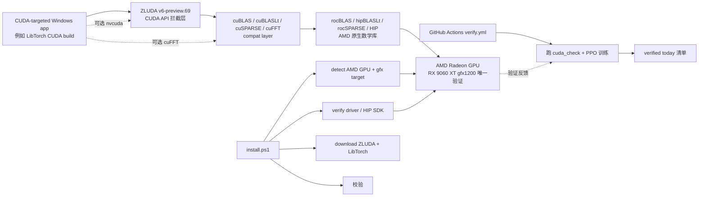

# Speedstu/CUDA-for-AMD-Windows

## 一句话定位
跨 GPU 厂商 CUDA 兼容层（ZLUDA + ROCm/HIP）的 Windows + AMD 可复现模板——ZLUDA v6-preview.69 + AMD HIP SDK 6.4 + LibTorch 2.3.0+cu118 + AMD Radeon RX 9060 XT (gfx1200) 单卡验证；install.ps1 全自动化（detect / verify / download / validate）；五个 CUDA 入口（nvcuda / cuBLAS / cuBLASLt / cuSPARSE / cuFFT）全 pass cuda_check；真实 220 万参数 PPO 网络 forward / inference / learning / optimizer 全链路验证。

## 它解决的问题
AMD GPU 用户长期被 CUDA 生态排斥——PyTorch 官方 CUDA-only build 不支持 AMD，ROCm PyTorch 滞后且 API 兼容性差（许多 CUDA-only 算子未实现）。Linux + AMD + ZLUDA + LibTorch 已可跑通，但 **Windows + AMD + CUDA-target LibTorch 训练路径长期没有公开复现**——AMD GPU Windows 用户（消费级 RDNA3/RDNA4）只能用 ROCm PyTorch（API 兼容性受限）或购买 NVIDIA GPU。**Speedstu 直击这一空白**：在 Windows 上把 ZLUDA + HIP SDK + LibTorch 端到端跑通，并用 install.ps1 把整个流程自动化 + GitHub Actions CI 持续验证。**这是「ZLUDA 仍活着的窗口期，把 Windows + AMD + CUDA 跑通留下可复现模板」**——解决的不是「自研 GPU runtime」（这是 ZLUDA 的工作），而是「AMD GPU Windows 用户跑 CUDA 训练」的工程闭环问题。

## 为什么值得关注（2026-09-14）
- **Stars:** 55（截至 2026-09-14），1 天新增 55⭐ / 1 fork / fork/star 1.8%
- **Forks:** 1，社区关注早期阶段
- **License:** **NOASSERTION**（企业合规风险——非 MIT/Apache，是「无明确声明」；合规扫描会直接拒绝）
- **语言:** PowerShell（install.ps1 自动化脚本）+ 文档 + 验证脚本
- **活跃度:** created 2026-09-13，pushed_at 2026-09-13，README 明示「WORKING REPRODUCIBLE STACK IS NOW UPLOADED」
- **规模:** 53 KB repo（不是「大项目」而是「集成脚本 + 验证脚本 + 文档」形态）
- **Topics:** amd, amd-gpu, compatibility-layer, cuda, cuda-on-amd, gpgpu, gpu-computing, hip, rocm, windows, zluda（主题清晰完整）
- **CI:** GitHub Actions `verify.yml` 跑验证

## 热度来源判断
CUDA-for-AMD-Windows 的热度是 **「ZLUDA 重新活跃 + 真实可复现 + 单卡验证明确 + install.ps1 自动化 + 五个 CUDA 入口验证 + 220 万参数 PPO 训练验证 + GitHub Actions CI」** 的强组合。**这是 Windows + AMD + CUDA 训练栈首次有公开可复现的端到端模板**——之前只有 Linux 上的成功复现。**README 直接给「verified today」清单**（具体到 ZLUDA 版本 + HIP SDK 版本 + LibTorch 版本 + 验证步骤 + 验证结果数字）是工程严肃度的明确信号。**「WORKING REPRODUCIBLE STACK IS NOW UPLOADED」的开头声明**——这是项目维护者对「之前没跑通、现在跑通了」的明确宣告，对长期被 ZLUDA + AMD 兼容性问题困扰的开发者有强吸引力。但 **1 fork + fork/star 1.8% 反映主要是个人关注而非企业 fork**——企业 fork 还需要时间。热度**真实且具工程价值**——53 KB repo + 明确版本固定 + 可复现验证步骤，说明这不是 PoC。

## 关键技术亮点
1. **三个 pinned 版本**——ZLUDA `v6-preview.69`（官方 upstream release）+ AMD HIP SDK `6.4` + LibTorch `2.3.0 + cu118`；版本固定避免「今天跑得通明天跑不通」
2. **五个 CUDA 入口验证**——nvcuda / cuBLAS / cuBLASLt / cuSPARSE / cuFFT 全 pass `cuda_check`
3. **真实 PPO 训练**——220 万参数 PPO 网络 forward / inference / PPO learning / optimizer 全部在 CUDA-facing device 上跑通；README 明示「the same CUDA-facing LibTorch training workload that originally motivated this project」
4. **65,536 timesteps 单次 validation**——可复现的验证规模（README 给具体数字）
5. **`install.ps1` 全自动**——detect AMD GPU + native `gfxXXXX` target + verify AMD driver/HIP SDK + download pinned ZLUDA + download LibTorch 2.3.0+cu118 (2.66 GB) + verify
6. **GitHub Actions CI**——`verify.yml` 自动跑验证（README badge 链接）
7. **`docs/VALIDATION.md`** 公开验证步骤——可复现性的关键
8. **NOASSERTION license**（潜在合规风险）——不是 MIT/Apache，是「无明确声明」；企业合规扫描会拒绝
9. **53 KB repo size**——不是「大项目」而是「集成脚本 + 验证脚本 + 文档」形态
10. **README 显式标注验证硬件**——`gfx1200` 唯一验证；README 明示「Other AMD GPUs are candidates, not guaranteed working devices」并提供 GPU compatibility report issue 模板

## 架构师速览

| 决策问题 | 研究判断 | 证据边界 |
|---|---|---|
| 系统边界 | Windows x64 + AMD GPU + ZLUDA + HIP SDK + LibTorch 集成栈；非「自研 GPU runtime」，而是「已有组件的集成配方 + 自动化脚本 + 验证证据」 | 来自 README 关于「ZLUDA v6-preview.69 + AMD HIP SDK 6.4 + LibTorch 2.3.0+cu118」、install.ps1 五步、验证 AMD Radeon RX 9060 XT (gfx1200) only 的明示；其他 AMD GPU 兼容性矩阵在 README 中显式标为「candidates, not guaranteed working devices」 |
| 主路径 | CUDA-targeted Windows app → ZLUDA → cuBLAS/cuSPARSE/cuFFT compat → rocBLAS/hipBLASLt/rocSPARSE/HIP → AMD GPU；README 给 ASCII 流程图 | 主路径来自 README 描述的 ASCII 流程图 + 「How it works」段落；具体 ZLUDA 拦截点、HIP 库替换细节在 docs/VALIDATION.md 中可能给出，本档案未读 |
| 关键权衡 | 单卡验证（RX 9060 XT gfx1200 only）vs ZLUDA 持续性（作者多次更迭 + 过去两年空窗）vs NOASSERTION 许可证（无明确声明）vs LibTorch 版本固定（避免依赖漂移但失去新特性） | 权衡四因素均从 README 推导；其他 AMD GPU 兼容性实测、ZLUDA 未来 roadmap、license 实际限制待核验 |
| 最小 PoC | Windows x64 + AMD Radeon RX 9060 XT；执行 install.ps1；运行 docs/VALIDATION.md 中 PPO 训练；观察 forward / inference / learning / optimizer 是否全在 CUDA-facing device 完成 | PoC 由「install.ps1 五步 + 五个 CUDA 入口验证 + PPO 训练验证」路径推导；其他 AMD GPU（如 RX 7900 XT / RX 9070 XT）兼容性测试在 README 中显式要求用户开 issue 报告 |

## 架构启发
CUDA-for-AMD-Windows 的核心启发是 **「跨厂商兼容层的工程价值在于「端到端可复现 + 自动化 + 验证证据」三件套」**。ZLUDA 项目本身存在已久，但过去四年没有 Windows 上跑通完整 LibTorch 训练链路的公开复现——原因不是技术不可行，而是「缺乏工程化的自动化脚本 + 验证证据 + 文档」让开发者难以一键复现。**Speedstu 把「ZLUDA + HIP SDK + LibTorch 在 Windows + AMD 上跑通」留下可复现模板**——这是「AI 训练栈搭建配方」的工程化体现，类似 Dockerfile + docker-compose 把应用部署从「手工命令」变成「一键启动」。**更深层的启发是：消费级 AMD GPU 用户（RX 9060 XT 等）的训练需求被 NVIDIA 生态长期忽视**——CUDA-for-AMD-Windows 提供了「不换硬件也能跑 CUDA 训练」的可复现路径。**53 KB repo + 1 fork + fork/star 1.8%** 反映这是「极简集成脚本 + 文档」形态而非「大项目」，但 README 给出的「verified today」清单（具体到版本号 + 验证步骤 + 验证结果数字）让任何开发者可以一键复现。

## 架构图（MMD）

> 证据边界：此图只采用本档案已有可核验描述；"待核验"节点不应视为项目实现事实。

## 定位判断
**工具型项目（跨 GPU 厂商 CUDA 兼容层 Windows 复现模板）。** CUDA-for-AMD-Windows 的核心定位不是「自研 GPU runtime」（这是 ZLUDA 的工作），也不是「AI 训练框架」（这是 PyTorch 的工作），而是 **「已有组件的集成配方 + 自动化脚本 + 验证证据」**——这是「AI 训练栈搭建配方」赛道的清晰尝试。**它的对手不是 NVIDIA CUDA Toolkit**（这是上游），而是 **「AMD GPU Windows 用户跑 CUDA 训练」的工程闭环方案**——目前这个位置几乎没有公开复现模板。**README 的「verified today」清单 + install.ps1 自动化 + GitHub Actions CI** 是「参考实现」的核心价值——其他 AMD GPU 用户可以基于这个模板扩展自己的硬件验证。但 **平台化的关键问题是：是否被 AMD GPU Windows 社区广泛采用**——1 fork + 53 KB size + NOASSERTION 都还处于「早期参考」阶段，距离「广泛采用」尚远。

## 风险 / 局限 / 泡沫点
- **NOASSERTION license（最大风险）**——不是 MIT/Apache，是「无明确声明」；合规扫描（Snyk / FOSSA / GitHub License API）直接拒绝；企业法务无法通过；建议补 MIT / Apache-2.0 文件
- **ZLUDA 项目可持续性**——ZLUDA 项目作者 vosen 多次更迭、过去两年空窗；若 ZLUDA 停止更新或转向闭源，CUDA-for-AMD-Windows 将失去上游依赖
- **单卡 RX 9060 XT gfx1200 唯一验证**——README 明示「Other AMD GPUs are candidates, not guaranteed working devices」；其他 AMD GPU（如 RX 7900 XT / RX 9070 XT）需用户自行测试并报告 issue
- **LibTorch 版本固定**——LibTorch 2.3.0+cu118 是 2024 年的版本；新版本 LibTorch + cu118 / cu121 可能引入 breaking change；README 未给出升级路径
- **HIP SDK 6.4 版本固定**——AMD HIP SDK 后续版本可能与 ZLUDA 不兼容；需 ZLUDA 同步适配
- **PPO 训练 ≠ 全面 CUDA 兼容**——README 明示「This does **not** mean every CUDA program or AI model works. CUDA API/library coverage is workload-dependent」；220 万参数 PPO 是「特定 workload」验证
- **53 KB repo + 1 fork**——说明主要是脚本 + 文档 + 少量验证代码；完整功能（如 ZLUDA 拦截层细节、HIP 库替换配置）的实现深度未公开

## 与同类项目的关系
- **vs ZLUDA（上游 CUDA-on-AMD 兼容层）**：ZLUDA 提供兼容层本身；CUDA-for-AMD-Windows 提供「ZLUDA + HIP SDK + LibTorch 在 Windows + AMD 上端到端跑通」的集成配方
- **vs ROCm PyTorch（AMD 官方 PyTorch）**：ROCm PyTorch 是 PyTorch 官方 AMD fork；API 兼容性差（许多 CUDA-only 算子未实现）；CUDA-for-AMD-Windows 是「CUDA-target PyTorch 直接跑」的替代路径
- **vs Docker + WSL2 + Linux + AMD**：Linux 路径已可跑通；CUDA-for-AMD-Windows 是「原生 Windows + AMD」路径，避免 WSL2 开销
- **vs NVIDIA CUDA Toolkit**：这是上游 CUDA 实现；CUDA-for-AMD-Windows 是「AMD GPU 跑 CUDA-target 应用」的兼容方案
- **vs 其他 ZLUDA 集成项目**：ZLUDA 在 GitHub 已有多个 fork / 集成尝试；CUDA-for-AMD-Windows 的差异化是「install.ps1 全自动 + PPO 训练验证 + GitHub Actions CI + 文档完整」

## 是否值得持续跟踪
**值得跟踪（AMD GPU Windows 用户跑 CUDA 训练的首次可复现模板）。** CUDA-for-AMD-Windows 解决了「AMD GPU Windows 用户无法跑 CUDA-target 训练」的真实空白。建议关注：1) LICENSE 文件是否补全（最大风险缓解信号）；2) ZLUDA 项目 roadmap（决定上游依赖可持续性）；3) 其他 AMD GPU 兼容性扩展（RX 7900 XT / RX 9070 XT 等是否成功跑通）；4) LibTorch + HIP SDK 版本升级路径。**对 AMD GPU Windows 用户**，这个仓库是「不换硬件也能跑 CUDA 训练」的可复现起点，值得直接 clone + 跑 install.ps1 评估。**对 GPU 计算生态观察者**，它是「跨厂商兼容层 + 工程化模板」的清晰样本，反映 AMD GPU 用户长期被忽视的需求。

## 后续观察点
- LICENSE 文件是否补全（建议 MIT 或 Apache-2.0）
- ZLUDA 项目未来 roadmap（v6 stable / v7 / 闭源可能）
- 其他 AMD GPU 兼容性测试结果（特别是 RX 9070 XT gfx1201 等 RDNA4 显卡）
- LibTorch + HIP SDK 版本升级路径（特别是 PyTorch 2.4+ / cu121+）
- 是否有更多 workload 验证（不只 PPO，还有 BERT / GPT / Diffusion 等）
- ZLUDA 在 cuDNN / cuTensorRT 等更深 CUDA 库上的兼容性

---
> 数据来源: GitHub API (2026-09-14) | Stars: 55 | Forks: 1 | License: NOASSERTION | 语言: PowerShell + 文档 | 创建: 2026-09-13 | Repo size: 53 KB