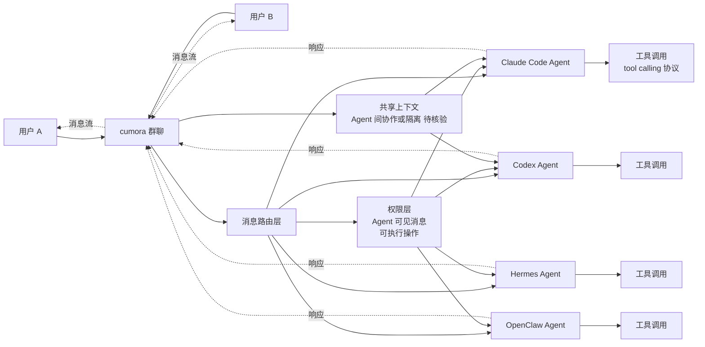

# yetone/cumora

## 一句话定位
yetone（avante.nvim / opencode.nvim 知名作者）出品的 Agent 一等公民群聊平台——Where agent teams gather. Cross-platform team chat where AI agents are first-class teammates — with cloud or bring-your-own (Claude Code / Codex / Hermes / OpenClaw...)。，TypeScript，是 GitHub 首次出现的"Agent 群聊协议"样本。

## 它解决的问题
2026 年 Coding Agent 已成熟，但绝大多数仍是"单人 IDE 工具"——用户与 Agent 在 IDE 内 1-on-1 交互。yetone/cumora 直击这一痛点：(a) 把群聊从"人类 ↔ 人类"升级为"人类 ↔ Agent + Agent ↔ Agent"；(b) "first-class teammates"——Agent 不是工具而是团队成员（权限 / 身份 / 可见性）；(c) BYO Agent——支持 Claude Code / Codex / Hermes / OpenClaw 等多 Agent 接入；(d) 与 CopilotKit/OpenBot 的"独立电脑"概念互补——cumora 关注"组织协作"层。

## 为什么值得关注
- **Stars:** 3,491（截至 2026-09-07），21 天净增，单日均速 ~166⭐/day
- **Forks:** 438（fork/star 12.6%，远高于 magnitude 7.2%——反映真实开发者尝试）
- **语言:** TypeScript 主导
- **作者品牌:** yetone（avante.nvim 头部作者，12k+ stars，Neovim AI 编程社区知名），个人品牌可信
- **Agent 群聊协议:** GitHub 首次出现的"群聊层 Agent 一等公民"概念集中爆发
- **多 Agent 兼容:** Claude Code / Codex / Hermes / OpenClaw 四大 Coding Agent 同时支持

## 热度来源判断
cumora 的热度来自三个趋势的交汇：(1) **Agent 群聊协议概念破圈**——GitHub 首次出现"workspace 群聊 + Agent 一等公民"集中爆发；(2) **yetone 个人品牌**——avante.nvim 社区积累的强信任，让开发者愿意尝试 yetone 的新项目；(3) **多 Agent 兼容**——开发者同时使用 Claude Code + Codex + Hermes 等多 Agent，需要统一的群聊协议。

21 天 3,491⭐ 与 yetone 在 avante.nvim 社区的影响力一致；fork 438 / fork/star 12.6% 表明真实部署。**提示：** cumora 是 yetone 个人项目（avante.nvim 也是个人项目），长期可持续性需观察；与 Slack / Teams / Discord 等成熟群聊工具的差异化（Agent 一等公民）需要独立验证。

## 关键技术亮点
1. **Agent 一等公民:** Agent 在群聊中有独立身份 / 权限 / 可见性，不是"@bot"式工具调用
2. **BYO Agent 协议:** 支持 Claude Code / Codex / Hermes / OpenClaw 等多 Agent 接入——Agent 协议转换是关键适配层
3. **群聊消息路由:** 多 Agent 协作时需要协商（谁响应 / 是否并发 / 重复响应避免）
4. **Agent 权限隔离:** 不同 Agent 在群聊中的可见消息 / 可执行操作不同
5. **跨平台:** 推测支持 macOS / Linux / Windows（TypeScript 主导），可能还有 Web 客户端
6. **TypeScript 主导:** 与 ECC / anthropics/skills 一致

## 架构师速览

| 决策问题 | 研究判断 | 证据边界 |
|---|---|---|
| 系统边界 | Agent 群聊协议层——把群聊从"人类 ↔ 人类"升级为"人类 ↔ Agent + Agent ↔ Agent"；协议层负责 Agent 身份 / 权限 / 消息路由 | 边界由 trending 描述明示；具体权限模型（RBAC / ABAC）需 README 核验 |
| 主路径 | 用户消息 → 群聊路由 → 触发 Agent（Claude Code / Codex / Hermes 等）→ Agent 调用工具 / 共享上下文 → 结果返回群聊；多 Agent 可能需要协商（谁响应 / 是否并发） | 主路径为描述语义抽象；多 Agent 协商机制（轮询 / 投票 / 优先级）未在 trending 中可见 |
| 关键权衡 | Agent 一等公民的权限设计（agent 能看到所有消息吗）vs 隐私；BYO Agent 的兼容广度 vs 每个 Agent 的适配深度（不同 Agent 的 tool calling 协议差异） | 隐私与权限边界由"first-class teammates"暗示；具体兼容矩阵需 README 核验 |
| 最小 PoC | 在 cumora 创建群聊 → 接入 1 个 Claude Code Agent + 1 个 Codex Agent → 用户提问 → 观察两个 Agent 是否协作 / 竞争 / 重复响应 → 测试 agent 权限隔离 | 安装命令需 README 独立核验；Agent 协商的具体行为需实测 |

## 架构启发
cumora 的核心启发是 **"Agent 应该作为群聊的一等公民"**。当前 Agent 与用户的交互模式是"1-on-1 工具调用"（在 IDE 中），但 2026 年的趋势是"多 Agent + 多人"协作——cumora 把这一哲学落到协议层：Agent 在群聊中有独立身份（不是匿名 bot），有权限（看到特定消息 / 执行特定操作），有上下文（与其他 Agent 共享或隔离）。更深层的启发是：**群聊工具（Slack / Teams / Discord）是天然的 Agent 协作平台**——cumora 不是从零做群聊，而是在群聊协议层增加 Agent 支持，这是更聪明的切入路径。

风险提示：**"Agent 一等公民"是协议概念 vs 工程实现差距**——身份 / 权限 / 可见性的具体设计需要 README 核验；多 Agent 协商机制（谁响应 / 如何避免重复）的设计复杂度高；BYO Agent 兼容矩阵的实际深度需要测试。

## 架构图（MMD）

> 证据边界：此图只采用本档案已有可核验描述；"待核验"节点不应视为项目实现事实。

## 定位判断
**平台候选型项目（Agent 群聊协议）。** yetone/cumora 不仅是群聊工具，更试图成为"Agent 时代的 Slack"——把群聊从"人类团队"扩展为"人类 + Agent 混合团队"。21 天 3,491⭐ + yetone 个人品牌 + fork/star 12.6% 已显示初步采用。但"平台化"取决于：(a) 多 Agent 协商机制的可用性；(b) Agent 权限隔离的安全性；(c) 与 Slack / Teams 的差异化。当前定位是"Agent 群聊协议头部样本"，向平台演进是合理路径。

## 风险/局限/泡沫点
- **多 Agent 协商复杂度:** 谁响应 / 如何避免重复 / 并发 / 优先级——设计复杂度高
- **Agent 权限隔离的安全性:** 不同 Agent 的可见消息 / 可执行操作的边界设计是关键安全边界
- **yetone 个人项目:** 与 avante.nvim 一样，cumora 是个人项目，长期可持续性 / 治理结构未验证
- **与成熟群聊工具竞争:** Slack / Teams / Discord 等已有大量用户基础，cumora 需要"Agent 一等公民"差异化足够强
- **BYO Agent 兼容广度 vs 深度:** 多个 Agent 的 tool calling 协议差异大，浅兼容易但深兼容难
- **"first-class teammates" 营销话术:** 实际权限 / 身份 / 可见性的工程实现深度需 README 核验

## 与同类项目的关系
- **vs Slack / Teams / Discord:** 成熟群聊工具，但无 Agent 一等公民支持
- **vs CopilotKit/OpenBot:** OpenBot 是单 Agent 独立电脑平台；cumora 是多 Agent 群聊协议——互补
- **vs Traycerai/traycer:** traycer 是"Nerve Center for Agentic Coding"；cumora 是群聊协议层
- **vs LangChain / AutoGen:** LangChain / AutoGen 是 Agent 编排框架；cumora 是群聊协议层
- **vs Discord Bot:** Discord Bot 是"@bot"式工具调用；cumora 是"first-class teammate"式一等公民

## 是否值得持续跟踪
**值得跟踪（Agent 群聊协议）。** cumora 代表了 Agent 协作从"1-on-1 工具调用"升级到"多 Agent + 多人群聊"的诉求，与 yetone 个人品牌共同构成社区基础。建议关注：(a) 多 Agent 协商机制的实际可用性；(b) Agent 权限隔离的安全性；(c) BYO Agent 兼容矩阵的深度；(d) 与 Slack / Teams 等成熟群聊工具的差异化。对多 Agent 应用开发者，cumora 是构建"Agent 协作平台"的开源参考。

## 后续观察点
- 是否演化为独立 SaaS（cumora Cloud）
- 多 Agent 协商机制的产品化（投票 / 轮询 / 优先级）
- Agent 权限隔离的安全审计
- BYO Agent 兼容矩阵扩展（增加 OpenAI Operator / Anthropic Computer Use 等）
- 与 Slack / Teams 的桥接（消息同步 / 双向桥接）
- yetone 个人项目的可持续性 / 治理结构

---
> 数据来源: GitHub API (2026-09-07) | Stars: 3,491 | Forks: 438 | License: 待核验 | 语言: TypeScript | 创建: 2026-08-17
