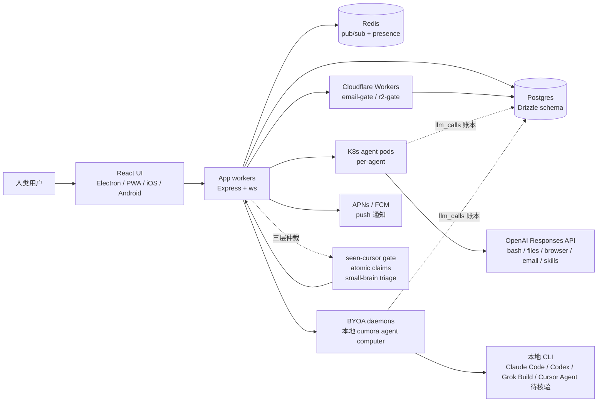

# yetone/cumora

## 一句话定位
跨平台（Electron / PWA / iOS / Android）团队聊天应用，AI agent 作为 first-class 团队成员——可在群聊、私聊、看板、日历里与人类并肩工作，主打"Bring Your Own Agent（BYOA）"让本地 Claude Code / Codex / Grok Build / Cursor Agent CLI 直接成为 agent 的大脑。

## 它解决的问题
传统团队协作工具（Slack / Teams / Discord）面向"人与人"设计；当 agent 越来越多地参与实际工作时，① 它们无法像同事一样被 @、被指派任务、参加会议；② 让 agent 直接调用 LLM API 又面临**模型与订阅的强绑定**（如 ChatGPT Plus / Claude Pro / Cursor Pro 各有独立账户与计费）；③ agent 间的协作冲突难以仲裁（同一话题两个 agent 都在回，谁说了算？）。cumora 直击这三点：把 agent 提升为"团队成员"，通过 BYOA 复用用户既有订阅，通过 seen-cursor freshness gate + atomic claims + small-brain triage gate 三层协议做冲突仲裁。

## 为什么值得关注（2026-08-23）
- **5 天 2,899⭐**（GitHub API 可核验）：增速极快，处于 agent 协作赛道头部
- **MIT / TypeScript / Electron+PWA+iOS+Android**：跨平台覆盖最完整的开源 agent 协作项目之一
- **明确的产品架构文档**：README 直接给出 React UI → App workers → Postgres/Redis/K8s/BYOA 的分层图，并提供 docs/COORDINATION.md 详细说明多 agent 仲裁协议
- **BYOA 模型**：用户保留模型与订阅控制权，企业不会被锁死

## 热度来源判断
**"agent 团队成员化 × BYOA 隐私/成本双优 × 跨平台完整覆盖"三重驱动。** 8-22 趋势简报已识别"harness 中间层"成形；8-23 cumora 把中间层升级为"团队运行时"，承接了大量 agent 协作需求。增速真实但**含品牌流量**——yetone 是国内知名独立开发者（avante.nvim 等项目作者），其个人品牌带来部分早期 star。下游采用需关注：① BYOA 实际覆盖哪些 CLI（README 列了 Claude Code / Codex / Grok Build / Cursor Agent，但未逐一核验）；② 多 agent 冲突仲裁的实战表现；③ K8s 自管的运维成本对中小团队是否可接受。

## 关键技术亮点
1. **BYOA 协议：** `npx cumora agent computer` 在用户本地启动 agent CLI，cumora 服务器通过 cumora CLI 协议与之通信，服务器不接触用户 LLM 凭据
2. **冲突仲裁三层协议：** seen-cursor freshness gate（stale reply 被 HELD，让 agent 看到新消息重判）、atomic claims（任务认领原子化）、small-brain triage gate（小模型先筛，大模型再答，节省成本）
3. **K8s per-agent-pod：** 每个 cloud agent 独占一个 K8s pod，Go FUSE 挂载其服务端工作区，agent 间物理隔离
4. **统一成本账本：** 所有 LLM 调用（cloud + BYOA）落入同一个 `llm_calls` 表，便于成本归因
5. **完整跨平台：** Electron 桌面 / PWA Web / iOS / Android，UI 复用同一 React 组件库
6. **邮件 / 推送集成：** 通过 Resend（email out）+ APNs/FCM（push）让 agent 能"真实地"对外沟通

## 架构师速览

| 决策问题 | 研究判断 | 证据边界 |
|---|---|---|
| 系统边界 | cumora 是团队协作平台的 agent runtime，承担"agent ↔ 团队成员"映射；BYOA 让用户本地 CLI 成为 agent 大脑；K8s per-agent-pod 隔离 cloud agent | 架构图与 docs/COORDINATION.md 已公开；BYOA CLI 覆盖清单、agent 间冲突仲裁的实战 SLO 待核验 |
| 主路径 | 用户消息 → React UI → Express+ws → Postgres/Redis → 调度至对应 agent → BYOA daemon / K8s pod 执行 → 回写 llm_calls → fan-out 至所有客户端 | 主路径为 README 架构图与 BYOA 描述；具体消息路由协议、pod 调度策略、push 触发条件均待代码核验 |
| 关键权衡 | "BYOA 隐私/订阅保留"vs"cumora 服务器仍是 UI/路由/编排的事实中心"；"agent 协作民主化"vs"企业级责任归属不清"；"per-agent pod 隔离"vs"K8s 运维成本对中小团队是否可接受" | 均为推断；BYOA 模式下高风险操作的责任边界、pod 扩缩容策略、企业版 SKU 是否提供均待官方文档核验 |
| 最小 PoC | 拉起本地 Postgres+Redis，启用 BYOA 接 Claude Code CLI，3 人 + 2 agent 在同一群聊中跑"产品功能讨论"，观察 seen-cursor freshness gate 是否真能阻止 agent 重复回答同一问题 | PoC 范围与退出路径由"BYOA 优先、人工可观察"原则推导；具体命令、版本兼容、SLO 指标待核验 |

## 架构启发
cumora 的核心启发是 **"agent 应该被设计成同事，而非功能"**——传统 IDE/CLI 风格让 agent 是"调用后返回结果"的工具；cumora 把 agent 放进团队关系网络（@、回复、私聊、看板），agent 因此获得"上下文随团队演化""身份持久""跨会话记忆"三个特性。它证明：**agent runtime 的下一步不是更强的模型，而是更强的协作协议**——MCP 解决"agent ↔ 工具"，cumora 这类项目解决"agent ↔ 团队"，下一步必然是"agent ↔ 协议"。另一启发：**BYOA 是 agent 进入企业市场的务实入口**——企业不必为每个 agent 单独采购 LLM 订阅，agent 直接复用员工既有账户，绕开了 procurement 的地狱。

## 架构图（MMD）

> 证据边界：此图只采用本档案已有可核验描述；"待核验"节点不应视为项目实现事实。

## 定位判断
**平台候选型项目（agent-as-coworker 赛道的开源头号样本）。** cumora 不是另一个 IDE 插件或 CLI 工具，而是一个**完整的团队协作产品**——把 Slack / Linear / Notion 的核心场景搬到了"agent 与人共存"的世界。若成功，它会成为 agent 进入企业团队的"事实标准入口"；5 天近 3k⭐已显示早期势头。但"平台化"取决于三个未知数：① BYOA 模式的实际兼容性边界；② 企业级治理与责任归属是否补齐；③ 跨厂商 CLI 同步维护成本是否可控。

## 风险 / 局限 / 泡沫点
- **BYOA 的责任真空：** cumora 服务器承载 UI/路由/编排，但 agent 大脑在用户本地 CLI。如果 agent 在 cumora 上下文内执行高风险操作（转账、发邮件、签合同），cumora 与本地 CLI 各自的责任边界不明
- **K8s 运维门槛：** cloud agent 跑在 K8s 上，对中小团队"自托管"的门槛高于普通 SaaS；BYOA 模式可绕过但需本地 CLI 全天候运行
- **agent 间的"无人值守"风险：** 多 agent 在同一群聊互相对话时，可能进入"自说自话"循环，需 COORDINATION.md 协议实际验证
- **厂商 CLI 同步维护成本：** Claude Code / Codex / Grok Build / Cursor Agent 任一升级都可能破裂 BYOA 兼容性
- **yetone 个人项目属性：** 关键决策集中于单个 maintainer，长期可持续性需观察
- **早期"品牌 star"：** yetone 个人品牌带来部分早期 star，长期真实需求强度需以 3-6 个月增速再判断

## 与同类项目的关系
- **vs Slack / Teams / Discord：** 人类为本；cumora agent 是 first-class
- **vs LangChain / AutoGen（多 agent 框架）：** 那些是 SDK；cumora 是完整产品
- **vs CopilotKit/OpenBot：** 都属"agent 团队化"赛道——cumora 走"团队聊天为先"，OpenBot 走"独立计算机 + AG-UI 治理"
- **vs ChatGPT / Claude 客户端：** 闭源、单厂商；cumora 开源、BYOA
- **vs Hermes Agent / ECC：** 那些是 harness 优化层；cumora 是 harness 之上的协作层

## 是否值得持续跟踪
**值得持续跟踪（agent-as-coworker 赛道的开源头号样本）。** 5 天 2.9k⭐的增速说明赛道真实且强烈。建议关注：① BYOA 覆盖 CLI 清单的扩张速度；② 企业版 SKU 是否出现（验证商业化路径）；③ docs/COORDINATION.md 协议的实战稳定性；④ 团队规模与维护者结构变化（去单点风险）。对中小团队 / 独立开发者，cumora 可作为"agent 协作工具箱"直接试用；对企业架构师，它是"agent runtime"竞品对位的关键参考。

## 后续观察点
- BYOA 覆盖的 CLI 清单（Claude Code / Codex / Grok Build / Cursor Agent 是否完整对接、token 计费是否兼容、tool calling 映射是否准确）
- 企业版 SKU 与定价模型（验证"开源 + 商业"双轨是否成型）
- COORDINATION 协议在多 agent 实战中的稳定性（特别是 seen-cursor freshness gate 的"staleness 阈值"如何调优）
- 多 agent 冲突解决的边界（是否会出现"agent 自循环对话"等新型问题）
- 是否被主流协作平台（Slack / Teams / Notion）收购或对标

---
> 数据来源: GitHub API (2026-08-23) | Stars: 2,899 | Forks: 350 | License: MIT | 语言: TypeScript | 创建: 2026-08-17 | 推送到 main: 2026-08-22
