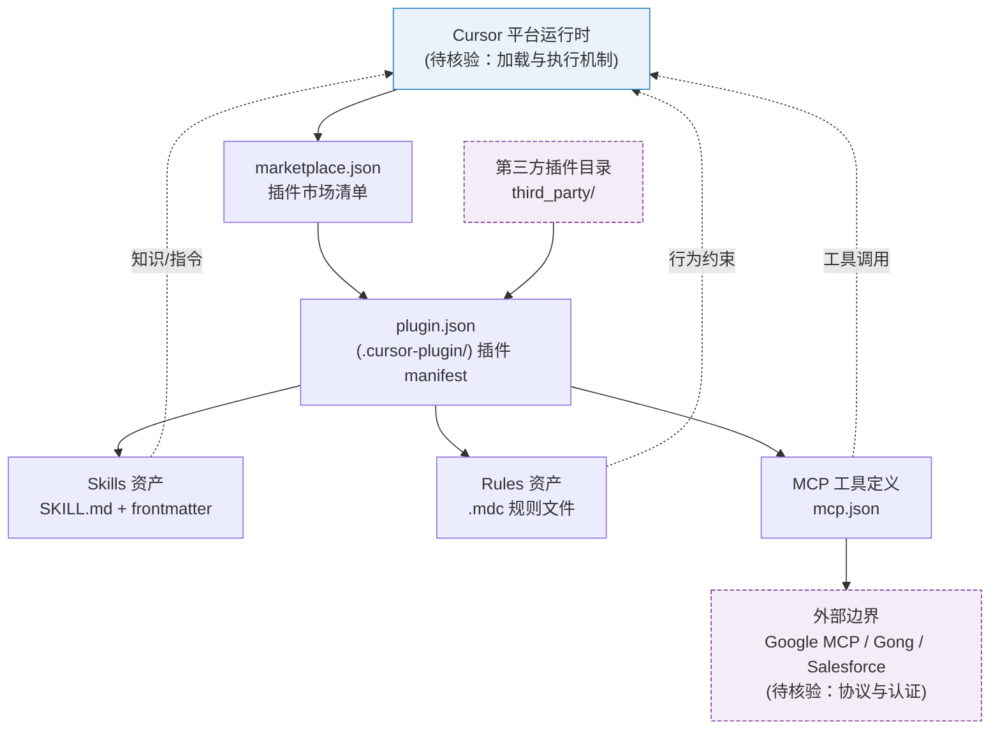

# cursor/plugins

## 一句话定位
Cursor 官方插件仓库——定义了 Cursor 平台的插件规范（`.cursor-plugin/plugin.json` manifest）并提供官方插件集合，是 Cursor 从 IDE 向 Agent 平台演进的关键基础设施。

## 它解决的问题
Cursor 作为当前最流行的 AI 编码工具之一，其能力扩展方式此前缺乏统一标准——用户只能通过自定义 prompt、MCP 配置或 rules 文件来扩展功能，缺乏一个标准化的"插件"系统。cursor/plugins 仓库定义了这个标准：每个插件是一个独立目录，包含 `plugin.json` manifest、skills（SKILL.md）、rules（.mdc 文件）、MCP 配置等。这使得第三方开发者可以为 Cursor 创建和分发可复用的能力扩展。

## 为什么值得关注（2026-05-27）
- 2,556 stars，202 forks——Cursor 官方仓库，创建于 2026-01-23
- 定义了 Cursor 插件的市场（marketplace）机制：根目录 `.cursor-plugin/marketplace.json` 列出所有插件，每个插件有自己的 manifest
- 官方已提供 16+ 个插件，覆盖开发者工具（continual-learning、thermos、orchestrate）、生产力（Gmail、Google Drive、Calendar）、集成（Gong、Salesforce）等类别
- 这是继 Claude Plugins 之后又一个主流 Coding Agent 平台推出正式的插件标准化规范

## 热度来源判断
**平台战略驱动 + Cursor 生态红利**。cursor/plugins 的热度直接与 Cursor 平台的成功挂钩——Cursor 作为增长最快的 AI IDE，其官方插件规范天然获得开发者关注。2.5K stars 对于一个纯规范仓库来说不算低，说明开发者社区对 Cursor 插件生态的期待。但需要注意，这个仓库的价值在于"标准定义"而非"代码量"——真正的生态繁荣取决于第三方插件的数量和质量。

## 关键技术亮点亮点
1. **标准化的插件目录结构**：每个插件遵循统一结构——`.cursor-plugin/plugin.json`（manifest）、`skills/`（SKILL.md 带 frontmatter）、`rules/`（.mdc Cursor 规则文件）、`mcp.json`（MCP 服务器定义）、`README.md`、`CHANGELOG.md`。这种结构将 Skills、Rules、MCP 三种扩展方式统一到一个插件框架中。
2. **Marketplace 机制**：根目录的 `marketplace.json` 作为插件市场清单，用户可以通过 Cursor 界面浏览和安装。每个插件在清单中有 name、author、category、description 元数据。这是标准的插件市场架构设计。
3. **高质量官方插件**：已提供的官方插件设计精良，如 `thermos`（深度安全/正确性审计 + 并行子代理）、`orchestrate`（将大任务分配给并行 Cursor 云 Agent）、`continual-learning`（增量记忆更新到 AGENTS.md）。这些插件本身就是 Agent 工程的最佳实践示例。
4. **第三方插件目录**：`third_party/` 目录用于集成外部服务（Gmail、Google Drive、Google Calendar 通过 Google MCP server；Gong、Salesforce 通过各自的 MCP），展示了插件系统与 MCP 生态的融合。

## 架构师速览

| 决策问题 | 研究判断 | 证据边界 |
|---|---|---|
| 系统边界 | Cursor 官方插件规范仓库，定义 `.cursor-plugin/plugin.json` manifest、`marketplace.json` 清单与 Skills/Rules/MCP 三件套目录约定，作为 Cursor IDE 与 Agent 平台的扩展基础设施层 | 边界仅来自档案描述的目录结构与 manifest 字段；具体加载器、安装协议、运行时权限模型未在档案中给出 |
| 主路径 | 官方插件与第三方插件通过 `marketplace.json` 声明 → 经 Cursor 界面被安装 → 由 Cursor 运行时加载 skills（SKILL.md）、rules（.mdc）、mcp.json 三类资产并用于 Agent 调用 | 主路径基于档案对插件结构与官方插件（如 thermos、orchestrate、continual-learning）的功能描述推断；具体加载顺序与调度细节未披露 |
| 关键权衡 | (1) 标准化降低扩展门槛 vs Skills/Rules/MCP 三类资产是否真正统一；(2) Marketplace 借鉴 VS Code 模式带来的生态速度 vs 平台商业策略调整风险；(3) 与 Claude Plugins、Vercel agent-skills 等并行规范并存的碎片化成本 | 权衡为基于档案“关键技术亮点”与“风险/局限”的研究判断；具体 API 兼容性、性能数据未在档案中出现 |
| 最小 PoC | 选取一个官方插件（如 `continual-learning` 更新 AGENTS.md，或 `thermos` 审计模式）在本地 Cursor 中安装，验证 manifest 字段、skill frontmatter 与 MCP 配置被正确解析；记录插件加载行为与可审计日志，作为后续第三方插件与最小工具权限的验收基线 | PoC 设计仅依赖档案列出的官方插件清单与目录约定；插件的真实运行行为、依赖版本、权限范围须在源码或运行时中核验 |

## 架构启发
cursor/plugins 的架构设计反映了 Coding Agent 平台的演进方向——从单一工具向可扩展平台转变。其关键设计决策包括：(1) 将 Skills（知识/指令）、Rules（行为约束）、MCP（工具能力）统一到"插件"概念下，而非各自独立；(2) 使用标准的目录约定而非复杂配置文件，降低了开发门槛；(3) marketplace + plugin 的两层架构与 VS Code Extensions Marketplace 类似，借鉴了成熟 IDE 生态的经验。

## 架构图（MMD）

> 证据边界：此图只采用本档案已有可核验描述；“待核验”节点不应视为项目实现事实。

## 定位判断
cursor/plugins 定位为**Cursor 平台的插件基础设施层**。它本身不是产品，而是"标准的载体"——定义了 Cursor 插件应该长什么样。2.5K stars 处于早期阶段，但方向意义重大。如果 Cursor 的插件生态繁荣（类似 VS Code Extensions），这个规范将成为事实标准。

## 风险 / 局限 / 泡沫点
1. **生态冷启动问题**：插件标准的价值完全取决于生态规模——有多少第三方开发者创建插件、有多少用户安装使用。当前仅 16 个官方插件和少量第三方插件，距离繁荣的生态还很远。
2. **与 Claude Plugins 规范的竞争**：Claude Code 有自己的插件规范，Cursor 有自己的，其他 Coding Agent 可能还会推出各自的规范。如果标准不统一，开发者需要为多个平台重复适配。
3. **Cursor 商业策略的影响**：Cursor 是商业产品，其插件策略可能随时调整（如限制第三方插件、引入付费分成等），这给开源插件生态带来不确定性。
4. **MCP 的替代效应**：如果 MCP（Model Context Protocol）成为统一的 Agent 工具协议标准，专门的 Cursor 插件规范可能被 MCP 吸收或边缘化。

## 与同类项目的关系
- **Claude Code Plugins**：Anthropic 的 Claude Code 也有插件/扩展机制。两者的规范不同但理念相似——都是将 Agent 能力打包为可分发的单元。Cursor plugins 的 marketplace + plugin.json 设计更接近 VS Code Extensions 模式。
- **VS Code Extensions**：最成熟的 IDE 插件生态。Cursor 基于 VS Code fork，其插件系统在某种程度上是对 VS Code Extensions 的 AI-native 重新设计。
- **vercel-labs/agent-skills**：Vercel 提出的跨 Agent Skill 标准（`npx skills add`），试图统一不同 Coding Agent 的 Skill 安装方式。Cursor plugins 可能与此标准互补或竞争。

## 是否值得持续跟踪
**高度关注，作为 Coding Agent 平台化趋势的核心信号**。cursor/plugins 代表了 AI 编码工具从"产品"向"平台"转变的关键一步。插件生态的繁荣程度将直接决定 Cursor 的长期竞争力。建议每月关注新插件发布和第三方贡献情况。

## 后续观察点
1. **第三方插件数量增长**：非 Cursor 官方贡献的插件数量和活跃度，是判断生态健康的关键指标
2. **跨平台插件标准的演进**：Cursor、Claude Code、Codex 的插件规范是否会走向统一，或各平台维持独立标准
3. **企业级插件的涌现**：是否会出现 Salesforce、Jira、Slack 等企业工具的官方 Cursor 插件，标志着 Cursor 进入企业工作流

---
*首次记录：2026-05-27*
