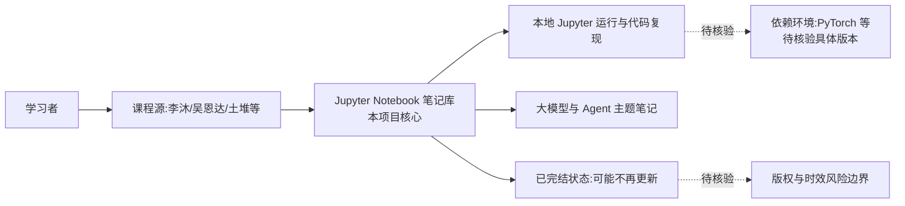

# AccumulateMore/CV

## 一句话定位
超级全面的深度学习笔记库——整合土堆 PyTorch、李沐动手学深度学习、吴恩达深度学习、大模型 Agent 等多套经典课程的中文学习笔记（已完结）。

## 它解决的问题
深度学习学习者在面对多套经典课程时需要分别看视频、做笔记、找代码，信息碎片化严重。AccumulateMore/CV 将多套顶级课程（李沐、吴恩达、土堆等）的核心内容统一整理为 Jupyter Notebook 笔记，配合代码和注释，让学习者可以一站式获取多套课程的精华。

## 为什么值得关注
- **Stars:** 23,197 stars，中文深度学习学习资源头部项目
- **Forks:** 2,611
- **Jupyter Notebook 格式**：可交互、可运行、图文并茂
- **多课程整合**：一套笔记覆盖多套经典课程
- **已完结**：内容完整，可作为系统学习材料
- 涵盖从 CV 基础到大模型 Agent 的完整谱系

## 热度来源判断
- **中文 AI 教育刚需（极高）**：深度学习入门需求持续旺盛
- **优质课程笔记稀缺（高）**：好笔记比好视频更难找
- **多课程整合价值（高）**：省去学习者自己整理的时间
- **B站/知乎推荐（中高）**：中文学习社区口碑传播

## 关键技术亮点亮点
1. **多源整合**：李沐《动手学DL》、土堆 PyTorch 教程、吴恩达深度学习课、大模型 Agent
2. **Jupyter Notebook**：代码+注释+输出+图表，可复现
3. **结构化组织**：按课程/主题/难度分层组织
4. **中文注释**：降低英文阅读门槛
5. **持续扩展**：从 CV 扩展到大模型 Agent 主题

## 架构师速览

| 决策问题 | 研究判断 | 证据边界 |
|---|---|---|
| 系统边界 | 项目本质是 Jupyter Notebook 形式的笔记仓库，编排边界在"课程源笔记 ↔ 学习者本地 Notebook 运行"，不涉及生产级模型服务编排 | 档案明确为"资源型"、Jupyter Notebook 格式，无部署/服务化证据 |
| 主路径 | 学习者 clone 仓库 → 打开对应课程的 Notebook → 本地执行代码与注释 → 完成 CV/DL/Agent 主题学习 | 档案未涉及云端运行、API 网关或模型调用链路 |
| 关键权衡 | 内容广度（多课程整合）vs 单课程深度（仅笔记，无论文级展开）；中文可读性 vs 版权灰区 | 档案自述"笔记适合入门，进阶需原始论文和代码"，并标注版权灰色地带、维护已完结 |
| 最小 PoC | clone 仓库 → 选择一门课程（如土堆 PyTorch）→ 本地 Jupyter 运行首章 Notebook → 验证代码可复现 | 无 GPU/CI/Docker 部署要求，验证门槛仅为本地 Notebook 执行 |

## 架构启发
- **笔记即课程**：优质的学习笔记本身可以作为独立的学习材料
- **多源整合优于单一来源**：不同课程有不同优势，整合后取长补短
- **Jupyter 作为知识载体**：交互式笔记本是技术教育的理想格式

## 架构图（MMD）

> 证据边界：此图只采用本档案已有可核验描述；“待核验”节点不应视为项目实现事实。

## 定位判断
**优质资源型项目**。中文深度学习教育领域的标杆笔记库。非工具非框架，是知识传播的重要载体。

## 风险/局限/泡沫点
- **版权灰色地带**：基于他人课程的笔记可能涉及版权问题
- **时效性**：深度学习技术迭代快，部分内容可能过时
- **深度有限**：笔记形式适合入门，进阶需要原始论文和代码
- **维护状态**：标注"已完结"，可能不再更新
- **CV vs 通用深度学习**：标题含 CV 但实际覆盖范围更广，分类不够清晰

## 与同类项目的关系
- **vs datawhalechina/self-llm**：self-llm 专注大模型部署微调，此项目更全面含 CV 基础
- **vs d2l-ai**：《动手学深度学习》官方版，此项目是其笔记+扩展
- **vs各类课程官方 repo**：官方 repo 只有代码，此项目有详细笔记
- **vs Lilian Weng 博客**：Lilian 偏研究综述，此项目偏教学笔记

## 是否值得持续跟踪
**一般关注。** 作为学习资源直接使用即可。技术跟踪方面意义不大，关注是否有大模型/Agent 新内容更新即可。

## 后续观察点
- 是否新增大模型/多模态/Agent 相关笔记
- 是否有出版计划或商业化
- 维护者是否开放社区贡献
- 笔记的准确性校验和质量控制机制

---
> 数据来源: GitHub API (2026-06-30) | Stars: 23,197 | Forks: 2,611 | 语言: Jupyter Notebook
