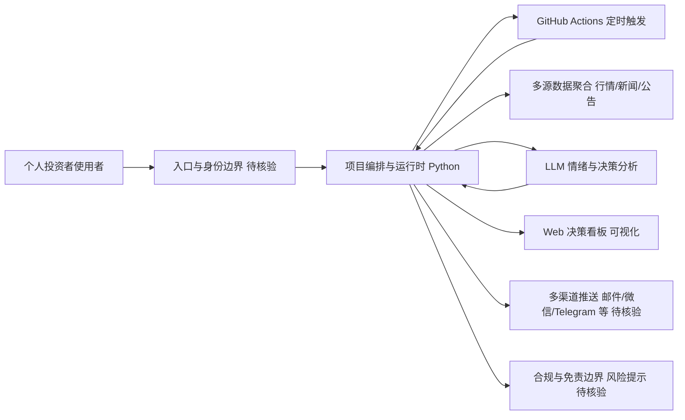

# ZhuLinsen/daily_stock_analysis

## 一句话定位
LLM 驱动的多市场股票智能分析系统——整合多源行情、实时新闻、AI 决策看板与自动推送，支持零成本定时运行（GitHub Actions）。

## 它解决的问题
个人投资者需要每天跟踪多市场（A股/美股/港股）行情、阅读大量新闻、做综合判断，人工操作耗时且容易遗漏关键信息。这个系统用 LLM 自动聚合行情数据、分析新闻情绪、生成决策参考看板，并通过多种渠道推送，帮助投资者高效获取每日市场洞察。

## 为什么值得关注
- **Stars:** 60,331 stars！增速极快，AI 金融分析赛道头部
- **Forks:** 51,616（极高，说明大量用户部署个人版本）
- **Python 实现**，Docker 部署
- **多市场支持**：A股、美股、港股等
- **LLM 驱动**：用大模型做新闻情绪分析和投资判断
- **零成本运行**：GitHub Actions 定时执行，无需服务器
- **决策看板**：可视化数据辅助判断

## 热度来源判断
- **个人投资者基数（极高）**：中国股民数以亿计
- **AI+金融概念（高）**：用 AI 做投资分析是热门话题
- **零成本部署（极高）**：GitHub Actions 免费运行是关键吸引力
- **多源数据整合（高）**：一站式解决信息获取问题
- **Fork 驱动增长**：用户 fork 后自用，进一步传播

## 关键技术亮点亮点
1. **多源数据聚合**：行情 API + 新闻源 + 公告数据统一获取
2. **LLM 情绪分析**：用大模型分析新闻对股价的影响
3. **决策看板**：Web 仪表盘可视化分析结果
4. **多渠道推送**：邮件、微信、Telegram 等
5. **GitHub Actions 定时运行**：零服务器成本
6. **多市场支持**：统一的接口适配不同市场数据源

## 架构师速览

| 决策问题 | 研究判断 | 证据边界 |
|---|---|---|
| 系统边界 | 项目是入口渠道、模型供应商、行情/新闻/公告数据源之间的编排层，对外暴露 Web 决策看板与多渠道推送 | 档案明示"多源数据聚合"、Web 仪表盘、多渠道推送；具体入口协议、模型供应商名单、数据源 API 未在档案中列出 |
| 主路径 | 编排运行时按定时触发拉取行情+新闻→LLM 情绪分析与判断→回写看板/会话→推送渠道 | 档案明示 GitHub Actions 定时执行、LLM 情绪分析、决策看板、自动推送；具体调度链路与会话存储方式未披露 |
| 关键权衡 | 零成本运行（GitHub Actions）与数据准确性、LLM 幻觉、监管合规之间的张力 | 档案列出"免费行情延迟"、"LLM 幻觉"、"监管红线"、"数据源使用条款"等风险；未给出量化对比 |
| 最小 PoC | Fork→配置 GitHub Actions 与单一推送渠道（如邮件）→单市场（A股）→加入风险免责与日志审计再扩展 | 档案仅证明"fork 即部署"门槛低与多市场支持；具体配置文件、Secrets 字段、调度频率需核验 |

## 架构启发
- **LLM 做信息综合而非预测**：AI 价值在于信息聚合和摘要，而非直接选股
- **零成本自动化**：GitHub Actions 是个人项目的理想运行平台
- **Fork 即部署**：用户 fork 后修改配置即可运行，极低采用门槛

## 架构图（MMD）

> 证据边界：此图只采用本档案已有可核验描述；“待核验”节点不应视为项目实现事实。

## 定位判断
**爆款工具型项目**。精准命中个人投资者信息焦虑痛点。但注意：**这是信息工具不是投资工具**，LLM 分析仅供参考，不构成投资建议。

## 风险/局限/泡沫点
- **⚠️ 投资风险警示**：LLM 分析不等于投资建议，用户可能过度依赖
- **数据准确性**：免费行情数据源可能延迟或不准确
- **LLM 幻觉**：AI 可能错误解读新闻或生成不准确分析
- **Fork 数异常**：51k fork 可能包含大量不活跃副本
- **监管风险**：提供投资分析可能触及金融监管红线
- **合规问题**：数据源 API 的使用条款需确认
- **个人项目可持续性**：60k stars 对个人维护者压力巨大

## 与同类项目的关系
- **vs TradingView**：TradingView 是专业图表工具，此项目是 AI 分析工具
- **vs 同花顺/东方财富**：传统炒股软件 vs AI 驱动分析
- **vs 专业量化平台**：量化平台需编程，此项目门槛更低
- **vs FinGPT**：FinGPT 偏金融大模型研发，此项目偏应用工具

## 是否值得持续跟踪
**推荐跟踪（技术角度），谨慎使用（投资角度）。** 技术架构（LLM+GitHub Actions+多源数据）值得学习。但作为投资工具必须保持批判性。

## 后续观察点
- ⚠️ 是否增加充分的风险免责声明
- LLM 分析的历史准确率回测
- 数据源的稳定性和合规性
- 是否有监管关注或限制
- 社区分支的质量和改进方向
- 是否扩展到加密货币/期货等市场

---
> 数据来源: GitHub API (2026-08-06) | Stars: 60,331 | Forks: 51,616 | 语言: Python
