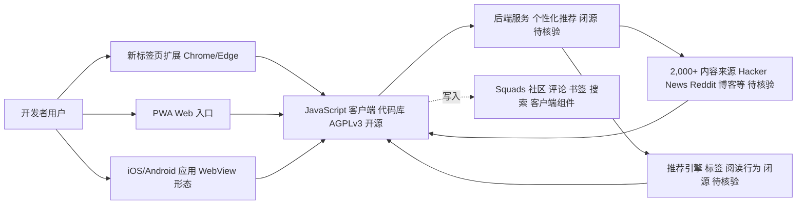

# dailydotdev/daily

## 一句话定位
daily.dev 的开源代码仓库——一个个性化开发者新闻聚合与社区平台，以浏览器新标签页扩展的形式呈现，从 2,000+ 来源聚合技术内容并基于标签和阅读行为进行个性化推荐。

## 它解决的问题
开发者每天需要在 Hacker News、Reddit、Twitter、技术博客、官方文档等多个来源之间切换来获取技术资讯，信息碎片化严重。daily.dev 将这些来源聚合到一个个性化信息流中，通过浏览器新标签页的形式让开发者每次打开新标签就能看到最相关的技术内容。同时它还构建了社区功能（Squads 群组、评论、书签、搜索），形成了开发者社交网络的雏形。

## 为什么值得关注（2026-07-08）
- 19,985 stars，创建于 2017 年，已运营近 9 年，是开发者工具领域少有的长期存活的内容型产品
- AGPLv3 许可证，Web + Chrome/Edge 扩展 + iOS/Android 应用全平台覆盖
- 月活百万级开发者（官方数据），已形成可持续的商业模型（开发者营销/招聘广告）
- topics 包含 `vibe-coding-friendly`，说明团队积极跟进最新开发者趋势

## 热度来源判断
**混合驱动：真实需求 + 社区运营 + 商业模式**。daily.dev 的热度有其真实基础——开发者信息获取确实是痛点。但 20K stars 中相当一部分来自其活跃的社区运营（鼓励用户 star 支持项目）。值得注意的是，daily.dev 已经是一个商业化的公司而非纯开源项目，star 数在某种程度上反映的是用户群规模而非技术社区认可。这是它与纯技术开源项目的本质区别。

## 关键技术亮点亮点
1. **浏览器新标签页劫持**：将产品触达与浏览器核心行为（开新标签）绑定，是一个极为聪明的设计——用户无需主动打开 App，每次开新标签就自然进入产品。这种零摩擦的分发模式是 daily.dev 高留存的关键。
2. **个性化推荐引擎**：基于用户关注的标签（#webdev、#ai、#devops 等）和阅读行为进行内容推荐，从 2,000+ 来源中筛选最相关的内容。推荐算法持续优化。
3. **全平台统一代码库**：单一 JavaScript 代码库支持浏览器扩展（Chrome/Edge）、PWA Web 应用、iOS/Android 原生应用（通过 WebView 或 React Native），这是少见的全平台开源项目架构。
4. **Squads 社区系统**：开发者可以围绕特定话题组建社区（类似 Discord 频道），在社区内分享和讨论内容，将单向的信息消费升级为双向的社区互动。

## 架构师速览

| 决策问题 | 研究判断 | 证据边界 |
|---|---|---|
| 系统边界 | 客户端覆盖 Web（PWA）、Chrome/Edge 扩展、iOS/Android；后端、推荐引擎、2,000+ 数据源管理为闭源，仅客户端 JavaScript 代码库以 AGPLv3 开源 | 档案明示"半开源"模式，具体后端 API、协议、部署形态未披露 |
| 主路径 | 用户开启新标签 → 客户端入口 → 后端编排 → 从 2,000+ 来源聚合并基于标签/阅读行为个性化推荐 → 展示内容并回写用户交互（Squads、评论、书签、搜索） | "新标签页劫持"和推荐路径有档案描述，但具体数据流/协议属"待核验" |
| 关键权衡 | 扩展高触达 vs 浏览器权限/隐私边界；闭源后端 vs AGPLv3 客户端的"半开源"张力；个性化分发 vs 信息茧房与内容质量 | 档案直接点出四项风险/局限；具体权限清单、推荐算法、SLO 无披露 |
| 最小 PoC | 先验证单渠道（仅 PWA 或单一扩展）的入口行为、推荐相关度与数据回写审计，不引入 Squads 等社区模块 | 入口策略和推荐机制有档案内文支撑；后端依赖及成本/退出路径"待核验" |

## 架构启发
daily.dev 展示了"开源 + 商业化"的一种模式：核心客户端代码开源（AGPLv3），但后端服务、推荐算法、数据源管理是闭源的。这意味着用户可以查看和修改客户端代码，但无法自建一个完整的 daily.dev 实例（因为缺少后端）。这种"半开源"模式在内容/社区类产品中较常见，但对于纯粹的技术工具来说可能不太适用。另一个启发是"高频入口策略"——通过占据浏览器新标签页这个高频入口，daily.dev 获得了近乎原生的留存能力。

## 架构图（MMD）

> 证据边界：此图只采用本档案已有可核验描述；“待核验”节点不应视为项目实现事实。

## 定位判断
daily.dev 定位为**开发者社区/媒体平台**，而非技术工具或框架。它的竞品不是 GitHub 项目，而是 Hacker News、Dev.to、Hashnode 等开发者内容平台。在 GitHub 上开源主要是为了品牌透明度和社区参与，而非技术复用——几乎没有开发者会 fork 这个项目来搭建自己的 daily.dev。20K stars 更多反映的是其用户社区的规模和忠诚度。

## 风险 / 局限 / 泡沫点
1. **商业化与开源的张力**：daily.dev 本质上是一家 VC 支持的创业公司，开源代码的维护优先级取决于商业利益。如果公司战略调整或融资困难，开源项目可能被边缘化。
2. **信息茧房风险**：个性化推荐可能导致开发者只看到自己已经关注领域的内容，错过跨领域的技术趋势。这对一个定位为"发现"工具来说是一个根本性矛盾。
3. **内容质量把控**：2,000+ 来源的内容质量参差不齐，如何避免标题党和低质内容是一个持续挑战。
4. **GitHub Stars 不代表技术价值**：20K stars 中大部分来自终端用户（而非开发者），不能直接与 jq、yq 等技术工具的 stars 比较。

## 与同类项目的关系
- **Hacker News (Y Combinator)**：daily.dev 的直接灵感来源和参照对象。HN 是纯 Web 论坛形式，daily.dev 用浏览器扩展 + 个性化推荐做了差异化。
- **Dev.to (forem)**：另一个开源开发者社区平台，约 22K stars。Forem 更侧重于"博客/论坛"形态，daily.dev 更侧重于"信息流/聚合器"形态。
- **Hashnode**：面向开发者的博客平台（闭源），与 daily.dev 的信息流定位不同，但在开发者受众上有重叠。

## 是否值得持续跟踪
**值得以"开发者媒体生态"的角度跟踪，而非作为技术项目跟踪**。daily.dev 的价值在于它代表了开发者信息消费方式的演变趋势。如果研究范围包括开发者社区和媒体产品，它是重要样本。如果纯看技术项目，则价值有限。

## 后续观察点
1. **AI 驱动的内容推荐演进**：daily.dev 是否会引入 LLM 做内容总结、个性化学习路径推荐等 AI 功能
2. **商业化路径的健康度**：开发者营销广告的天花板有多高，是否能支撑长期独立运营（而非被收购）
3. **与 AI 编程工具的整合**：是否会与 Copilot、Cursor 等工具集成，成为 AI 编程工作流中的信息层

---
*首次记录：2026-07-08*
