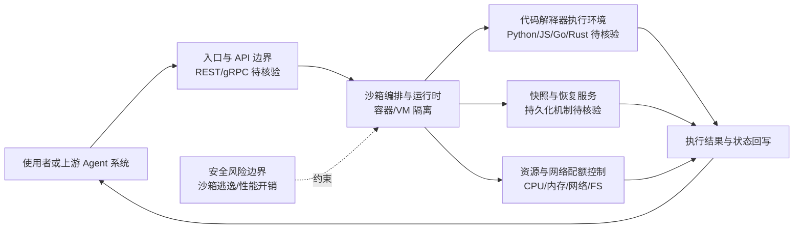

# daytonaio/daytona

## 一句话定位
面向 AI 生成代码的安全弹性执行基础设施——提供沙箱环境、代码解释器和 Agent 运行时，让 AI Agent 在隔离环境中安全地执行任意代码。

## 它解决的问题
AI Agent 需要执行代码来完成任务（数据分析、自动化脚本、代码生成验证），但直接在用户机器上执行 AI 生成的代码存在严重安全风险——恶意代码、意外破坏、数据泄露。Daytona 提供标准化的安全沙箱：每次代码执行在隔离的容器/VM 中进行，资源配额可控，网络访问受限制，执行结果安全返回。它是 AI Agent 的"安全执行层"基础设施。

## 为什么值得关注
- **72,033 stars:** AI 基础设施赛道的热门项目
- **核心定位:** 处于 Agent 技术栈的"执行层"——所有需要代码执行的 Agent 都需要这类基础设施
- **多场景支持:** AI 沙箱、代码解释器、Agent 运行时、开发环境
- **弹性伸缩:** 从单机到云端的弹性基础设施
- **安全优先:** 专为运行不可信代码设计

## 热度来源判断
热度来自 Agent 应用对安全执行环境的刚需。2026 年 AI Agent 大规模落地，每个需要"工具调用"或"代码执行"的 Agent 都面临沙箱问题。OpenAI Code Interpreter 的成功验证了市场需求，Daytona 作为开源替代方案获得了大量关注。企业 AI 平台（需要在内部部署 Agent 执行环境）是重要的传播节点。

## 关键技术亮点亮点
- 轻量级沙箱：基于容器/VM 的隔离，毫秒级启动
- API 驱动：REST/gRPC API 管理沙箱生命周期
- 资源控制：CPU、内存、网络、文件系统的精细化配额
- 多语言支持：Python、JavaScript、Go、Rust 等主流语言
- 弹性架构：从本地开发到云端集群的无缝扩展
- 快照与恢复：沙箱状态可持久化和恢复

## 架构师速览

| 决策问题 | 研究判断 | 证据边界 |
|---|---|---|
| 系统边界 | 项目自定为"AI Agent 安全执行基础设施"，覆盖沙箱、代码解释器与 Agent 运行时四类场景，属执行层而非模型层 | 边界描述源自档案"它解决的问题/关键亮点"，未给出具体 SDK、API 边界与多租户模型 |
| 主路径 | 用户/Agent 调用 → 隔离沙箱（容器/VM）内执行代码 → 结果回传，并支持快照/恢复 | "毫秒级启动""REST/gRPC API 管理生命周期"出自档案；具体协议版本、调度器实现未在档案中证实 |
| 关键权衡 | 隔离强度（容器/VM 防逃逸） vs. 启动延迟与资源开销；多场景通用性 vs. 单一执行场景性能 | "沙箱逃逸风险""性能开销"由档案指出；权衡量化数据（启动时间、QPS）档案未提供 |
| 最小 PoC | 建议先在单租户、单语言（Python）、最小资源配额与网络受限策略下，跑通"创建沙箱→执行代码→快照/销毁"闭环 | 配额项、快照机制、API 形态档案有提及；但配额默认值、SLA、审计能力未在档案中说明，需源码核验 |

## 架构启发
Daytona 的核心启发是"安全沙箱是 AI Agent 的必备基础设施"。对架构师的启发是：**AI Agent 的代码执行不应依赖宿主环境的权限模型，而应该有专门的隔离层**——就像浏览器沙箱之于 JavaScript，Daytona 之于 Agent 代码。这种"默认不信任"的架构原则是 AI 安全的基础。

## 架构图（MMD）

> 证据边界：此图只采用本档案已有可核验描述；“待核验”节点不应视为项目实现事实。

## 定位判断
**平台候选（强）。** 处于 Agent 基础设施的核心层——执行环境。72k stars + 企业级定位 + 安全基础设施刚需使其具备平台潜力。定位为"AI Agent 的安全执行平台"。

## 风险/局限/泡沫点
- **沙箱逃逸风险:** 容器/VM 隔离始终存在逃逸可能，安全是持续攻防
- **性能开销:** 沙箱隔离带来的性能损耗在高频调用场景下显著
- **竞争激烈:** E2B、Modal、Fly Machines 都在提供类似的沙箱服务
- **商业模式:** 开源 + 自托管如何盈利？需要清晰的云服务定价
- **复杂度:** 企业自托管 Daytona 的运维门槛不低

## 与同类项目的关系
- 与 **E2B**（代码执行沙箱）是直接竞品——E2B 偏 SaaS，Daytona 偏自托管
- 与 **Modal**（Serverless 计算）在弹性执行维度竞争
- 与 **Apple Container** 在轻量容器维度有技术共鸣
- 与 **ZeroLang** 互补——ZeroLang 做语言层安全，Daytona 做系统层隔离
- 与 **n8n**、**Multica** 等 Agent 平台形成上下游——Agent 平台调度，Daytona 执行

## 是否值得持续跟踪
**强烈推荐跟踪。** AI Agent 安全执行是基础设施级需求，Daytona 作为开源方案有重要战略价值。建议关注其安全模型和企业采用情况。

## 后续观察点
- 沙箱安全性的验证（是否有公开的安全审计报告）
- 企业客户采用案例和规模
- 与 E2B、Modal 的功能差异化
- 云服务版本的定价和 SLA
- 多租户和合规认证（SOC2、FedRAMP）进展

---
> 数据来源: GitHub API (daytonaio/daytona) | 星标: 72,033 | 语言: N/A | 创建于: 2024-02-06
