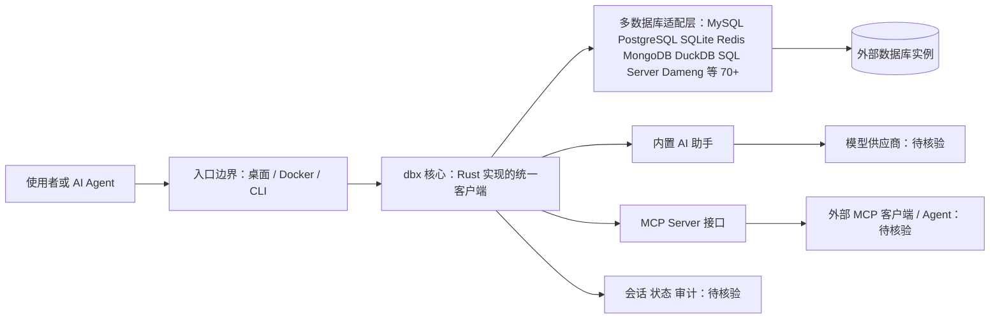

# t8y2/dbx — 20 MB lightweight cross-platform database client for 70+ databases, including My

## 一句话定位

20 MB lightweight cross-platform database client for 70+ databases, including MySQL, PostgreSQL, SQLite, Redis, MongoDB, DuckDB, SQL Server, and Dameng. Built-in AI, MCP Server, CLI, desktop and Docker. | 轻量级跨平台数据库管理工具，支持 MySQL、PostgreSQL、SQLite、Redis、MongoDB、达梦等 70+ 数据库，提供桌面端、Docker、CLI、内置 AI 助手和 MCP Server。。主要使用 Rust 编写，当前 14,078 stars / 1,445 forks / 84 subscribers。

## 它解决的问题

**目标用户**：使用 rust 生态的开发者、AI Agent 构建者。

**痛点**：该项目解决的核心问题是 20 MB lightweight cross-platform database client for 70+ databases, including MySQL, PostgreSQL, SQLite, Redis, MongoDB, DuckDB, SQL Server, and Dameng. Built-in AI, MCP Server, CLI, desktop and Docker. | 轻量级跨平台数据库管理工具，支持 MySQL、PostgreSQL、SQLite、Redis、MongoDB、达梦等 70+ 数据库，提供桌面端、Docker、CLI、内置 AI 助手和 MCP Server。。从 README 来看，项目提供了 
 
<strong>70+ databases in 20 MB. Desktop, Docker, CLI, built-in AI assistant, and MCP Server.</strong>
 
 **
2. **
<strong>70+ databases in 20 MB. Desktop, Docker, CL**
4. ****

## 架构师速览

| 决策问题 | 研究判断 | 证据边界 |
|---|---|---|
| 系统边界 | dbx（Rust，Apache-2.0）作为面向 70+ 数据库的统一客户端，提供桌面端、Docker、CLI、内置 AI 助手与 MCP Server 入口；边界落在 dbx 进程与外部数据库驱动、AI 模型供应商、MCP 客户端之间 | 档案列出入口形态与数据库覆盖范围；协议栈、驱动实现、模型供应商对接方式未在档案中说明，待核验 |
| 主路径 | 用户 → dbx 入口（桌面/Docker/CLI） → 多数据库适配层 → AI 助手 / MCP Server 输出；MCP Server 作为 AI Agent 侧的访问面 | 档案点名了入口形态与 AI/MCP 组件；具体调用链、会话管理、缓存与凭据流未在档案中说明 |
| 关键权衡 | “20 MB 体积 + 70+ 数据库覆盖 + 内置 AI/MCP”的集成速度，与各数据库方言一致性、凭据安全、MCP 协议兼容性之间的取舍 | 体积、口径、组件名为档案事实；性能基准、SQL 方言覆盖深度、权限模型档案未给出 |
| 最小 PoC | 在 Docker 方式下以只读账号接入 1 个 PostgreSQL 与 1 个 ClickHouse，验证 CLI 与 MCP Server 两条入口的连通性与最小 SQL 执行；其余 68+ 数据库与 AI 助手功能暂不纳入验收 | 档案支持 Docker、CLI、ClickHouse 与 AI/MCP 描述；具体镜像参数、配置项与 MCP 协议细节待核验 |

## 架构启发

从 t8y2/dbx 的设计来看，核心思路是 **"20 MB lightweight cross-platform database client for 70+ dat"**。这反映了 Rust 生态中 Agent / AI 工具链 的演进方向——降低集成复杂度、提供开箱即用的能力。开源 License (Apache-2.0) 降低了采用门槛。

## 架构图（MMD）

> 证据边界：此图只采用本档案已有可核验描述；“待核验”节点不应视为项目实现事实。

## 定位判断

**工具型**。在生态中定位为20 MB lightweight cross-platform databas方向的工具。Stars 14078 说明已有一定社区基础。

## 风险 / 局限 / 泡沫点

1. **规模风险**：14,078 stars，但 fork 1445 说明有实际部署
2. **维护风险**：最后 push 时间 2026-08-11，活跃维护中
3. **Open Issues**：1236 个 open issues，活跃社区反馈
4. **License**：Apache-2.0（宽松许可，适合商用）

## 与同类项目的关系

- 与同 Rust 生态的同类工具形成竞争/互补关系。具体竞品对比需参考社区讨论。
- 从 topics (ai, cli, clickhouse) 来看，与关注 ai 的其他项目有交叉。

## 是否值得持续跟踪

**是。** 14078 stars + 活跃更新说明项目有持续价值。建议关注后续版本迭代和社区增长。

## 后续观察点

1. Star 增速是否可持续（当前 14,078）
2. Fork 增长趋势（当前 1,445）
3. 功能迭代频率（最后更新 2026-08-11）
4. 社区活跃度（subscribers 84, open issues 1236）

---
> 数据来源: GitHub API (2026-08-11) | Stars: 14,078 | Forks: 1,445 | License: Apache-2.0 | 语言: Rust | 创建: 2026-04-29
