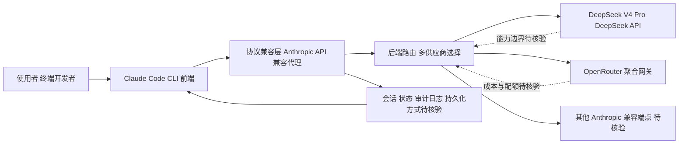

# DeepClaude

## 一句话定位
用 DeepSeek V4 Pro / OpenRouter 替换 Claude Code 的 Anthropic 后端，保持相同 UX，成本降低 17 倍。

## 它解决的问题
**目标用户：** 使用 Claude Code 但受限于 Anthropic API 成本的开发者。

**痛点：**
- Claude Code UX 已成为 Agent CLI 事实标准，但 Anthropic 后端成本高
- 开发者想要 Claude Code 的体验 + 更便宜的模型
- 多个模型后端的切换缺乏统一方案

## 为什么值得关注（2026-05-05）
DeepClaude 代表了一个重要趋势：**Agent 前端和后端的解耦**。当 Agent UX 标准化后（Claude Code 风格），后端模型的选择就变成了纯成本/性能决策。2 天 987 stars 说明社区对这个方向有强烈共鸣。

## 热度来源判断
- **真实需求驱动** — Agent 用户对成本敏感是真实的
- **时机好** — DeepSeek V4 Pro 刚发布不久，"性价比替代" 话题热度高
- **炒作成分约 30%** — 17x 降本在简单任务上成立，复杂任务差距明显

## 关键技术亮点亮点
1. **协议兼容层** — 实现 Anthropic API 兼容层，让 Claude Code CLI 无感知地使用其他后端
2. **多后端路由** — 支持 DeepSeek V4 Pro、OpenRouter、任意 Anthropic 兼容端点
3. **零侵入集成** — 不修改 Claude Code 本身，通过代理层实现后端替换

## 架构师速览

| 决策问题 | 研究判断 | 证据边界 |
|---|---|---|
| 系统边界 | DeepClaude 是一个 JavaScript 编写的本地代理/编排层，夹在 Claude Code CLI（前端）与 Anthropic 兼容后端（DeepSeek V4 Pro / OpenRouter / 其他端点）之间，不修改 Claude Code 本体。 | 基于标签 `agent-backend, claude-code, backend-swap` 与"零侵入集成"描述；具体 API 表面、请求体格式未在档案中给出。 |
| 主路径 | Claude Code 客户端 → 协议兼容层（Anthropic API 兼容） → 后端路由（DeepSeek V4 Pro / OpenRouter / 其他） → 响应回写到 Claude Code。 | 档案仅描述"协议兼容层 + 多后端路由"职责，未给出流式、超时、工具调用协议细节。 |
| 关键权衡 | 17× 成本下降 vs 复杂任务能力下降（DeepSeek V4 Pro < Claude Opus）；同时存在 Anthropic ToS 违规与协议变更（Claude Code 更新）导致的失效风险。 | 数字与风险来自档案"风险/局限"段；未提供基准测试或 ToS 条款原文。 |
| 最小 PoC | 在单一渠道（如 OpenRouter）用受限权限、单会话、可审计日志跑通 Claude Code → DeepClaude → 后端的端到端请求，把成本、行为差异与回滚路径作为验收项。 | 项目本身已声明需"源码/文档核验"，本表不替代源码审查。 |

## 架构启发
- Agent 系统的 **前端-后端解耦** 是一个被低估的架构趋势
- 类似于浏览器的搜索引擎可切换，Agent 的模型后端也应可插拔
- 代理层模式（Proxy Pattern）在这里非常适用
- Trade-off：节省成本 vs 能力损失，这是一个连续的光谱而非二元选择

## 架构图（MMD）

> 证据边界：此图只采用本档案已有可核验描述；“待核验”节点不应视为项目实现事实。

## 定位判断
在 Agent 生态中，DeepClaude 是一个 **"降本补丁"**：
- 不是平台，不是基础设施
- 但它揭示了一个方向：Agent 后端市场化的可能
- 如果 Agent UX 完全标准化，后端模型就变成了类似 CDN 的基础设施

## 风险 / 局限 / 泡沫点
1. **能力差距** — DeepSeek V4 Pro 在复杂推理任务上仍不如 Claude Opus，17x 降本的前提是"够用"
2. **协议脆弱性** — 依赖 Anthropic API 的行为兼容，后端变更可能导致失效
3. **法律风险** — 可能违反 Anthropic 的 ToS
4. **维护成本** — 需要持续跟进 Claude Code 的更新并适配

## 与同类项目的关系
- **Claude Code（Anthropic）** — 原始实现，DeepClaude 是其后端替换层
- **OpenCode（15.4K stars）** — 独立的开源 Coding Agent，支持多模型，是"完全替代"路线
- **CC Switch（59K stars）** — 桌面端 Agent 管理器，支持多 Agent 切换，是"统一管理"路线
- DeepClaude 是"最小改动"路线 — 只替换后端，不改前端

## 是否值得持续跟踪
**有限跟踪。** 方向重要（后端解耦），但 DeepClaude 本身可能是过渡方案。更有价值的是观察这个方向是否催生更通用的 "Agent 后端网关"。

## 后续观察点
1. DeepSeek V4 Pro 在真实 Agent 编码场景中的能力评测
2. Anthropic 是否会对这类后端替换方案采取限制措施
3. 是否出现更通用的 "Agent 后端网关" 项目（支持多前端 × 多后端）

---
*首次记录：2026-05-05*
