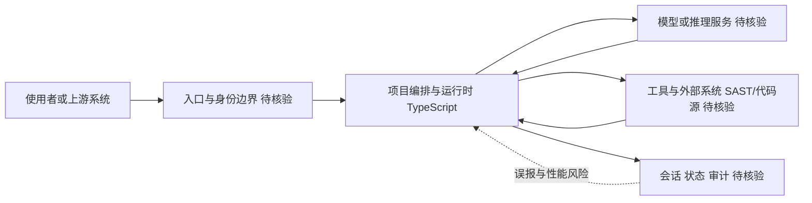

# Deepsec

## 一句话定位
Vercel 出品的安全工具：用 Coding Agent 驱动代码安全审计，自动发现代码库中的漏洞。

## 它解决的问题
面向开发团队，解决"代码安全审计依赖人工、效率低、覆盖面窄"的痛点。传统 SAST 工具误报多、缺乏语义理解，Deepsec 用 Agent 模拟安全研究员的思维进行深度审计。

## 为什么值得关注（2026-05-06）
Vercel Labs 出品，Apache 2.0 许可证。用 Agent 做安全审计是 DevSecOps Agent 化的明确信号。虽然当前仅 1K stars，但 Vercel 背书 + 正确方向值得早期关注。

## 热度来源判断
- **Vercel 品牌效应**：Vercel Labs 出品自带关注
- **方向正确**：安全审计 Agent 化是 DevSecOps 的确定趋势
- **早期阶段**：1K stars，尚未爆发

## 关键技术亮点亮点
1. **Agent 驱动审计**：用 Coding Agent 模拟安全研究员审计代码
2. **语义理解**：比传统 SAST 工具更能理解代码意图
3. **Apache 2.0**：开源友好，便于集成

## 架构师速览

| 决策问题 | 研究判断 | 证据边界 |
|---|---|---|
| 系统边界 | 入口渠道 → 项目编排/运行时 → 模型推理 + 工具/外部系统 + 会话/状态/审计四向边界，TypeScript 实现的 Coding Agent 安全审计工具 | 档案仅给出语言、标签与一句定位，未披露具体入口协议、模型供应商与工具清单 |
| 主路径 | 使用者或上游 → 入口与身份边界 → 编排与运行时（双向调用模型与工具）→ 会话/状态/审计回写 | 节点均为职责抽象，消息协议、持久化与部署形态须以源码核验 |
| 关键权衡 | Agent 语义理解的覆盖力 vs. 审计场景下幻觉代价与性能开销；当前 2.4K stars 表明关注度但非生产可用性证据 | 档案给出三个风险点（早期项目、Agent 幻觉、性能开销），未提供基准数据 |
| 最小 PoC | 单仓库 + 最小工具权限 + 可审计日志下做 PR 级审计验证，并将准确率/误报率/成本/退出路径列为验收项 | 集成形态、CICD 钩子位置与权限模型在档案中未证实 |

## 架构启发
- 安全审计从"规则匹配"到"Agent 理解"的范式转变
- Agent 作为安全研究员的"超级助手"模式
- CI/CD 集成潜力——每次 PR 自动安全审计

## 架构图（MMD）

> 证据边界：此图只采用本档案已有可核验描述；“待核验”节点不应视为项目实现事实。

## 定位判断
安全工具链中的"Agent 化"先驱。当前偏工具型，有潜力发展为 DevSecOps 平台组件。

## 风险 / 屏限 / 泡沫点
1. **早期项目**：1K stars，功能可能不完整
2. **Agent 幻觉**：安全审计中误判的代价很高
3. **性能开销**：Agent 审计可能比传统 SAST 慢很多

## 与同类项目的关系
- **Snyk / SonarQube**：传统 SAST 工具，规则驱动
- **CVE-2026-31431**：说明安全审计仍有盲区，Agent 有价值
- **Semgrep**：半语义 SAST 工具，Deepsec 的潜在补充或竞争者

## 是否值得持续跟踪
是。Vercel 出品 + DevSecOps Agent 化方向正确，值得早期跟踪。

## 后续观察点
1. 漏洞发现准确率和误报率
2. 是否集成到 Vercel 平台成为原生功能
3. 支持的语言和框架范围

## 最近动态（2026-05-07）

### 2026-05-13（实测）
- **Stars 实测 2,415** — 稳步增长
- CVE-2026-31431（Linux kernel LPE 3.7K）推动安全赛道整体升温
- 维持工具型判断

### 2026-05-12
- 连续第三天无外部数据，Star 推演为最后有效轮次

---
*首次记录：2026-05-06*
